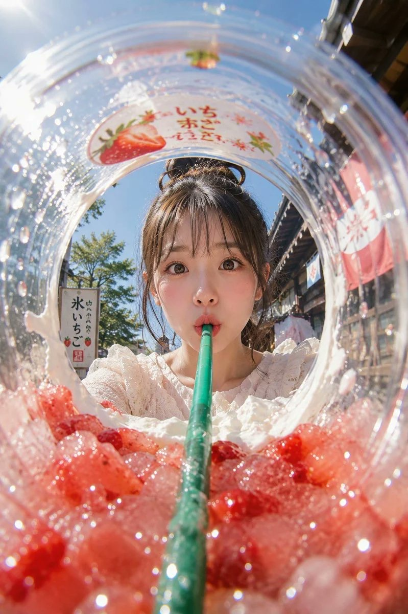
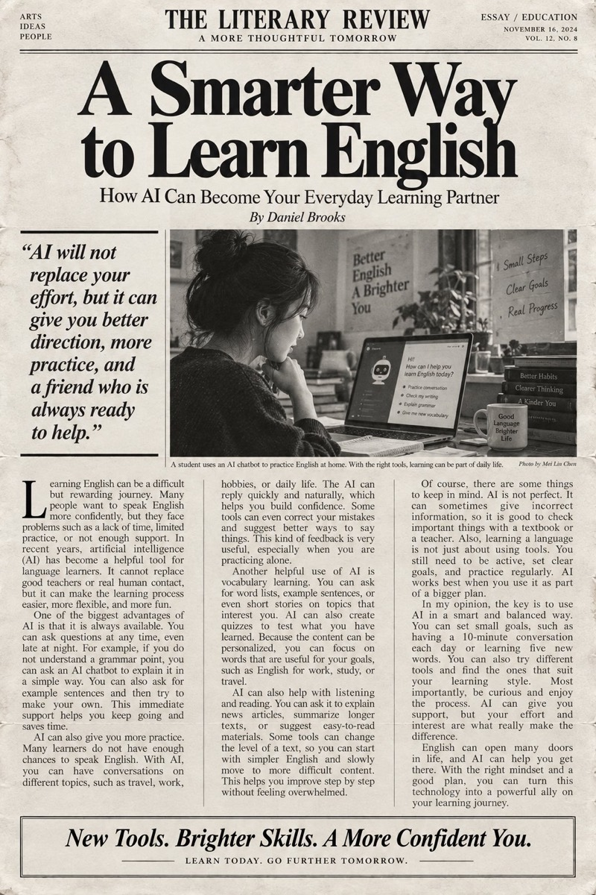
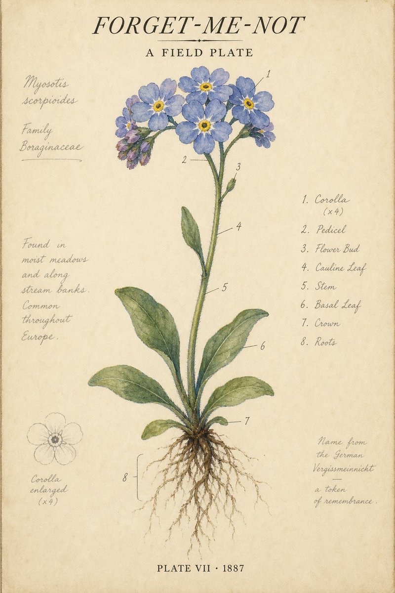
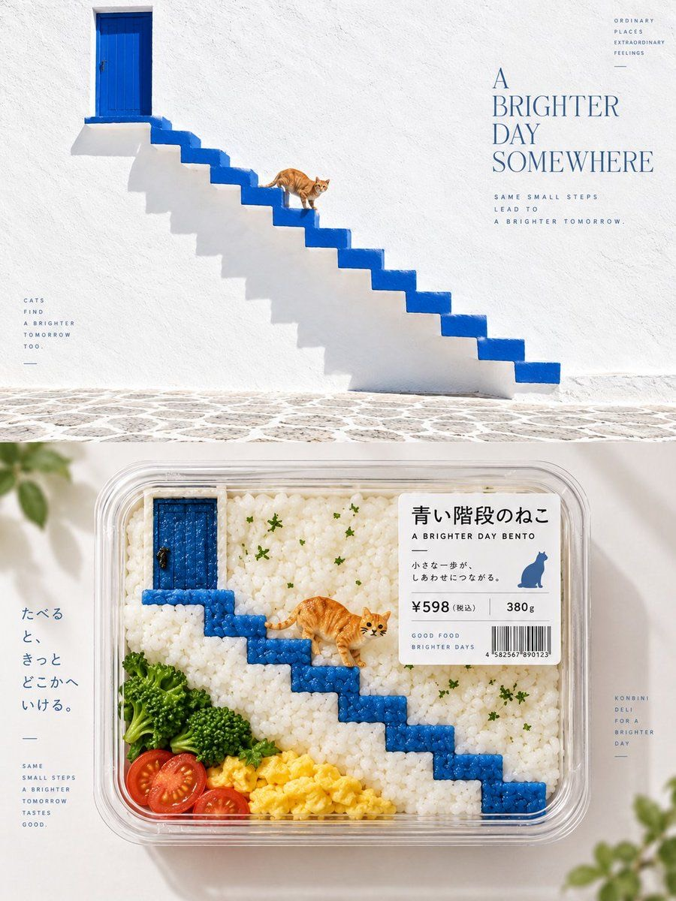
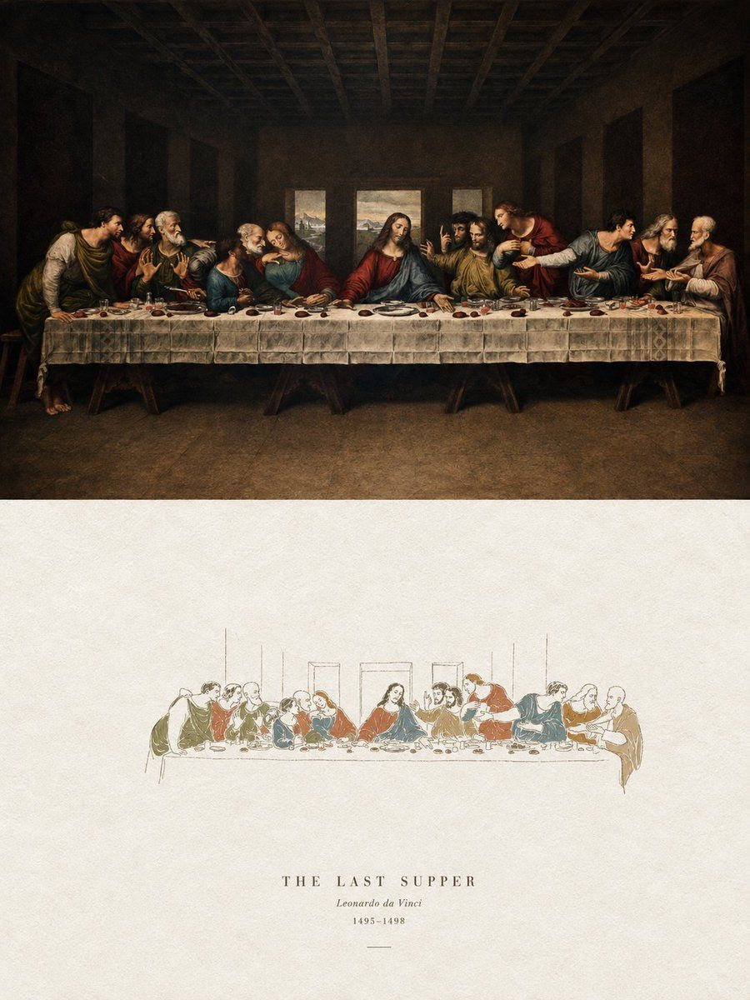
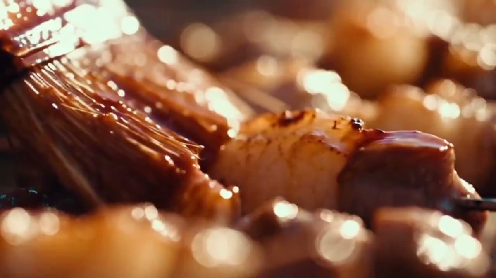
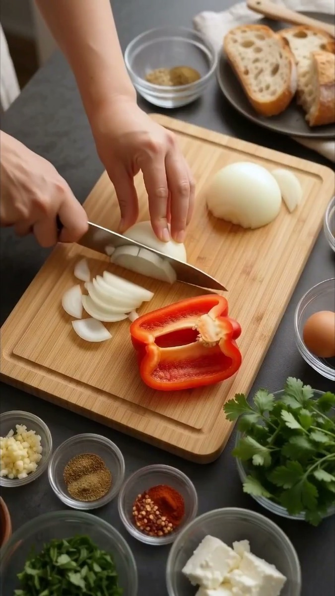
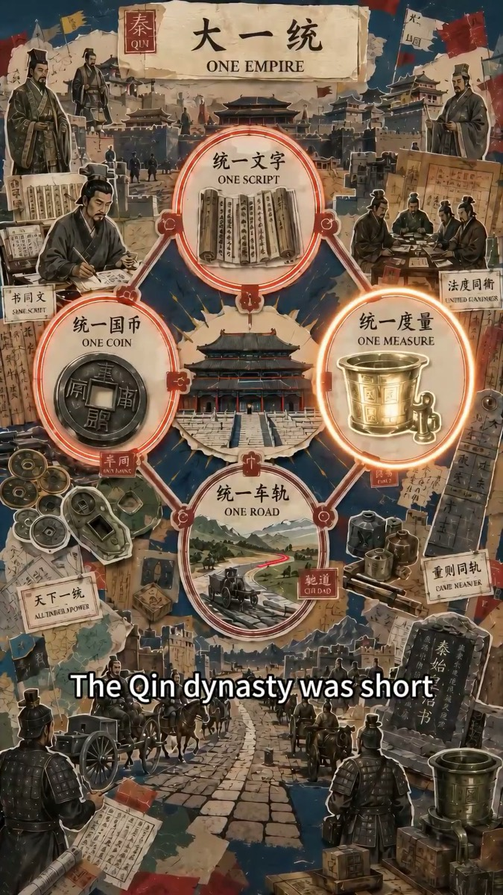

# Awesome Image & Video Prompts

按画面找提示词。收录生图、生视频案例的预览、完整 Prompt 与原作者链接，以及 92 套来源适配模板和 20 套原创通用模板。

[在线画廊](https://dle-kb.github.io/awesome-image-video-prompts/) · [全部生图案例](showcase/image.md) · [全部生视频案例](showcase/video.md) · [生图模板](templates/image.md) · [生视频模板](templates/video.md)

## 生图案例

点击预览查看完整提示词和来源；[浏览全部生图案例](showcase/image.md)。

<table>
  <tr>
    <td width="33%" align="center"> <a href="showcase/image.md#image-828d8ade3e">杯内鱼眼夏日冰饮广告</a></td>
    <td width="33%" align="center"> <a href="showcase/image.md#image-5efc7ec9c3">分级英语杂志阅读页</a></td>
    <td width="33%" align="center"> <a href="showcase/image.md#image-9dc00fd4c2">复古科学植物学海报</a></td>
  </tr>
  <tr>
    <td align="center"> <a href="showcase/image.md#image-5b85051bd1">便当化食品包装创意</a></td>
    <td align="center"> <a href="showcase/image.md#image-5573ad414d">丙烯手绘风格海报设计</a></td>
    <td align="center"> <a href="showcase/image.md#image-2d9c1779c7">二十四节气编辑视觉设计</a></td>
  </tr>
</table>

## 生视频案例

点击封面播放样片，或点击标题查看完整 Prompt 和原作者；[浏览全部生视频案例](showcase/video.md)。

<table>
  <tr>
    <td width="33%" align="center"> <a href="showcase/video.md#video-fa2e0ad821">推拉变焦空间扭曲</a></td>
    <td width="33%" align="center"> <a href="showcase/video.md#video-50e620e4e4">巴黎街头时装变身</a></td>
    <td width="33%" align="center"> <a href="showcase/video.md#video-1d6c1fec91">烧烤美食微距短片</a></td>
  </tr>
  <tr>
    <td align="center"> <a href="showcase/video.md#video-60b5dcaaac">食谱信息图转连续烹饪短片</a></td>
    <td align="center"> <a href="showcase/video.md#video-f97cb22797">第一人称视角：龙骑士电影级画面</a></td>
    <td align="center"> <a href="showcase/video.md#video-53bf374a72">动态百科页拼贴解说</a></td>
  </tr>
</table>

## 使用与贡献

在[在线画廊](https://dle-kb.github.io/awesome-image-video-prompts/)按生图、生视频或题材筛选；打开案例即可预览并复制完整 Prompt。[生图模板](templates/image.md)包含 67 套来源适配模板和 10 套原创通用模板；[生视频模板](templates/video.md)包含 25 套来源适配模板和 10 套原创通用模板。模板页将预览与提示词放在同一条目里，来源适配模板提供中英文 Prompt 和原作者链接。欢迎按[贡献指南](CONTRIBUTING.md)提交公开案例与来源修订。

每个来源案例均标注原作者和原始链接。来源预览、样片与提示词不属于本仓库的 MIT 许可范围；仓库原创内容与站点代码适用 [MIT License](LICENSE)。使用第三方素材时请遵守原作者和来源平台的许可要求。
