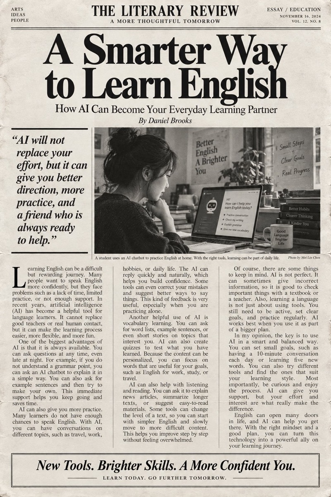
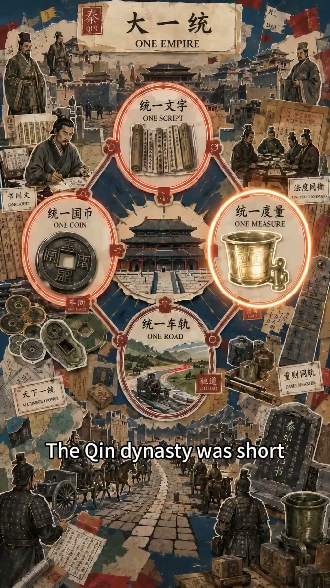

<h1 align="center">AI Image &amp; Video Prompt Library</h1>

<p align="center">Awesome Image &amp; Video Prompts</p>

<p align="center"><a href="https://dingle-kb.github.io/awesome-image-video-prompts/"></a></p>

<p align="center">English | <a href="readme-zh.md">简体中文</a></p>

<p align="center">
  
  
  
  
</p>

<p align="center"><strong>See the result, copy the full prompt, then use a fill-in template when you need a new subject.</strong></p>

<p align="center">From product ads and travel posters to educational graphics and camera moves: open a case for its preview or clip, full prompt, and original source.</p>

<p align="center">Curated and maintained by <a href="https://github.com/dingle-kb">dingle</a>. Source cases credit their original creators. No installation needed.</p>

<p align="center"><strong><a href="https://dingle-kb.github.io/awesome-image-video-prompts/">Browse the visual gallery</a></strong> or open the <a href="showcase/index.md">complete case index</a>.</p>

## Quick links: start with your task

Start with the work you want to make. **To try an existing prompt:** open a case and copy its full text. **To change the subject:** use the fill-in template or source-linked prompt in the right column. For source cases, check the original creator and post as well.

| What you want to make | Case or workflow | Editable starting point |
| --- | --- | --- |
| Product advertising visual | [Botanical soda still life](showcase/image.md#botanical-soda) | [Beverage still-life fill-in template](templates/image.md#beverage-still-life) |
| Travel or city poster | [Imaginary coastal city poster](showcase/image.md#coastal-poster) | [Travel poster fill-in template](templates/image.md#travel-print-poster) |
| Readable educational plate | [Imaginary botanical plate](showcase/image.md#botanical-plate) | [Botanical plate fill-in template](templates/image.md#botanical-editorial) |
| Food advertising storyboard | [Pear tart in four shots](showcase/image.md#pear-tart-storyboard) | [Food storyboard fill-in template](templates/image.md#food-storyboard) |
| Single-product video | [Slow product reveal](showcase/video.md#product-reveal) | [Single-shot product video fill-in template](templates/video.md#single-shot-product) |
| Camera movement and depth | [Dolly-zoom clip](showcase/video.md#video-fa2e0ad821) | [Source-linked prompt](templates/video.md#video-dolly-zoom-space-warp) |

The six images in the opening collage also lead to their cases: [travel poster](showcase/image.md#coastal-poster) | [botanical soda](showcase/image.md#botanical-soda) | [botanical plate](showcase/image.md#botanical-plate) | [pear tart storyboard](showcase/image.md#pear-tart-storyboard) | [food infographic](showcase/image.md#image-2be108496e) | [photo-to-sketch card](showcase/image.md#image-2a8d580cf7).

More ways in: [all image cases](showcase/image.md) | [all video cases](showcase/video.md) | [image prompts](templates/image.md) | [video prompts](templates/video.md) | [filter the gallery](https://dingle-kb.github.io/awesome-image-video-prompts/).

Case detail pages and original fill-in templates are primarily in Chinese; the 92 source-linked prompts include both Chinese and English versions.

## Why this collection exists

It is easy to save a good-looking image, but harder to find its full prompt, creator, and an editable starting point when you want to make something. This library organizes image and video cases by work and task: see the preview or clip, read the full prompt and source, then use an original fill-in template for your own subject.

## Complete example: prompt to botanical soda visual

This is the **exact prompt** recorded in an [original repository case](showcase/image.md#botanical-soda), followed by its actual preview. The image is not the result of editing a separate template.

### 1. Input: the full case prompt

```text
A polished commercial still-life photograph for a fictional botanical soda called MIRA. One clear unbranded glass bottle with pale coral liquid on a vivid sea-green tabletop, condensation, sliced ruby grapefruit and a single leafy stem, directional late afternoon sunlight, sharp caustic shadows, premium beverage advertising composition with generous negative space, bright believable materials. No people, no visible words, no brand logos, no collage or mockup frame. Square image.
```

### 2. Output: the actual case preview

<a href="showcase/image.md#botanical-soda"></a>

Case details: `gpt-image-2` | RightCodes | requested `1024x1024` | output `1254x1254`. [Open the full case and generation details](showcase/image.md#botanical-soda).

### 3. Change the subject with a separate fill-in template

For your own beverage campaign, open the [beverage still-life fill-in template](templates/image.md#beverage-still-life) and replace its product description, flavor elements, primary color, and format fields. This is a different editable starting point; the preview above belongs only to the original case prompt, not to a version with your variables filled in.

## Featured source cases

Source cases retain creator credits and links to the original posts. Click an image to open its case and attribution; the links below each card go to its full prompt. Video cards also link directly to their clips. Source previews and clips are not results regenerated by this repository with the linked prompts.

### Images: advertising, editorial layout, educational visuals

<table>
  <tr>
    <td width="33%" align="center" valign="top"><a href="showcase/image.md#image-828d8ade3e"></a><br><strong>Inside-the-cup summer drink ad</strong><br><sub>A fisheye viewpoint from inside the cup</sub><br><a href="showcase/image.md#image-828d8ade3e">Full prompt / source</a> | <a href="templates/image.md#image-inside-cup-fisheye-summer-drink-ad">Linked prompt</a></td>
    <td width="33%" align="center" valign="top"><a href="showcase/image.md#image-5efc7ec9c3"></a><br><strong>Graded English reading page</strong><br><sub>Reading level and layout constraints in the prompt</sub><br><a href="showcase/image.md#image-5efc7ec9c3">Full prompt / source</a> | <a href="templates/image.md#image-graded-english-magazine-reading-page">Linked prompt</a></td>
    <td width="33%" align="center" valign="top"><a href="showcase/image.md#image-9dc00fd4c2"></a><br><strong>Vintage botanical plate</strong><br><sub>Anatomical labels and scientific plate composition</sub><br><a href="showcase/image.md#image-9dc00fd4c2">Full prompt / source</a> | <a href="templates/image.md#image-vintage-scientific-botanical-poster">Linked prompt</a></td>
  </tr>
</table>

### Videos: camera moves, processes, explainers

**Landscape | 16:9**

<table>
  <tr>
    <td width="33%" align="center" valign="top"><a href="showcase/video.md#video-fa2e0ad821"></a><br><strong>Dolly-zoom space warp</strong><br><sub>Stable subject size, stretching background</sub><br><a href="assets/cases/video-fa2e0ad821.mp4">Play clip</a> | <a href="showcase/video.md#video-fa2e0ad821">Full prompt / source</a> | <a href="templates/video.md#video-dolly-zoom-space-warp">Linked prompt</a></td>
    <td width="33%" align="center" valign="top"><a href="showcase/video.md#video-a2196efe4e"></a><br><strong>Sketch-to-real cooking</strong><br><sub>Ingredients turn from drawings into real objects</sub><br><a href="assets/cases/video-a2196efe4e.mp4">Play clip</a> | <a href="showcase/video.md#video-a2196efe4e">Full prompt / source</a></td>
    <td width="33%" align="center" valign="top"><a href="showcase/video.md#video-bc1f9f0af1"></a><br><strong>Vertical crane reveal</strong><br><sub>A rising camera gradually reveals the scene</sub><br><a href="assets/cases/video-bc1f9f0af1.mp4">Play clip</a> | <a href="showcase/video.md#video-bc1f9f0af1">Full prompt / source</a> | <a href="templates/video.md#video-vertical-crane-reveal">Linked prompt</a></td>
  </tr>
</table>

**Portrait | 9:16**

<table>
  <tr>
    <td width="33%" align="center" valign="top"><a href="showcase/video.md#video-5d2a7780cd"></a><br><strong>Beach stone stop-motion</strong><br><sub>A stone figure moves, then falls apart</sub><br><a href="assets/cases/video-5d2a7780cd.mp4">Play clip</a> | <a href="showcase/video.md#video-5d2a7780cd">Full prompt / source</a> | <a href="templates/video.md#video-beach-stone-stop-motion">Linked prompt</a></td>
    <td width="33%" align="center" valign="top"><a href="showcase/video.md#video-60b5dcaaac"></a><br><strong>Recipe to cooking video</strong><br><sub>Keep ingredients and stages consistent across clips</sub><br><a href="assets/cases/video-60b5dcaaac.mp4">Play clip</a> | <a href="showcase/video.md#video-60b5dcaaac">Full prompt / source</a> | <a href="templates/video.md#video-recipe-infographic-cooking-sequence">Linked prompt</a></td>
    <td width="33%" align="center" valign="top"><a href="showcase/video.md#video-53bf374a72"></a><br><strong>Animated encyclopedia explainer</strong><br><sub>Break a knowledge topic into visual beats</sub><br><a href="assets/cases/video-53bf374a72.mp4">Play clip</a> | <a href="showcase/video.md#video-53bf374a72">Full prompt / source</a></td>
  </tr>
</table>

## What is in this library

| Type | What you get | Keep in mind |
| --- | --- | --- |
| **Source cases** | 68 image and 46 video cases with media, full prompts, creators, and original links | Source previews and clips are not regenerated by this repository |
| **Original cases and workflows** | 4 image cases and 2 video workflows; image cases include generation details | An original preview is not a result for every related template |
| **Source-linked prompts** | 67 image and 25 video prompts, each with Chinese and English versions and a case link | Some are edited or translated from source prompts and do not have fill-in variables |
| **Original fill-in templates** | 10 image and 10 video templates with variables and usage checks | Only some templates have original previews; others do not imply an existing output |

In the opening collage, the first four images are original cases and the last two are credited source cases. The collage does not show results generated after replacing fill-in template variables.

Use the [case index](showcase/index.md) to browse by title or the [visual gallery](https://dingle-kb.github.io/awesome-image-video-prompts/) to filter by subject and tag.

## Contributing and license

Corrections to source links, creator credits, categories, and broken media are welcome. To propose a new case through the [contribution guide](CONTRIBUTING.md), include the creator, original URL, and whether its preview or clip can be redistributed in this repository.

Original repository content and site code are under the [MIT License](LICENSE). **Third-party previews, clips, and prompts are not covered by this repository's MIT license.** Follow the original creator's and platform's terms before reusing them.
