<h1 align="center">AI Image &amp; Video Prompt Library</h1>

<p align="center">Awesome Image &amp; Video Prompts</p>

<p align="center"><a href="https://dingle-kb.github.io/awesome-image-video-prompts/"></a></p>

<p align="center">English | <a href="README-ZH.md">简体中文</a></p>

<p align="center"><strong>Choose a style, open one JSON, and create.</strong></p>

<p align="center">180 individual prompts · 120 cases and workflows · 20 fill-in templates</p>

<p align="center"><a href="https://dingle-kb.github.io/awesome-image-video-prompts/"><strong>Browse the online gallery</strong></a> · <a href="#all-styles">All Styles</a> · <a href="docs/CATALOG.md">Full catalog</a></p>

## Quick Start

1. Find a direction in the gallery below, the [full catalog](docs/CATALOG.md), or the [online gallery](https://dingle-kb.github.io/awesome-image-video-prompts/).
2. Open its `style.json` and provide the complete file to an image or video generation model. For plain text, open its Copy Prompt page instead.
3. Change the subject, input materials, or template variables while keeping the composition, camera, and style constraints you need.

```text
styles/<slug>/
  style.json       Full prompt, category, attribution, and relationships
  preview.jpg      Image preview or video poster, when available
  sample.mp4       Video clip, when available
```

Some image previews use `preview.webp`; linked versions reference their related case's media. Each folder has one machine-readable content file. Copy pages and gallery data are generated from these files. Identical source and linked prompts share one file; distinct versions have their own linked folders.

## Start With a Task

| What you want to make | Style and case | Copy-ready prompt |
| --- | --- | --- |
| Beverage campaign visual | [Botanical soda still life](styles/botanical-soda/style.json) | [Beverage still-life template](docs/copy-prompts/beverage-still-life.md) |
| Travel poster | [Imaginary coastal city](styles/coastal-poster/style.json) | [Travel poster template](docs/copy-prompts/travel-print-poster.md) |
| Educational plate | [Botanical plate](styles/botanical-plate/style.json) | [Botanical editorial template](docs/copy-prompts/botanical-editorial.md) |
| Food storyboard | [Pear tart storyboard](styles/pear-tart-storyboard/style.json) | [Food storyboard template](docs/copy-prompts/food-storyboard.md) |
| Product video | [Slow product reveal](styles/product-reveal/style.json) | [Single-shot product template](docs/copy-prompts/single-shot-product.md) |
| Camera movement | [Dolly-zoom space warp](styles/video-dolly-zoom-space-warp/style.json) | [Copy the prompt](docs/copy-prompts/video-dolly-zoom-space-warp.md) |

## Complete Example

[Botanical soda still life](styles/botanical-soda/) includes the prompt used, generation settings, and preview. Open its [`style.json`](styles/botanical-soda/style.json) for the full structure, or the [Copy Prompt page](docs/copy-prompts/botanical-soda.md) for the plain-text version.

<a href="styles/botanical-soda/style.json"></a>

## Featured Styles

<table><tr>
<td width="33%"><a href="styles/image-inside-cup-fisheye-summer-drink-ad/style.json">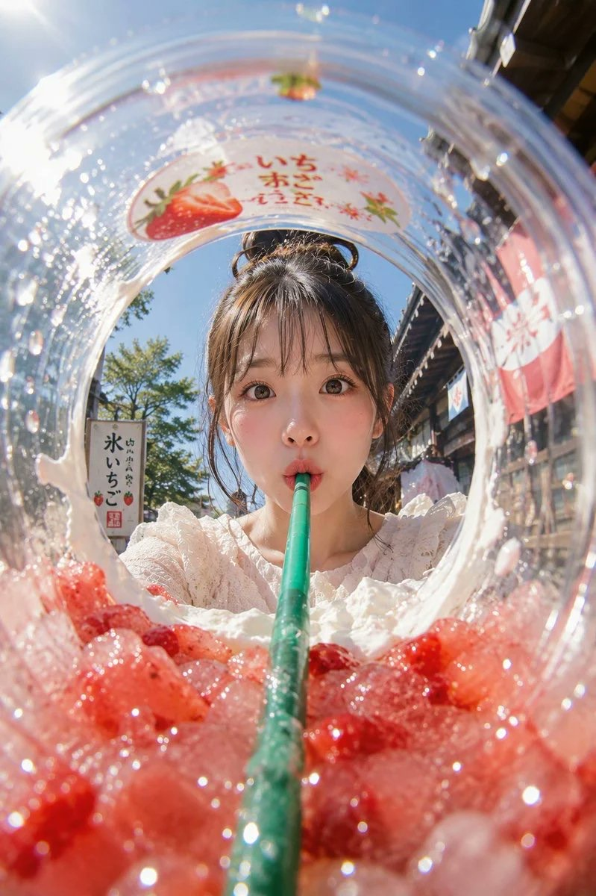</a><br><strong>Inside-the-cup ad</strong><br><a href="docs/copy-prompts/image-inside-cup-fisheye-summer-drink-ad.md">Copy Prompt</a></td>
<td width="33%"><a href="styles/botanical-soda/style.json"></a><br><strong>Botanical soda</strong><br><a href="docs/copy-prompts/botanical-soda.md">Copy Prompt</a></td>
<td width="33%"><a href="styles/coastal-poster/style.json">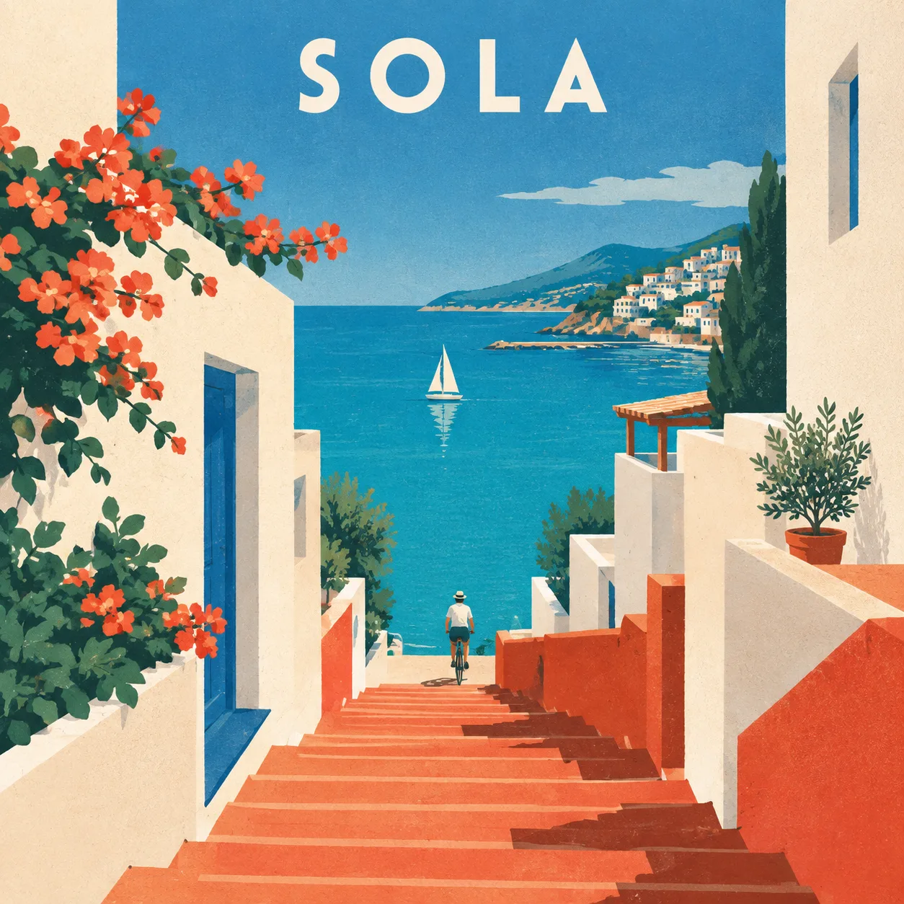</a><br><strong>Coastal city poster</strong><br><a href="docs/copy-prompts/coastal-poster.md">Copy Prompt</a></td>
</tr></table>

## All Styles

Browse 140 visual directions; distinct linked versions open from the same card. All 180 prompts remain accessible through the [online gallery](https://dingle-kb.github.io/awesome-image-video-prompts/) and [full catalog](docs/CATALOG.md).

<!-- BEGIN GENERATED GALLERY -->
### Image (82)

<table>
<tr>
<td width="33%" valign="top"><a href="docs/copy-prompts/image-inside-cup-fisheye-summer-drink-ad.md"></a><br><strong>杯内鱼眼夏日冰饮广告</strong><br><sub>从透明饮料杯内部使用鱼眼视角拍摄人物饮用冰饮的夏日商业广告。</sub><br><a href="styles/image-inside-cup-fisheye-summer-drink-ad/style.json">style.json</a> · <a href="docs/copy-prompts/image-inside-cup-fisheye-summer-drink-ad.md">Copy Prompt</a></td>
<td width="33%" valign="top"><a href="docs/copy-prompts/image-bento-food-packaging-concept.md">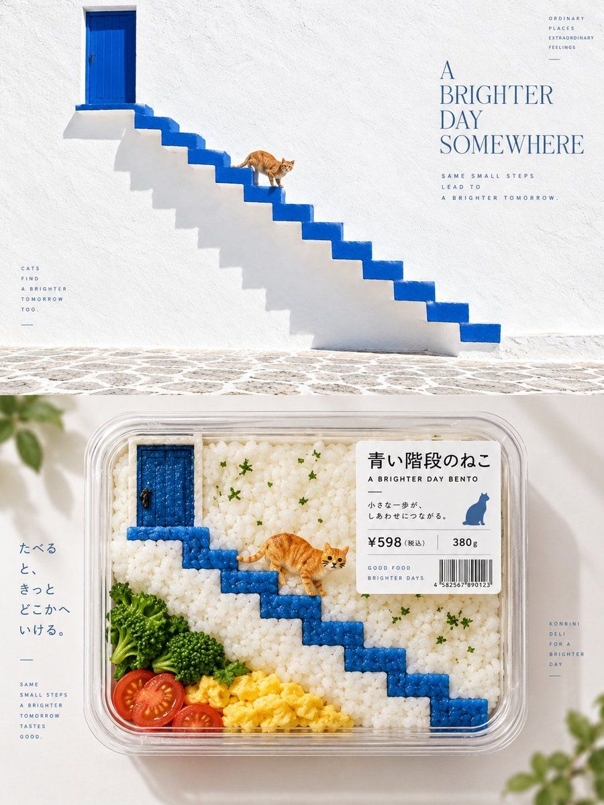</a><br><strong>便当化食品包装创意</strong><br><sub>把食品或包装商品重新设计为便当式分区陈列创意图。</sub><br><a href="styles/image-bento-food-packaging-concept/style.json">style.json</a> · <a href="docs/copy-prompts/image-bento-food-packaging-concept.md">Copy Prompt</a></td>
<td width="33%" valign="top"><a href="docs/copy-prompts/image-acrylic-hand-painted-split-poster.md">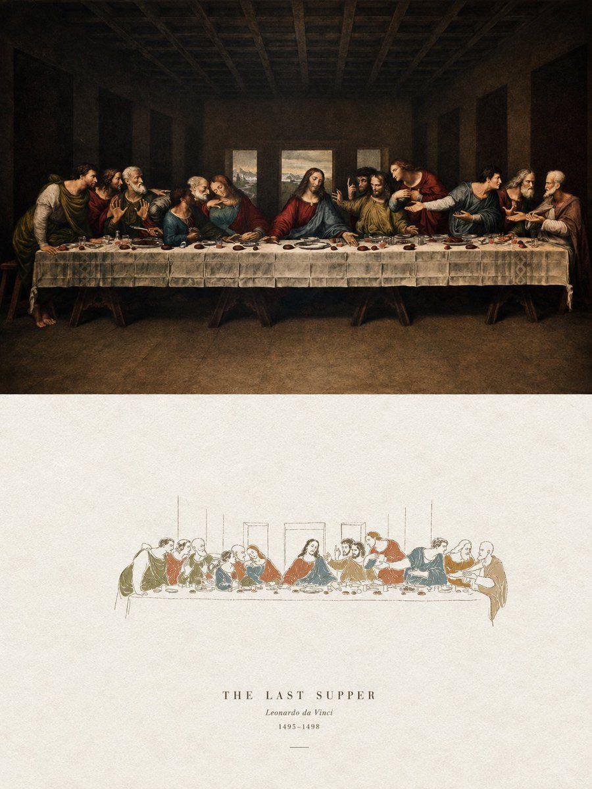</a><br><strong>丙烯手绘风格海报设计</strong><br><sub>将上传照片制作成上半部真实摄影、下半部极简丙烯手绘插画的 3:4 高级设计海报。</sub><br><a href="styles/image-acrylic-hand-painted-split-poster/style.json">style.json</a> · <a href="docs/copy-prompts/image-acrylic-hand-painted-split-poster.md">Copy Prompt</a></td>
</tr>
<tr>
<td width="33%" valign="top"><a href="docs/copy-prompts/image-miniature-city-map-travel-poster-source.md">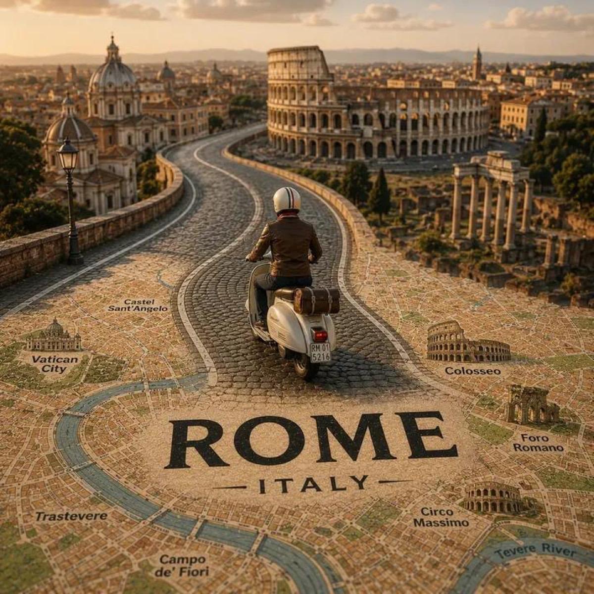</a><br><strong>城市地图微缩旅行海报</strong><br><sub>把城市地图、弯曲道路、交通工具和地标融合成写实微缩旅行海报。</sub><br><a href="styles/image-miniature-city-map-travel-poster-source/style.json">style.json</a> · <a href="docs/copy-prompts/image-miniature-city-map-travel-poster-source.md">Copy Prompt</a> · <a href="docs/copy-prompts/image-miniature-city-map-travel-poster.md">Linked Version</a></td>
<td width="33%" valign="top"><a href="docs/copy-prompts/image-city-corner-3d-billboard-photography.md">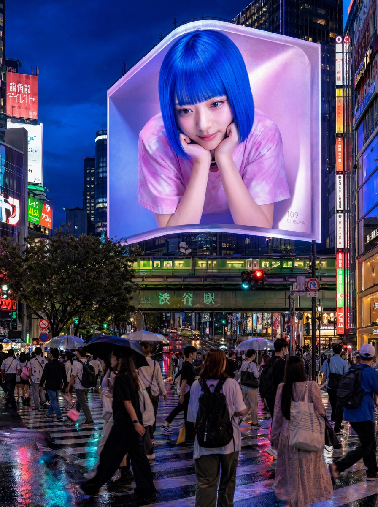</a><br><strong>城市巨幕三维广告摄影</strong><br><sub>生成蓝调时刻城市街头摄影，核心是一块包裹建筑转角、具有裸眼三维错觉的巨型户外广告屏。</sub><br><a href="styles/image-city-corner-3d-billboard-photography/style.json">style.json</a> · <a href="docs/copy-prompts/image-city-corner-3d-billboard-photography.md">Copy Prompt</a></td>
<td width="33%" valign="top"><strong>创作者视频封面</strong><br><sub>优先保证主题识别与手机端标题可读性。</sub><br><a href="styles/creator-cover/style.json">style.json</a> · <a href="docs/copy-prompts/creator-cover.md">Copy Prompt</a></td>
</tr>
<tr>
<td width="33%" valign="top"><a href="docs/copy-prompts/image-isometric-miniature-kitchen.md">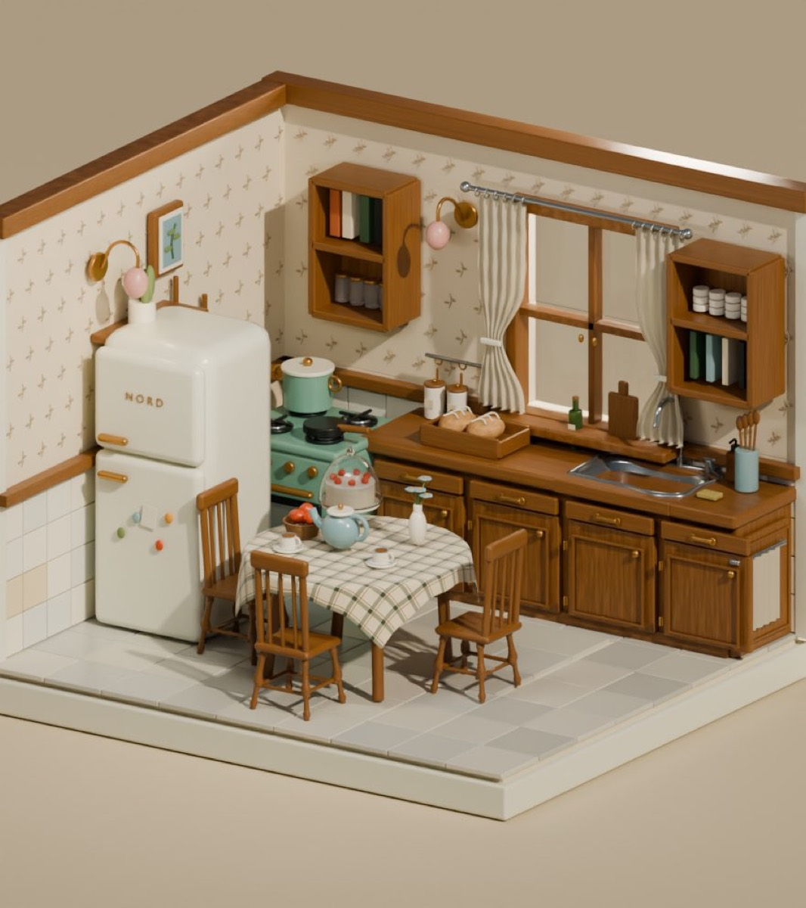</a><br><strong>等轴测微缩厨房</strong><br><sub>生成等轴测视角的完整微缩厨房空间。</sub><br><a href="styles/image-isometric-miniature-kitchen/style.json">style.json</a> · <a href="docs/copy-prompts/image-isometric-miniature-kitchen.md">Copy Prompt</a></td>
<td width="33%" valign="top"><strong>电商商品系列图</strong><br><sub>让同一商品的多角度图像保持材质和色彩一致。</sub><br><a href="styles/ecommerce-grid/style.json">style.json</a> · <a href="docs/copy-prompts/ecommerce-grid.md">Copy Prompt</a></td>
<td width="33%" valign="top"><a href="docs/copy-prompts/image-cinematic-action-rpg-screenshot.md">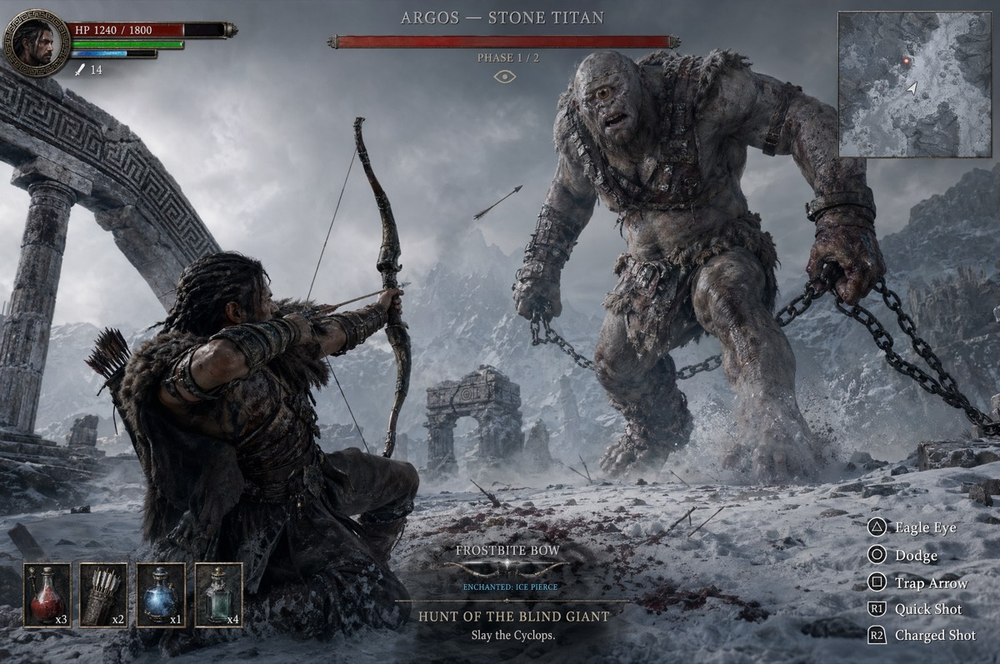</a><br><strong>电影级动作角色扮演游戏截图</strong><br><sub>生成一张包含玩家角色、巨型首领、战斗瞬间、环境叙事和完整 HUD 的电影级第三人称动作角色扮演游戏截图。</sub><br><a href="styles/image-cinematic-action-rpg-screenshot/style.json">style.json</a> · <a href="docs/copy-prompts/image-cinematic-action-rpg-screenshot.md">Copy Prompt</a></td>
</tr>
<tr>
<td width="33%" valign="top"><a href="docs/copy-prompts/image-animated-campus-world-reference-board.md">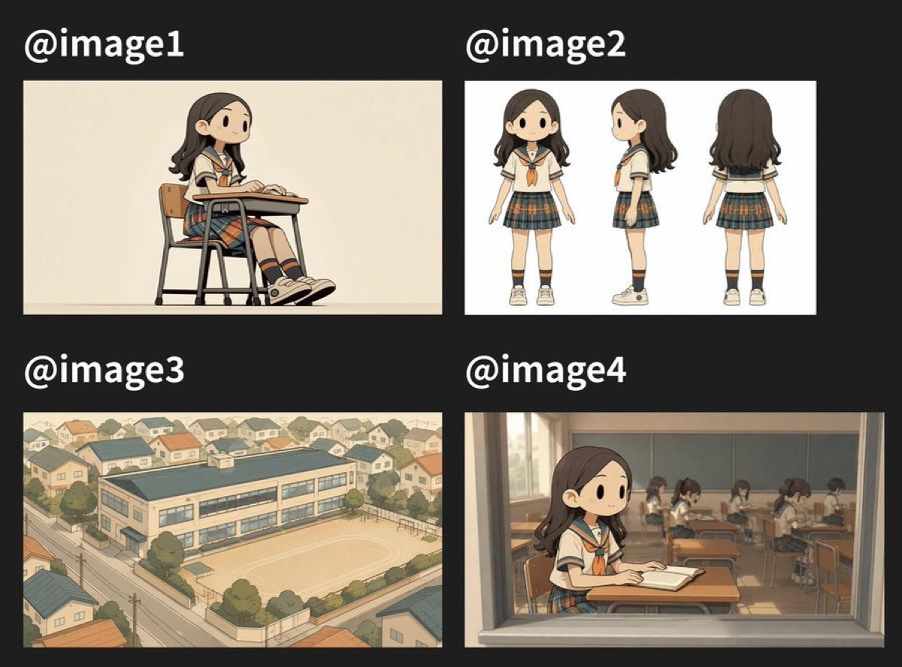</a><br><strong>动画校园世界观参考面板</strong><br><sub>生成角色、校园外观和教室场景保持统一的四格世界观参考板。</sub><br><a href="styles/image-animated-campus-world-reference-board/style.json">style.json</a> · <a href="docs/copy-prompts/image-animated-campus-world-reference-board.md">Copy Prompt</a></td>
<td width="33%" valign="top"><a href="docs/copy-prompts/image-solar-terms-editorial-visual.md">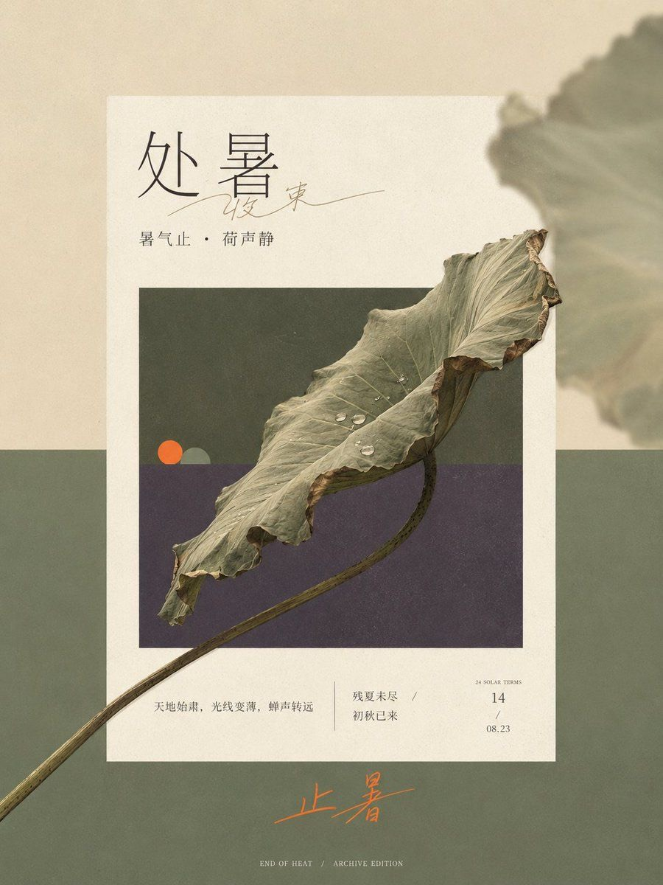</a><br><strong>二十四节气编辑视觉设计</strong><br><sub>生成具有三层平面空间、跨界核心形态和现代纸印质感的二十四节气竖版编辑视觉。</sub><br><a href="styles/image-solar-terms-editorial-visual/style.json">style.json</a> · <a href="docs/copy-prompts/image-solar-terms-editorial-visual.md">Copy Prompt</a></td>
<td width="33%" valign="top"><a href="docs/copy-prompts/image-french-new-wave-torn-paper-poster-source.md">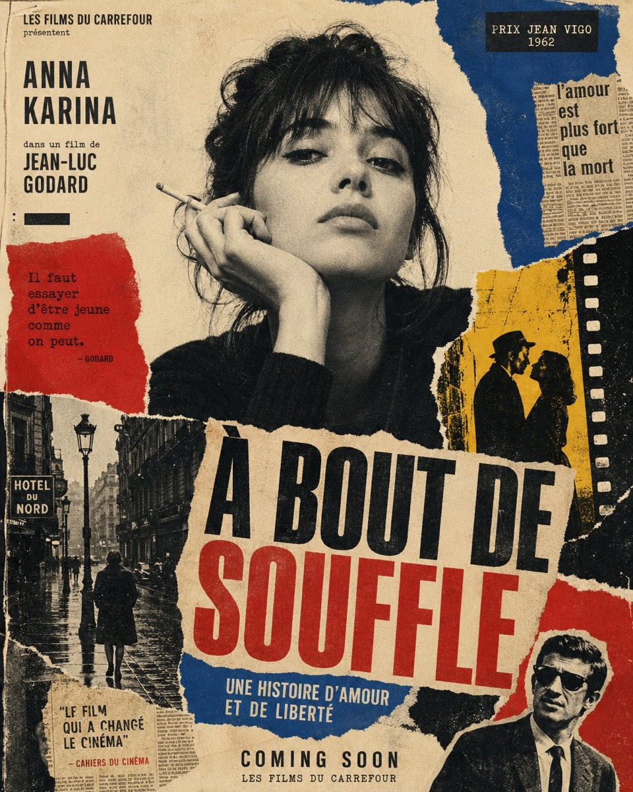</a><br><strong>法新浪潮撕纸电影海报</strong><br><sub>生成具有撕纸、复印颗粒、网点和手工拼贴质感的法国新浪潮电影海报。</sub><br><a href="styles/image-french-new-wave-torn-paper-poster-source/style.json">style.json</a> · <a href="docs/copy-prompts/image-french-new-wave-torn-paper-poster-source.md">Copy Prompt</a> · <a href="docs/copy-prompts/image-french-new-wave-torn-paper-poster.md">Linked Version</a></td>
</tr>
<tr>
<td width="33%" valign="top"><a href="docs/copy-prompts/image-reflective-ski-gear-landing-page.md">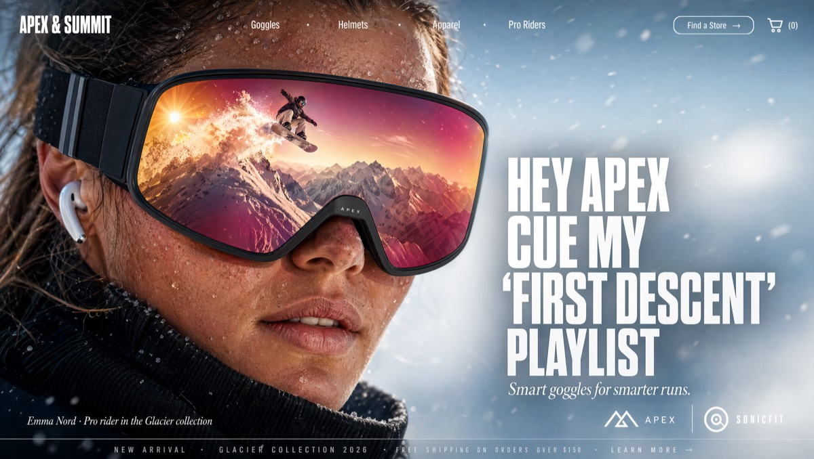</a><br><strong>反射式滑雪装备落地页</strong><br><sub>生成高端滑雪装备品牌的横版网页主视觉，以护目镜特写和镜片内动作反射讲述产品场景。</sub><br><a href="styles/image-reflective-ski-gear-landing-page/style.json">style.json</a> · <a href="docs/copy-prompts/image-reflective-ski-gear-landing-page.md">Copy Prompt</a></td>
<td width="33%" valign="top"><a href="docs/copy-prompts/image-split-canvas-editorial-art-poster.md">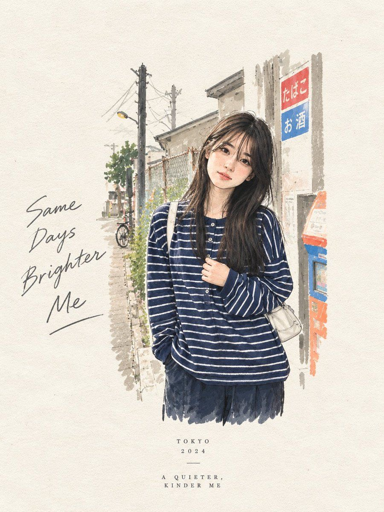</a><br><strong>分割画布编辑艺术海报</strong><br><sub>生成具有分割画布、人物与编辑排版关系的艺术海报。</sub><br><a href="styles/image-split-canvas-editorial-art-poster/style.json">style.json</a> · <a href="docs/copy-prompts/image-split-canvas-editorial-art-poster.md">Copy Prompt</a></td>
<td width="33%" valign="top"><a href="docs/copy-prompts/image-graded-english-magazine-reading-page.md"></a><br><strong>分级英语杂志阅读页</strong><br><sub>根据指定主题、CEFR（欧洲语言共同参考框架）英语等级和正文词数，生成一张高级黑白报刊社论风英文杂志阅读页。适合作为不同英语水平的分级阅读材料。</sub><br><a href="styles/image-graded-english-magazine-reading-page/style.json">style.json</a> · <a href="docs/copy-prompts/image-graded-english-magazine-reading-page.md">Copy Prompt</a></td>
</tr>
<tr>
<td width="33%" valign="top"><a href="docs/copy-prompts/image-vintage-scientific-botanical-poster.md">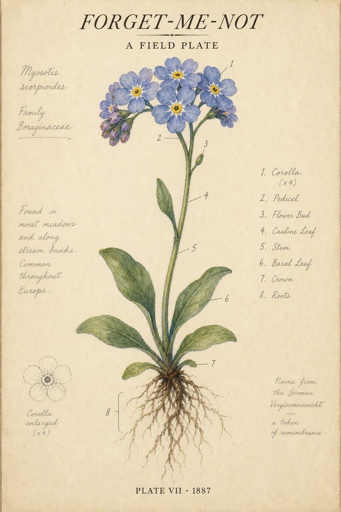</a><br><strong>复古科学植物学海报</strong><br><sub>生成带解剖编号、手写注记和科学图版排版的植物学海报。</sub><br><a href="styles/image-vintage-scientific-botanical-poster/style.json">style.json</a> · <a href="docs/copy-prompts/image-vintage-scientific-botanical-poster.md">Copy Prompt</a></td>
<td width="33%" valign="top"><a href="docs/copy-prompts/image-retro-scrapbook-poster.md">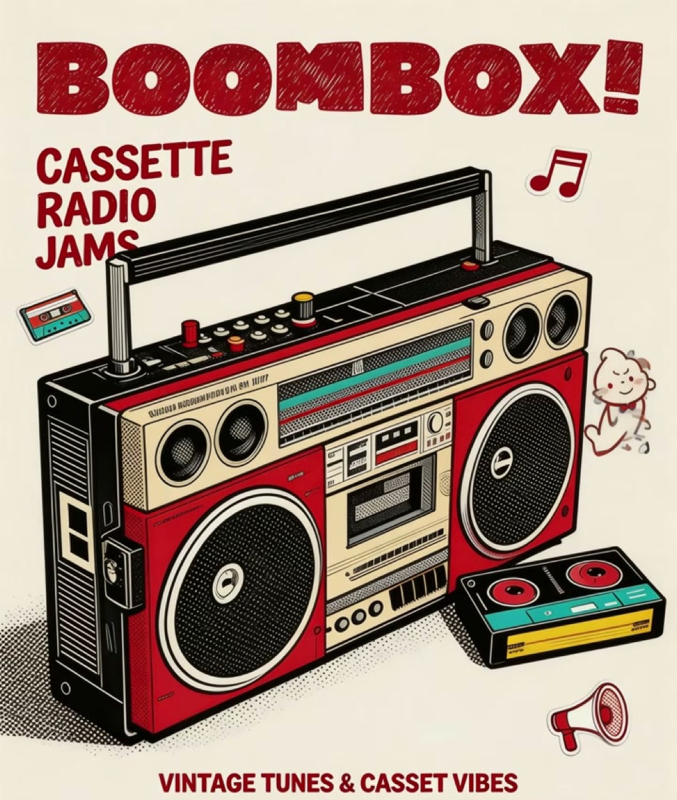</a><br><strong>复古手账海报排版</strong><br><sub>以一张排版参考图和一张主体插画，设计主题一致的复古手账海报。</sub><br><a href="styles/image-retro-scrapbook-poster/style.json">style.json</a> · <a href="docs/copy-prompts/image-retro-scrapbook-poster.md">Copy Prompt</a></td>
<td width="33%" valign="top"><a href="docs/copy-prompts/image-retro-halftone-illustration.md">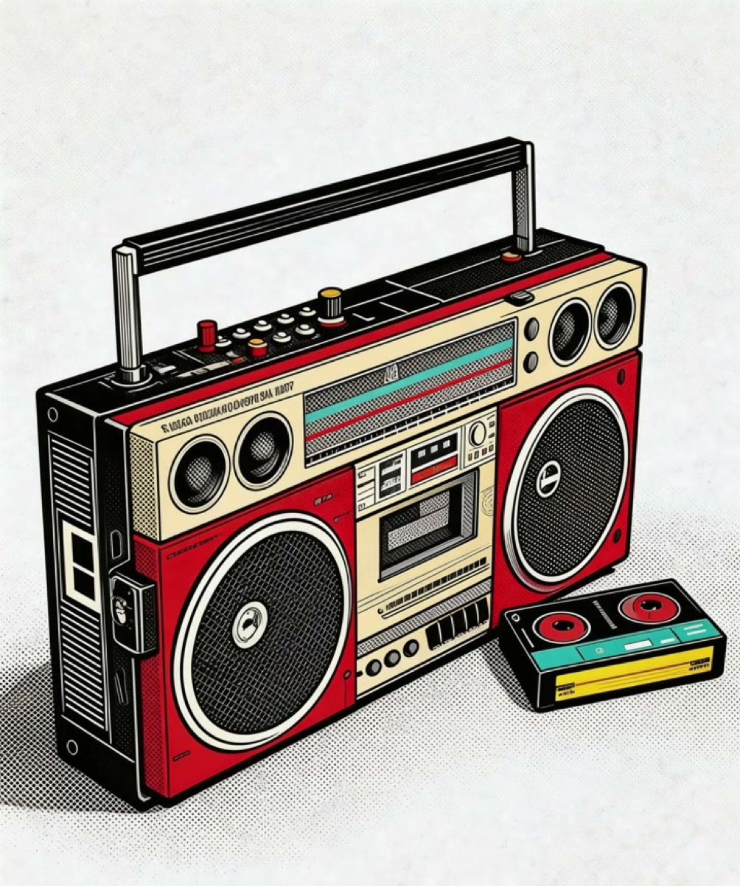</a><br><strong>复古网点插画转绘</strong><br><sub>上传原照片，将主体转绘为粗黑轮廓、半色调网点与有限配色的复古插画。</sub><br><a href="styles/image-retro-halftone-illustration/style.json">style.json</a> · <a href="docs/copy-prompts/image-retro-halftone-illustration.md">Copy Prompt</a></td>
</tr>
<tr>
<td width="33%" valign="top"><a href="docs/copy-prompts/image-concept-sofa-development-board-source.md">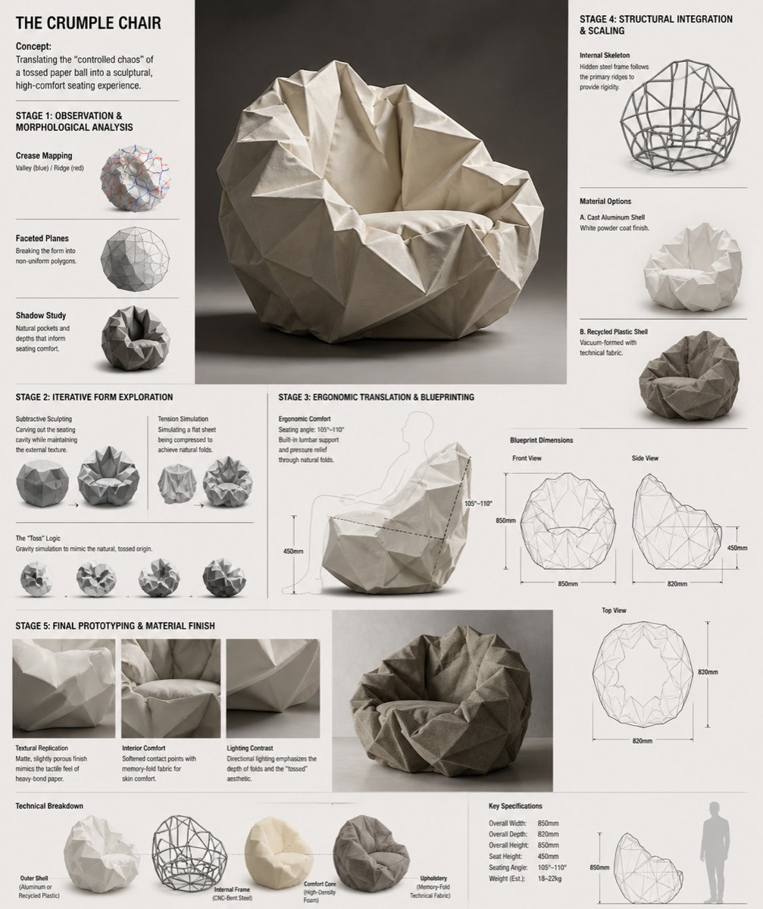</a><br><strong>概念沙发研发板</strong><br><sub>生成从形态观察、结构推导到成品展示的概念家具研发视觉板。</sub><br><a href="styles/image-concept-sofa-development-board-source/style.json">style.json</a> · <a href="docs/copy-prompts/image-concept-sofa-development-board-source.md">Copy Prompt</a> · <a href="docs/copy-prompts/image-concept-sofa-development-board.md">Linked Version</a></td>
<td width="33%" valign="top"><a href="docs/copy-prompts/image-haute-couture-fashion-magazine-cover-source.md">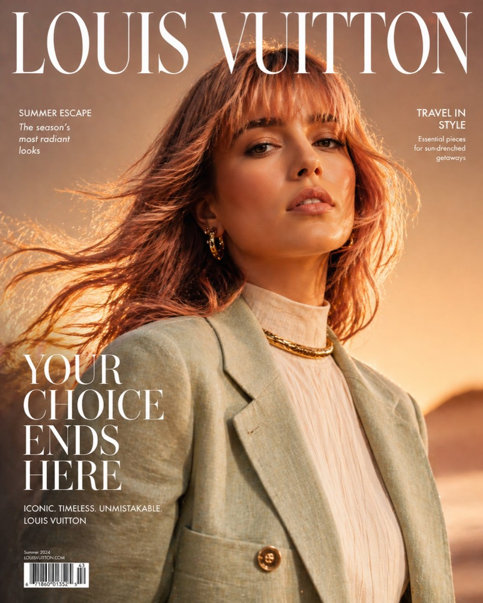</a><br><strong>高定时尚杂志封面</strong><br><sub>生成带高定人像、夏日金色光线和奢侈时尚排版的杂志封面。</sub><br><a href="styles/image-haute-couture-fashion-magazine-cover-source/style.json">style.json</a> · <a href="docs/copy-prompts/image-haute-couture-fashion-magazine-cover-source.md">Copy Prompt</a> · <a href="docs/copy-prompts/image-haute-couture-fashion-magazine-cover.md">Linked Version</a></td>
<td width="33%" valign="top"><a href="docs/copy-prompts/image-premium-food-commercial-storyboard.md">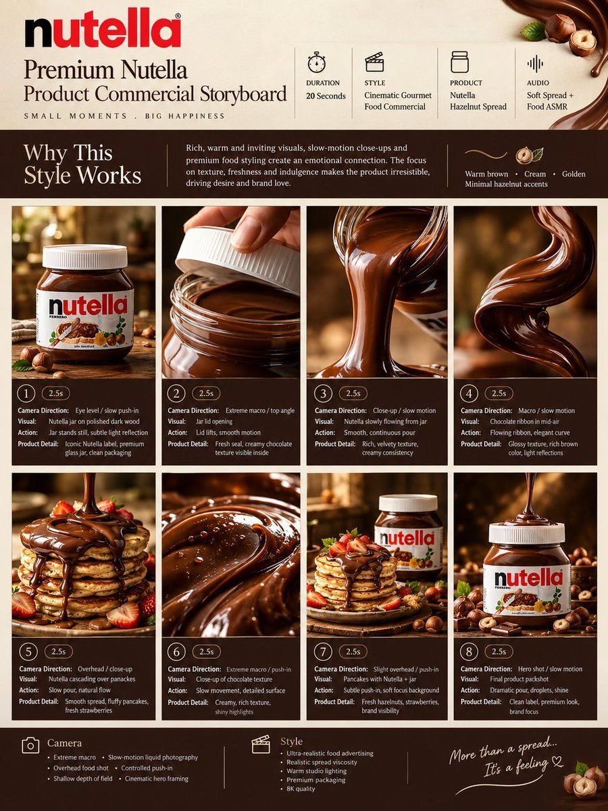</a><br><strong>高端食品商业广告分镜</strong><br><sub>生成单页高端食品广告分镜与镜头项目板。</sub><br><a href="styles/image-premium-food-commercial-storyboard/style.json">style.json</a> · <a href="docs/copy-prompts/image-premium-food-commercial-storyboard.md">Copy Prompt</a></td>
</tr>
<tr>
<td width="33%" valign="top"><a href="docs/copy-prompts/image-grimm-fairy-tale-woodcut-poster.md">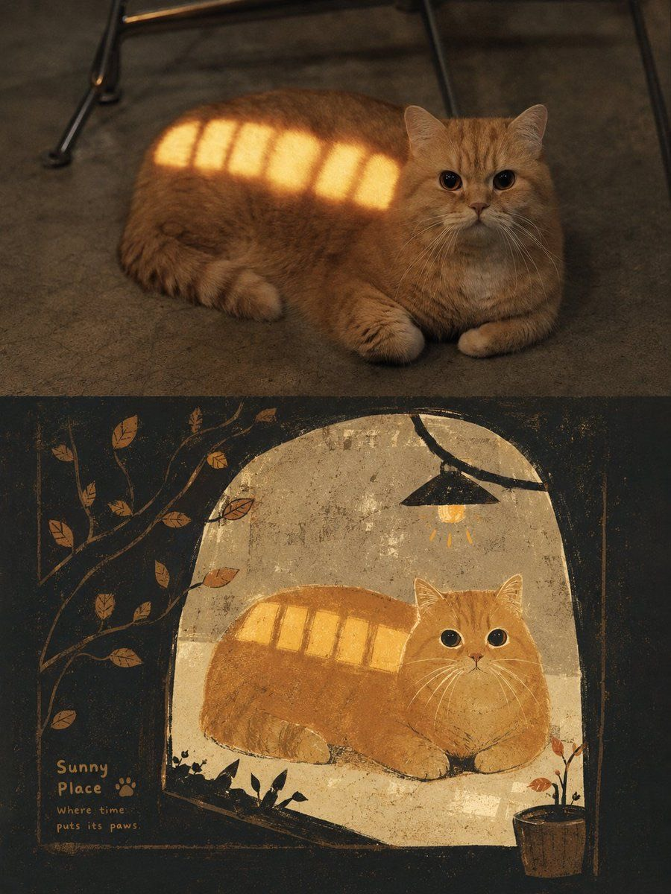</a><br><strong>格林童话木刻版画海报</strong><br><sub>将人物、动物、建筑或场景照片转化为具有童话叙事、木刻版画和手工印刷质感的海报。</sub><br><a href="styles/image-grimm-fairy-tale-woodcut-poster/style.json">style.json</a> · <a href="docs/copy-prompts/image-grimm-fairy-tale-woodcut-poster.md">Copy Prompt</a></td>
<td width="33%" valign="top"><a href="docs/copy-prompts/image-minimal-abstract-geometric-deconstruction-poster.md">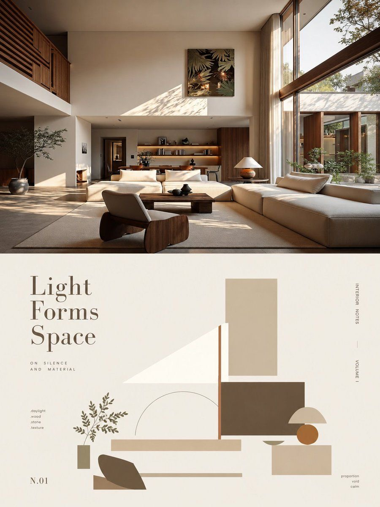</a><br><strong>极简抽象几何解构海报</strong><br><sub>把照片中的结构、色彩和记忆点解构为极简几何形体，并结合艺术出版物式微排版生成海报。</sub><br><a href="styles/image-minimal-abstract-geometric-deconstruction-poster/style.json">style.json</a> · <a href="docs/copy-prompts/image-minimal-abstract-geometric-deconstruction-poster.md">Copy Prompt</a></td>
<td width="33%" valign="top"><a href="docs/copy-prompts/image-minimal-conceptual-line-art-poster.md">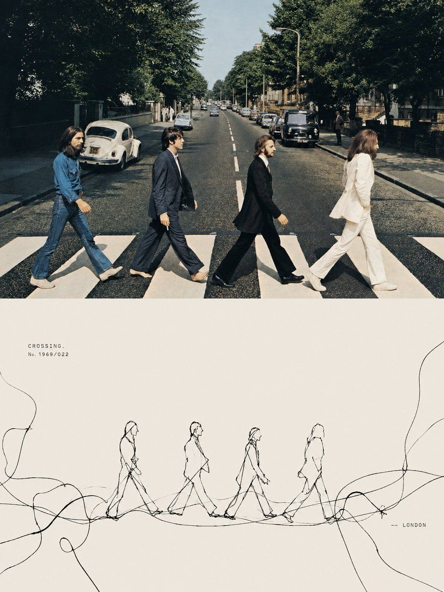</a><br><strong>极简概念线条艺术海报</strong><br><sub>把照片重构为带有公共议题气质、强调张力与留白的极简概念线条艺术海报。</sub><br><a href="styles/image-minimal-conceptual-line-art-poster/style.json">style.json</a> · <a href="docs/copy-prompts/image-minimal-conceptual-line-art-poster.md">Copy Prompt</a></td>
</tr>
<tr>
<td width="33%" valign="top"><a href="docs/copy-prompts/image-architecture-photo-concept-sketch-diptych.md">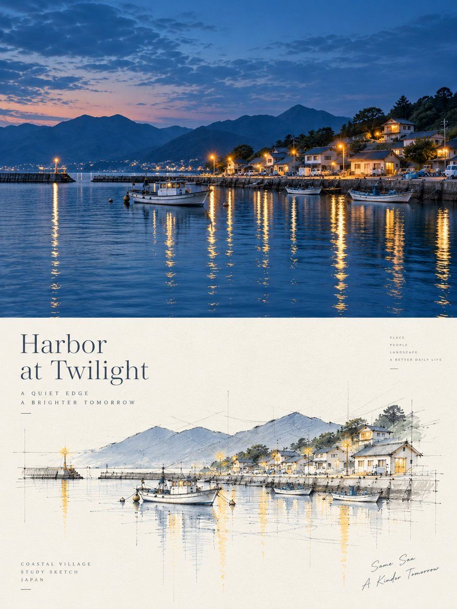</a><br><strong>建筑照片概念草图双联海报</strong><br><sub>把上传照片转化为上方实景、下方建筑概念草图的双联海报。</sub><br><a href="styles/image-architecture-photo-concept-sketch-diptych/style.json">style.json</a> · <a href="docs/copy-prompts/image-architecture-photo-concept-sketch-diptych.md">Copy Prompt</a></td>
<td width="33%" valign="top"><a href="docs/copy-prompts/image-berry-smoothie-commercial-photo.md">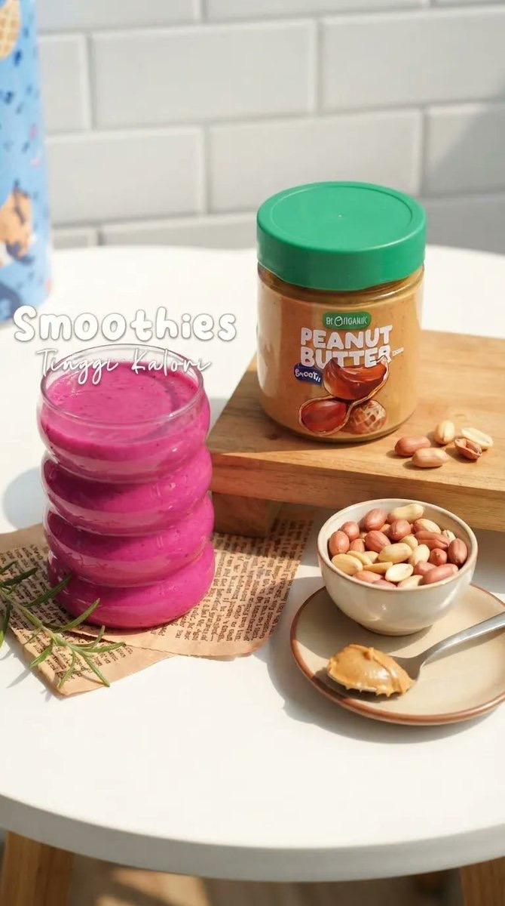</a><br><strong>浆果冰沙商业摄影</strong><br><sub>生成具有广告质感的饮品产品摄影。</sub><br><a href="styles/image-berry-smoothie-commercial-photo/style.json">style.json</a> · <a href="docs/copy-prompts/image-berry-smoothie-commercial-photo.md">Copy Prompt</a></td>
<td width="33%" valign="top"><strong>角色设定多视角板</strong><br><sub>把形象、服装和道具固定在正面、侧面与背面。</sub><br><a href="styles/character-turnaround/style.json">style.json</a> · <a href="docs/copy-prompts/character-turnaround.md">Copy Prompt</a></td>
</tr>
<tr>
<td width="33%" valign="top"><a href="docs/copy-prompts/image-street-scroll-backdrop-fashion-editorial.md"></a><br><strong>街头卷轴背景时尚大片</strong><br><sub>生成把手工卷轴摄影背景放入真实街道的时尚广告大片，以棚拍秩序和户外环境形成视觉对照。</sub><br><a href="styles/image-street-scroll-backdrop-fashion-editorial/style.json">style.json</a> · <a href="docs/copy-prompts/image-street-scroll-backdrop-fashion-editorial.md">Copy Prompt</a></td>
<td width="33%" valign="top"><a href="docs/copy-prompts/image-vr-headset-exploded-interface-diagram.md">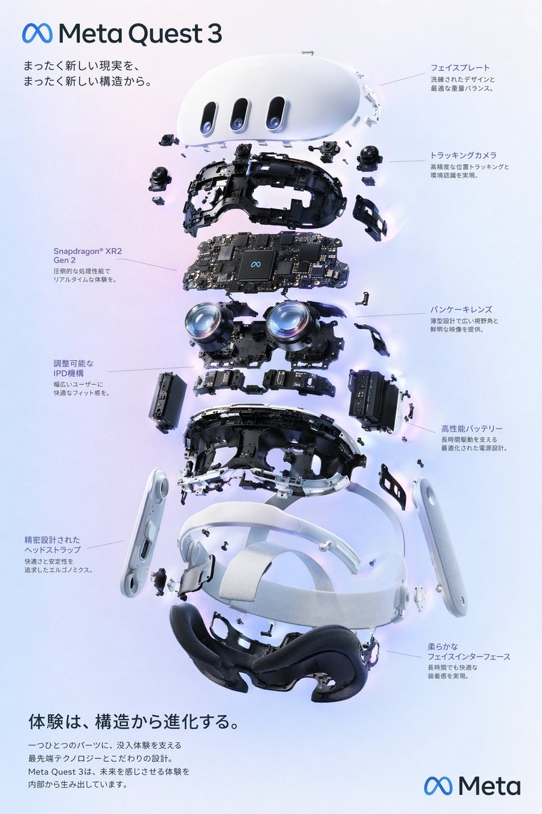</a><br><strong>界面交互设计图</strong><br><sub>生成带产品部件分层、功能标注和科技视觉效果的 VR 头显爆炸拆解展示图。</sub><br><a href="styles/image-vr-headset-exploded-interface-diagram/style.json">style.json</a> · <a href="docs/copy-prompts/image-vr-headset-exploded-interface-diagram.md">Copy Prompt</a></td>
<td width="33%" valign="top"><a href="docs/copy-prompts/image-boutique-ecommerce-product-flatlay-grid.md">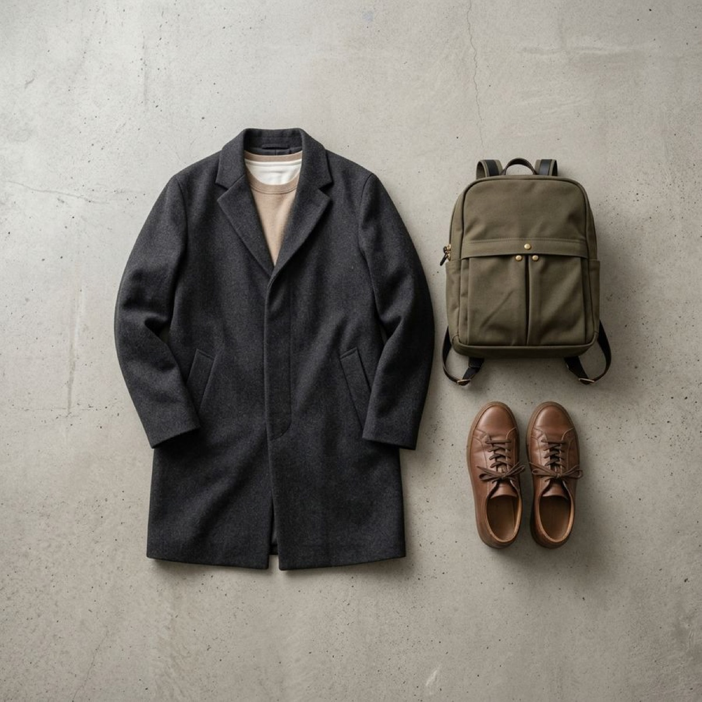</a><br><strong>精品电商产品平铺网格</strong><br><sub>生成精品服饰、配件和生活方式商品的平铺电商展示网格。</sub><br><a href="styles/image-boutique-ecommerce-product-flatlay-grid/style.json">style.json</a> · <a href="docs/copy-prompts/image-boutique-ecommerce-product-flatlay-grid.md">Copy Prompt</a></td>
</tr>
<tr>
<td width="33%" valign="top"><a href="docs/copy-prompts/image-tech-product-review-thumbnail.md">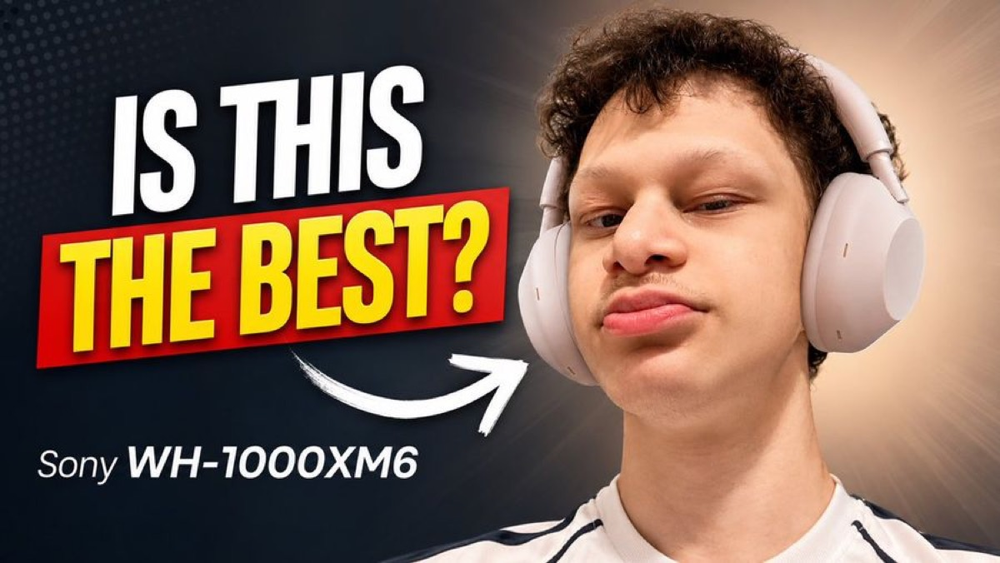</a><br><strong>科技产品评测缩略图</strong><br><sub>生成科技产品评测视频使用的高点击率横版缩略图。</sub><br><a href="styles/image-tech-product-review-thumbnail/style.json">style.json</a> · <a href="docs/copy-prompts/image-tech-product-review-thumbnail.md">Copy Prompt</a></td>
<td width="33%" valign="top"><a href="docs/copy-prompts/image-croissant-baking-storyboard-source.md">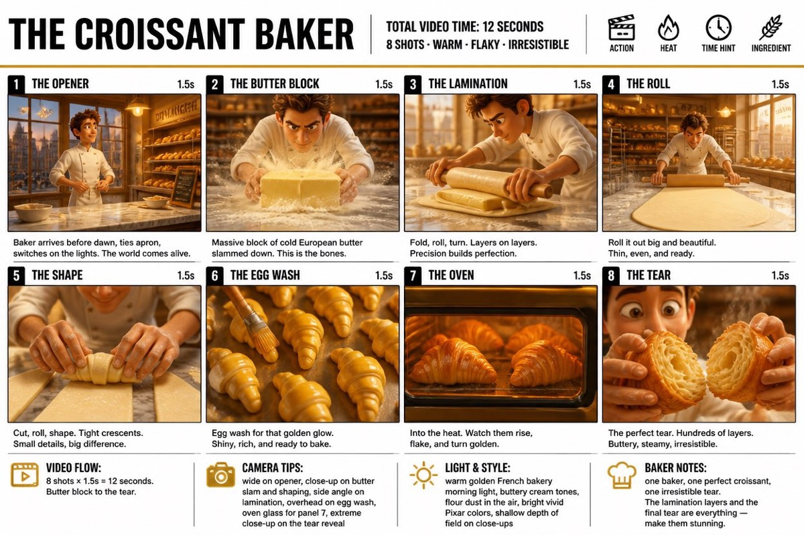</a><br><strong>可颂烘焙流程分镜板</strong><br><sub>生成展示可颂制作过程、镜头顺序和成品诱惑力的食品商业分镜板。</sub><br><a href="styles/image-croissant-baking-storyboard-source/style.json">style.json</a> · <a href="docs/copy-prompts/image-croissant-baking-storyboard-source.md">Copy Prompt</a> · <a href="docs/copy-prompts/image-croissant-baking-storyboard.md">Linked Version</a></td>
<td width="33%" valign="top"><a href="docs/copy-prompts/image-326b2a7f37.md">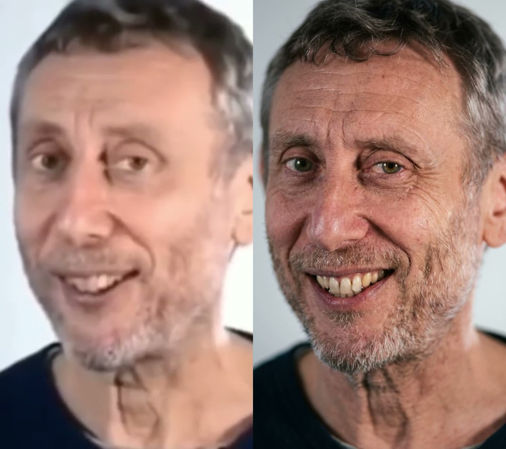</a><br><strong>老照片人像保真修复</strong><br><sub>以一张有人物的旧照或低清照片作为参考图，提升人像画质，同时要求保留人物身份、表情、脸型和背景。适合以人物为主体、需要尽量忠于原图的照片修复场景。</sub><br><a href="styles/image-326b2a7f37/style.json">style.json</a> · <a href="docs/copy-prompts/image-326b2a7f37.md">Copy Prompt</a></td>
</tr>
<tr>
<td width="33%" valign="top"><a href="docs/copy-prompts/pear-tart-storyboard.md">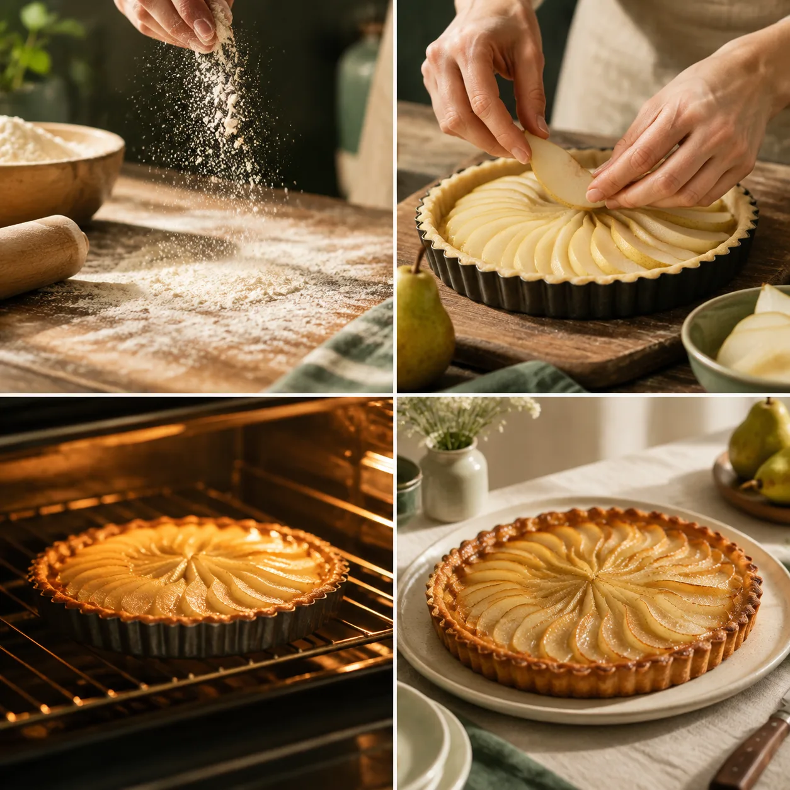</a><br><strong>梨挞广告四镜头分镜</strong><br><sub>四格镜头从原料、制作、烘烤过渡到成品。</sub><br><a href="styles/pear-tart-storyboard/style.json">style.json</a> · <a href="docs/copy-prompts/pear-tart-storyboard.md">Copy Prompt</a></td>
<td width="33%" valign="top"><a href="docs/copy-prompts/image-rio-travel-ticket-paper-diorama-poster-source.md">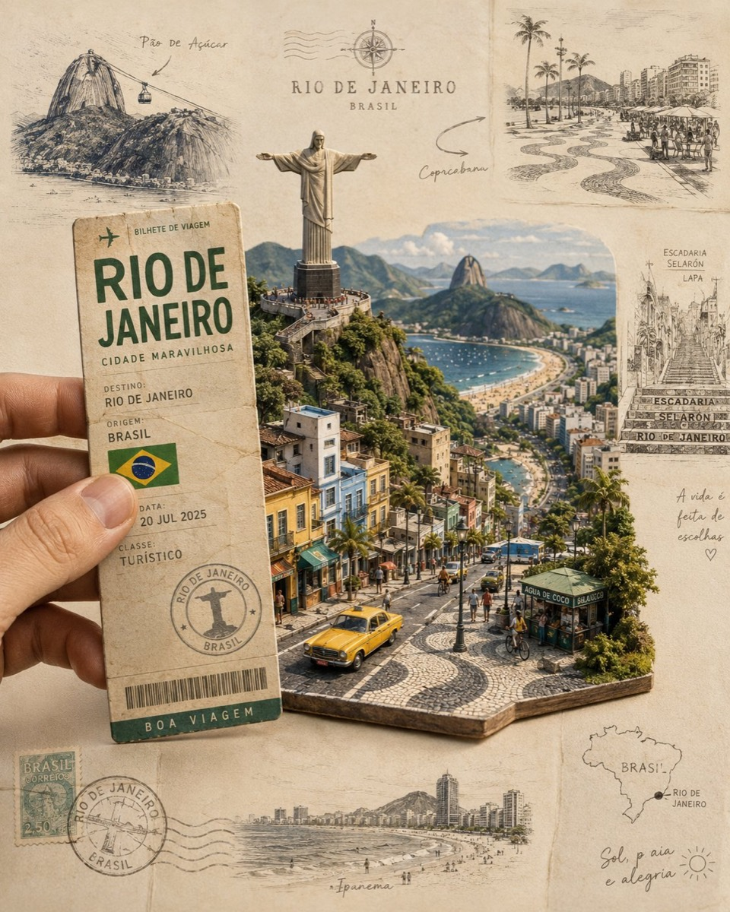</a><br><strong>里约旅行票据纸雕立体海报</strong><br><sub>把旅行票据、城市地标与纸雕场景组合成具有收藏感的立体旅行海报。</sub><br><a href="styles/image-rio-travel-ticket-paper-diorama-poster-source/style.json">style.json</a> · <a href="docs/copy-prompts/image-rio-travel-ticket-paper-diorama-poster-source.md">Copy Prompt</a> · <a href="docs/copy-prompts/image-rio-travel-ticket-paper-diorama-poster.md">Linked Version</a></td>
<td width="33%" valign="top"><a href="docs/copy-prompts/image-six-panel-miniature-beverage-ad-source.md">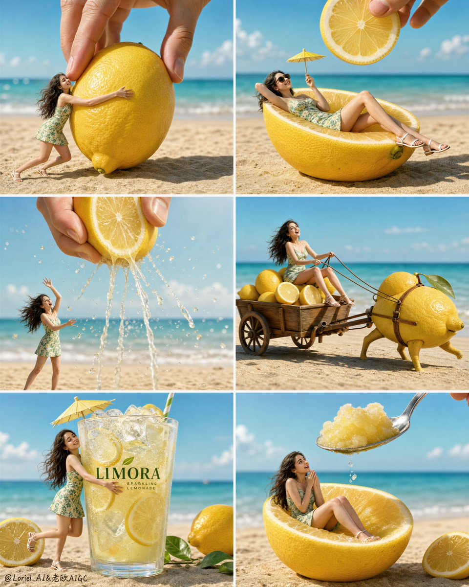</a><br><strong>六宫格饮料微缩广告</strong><br><sub>使用严格六宫格与微缩人物，生成围绕同一饮料品牌展开的完整商业广告系列。</sub><br><a href="styles/image-six-panel-miniature-beverage-ad-source/style.json">style.json</a> · <a href="docs/copy-prompts/image-six-panel-miniature-beverage-ad-source.md">Copy Prompt</a> · <a href="docs/copy-prompts/image-six-panel-miniature-beverage-ad.md">Linked Version</a></td>
</tr>
<tr>
<td width="33%" valign="top"><a href="docs/copy-prompts/image-travel-souvenir-enamel-pin-source.md">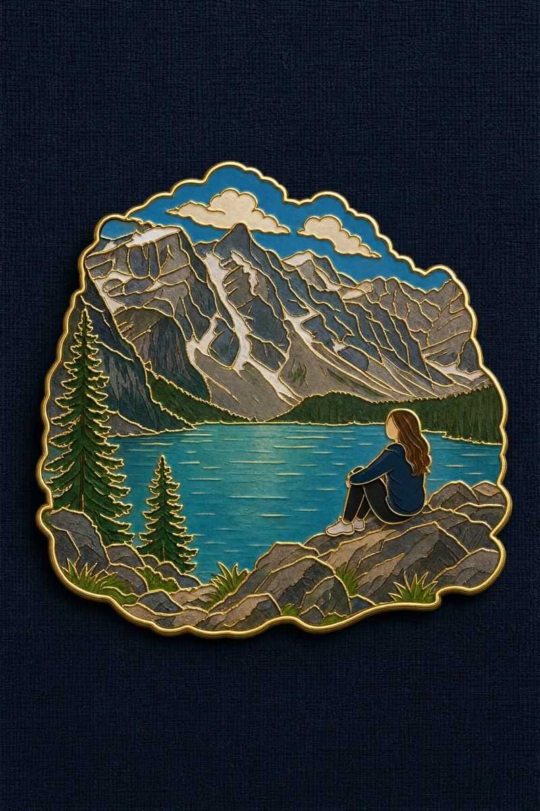</a><br><strong>旅行纪念珐琅徽章</strong><br><sub>将旅行照片中的地形、地标和人物比例转化为场景式珐琅纪念徽章。</sub><br><a href="styles/image-travel-souvenir-enamel-pin-source/style.json">style.json</a> · <a href="docs/copy-prompts/image-travel-souvenir-enamel-pin-source.md">Copy Prompt</a> · <a href="docs/copy-prompts/image-travel-souvenir-enamel-pin.md">Linked Version</a></td>
<td width="33%" valign="top"><strong>旅行主题丝网印刷海报</strong><br><sub>用地标、路线和有限色版构建目的地识别度。</sub><br><a href="styles/travel-print-poster/style.json">style.json</a> · <a href="docs/copy-prompts/travel-print-poster.md">Copy Prompt</a></td>
<td width="33%" valign="top"><a href="docs/copy-prompts/image-cooking-sketch-illustration-story.md"></a><br><strong>烹饪速写插画叙事</strong><br><sub>将食物或烹饪主题转化为包含食材、准备过程、质地和成品的 4 至 6 格怀旧手绘速写故事。</sub><br><a href="styles/image-cooking-sketch-illustration-story/style.json">style.json</a> · <a href="docs/copy-prompts/image-cooking-sketch-illustration-story.md">Copy Prompt</a></td>
</tr>
<tr>
<td width="33%" valign="top"><a href="docs/copy-prompts/image-y2k-streetwear-mobile-landing-page.md">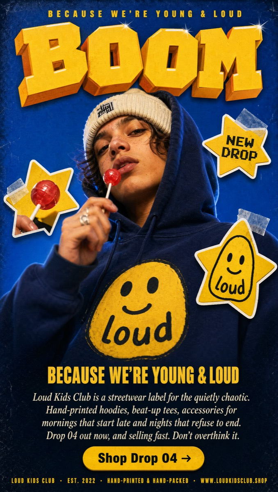</a><br><strong>千禧街头服饰移动落地页</strong><br><sub>生成一张海报式 9:16 移动端街头服饰品牌落地页，融合人物主视觉、夸张字标、贴纸拼贴、商品文案和购买按钮。</sub><br><a href="styles/image-y2k-streetwear-mobile-landing-page/style.json">style.json</a> · <a href="docs/copy-prompts/image-y2k-streetwear-mobile-landing-page.md">Copy Prompt</a></td>
<td width="33%" valign="top"><a href="docs/copy-prompts/image-y2k-virtual-try-on-game-ui.md">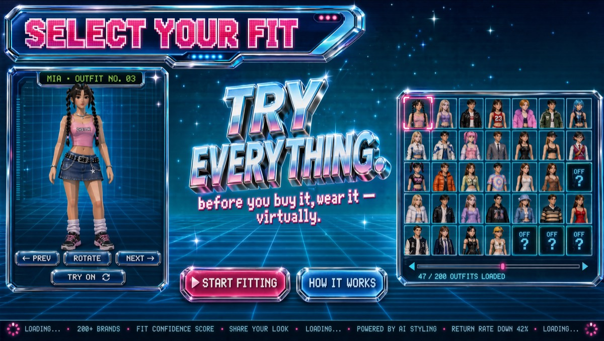</a><br><strong>千禧虚拟试衣游戏界面</strong><br><sub>生成一张把虚拟试衣服务设计成千禧年主机游戏角色选择界面的横版网页视觉。</sub><br><a href="styles/image-y2k-virtual-try-on-game-ui/style.json">style.json</a> · <a href="docs/copy-prompts/image-y2k-virtual-try-on-game-ui.md">Copy Prompt</a></td>
<td width="33%" valign="top"><a href="docs/copy-prompts/image-blue-white-dunhuang-embroidery-quadriptych.md">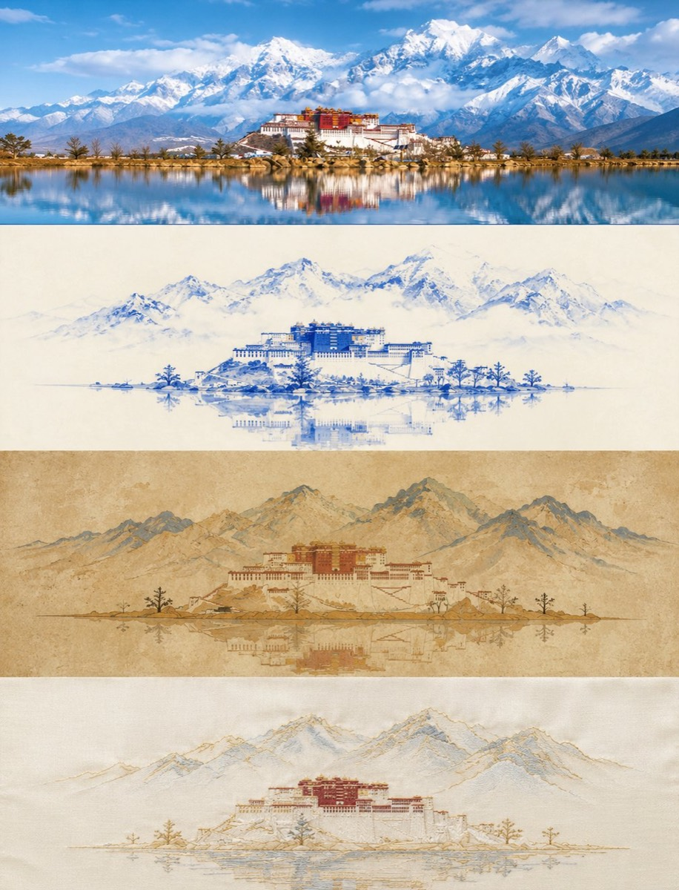</a><br><strong>青花敦煌刺绣四拼海报</strong><br><sub>将同一主体转译为青花瓷、敦煌、刺绣等中国传统视觉语言的四拼风格海报。</sub><br><a href="styles/image-blue-white-dunhuang-embroidery-quadriptych/style.json">style.json</a> · <a href="docs/copy-prompts/image-blue-white-dunhuang-embroidery-quadriptych.md">Copy Prompt</a></td>
</tr>
<tr>
<td width="33%" valign="top"><a href="docs/copy-prompts/image-playful-ceramic-ecommerce-hero.md">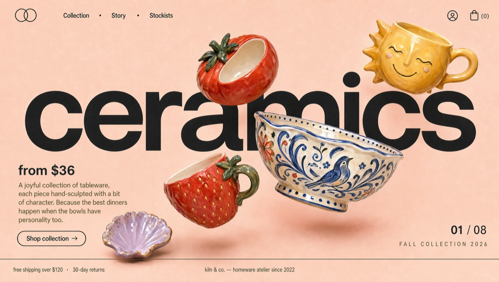</a><br><strong>趣味陶瓷电商首页主视觉</strong><br><sub>生成横版电商首页主视觉，用悬浮陶瓷产品、超大字标和克制网页信息结构展示一组具有统一角色语言的商品。</sub><br><a href="styles/image-playful-ceramic-ecommerce-hero/style.json">style.json</a> · <a href="docs/copy-prompts/image-playful-ceramic-ecommerce-hero.md">Copy Prompt</a></td>
<td width="33%" valign="top"><strong>人像灯光方案对照</strong><br><sub>同一人物与机位下比较四种布光，不混淆人物特征。</sub><br><a href="styles/portrait-lighting-sheet/style.json">style.json</a> · <a href="docs/copy-prompts/portrait-lighting-sheet.md">Copy Prompt</a></td>
<td width="33%" valign="top"><a href="docs/copy-prompts/image-portrait-lighting-scheme-grid.md">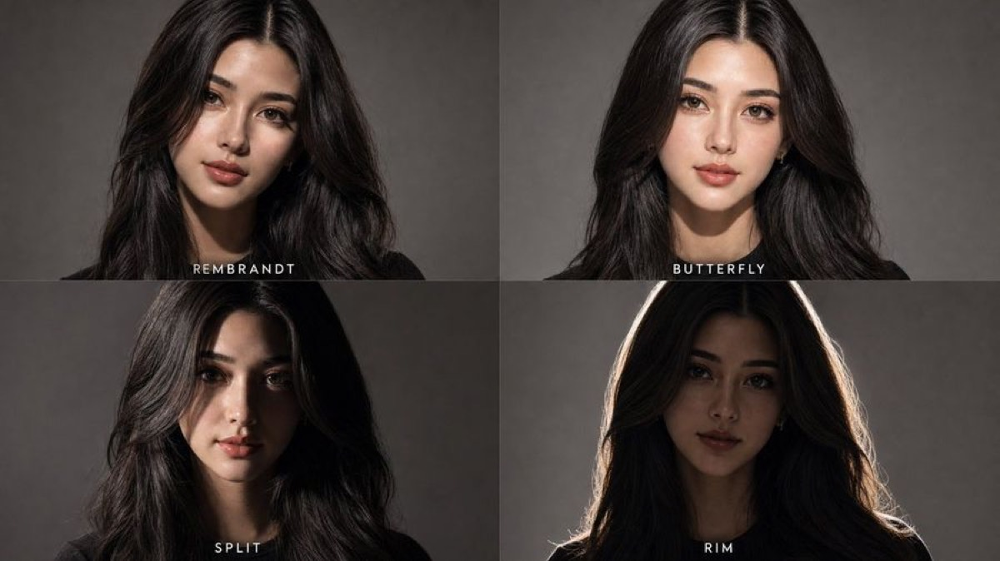</a><br><strong>人像摄影灯光方案网格</strong><br><sub>生成同一人物在多种专业摄影灯光方案下的对比网格。</sub><br><a href="styles/image-portrait-lighting-scheme-grid/style.json">style.json</a> · <a href="docs/copy-prompts/image-portrait-lighting-scheme-grid.md">Copy Prompt</a></td>
</tr>
<tr>
<td width="33%" valign="top"><a href="docs/copy-prompts/image-desert-car-wash-documentary-photo.md"></a><br><strong>沙漠洗车电影感纪实摄影</strong><br><sub>生成沙漠露天洗车场的电影感纪实画面，通过车尾备胎、水柱、泡沫玻璃和车内人物形成多层叙事。</sub><br><a href="styles/image-desert-car-wash-documentary-photo/style.json">style.json</a> · <a href="docs/copy-prompts/image-desert-car-wash-documentary-photo.md">Copy Prompt</a></td>
<td width="33%" valign="top"><a href="docs/copy-prompts/image-luxury-mechanical-watch-technical-guide-source.md"></a><br><strong>奢华机械腕表技术图鉴</strong><br><sub>生成多款高级机械腕表的透明结构、零件拆解和材质说明图鉴。</sub><br><a href="styles/image-luxury-mechanical-watch-technical-guide-source/style.json">style.json</a> · <a href="docs/copy-prompts/image-luxury-mechanical-watch-technical-guide-source.md">Copy Prompt</a> · <a href="docs/copy-prompts/image-luxury-mechanical-watch-technical-guide.md">Linked Version</a></td>
<td width="33%" valign="top"><a href="docs/copy-prompts/image-social-media-giveaway-banner.md">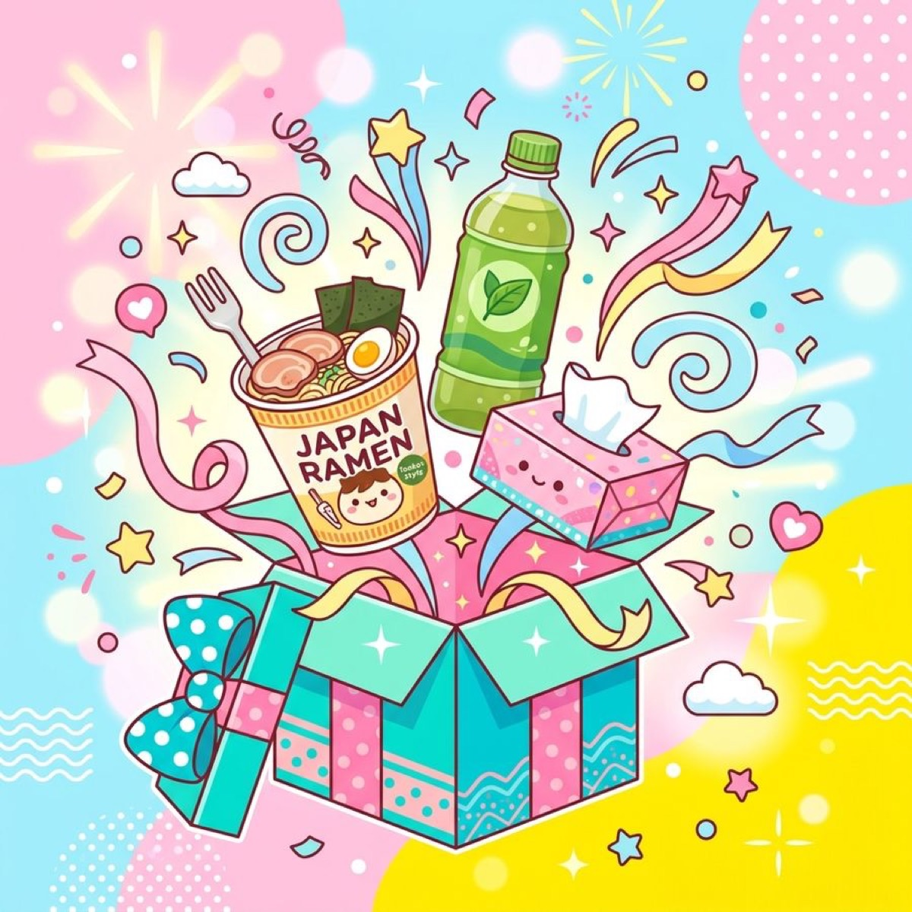</a><br><strong>社交媒体赠礼活动横幅</strong><br><sub>生成适合赠品、抽奖和活动发布的社交媒体宣传横幅。</sub><br><a href="styles/image-social-media-giveaway-banner/style.json">style.json</a> · <a href="docs/copy-prompts/image-social-media-giveaway-banner.md">Copy Prompt</a></td>
</tr>
<tr>
<td width="33%" valign="top"><a href="docs/copy-prompts/image-deep-sea-freediving-adventure-photo.md">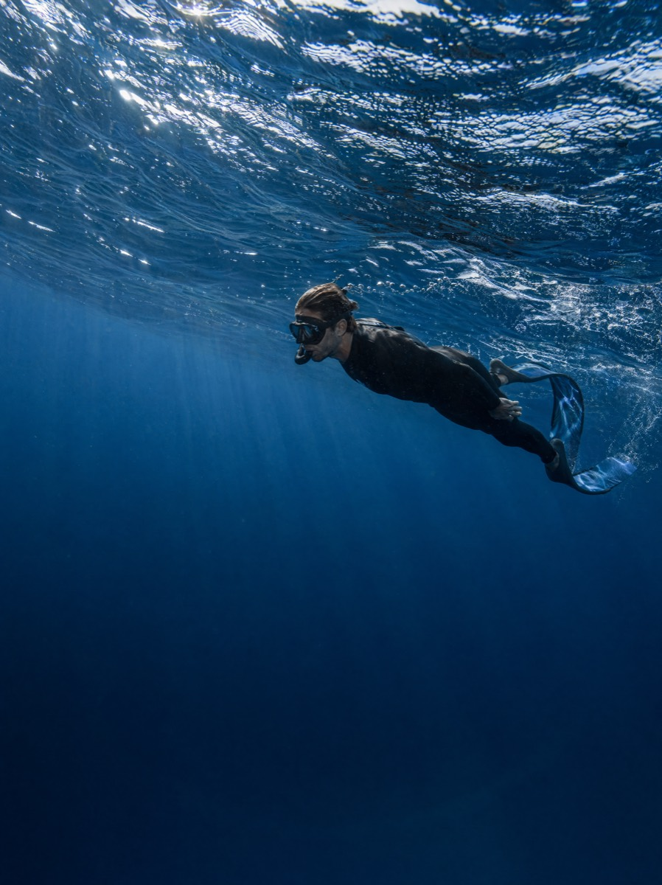</a><br><strong>深海自由潜水探险摄影</strong><br><sub>生成从水下仰拍自由潜水者的电影感探险摄影，通过水面纹理、深蓝渐变和大面积负空间表现孤独与尺度。</sub><br><a href="styles/image-deep-sea-freediving-adventure-photo/style.json">style.json</a> · <a href="docs/copy-prompts/image-deep-sea-freediving-adventure-photo.md">Copy Prompt</a></td>
<td width="33%" valign="top"><a href="docs/copy-prompts/image-fifteen-step-photorealistic-recipe.md"></a><br><strong>十五步写实食谱信息图</strong><br><sub>把一道菜的食材、15 个连续制作步骤和成品主视觉整理成竖版写实食谱信息图，也可作为后续图生视频的视觉分镜参考。</sub><br><a href="styles/image-fifteen-step-photorealistic-recipe/style.json">style.json</a> · <a href="docs/copy-prompts/image-fifteen-step-photorealistic-recipe.md">Copy Prompt</a></td>
<td width="33%" valign="top"><strong>食品广告四格分镜</strong><br><sub>从原料到成品，把一支短广告压缩到一页。</sub><br><a href="styles/food-storyboard/style.json">style.json</a> · <a href="docs/copy-prompts/food-storyboard.md">Copy Prompt</a></td>
</tr>
<tr>
<td width="33%" valign="top"><a href="docs/copy-prompts/image-exploded-food-infographic-source.md">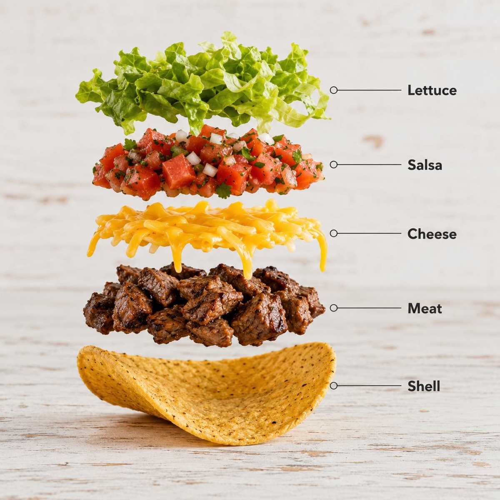</a><br><strong>食物爆炸拆解信息图</strong><br><sub>把食物的不同组成部分按垂直顺序悬浮排列，生成写实爆炸拆解信息图。</sub><br><a href="styles/image-exploded-food-infographic-source/style.json">style.json</a> · <a href="docs/copy-prompts/image-exploded-food-infographic-source.md">Copy Prompt</a> · <a href="docs/copy-prompts/image-exploded-food-infographic.md">Linked Version</a></td>
<td width="33%" valign="top"><strong>室内空间材质板</strong><br><sub>空间主视图与材质细节在一页内建立对应关系。</sub><br><a href="styles/interior-material-board/style.json">style.json</a> · <a href="docs/copy-prompts/interior-material-board.md">Copy Prompt</a></td>
<td width="33%" valign="top"><a href="docs/copy-prompts/image-hand-torn-paper-poster.md"></a><br><strong>手工撕纸海报风格</strong><br><sub>生成以荧光撕纸标题、手绘贴纸徽章和陈旧纸张为核心的城市文化活动海报。</sub><br><a href="styles/image-hand-torn-paper-poster/style.json">style.json</a> · <a href="docs/copy-prompts/image-hand-torn-paper-poster.md">Copy Prompt</a></td>
</tr>
<tr>
<td width="33%" valign="top"><a href="docs/copy-prompts/image-duotone-studio-commercial-portrait.md">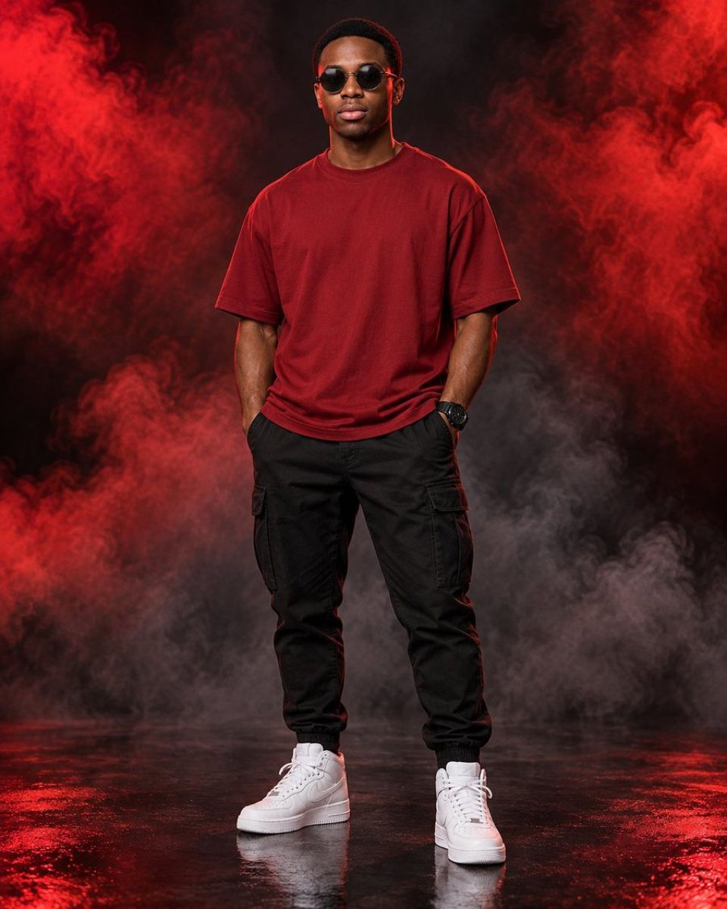</a><br><strong>双色调摄影棚商业肖像</strong><br><sub>生成具有品红与电光蓝双色布光的高端商业肖像。</sub><br><a href="styles/image-duotone-studio-commercial-portrait/style.json">style.json</a> · <a href="docs/copy-prompts/image-duotone-studio-commercial-portrait.md">Copy Prompt</a></td>
<td width="33%" valign="top"><a href="docs/copy-prompts/image-watercolor-editorial-illustration-poster.md">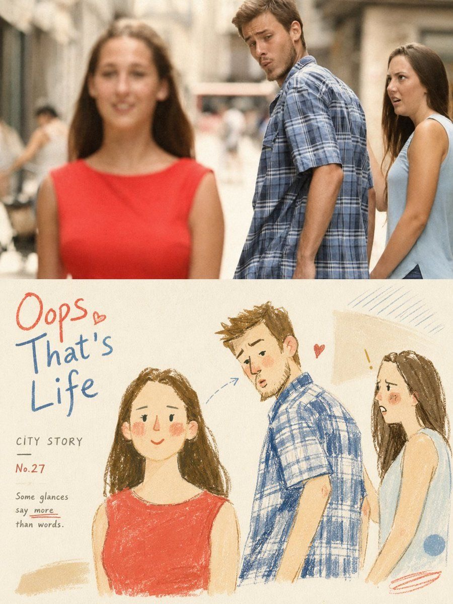</a><br><strong>水彩风格编辑插画海报</strong><br><sub>将照片转化为上半部真实摄影、下半部复古水彩编辑插画的 3:4 分屏海报。</sub><br><a href="styles/image-watercolor-editorial-illustration-poster/style.json">style.json</a> · <a href="docs/copy-prompts/image-watercolor-editorial-illustration-poster.md">Copy Prompt</a></td>
<td width="33%" valign="top"><a href="docs/copy-prompts/image-ink-double-exposure-portrait-poster-source.md">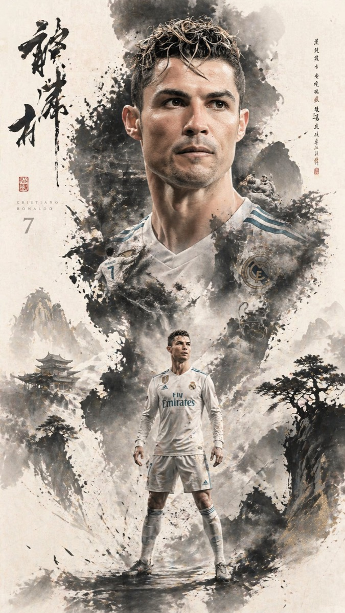</a><br><strong>水墨双重曝光人物海报</strong><br><sub>生成融合人物轮廓、东方水墨、叙事场景和留白的双重曝光竖版海报。</sub><br><a href="styles/image-ink-double-exposure-portrait-poster-source/style.json">style.json</a> · <a href="docs/copy-prompts/image-ink-double-exposure-portrait-poster-source.md">Copy Prompt</a> · <a href="docs/copy-prompts/image-ink-double-exposure-portrait-poster.md">Linked Version</a></td>
</tr>
<tr>
<td width="33%" valign="top"><a href="docs/copy-prompts/image-four-city-minimal-travel-poster-series-source.md">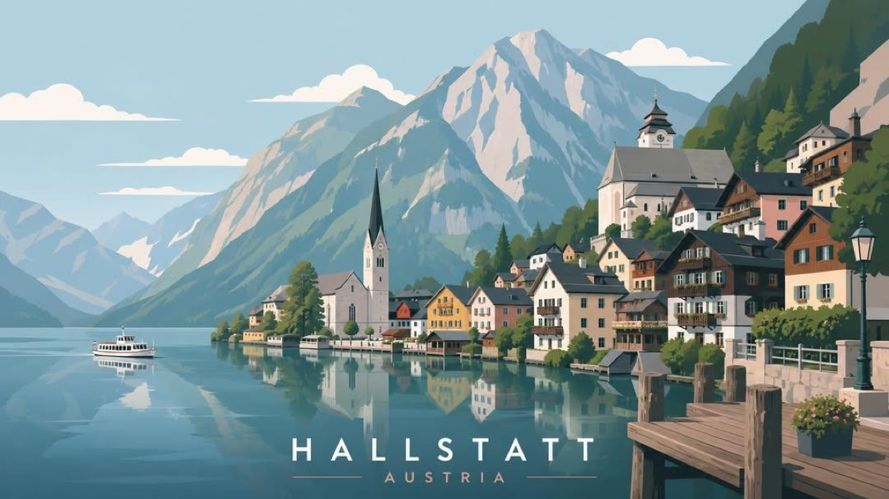</a><br><strong>四城极简旅行海报系列</strong><br><sub>以统一的极简矢量风格生成多个城市或目的地的系列旅行海报。</sub><br><a href="styles/image-four-city-minimal-travel-poster-series-source/style.json">style.json</a> · <a href="docs/copy-prompts/image-four-city-minimal-travel-poster-series-source.md">Copy Prompt</a> · <a href="docs/copy-prompts/image-four-city-minimal-travel-poster-series.md">Linked Version</a></td>
<td width="33%" valign="top"><a href="docs/copy-prompts/image-four-panel-milkshake-recipe.md">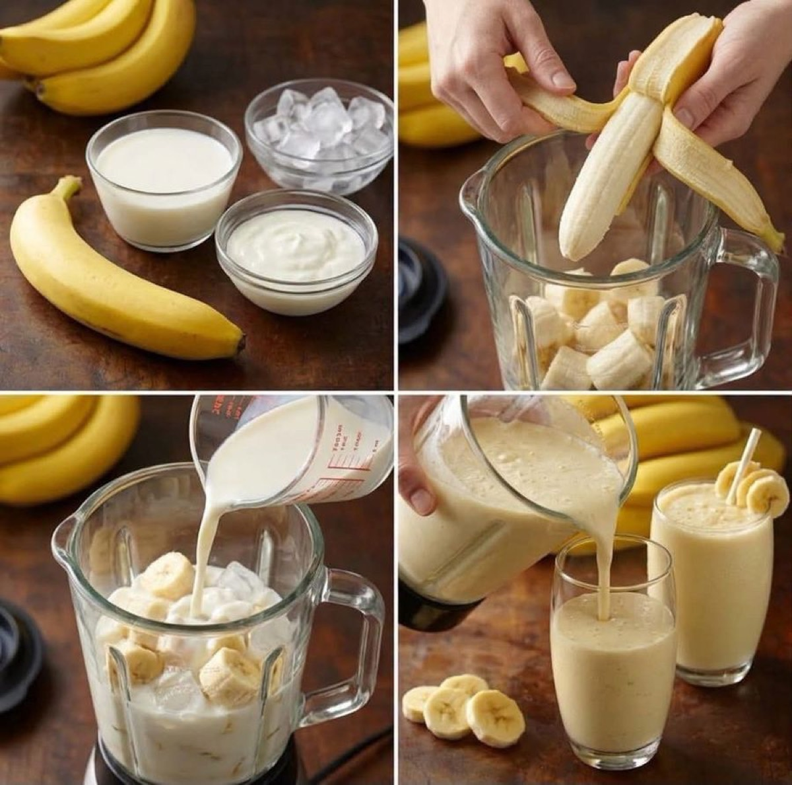</a><br><strong>四格奶昔食谱过程拼图</strong><br><sub>生成用四个连续画面展示食材、处理、混合和成品的写实食谱过程拼图。</sub><br><a href="styles/image-four-panel-milkshake-recipe/style.json">style.json</a> · <a href="docs/copy-prompts/image-four-panel-milkshake-recipe.md">Copy Prompt</a></td>
<td width="33%" valign="top"><a href="docs/copy-prompts/image-same-face-twelve-hairstyles-source.md">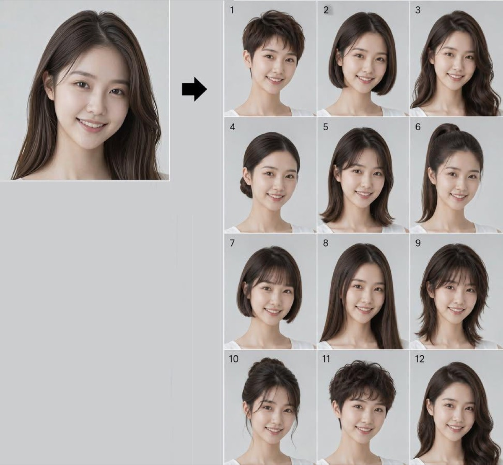</a><br><strong>同一人脸十二款发型图鉴</strong><br><sub>保持参考人物身份、服装和光线一致，仅更换十二种发型并生成对照图鉴。</sub><br><a href="styles/image-same-face-twelve-hairstyles-source/style.json">style.json</a> · <a href="docs/copy-prompts/image-same-face-twelve-hairstyles-source.md">Copy Prompt</a> · <a href="docs/copy-prompts/image-same-face-twelve-hairstyles.md">Linked Version</a></td>
</tr>
<tr>
<td width="33%" valign="top"><a href="docs/copy-prompts/image-futuristic-biophilic-atrium.md">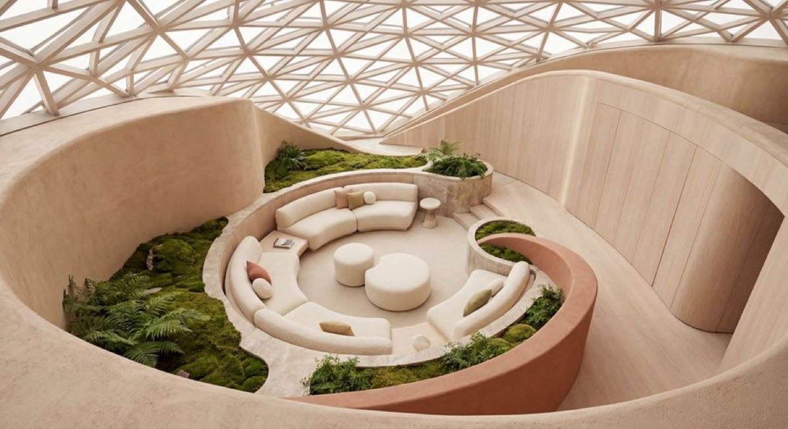</a><br><strong>未来亲生物中庭空间</strong><br><sub>生成融合自然植被、采光和未来建筑语言的中庭休息空间。</sub><br><a href="styles/image-futuristic-biophilic-atrium/style.json">style.json</a> · <a href="docs/copy-prompts/image-futuristic-biophilic-atrium.md">Copy Prompt</a></td>
<td width="33%" valign="top"><a href="docs/copy-prompts/image-five-panel-cafe-character-collage.md">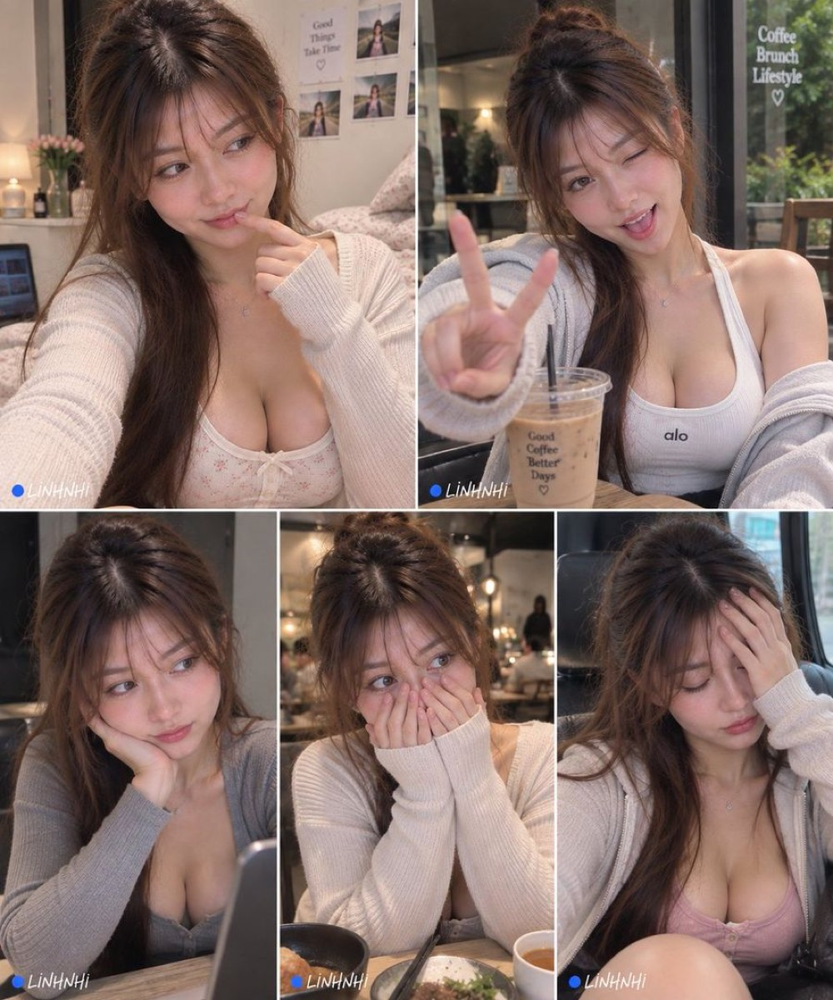</a><br><strong>五格咖啡馆人物拼贴</strong><br><sub>生成适合社交媒体发布的五格咖啡馆人物生活方式拼贴。</sub><br><a href="styles/image-five-panel-cafe-character-collage/style.json">style.json</a> · <a href="docs/copy-prompts/image-five-panel-cafe-character-collage.md">Copy Prompt</a></td>
<td width="33%" valign="top"><a href="docs/copy-prompts/image-half-photo-half-crayon-memory-card-source.md"></a><br><strong>五五分混合媒介回忆卡</strong><br><sub>将原始照片与蜡笔速写严格上下五五分割，生成克制怀旧的混合媒介回忆卡。</sub><br><a href="styles/image-half-photo-half-crayon-memory-card-source/style.json">style.json</a> · <a href="docs/copy-prompts/image-half-photo-half-crayon-memory-card-source.md">Copy Prompt</a> · <a href="docs/copy-prompts/image-half-photo-half-crayon-memory-card.md">Linked Version</a></td>
</tr>
<tr>
<td width="33%" valign="top"><a href="docs/copy-prompts/image-wuhan-vintage-map-poster.md">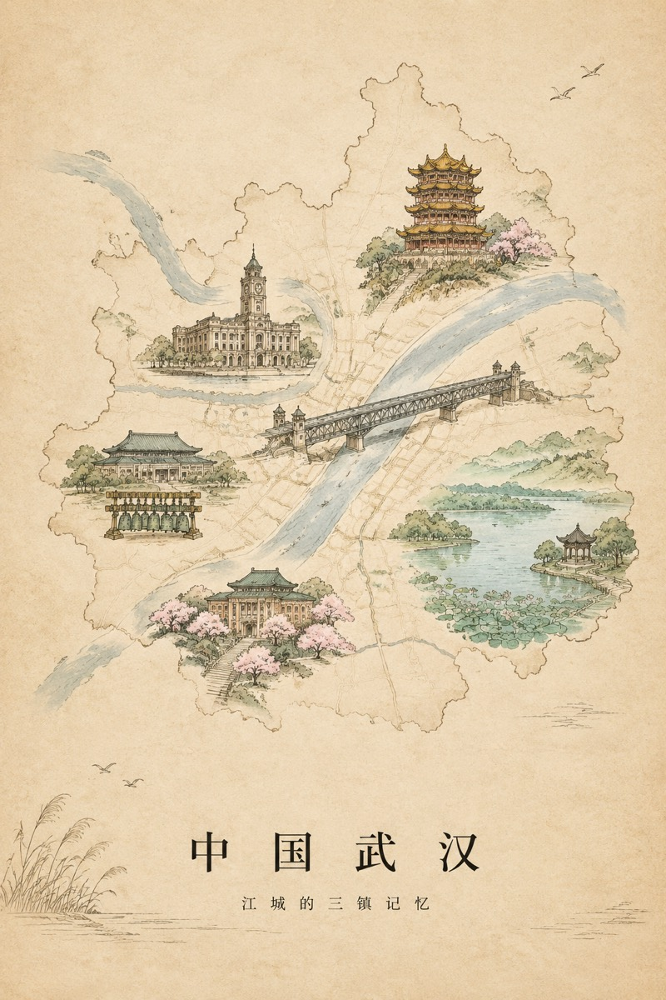</a><br><strong>武汉复古地图海报</strong><br><sub>生成一张以武汉城市地图、两江交汇和代表性地标为主体的复古羊皮纸线条艺术旅游海报，适合城市文化展示、旅行纪念和地方主题视觉创作。</sub><br><a href="styles/image-wuhan-vintage-map-poster/style.json">style.json</a> · <a href="docs/copy-prompts/image-wuhan-vintage-map-poster.md">Copy Prompt</a></td>
<td width="33%" valign="top"><a href="docs/copy-prompts/image-wuhan-breakfast-food-map-infographic.md">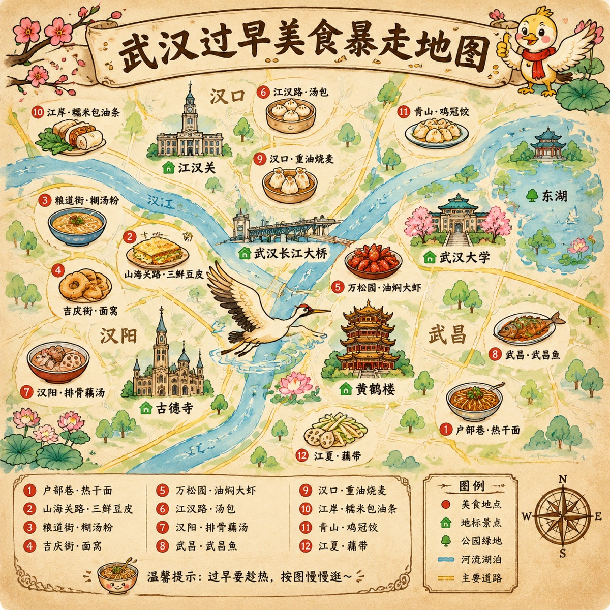</a><br><strong>武汉过早美食地图信息图</strong><br><sub>生成一张以武汉两江交汇、三镇格局、代表性地标和“过早”美食为主体的复古手绘城市地图信息图。</sub><br><a href="styles/image-wuhan-breakfast-food-map-infographic/style.json">style.json</a> · <a href="docs/copy-prompts/image-wuhan-breakfast-food-map-infographic.md">Copy Prompt</a></td>
<td width="33%" valign="top"><a href="docs/copy-prompts/image-modern-art-event-flyer.md">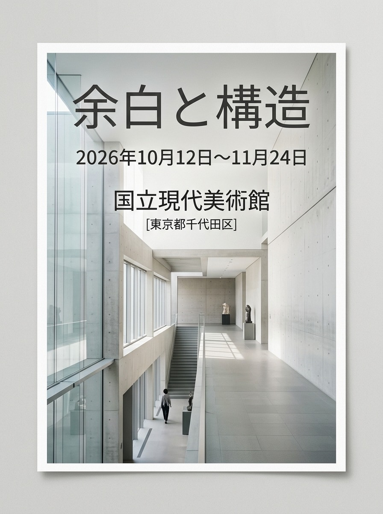</a><br><strong>现代艺术活动传单</strong><br><sub>生成适合展览、讲座和文化活动的现代艺术传单。</sub><br><a href="styles/image-modern-art-event-flyer/style.json">style.json</a> · <a href="docs/copy-prompts/image-modern-art-event-flyer.md">Copy Prompt</a></td>
</tr>
<tr>
<td width="33%" valign="top"><a href="docs/copy-prompts/image-inside-box-farm-ad-poster.md">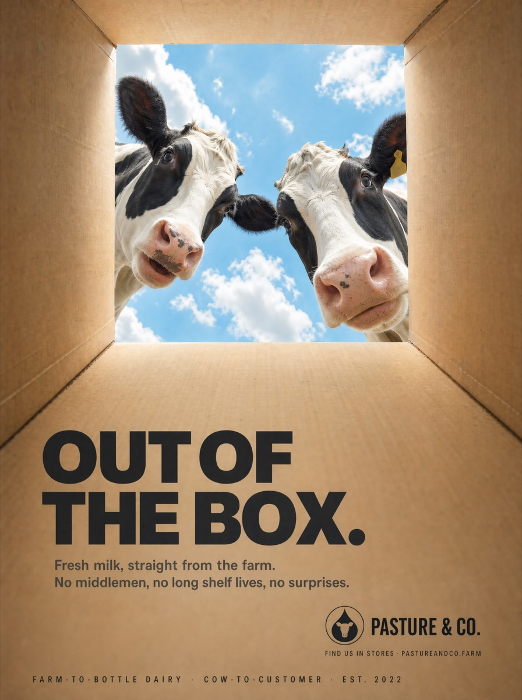</a><br><strong>箱内仰视农场广告海报</strong><br><sub>生成从纸箱内部向上仰视的概念广告海报，通过强透视开口、动物探头和底部品牌文案表达新鲜直达的产品卖点。</sub><br><a href="styles/image-inside-box-farm-ad-poster/style.json">style.json</a> · <a href="docs/copy-prompts/image-inside-box-farm-ad-poster.md">Copy Prompt</a></td>
<td width="33%" valign="top"><a href="docs/copy-prompts/image-rubber-stamp-travel-field-notes-source.md"></a><br><strong>橡皮章旅行田野笔记</strong><br><sub>把旅行照片与手工橡皮章、旧纸张和少量档案文字组合成旅行田野笔记。</sub><br><a href="styles/image-rubber-stamp-travel-field-notes-source/style.json">style.json</a> · <a href="docs/copy-prompts/image-rubber-stamp-travel-field-notes-source.md">Copy Prompt</a> · <a href="docs/copy-prompts/image-rubber-stamp-travel-field-notes.md">Linked Version</a></td>
<td width="33%" valign="top"><a href="docs/copy-prompts/coastal-poster.md"></a><br><strong>虚构海岸城市旅行海报</strong><br><sub>以大色块、几何建筑和丝网印刷肌理构成旅行海报。</sub><br><a href="styles/coastal-poster/style.json">style.json</a> · <a href="docs/copy-prompts/coastal-poster.md">Copy Prompt</a></td>
</tr>
<tr>
<td width="33%" valign="top"><a href="docs/copy-prompts/botanical-plate.md"></a><br><strong>虚构植物科学图版</strong><br><sub>以标本主图和局部放大图组织清晰的植物学图版。</sub><br><a href="styles/botanical-plate/style.json">style.json</a> · <a href="docs/copy-prompts/botanical-plate.md">Copy Prompt</a></td>
<td width="33%" valign="top"><a href="docs/copy-prompts/image-felt-country-miniature-world-source.md"></a><br><strong>羊毛毡国家微缩世界</strong><br><sub>将国家、城市和代表性地标转化为具有手工羊毛毡质感的微缩世界。</sub><br><a href="styles/image-felt-country-miniature-world-source/style.json">style.json</a> · <a href="docs/copy-prompts/image-felt-country-miniature-world-source.md">Copy Prompt</a> · <a href="docs/copy-prompts/image-felt-country-miniature-world.md">Linked Version</a></td>
<td width="33%" valign="top"><a href="docs/copy-prompts/image-consistent-interior-multiview-grid.md">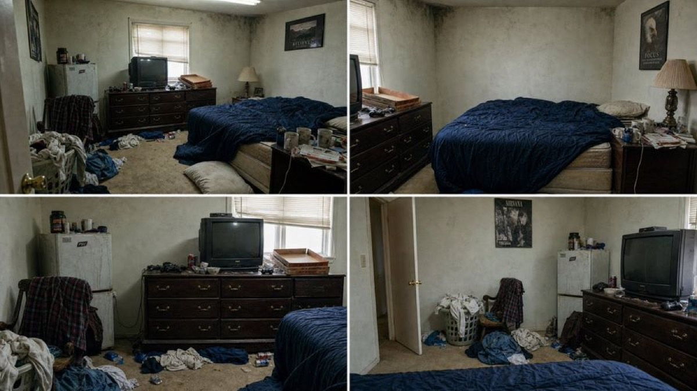</a><br><strong>一致性室内空间多视角网格</strong><br><sub>生成同一室内空间的多角度一致性设计网格。</sub><br><a href="styles/image-consistent-interior-multiview-grid/style.json">style.json</a> · <a href="docs/copy-prompts/image-consistent-interior-multiview-grid.md">Copy Prompt</a></td>
</tr>
<tr>
<td width="33%" valign="top"><a href="docs/copy-prompts/image-weekly-outfit-infographic.md">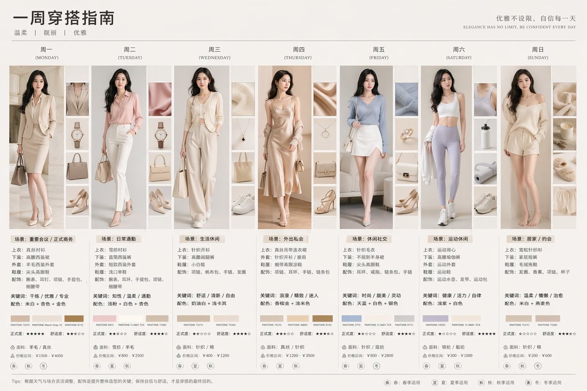</a><br><strong>一周穿搭信息图</strong><br><sub>生成按星期排列的七日穿搭图鉴，集中展示人物造型、服装细节、颜色和适用场景。</sub><br><a href="styles/image-weekly-outfit-infographic/style.json">style.json</a> · <a href="docs/copy-prompts/image-weekly-outfit-infographic.md">Copy Prompt</a></td>
<td width="33%" valign="top"><a href="docs/copy-prompts/image-beverage-food-marketing-hero.md"></a><br><strong>饮料食品营销主视觉</strong><br><sub>生成饮料、冷冻食品和包装商品的商业营销主视觉。</sub><br><a href="styles/image-beverage-food-marketing-hero/style.json">style.json</a> · <a href="docs/copy-prompts/image-beverage-food-marketing-hero.md">Copy Prompt</a></td>
<td width="33%" valign="top"><strong>饮品商业静物</strong><br><sub>把包装、材质、光线和留白整合成可放文案的主视觉。</sub><br><a href="styles/beverage-still-life/style.json">style.json</a> · <a href="docs/copy-prompts/beverage-still-life.md">Copy Prompt</a></td>
</tr>
<tr>
<td width="33%" valign="top"><a href="docs/copy-prompts/image-real-person-die-cut-sticker-poster.md">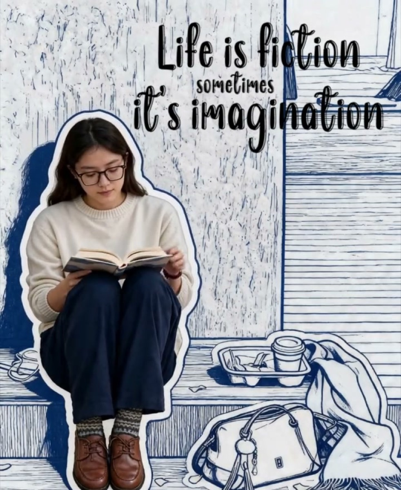</a><br><strong>真人切模贴纸海报</strong><br><sub>上传人物照片，保留真人摄影质感，将环境改为带白色裁切边的黑白手绘贴纸。</sub><br><a href="styles/image-real-person-die-cut-sticker-poster/style.json">style.json</a> · <a href="docs/copy-prompts/image-real-person-die-cut-sticker-poster.md">Copy Prompt</a></td>
<td width="33%" valign="top"><strong>知识解释信息图</strong><br><sub>把一条知识链拆成几个可快速扫读的视觉步骤。</sub><br><a href="styles/learning-infographic/style.json">style.json</a> · <a href="docs/copy-prompts/learning-infographic.md">Copy Prompt</a></td>
<td width="33%" valign="top"><strong>植物科学图版</strong><br><sub>标本主图、局部放大与短标签组成一张可阅读的图版。</sub><br><a href="styles/botanical-editorial/style.json">style.json</a> · <a href="docs/copy-prompts/botanical-editorial.md">Copy Prompt</a></td>
</tr>
<tr>
<td width="33%" valign="top"><a href="docs/copy-prompts/botanical-soda.md"></a><br><strong>植物汽水商业静物</strong><br><sub>用光线、冷凝水和水果切片突出饮品材质。</sub><br><a href="styles/botanical-soda/style.json">style.json</a> · <a href="docs/copy-prompts/botanical-soda.md">Copy Prompt</a></td>
<td width="33%" valign="top"><a href="docs/copy-prompts/image-paper-relief-neighborhood-grid.md">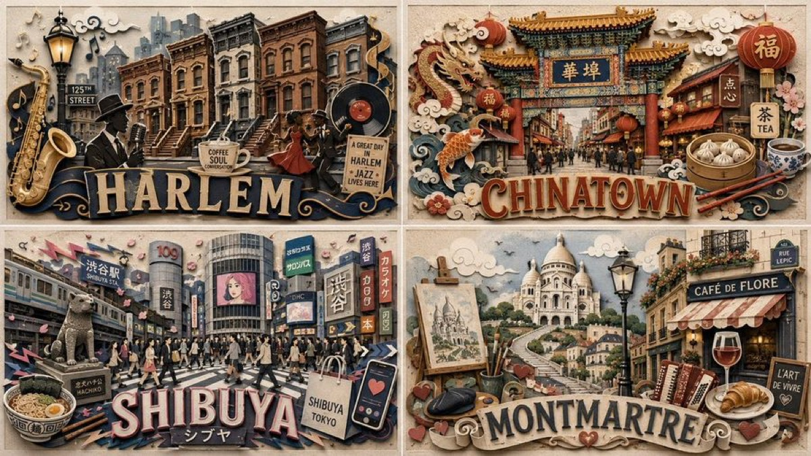</a><br><strong>纸雕浮雕街区网格</strong><br><sub>生成多组统一纸雕浮雕风格的街区或社区场景。</sub><br><a href="styles/image-paper-relief-neighborhood-grid/style.json">style.json</a> · <a href="docs/copy-prompts/image-paper-relief-neighborhood-grid.md">Copy Prompt</a></td>
<td width="33%" valign="top"><a href="docs/copy-prompts/image-chinese-luxury-beauty-poster.md"></a><br><strong>中文奢华美妆海报</strong><br><sub>生成一张以面霜产品为视觉中心，使用香槟金丝绸、大理石台面、中文标题和中文卖点的高端美妆广告海报。</sub><br><a href="styles/image-chinese-luxury-beauty-poster/style.json">style.json</a> · <a href="docs/copy-prompts/image-chinese-luxury-beauty-poster.md">Copy Prompt</a></td>
</tr>
<tr>
<td width="33%" valign="top"><a href="docs/copy-prompts/image-football-player-stats-doodle-poster-source.md">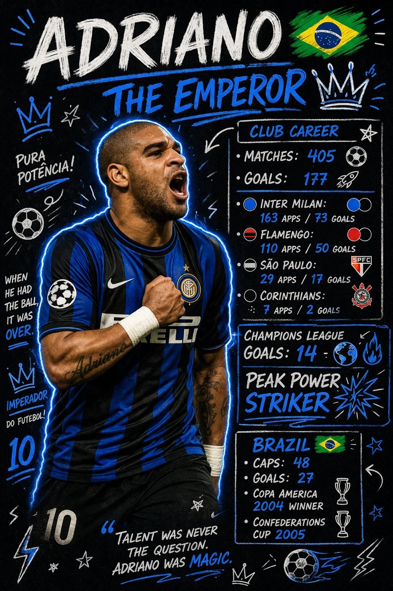</a><br><strong>足球球员数据涂鸦海报</strong><br><sub>生成以足球运动员、比赛数据和霓虹手写涂鸦为核心的体育宣传海报。</sub><br><a href="styles/image-football-player-stats-doodle-poster-source/style.json">style.json</a> · <a href="docs/copy-prompts/image-football-player-stats-doodle-poster-source.md">Copy Prompt</a> · <a href="docs/copy-prompts/image-football-player-stats-doodle-poster.md">Linked Version</a></td>
</tr>
</table>

### Video (58)

<table>
<tr>
<td width="33%" valign="top"><a href="docs/copy-prompts/video-3d40126f5f.md"></a><br><strong>90年代像素文字游戏</strong><br><sub>用 CRT 像素界面、逐字翻牌和连续挑战节奏制作复古文字游戏概念短片。</sub><br><a href="styles/video-3d40126f5f/style.json">style.json</a> · <a href="docs/copy-prompts/video-3d40126f5f.md">Copy Prompt</a></td>
<td width="33%" valign="top"><a href="docs/copy-prompts/video-50e620e4e4.md">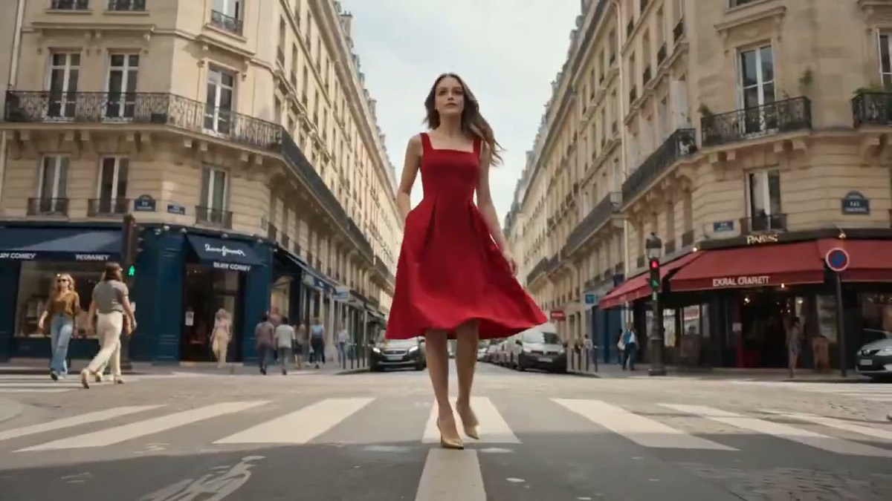</a><br><strong>巴黎街头时装变身</strong><br><sub>以行走跟拍和环绕光轨完成街头服装无缝变身。</sub><br><a href="styles/video-50e620e4e4/style.json">style.json</a> · <a href="docs/copy-prompts/video-50e620e4e4.md">Copy Prompt</a></td>
<td width="33%" valign="top"><strong>插画局部微动效</strong><br><sub>保留画面构图，只让指定层轻微运动。</sub><br><a href="styles/illustration-micro-loop/style.json">style.json</a> · <a href="docs/copy-prompts/illustration-micro-loop.md">Copy Prompt</a></td>
</tr>
<tr>
<td width="33%" valign="top"><strong>产品单镜头推进</strong><br><sub>固定产品外观，以一次缓慢推近完成五秒展示。</sub><br><a href="styles/single-shot-product/style.json">style.json</a> · <a href="docs/copy-prompts/single-shot-product.md">Copy Prompt</a></td>
<td width="33%" valign="top"><strong>产品短片：固定主体与缓慢推近</strong><br><sub>适合单件产品的五秒竖屏镜头设计。</sub><br><a href="styles/product-reveal/style.json">style.json</a> · <a href="docs/copy-prompts/product-reveal.md">Copy Prompt</a></td>
<td width="33%" valign="top"><a href="docs/copy-prompts/video-vertical-crane-reveal-source.md"></a><br><strong>垂直升降揭示</strong><br><sub>通过摇臂垂直升高并持续向下俯仰，在固定主体位置的同时逐步揭示环境规模。</sub><br><a href="styles/video-vertical-crane-reveal-source/style.json">style.json</a> · <a href="docs/copy-prompts/video-vertical-crane-reveal-source.md">Copy Prompt</a> · <a href="docs/copy-prompts/video-vertical-crane-reveal.md">Linked Version</a></td>
</tr>
<tr>
<td width="33%" valign="top"><a href="docs/copy-prompts/video-brutalist-courtyard-martial-arts-source.md">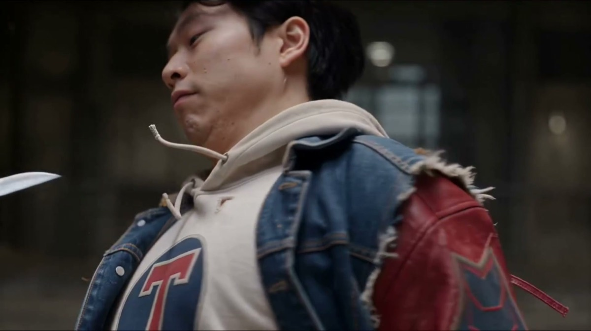</a><br><strong>粗野主义庭院武术动作</strong><br><sub>生成发生在粗野主义混凝土庭院中的多人武术对抗，强调快节奏摄影和高张力布光。</sub><br><a href="styles/video-brutalist-courtyard-martial-arts-source/style.json">style.json</a> · <a href="docs/copy-prompts/video-brutalist-courtyard-martial-arts-source.md">Copy Prompt</a> · <a href="docs/copy-prompts/video-brutalist-courtyard-martial-arts.md">Linked Version</a></td>
<td width="33%" valign="top"><a href="docs/copy-prompts/video-8f1bbd26f7.md"></a><br><strong>大学物理实验演示短片</strong><br><sub>以教授和学生参与的斜轨小球实验组织课堂教育视频。</sub><br><a href="styles/video-8f1bbd26f7/style.json">style.json</a> · <a href="docs/copy-prompts/video-8f1bbd26f7.md">Copy Prompt</a></td>
<td width="33%" valign="top"><strong>地点氛围三段短片</strong><br><sub>用远景、行动和细节建立一个具体地点的记忆点。</sub><br><a href="styles/travel-mini-film/style.json">style.json</a> · <a href="docs/copy-prompts/travel-mini-film.md">Copy Prompt</a></td>
</tr>
<tr>
<td width="33%" valign="top"><a href="docs/copy-prompts/video-first-person-dragon-rider-source.md">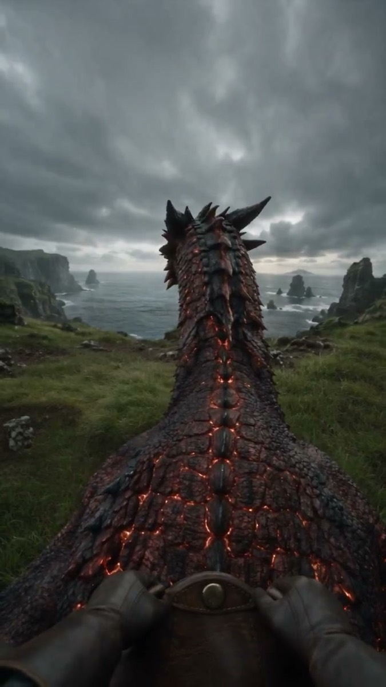</a><br><strong>第一人称视角：龙骑士电影级画面</strong><br><sub>以第一人称骑手视角生成巨龙从海岸悬崖起飞、贴海飞行、入水并再次冲出水面的奇幻镜头。</sub><br><a href="styles/video-first-person-dragon-rider-source/style.json">style.json</a> · <a href="docs/copy-prompts/video-first-person-dragon-rider-source.md">Copy Prompt</a> · <a href="docs/copy-prompts/video-first-person-dragon-rider.md">Linked Version</a></td>
<td width="33%" valign="top"><a href="docs/copy-prompts/video-cinematic-roller-skating-action-source.md">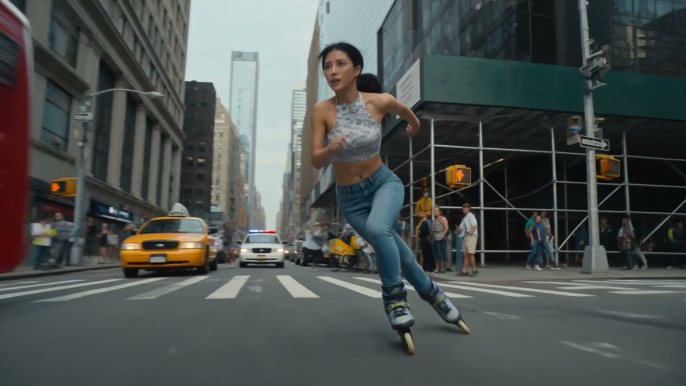</a><br><strong>电影级动作轮滑序列</strong><br><sub>生成一名轮滑女性穿梭城市车流并躲避警车追逐的电影级动作序列，强调角色一致性和真实运动物理。</sub><br><a href="styles/video-cinematic-roller-skating-action-source/style.json">style.json</a> · <a href="docs/copy-prompts/video-cinematic-roller-skating-action-source.md">Copy Prompt</a> · <a href="docs/copy-prompts/video-cinematic-roller-skating-action.md">Linked Version</a></td>
<td width="33%" valign="top"><a href="docs/copy-prompts/video-cinematic-shaolin-action-source.md">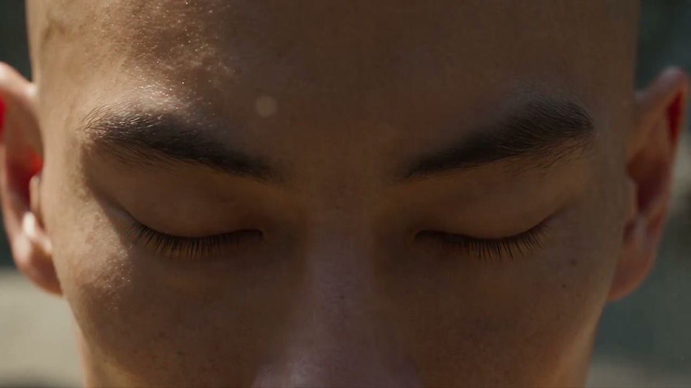</a><br><strong>电影级少林武僧动作大片</strong><br><sub>生成少林武僧与石甲生物对决的武侠奇幻动作序列，包含分段动作编排、变速和电光效果。</sub><br><a href="styles/video-cinematic-shaolin-action-source/style.json">style.json</a> · <a href="docs/copy-prompts/video-cinematic-shaolin-action-source.md">Copy Prompt</a> · <a href="docs/copy-prompts/video-cinematic-shaolin-action.md">Linked Version</a></td>
</tr>
<tr>
<td width="33%" valign="top"><a href="docs/copy-prompts/video-53bf374a72.md"></a><br><strong>动态百科页拼贴解说</strong><br><sub>将一个知识主题拆成九个视觉节拍，以纸片拼贴关键帧、局部定格动画、旁白和字幕组成竖屏解释短片。</sub><br><a href="styles/video-53bf374a72/style.json">style.json</a> · <a href="docs/copy-prompts/video-53bf374a72.md">Copy Prompt</a></td>
<td width="33%" valign="top"><a href="docs/copy-prompts/video-retro-illustration-micro-motion.md">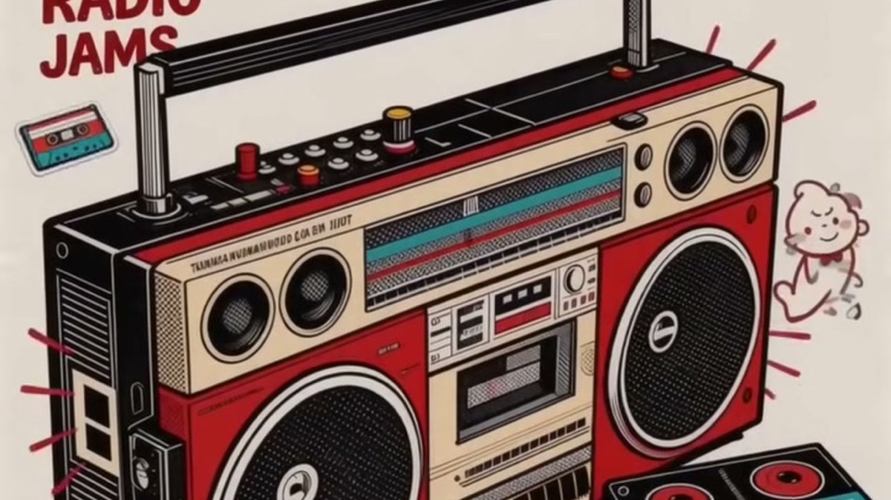</a><br><strong>复古插画微动效</strong><br><sub>上传完成的插画或海报，以固定镜头生成局部微动效，保持主体、文字与布局稳定。</sub><br><a href="styles/video-retro-illustration-micro-motion/style.json">style.json</a> · <a href="docs/copy-prompts/video-retro-illustration-micro-motion.md">Copy Prompt</a></td>
<td width="33%" valign="top"><strong>概念解释动效</strong><br><sub>从一个可见动作解释一个机制，不塞入过多概念。</sub><br><a href="styles/science-motion-explainer/style.json">style.json</a> · <a href="docs/copy-prompts/science-motion-explainer.md">Copy Prompt</a></td>
</tr>
<tr>
<td width="33%" valign="top"><a href="docs/copy-prompts/video-e0fd6d34ba.md">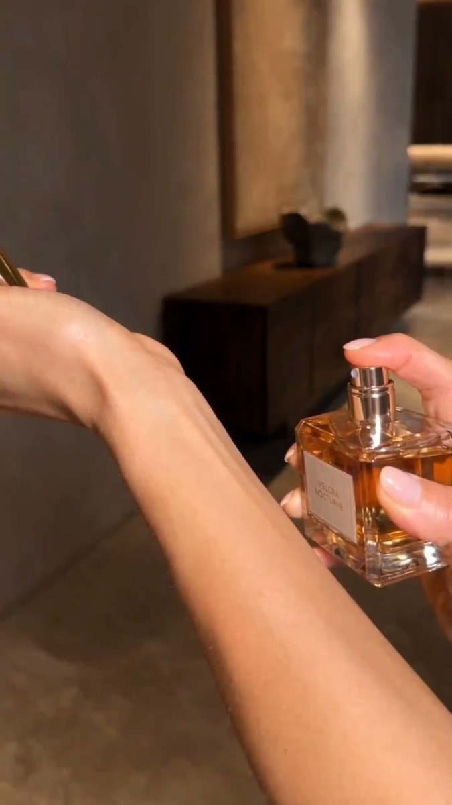</a><br><strong>高端香水UGC口播</strong><br><sub>用手持口播、试喷和产品近景组合高端香水 UGC 广告。</sub><br><a href="styles/video-e0fd6d34ba/style.json">style.json</a> · <a href="docs/copy-prompts/video-e0fd6d34ba.md">Copy Prompt</a></td>
<td width="33%" valign="top"><a href="docs/copy-prompts/video-fixed-point-pan-right-reveal-source.md">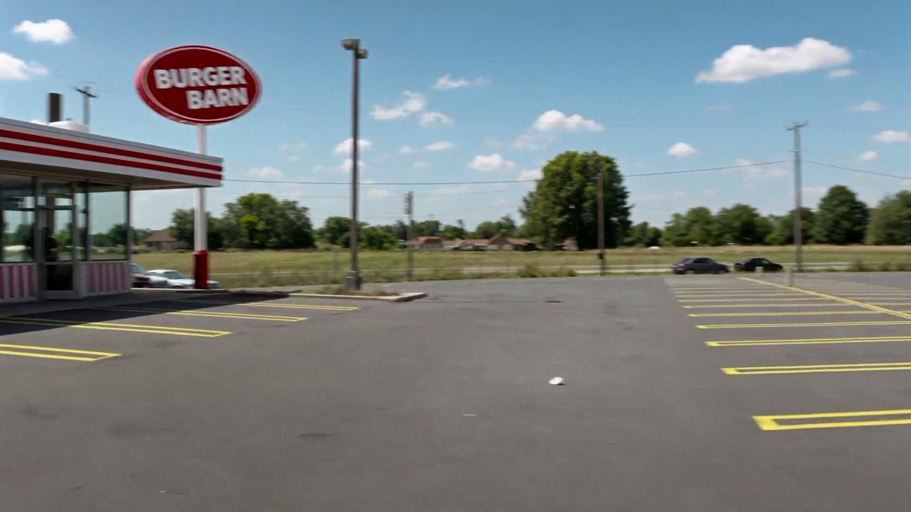</a><br><strong>固定点向右横摇揭示</strong><br><sub>让摄像机保持原地不位移，只向右水平旋转并在结尾主体上稳定停留。</sub><br><a href="styles/video-fixed-point-pan-right-reveal-source/style.json">style.json</a> · <a href="docs/copy-prompts/video-fixed-point-pan-right-reveal-source.md">Copy Prompt</a> · <a href="docs/copy-prompts/video-fixed-point-pan-right-reveal.md">Linked Version</a></td>
<td width="33%" valign="top"><a href="docs/copy-prompts/video-3207e9e8c2.md">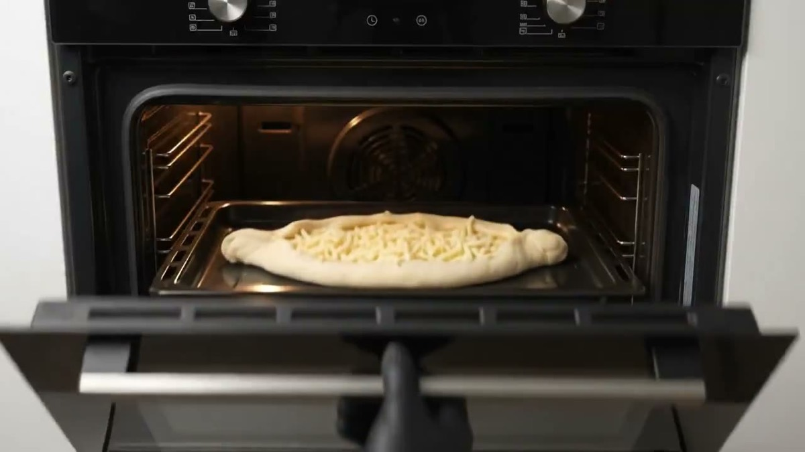</a><br><strong>哈恰普里俯拍烹饪</strong><br><sub>用固定俯拍和物体状态连续性展示哈恰普里的完整制作步骤。</sub><br><a href="styles/video-3207e9e8c2/style.json">style.json</a> · <a href="docs/copy-prompts/video-3207e9e8c2.md">Copy Prompt</a></td>
</tr>
<tr>
<td width="33%" valign="top"><a href="docs/copy-prompts/video-beach-stone-stop-motion-source.md">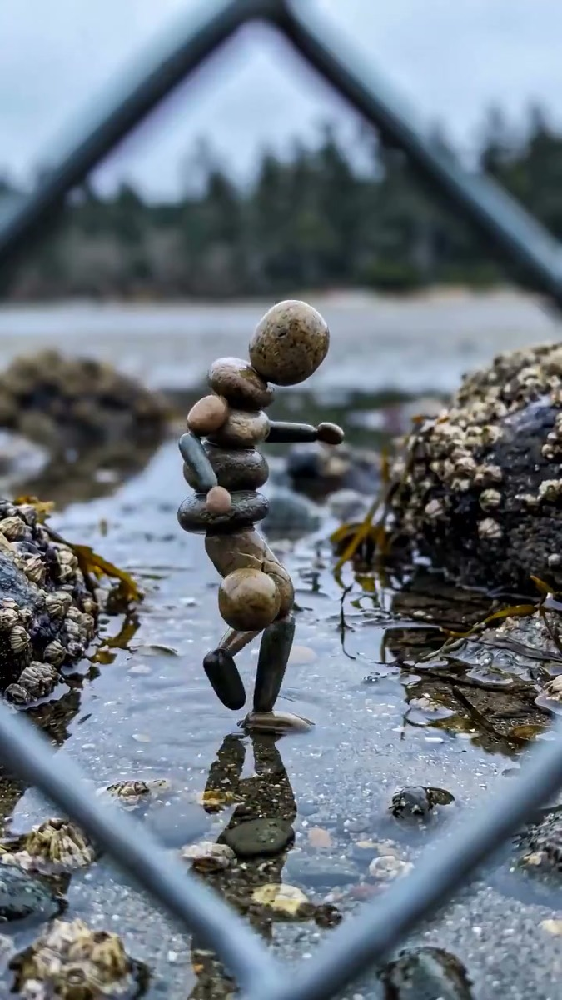</a><br><strong>海滩石像定格动画</strong><br><sub>生成由天然石块组成的小型人形在潮汐池中起舞、跌倒并重新散落成石块的定格动画。</sub><br><a href="styles/video-beach-stone-stop-motion-source/style.json">style.json</a> · <a href="docs/copy-prompts/video-beach-stone-stop-motion-source.md">Copy Prompt</a> · <a href="docs/copy-prompts/video-beach-stone-stop-motion.md">Linked Version</a></td>
<td width="33%" valign="top"><a href="docs/copy-prompts/video-aerial-pullback-rise-reveal-source.md">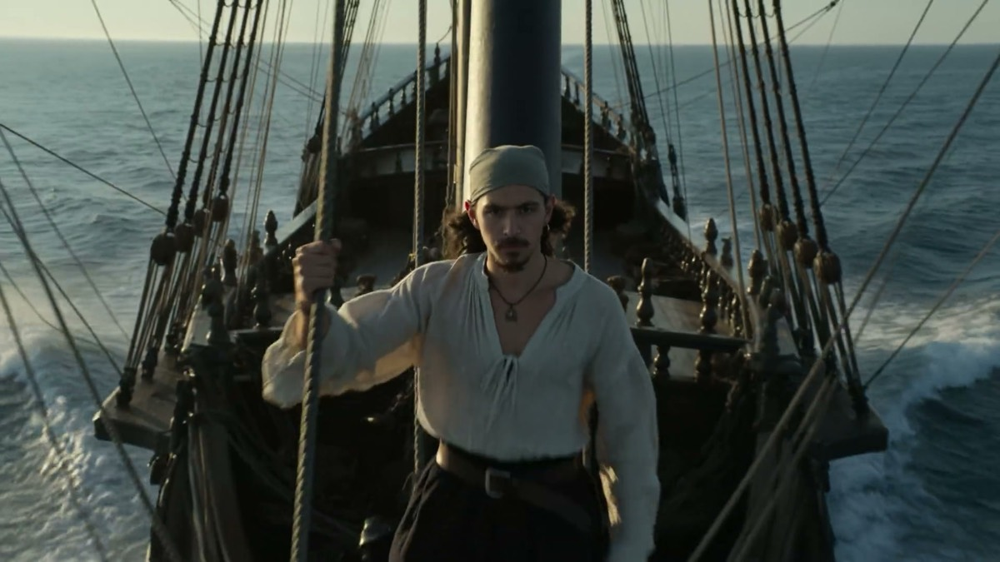</a><br><strong>航拍后拉升高揭示</strong><br><sub>让摄像机沿主体轴线同时后退和升高，从近景主体逐步揭示完整载具或大场景。</sub><br><a href="styles/video-aerial-pullback-rise-reveal-source/style.json">style.json</a> · <a href="docs/copy-prompts/video-aerial-pullback-rise-reveal-source.md">Copy Prompt</a> · <a href="docs/copy-prompts/video-aerial-pullback-rise-reveal.md">Linked Version</a></td>
<td width="33%" valign="top"><a href="docs/copy-prompts/video-19ceae29af.md">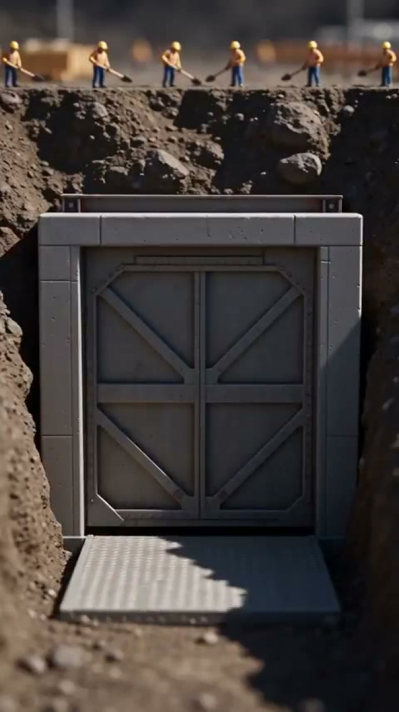</a><br><strong>火山疏散城市建造延时</strong><br><sub>用微型工人连续施工展示火山谷紧急疏散城市的建造。</sub><br><a href="styles/video-19ceae29af/style.json">style.json</a> · <a href="docs/copy-prompts/video-19ceae29af.md">Copy Prompt</a></td>
</tr>
<tr>
<td width="33%" valign="top"><strong>角色连续动作短片</strong><br><sub>角色、服装和道具在动作前后保持同一状态。</sub><br><a href="styles/character-continuity/style.json">style.json</a> · <a href="docs/copy-prompts/character-continuity.md">Copy Prompt</a></td>
<td width="33%" valign="top"><a href="docs/copy-prompts/video-sci-fi-motorcycle-action-source.md">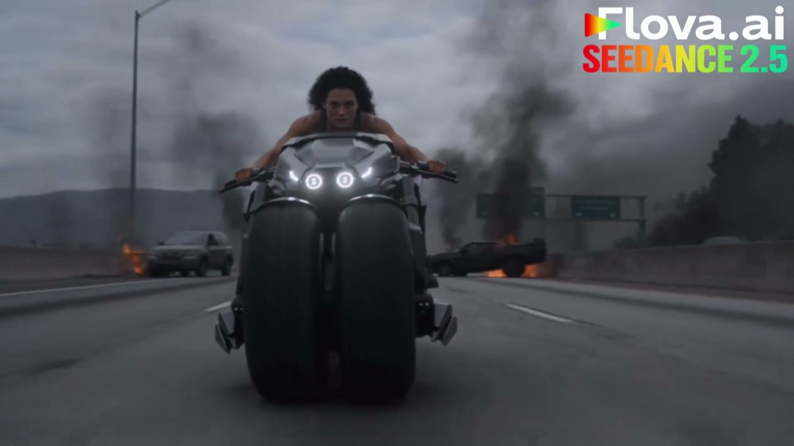</a><br><strong>科幻摩托车动作场面</strong><br><sub>生成未来摩托车追逐、外星母舰爆炸和近身格斗组成的高能电影级科幻动作场面。</sub><br><a href="styles/video-sci-fi-motorcycle-action-source/style.json">style.json</a> · <a href="docs/copy-prompts/video-sci-fi-motorcycle-action-source.md">Copy Prompt</a> · <a href="docs/copy-prompts/video-sci-fi-motorcycle-action.md">Linked Version</a></td>
<td width="33%" valign="top"><a href="docs/copy-prompts/video-31ea8a7f7c.md">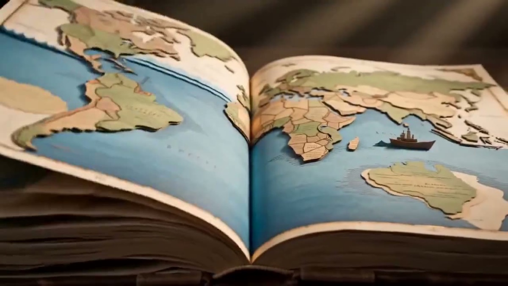</a><br><strong>立体书地图纸艺动画</strong><br><sub>让地图集中的纸艺地形随翻页重组并最终折叠成罗盘。</sub><br><a href="styles/video-31ea8a7f7c/style.json">style.json</a> · <a href="docs/copy-prompts/video-31ea8a7f7c.md">Copy Prompt</a></td>
</tr>
<tr>
<td width="33%" valign="top"><strong>料理过程三镜头</strong><br><sub>原料、关键动作、成品之间保持物体状态连续。</sub><br><a href="styles/cooking-sequence/style.json">style.json</a> · <a href="docs/copy-prompts/cooking-sequence.md">Copy Prompt</a></td>
<td width="33%" valign="top"><a href="docs/copy-prompts/video-d2f1128753.md"></a><br><strong>毛线娃娃早餐定格动画</strong><br><sub>用四段针织材质镜头串联打蛋、调味、装盘和用餐的定格动画。</sub><br><a href="styles/video-d2f1128753/style.json">style.json</a> · <a href="docs/copy-prompts/video-d2f1128753.md">Copy Prompt</a></td>
<td width="33%" valign="top"><a href="docs/copy-prompts/video-69395c9b4c.md">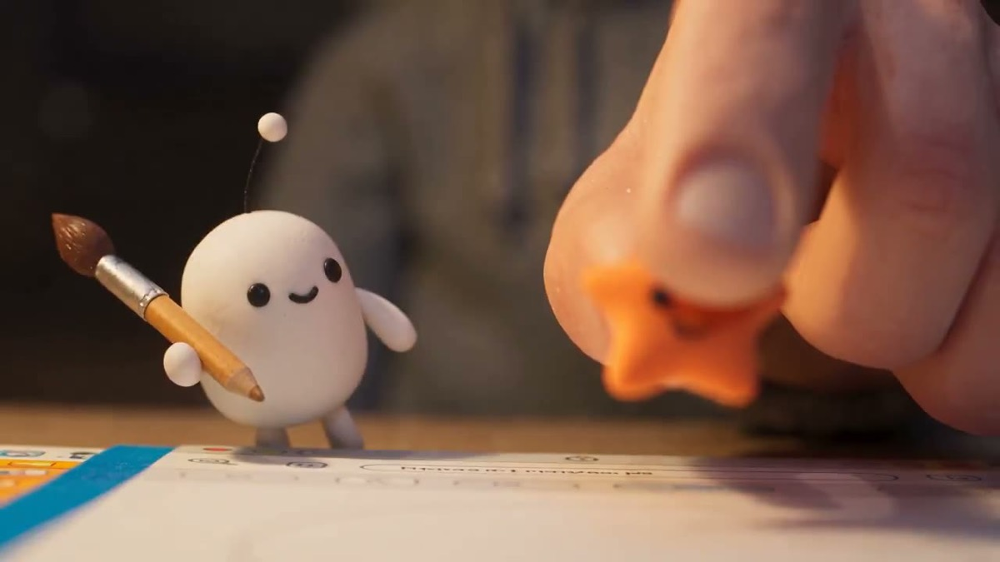</a><br><strong>黏土机器人创业故事</strong><br><sub>用黏土定格和拟音叙述微型机器人协助创作应用的故事。</sub><br><a href="styles/video-69395c9b4c/style.json">style.json</a> · <a href="docs/copy-prompts/video-69395c9b4c.md">Copy Prompt</a></td>
</tr>
<tr>
<td width="33%" valign="top"><a href="docs/copy-prompts/video-anime-skateboard-chase-nyc-source.md">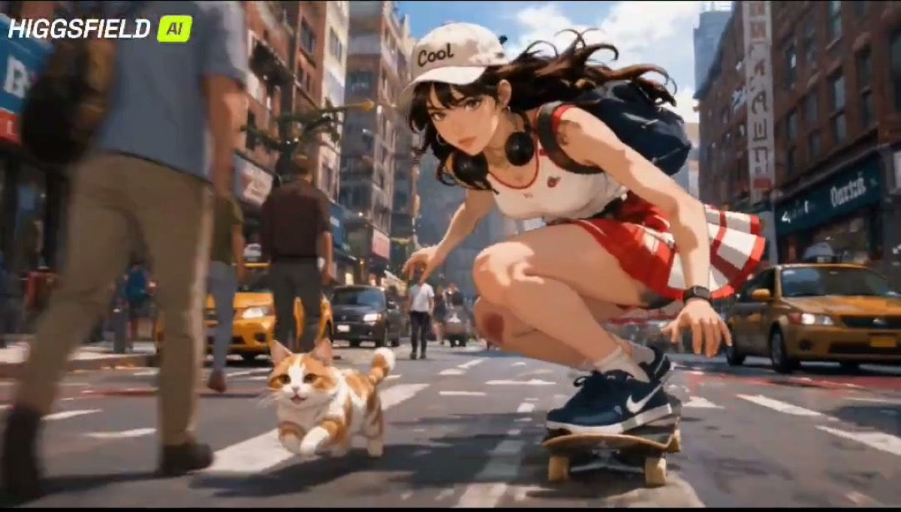</a><br><strong>纽约街头的动漫滑板追逐</strong><br><sub>根据角色参考图生成女孩与小猫在纽约街头高速滑板追逐的半写实动漫短片。</sub><br><a href="styles/video-anime-skateboard-chase-nyc-source/style.json">style.json</a> · <a href="docs/copy-prompts/video-anime-skateboard-chase-nyc-source.md">Copy Prompt</a> · <a href="docs/copy-prompts/video-anime-skateboard-chase-nyc.md">Linked Version</a></td>
<td width="33%" valign="top"><a href="docs/copy-prompts/video-nyc-parkour-web-swing-source.md">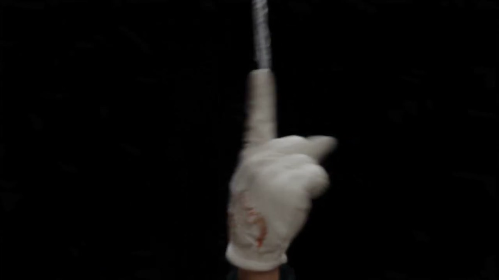</a><br><strong>纽约跑酷与蛛丝摆荡动作</strong><br><sub>生成一段15秒连续无人机跟拍，让角色在纽约街区完成跑酷、蹬墙和蛛丝摆荡。</sub><br><a href="styles/video-nyc-parkour-web-swing-source/style.json">style.json</a> · <a href="docs/copy-prompts/video-nyc-parkour-web-swing-source.md">Copy Prompt</a> · <a href="docs/copy-prompts/video-nyc-parkour-web-swing.md">Linked Version</a></td>
<td width="33%" valign="top"><a href="docs/copy-prompts/video-1c634febce.md">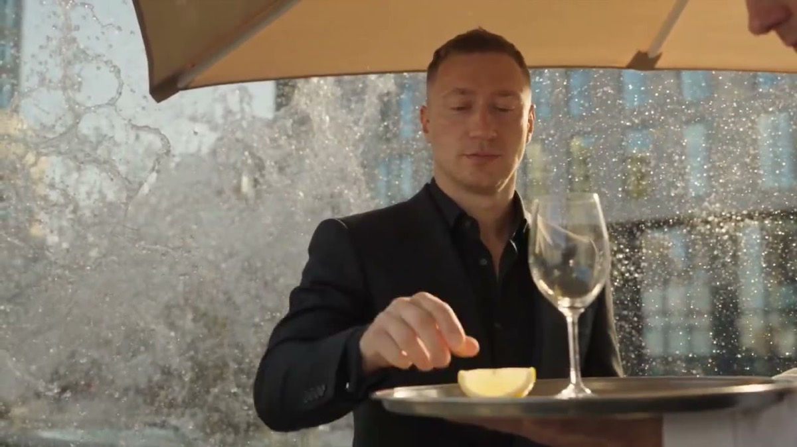</a><br><strong>喷泉时间静止与彩虹</strong><br><sub>通过冻结喷泉水流、人物互动与恢复时间形成超现实彩虹揭示。</sub><br><a href="styles/video-1c634febce/style.json">style.json</a> · <a href="docs/copy-prompts/video-1c634febce.md">Copy Prompt</a></td>
</tr>
<tr>
<td width="33%" valign="top"><a href="docs/copy-prompts/video-e6248de843.md">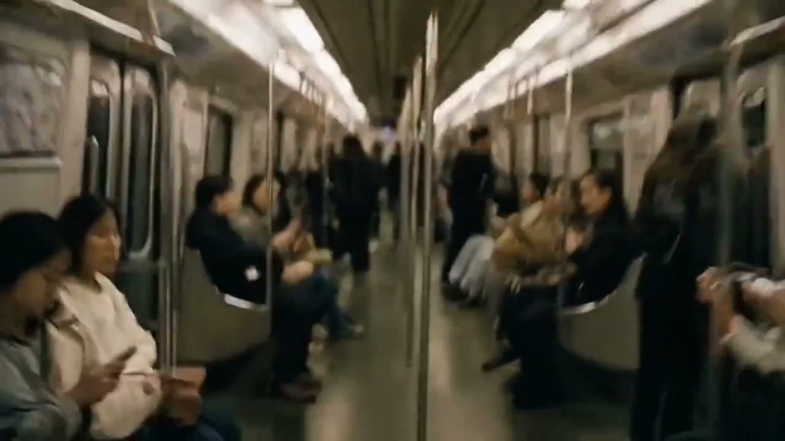</a><br><strong>疲惫日常蒙太奇</strong><br><sub>用连续生活碎片呈现从清晨通勤到深夜工作的疲惫日常。</sub><br><a href="styles/video-e6248de843/style.json">style.json</a> · <a href="docs/copy-prompts/video-e6248de843.md">Copy Prompt</a></td>
<td width="33%" valign="top"><a href="docs/copy-prompts/video-0a64266abe.md">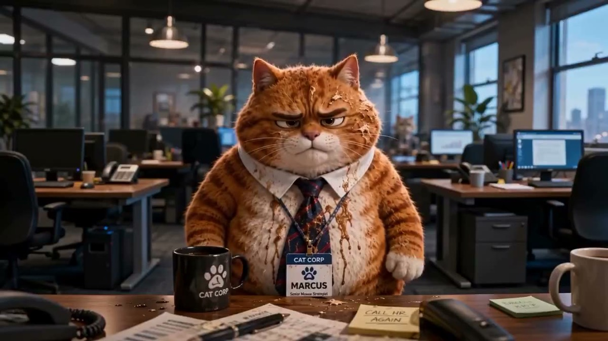</a><br><strong>企业猫职场动画短片</strong><br><sub>以拟人化角色的一日职场故事制作 3D 动画短片。</sub><br><a href="styles/video-0a64266abe/style.json">style.json</a> · <a href="docs/copy-prompts/video-0a64266abe.md">Copy Prompt</a></td>
<td width="33%" valign="top"><a href="docs/copy-prompts/video-rack-focus-foreground-background-source.md">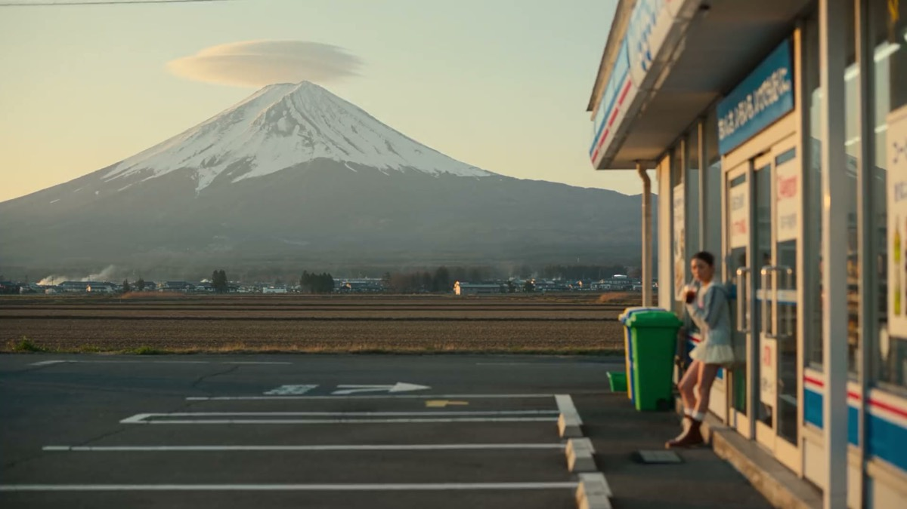</a><br><strong>前后景转移焦点</strong><br><sub>保持机位和构图完全固定，只在远景锚点与近景主体之间进行一次平滑转焦。</sub><br><a href="styles/video-rack-focus-foreground-background-source/style.json">style.json</a> · <a href="docs/copy-prompts/video-rack-focus-foreground-background-source.md">Copy Prompt</a> · <a href="docs/copy-prompts/video-rack-focus-foreground-background.md">Linked Version</a></td>
</tr>
<tr>
<td width="33%" valign="top"><strong>前后状态揭示</strong><br><sub>在不替换主体的前提下展示一种可观察的状态变化。</sub><br><a href="styles/before-after-reveal/style.json">style.json</a> · <a href="docs/copy-prompts/before-after-reveal.md">Copy Prompt</a></td>
<td width="33%" valign="top"><a href="docs/copy-prompts/video-japanese-influencer-get-ready-ugc-source.md">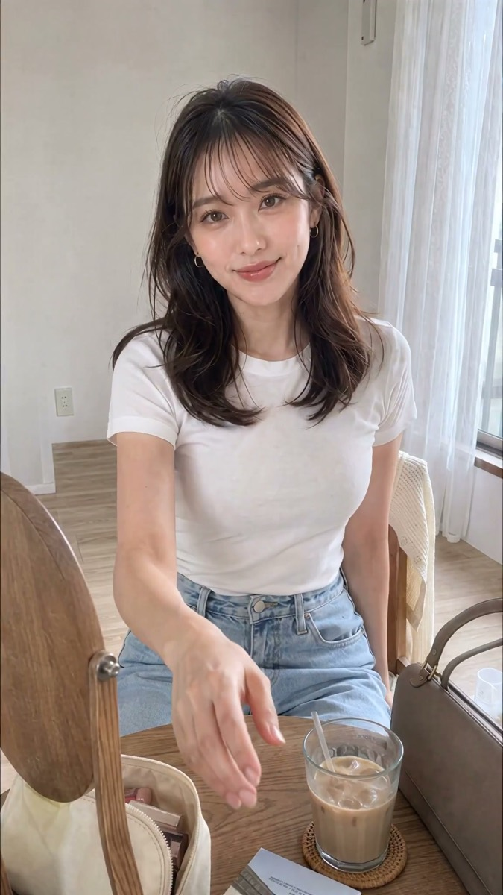</a><br><strong>日本网红出门准备 UGC</strong><br><sub>使用角色图和房间首帧生成一段日本美妆网红出门前整理刘海的自然手机口播视频。</sub><br><a href="styles/video-japanese-influencer-get-ready-ugc-source/style.json">style.json</a> · <a href="docs/copy-prompts/video-japanese-influencer-get-ready-ugc-source.md">Copy Prompt</a> · <a href="docs/copy-prompts/video-japanese-influencer-get-ready-ugc.md">Linked Version</a></td>
<td width="33%" valign="top"><a href="docs/copy-prompts/video-cliffside-roller-skating-source.md">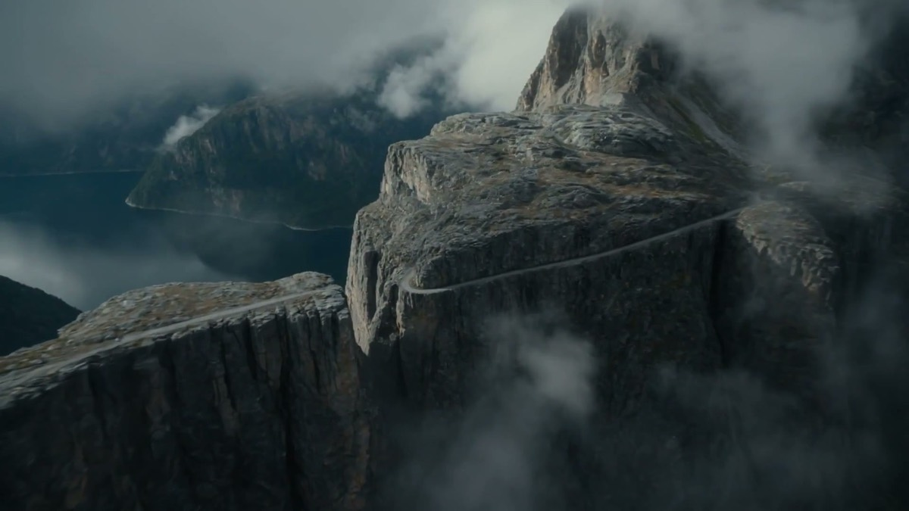</a><br><strong>山崖轮滑动作</strong><br><sub>生成一名女性在危险山崖道路轮滑的超写实动作序列，重点控制环境尺度、身体平衡和轮滑物理。</sub><br><a href="styles/video-cliffside-roller-skating-source/style.json">style.json</a> · <a href="docs/copy-prompts/video-cliffside-roller-skating-source.md">Copy Prompt</a> · <a href="docs/copy-prompts/video-cliffside-roller-skating.md">Linked Version</a></td>
</tr>
<tr>
<td width="33%" valign="top"><strong>上升镜头环境揭示</strong><br><sub>主体位置稳定，镜头升高时逐步交代空间关系。</sub><br><a href="styles/camera-reveal/style.json">style.json</a> · <a href="docs/copy-prompts/camera-reveal.md">Copy Prompt</a></td>
<td width="33%" valign="top"><a href="docs/copy-prompts/video-1d6c1fec91.md"></a><br><strong>烧烤美食微距短片</strong><br><sub>组合烤架火焰、肉串和人物动作的微距美食镜头。</sub><br><a href="styles/video-1d6c1fec91/style.json">style.json</a> · <a href="docs/copy-prompts/video-1d6c1fec91.md">Copy Prompt</a></td>
<td width="33%" valign="top"><a href="docs/copy-prompts/video-512e7b9e27.md">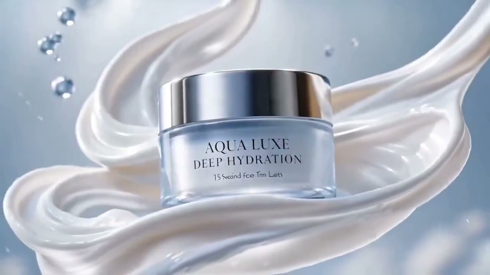</a><br><strong>奢华护肤品水感广告</strong><br><sub>围绕护肤玻璃罐设计水珠、乳霜、花叶和产品定格镜头。</sub><br><a href="styles/video-512e7b9e27/style.json">style.json</a> · <a href="docs/copy-prompts/video-512e7b9e27.md">Copy Prompt</a></td>
</tr>
<tr>
<td width="33%" valign="top"><a href="docs/copy-prompts/video-luxury-jewelry-unboxing-source.md">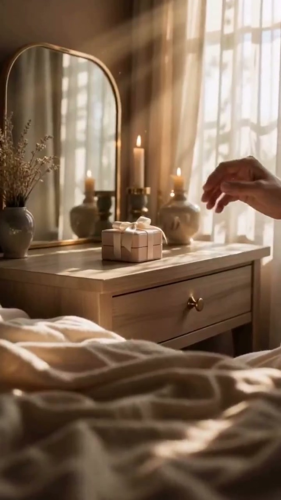</a><br><strong>奢华珠宝开箱广告</strong><br><sub>生成包含礼盒开箱、宝石微距、人物佩戴和产品陈列的竖屏珠宝商业广告。</sub><br><a href="styles/video-luxury-jewelry-unboxing-source/style.json">style.json</a> · <a href="docs/copy-prompts/video-luxury-jewelry-unboxing-source.md">Copy Prompt</a> · <a href="docs/copy-prompts/video-luxury-jewelry-unboxing.md">Linked Version</a></td>
<td width="33%" valign="top"><a href="docs/copy-prompts/video-dcc3d74eac.md"></a><br><strong>摄政时期电影蒙太奇</strong><br><sub>通过服饰、场景与光线连续性制作摄政时期人物蒙太奇。</sub><br><a href="styles/video-dcc3d74eac/style.json">style.json</a> · <a href="docs/copy-prompts/video-dcc3d74eac.md">Copy Prompt</a></td>
<td width="33%" valign="top"><a href="docs/copy-prompts/video-bioluminescent-lighthouse-keeper-source.md">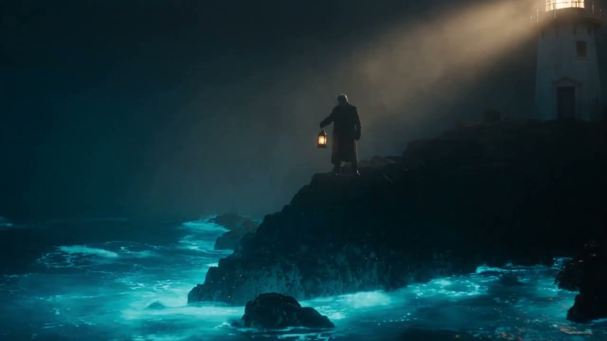</a><br><strong>生物发光灯塔守望者</strong><br><sub>生成老灯塔守望者在雾夜悬崖目睹发光球体从海中升起的连续电影镜头。</sub><br><a href="styles/video-bioluminescent-lighthouse-keeper-source/style.json">style.json</a> · <a href="docs/copy-prompts/video-bioluminescent-lighthouse-keeper-source.md">Copy Prompt</a> · <a href="docs/copy-prompts/video-bioluminescent-lighthouse-keeper.md">Linked Version</a></td>
</tr>
<tr>
<td width="33%" valign="top"><a href="docs/copy-prompts/video-recipe-infographic-cooking-sequence-source.md"></a><br><strong>食谱信息图转连续烹饪短片</strong><br><sub>以一张多步骤食谱信息图为视觉分镜，先生成前半段，再续写后半段，得到保持食材状态、厨房环境、声效和烹饪顺序连续的竖屏美食短片。</sub><br><a href="styles/video-recipe-infographic-cooking-sequence-source/style.json">style.json</a> · <a href="docs/copy-prompts/video-recipe-infographic-cooking-sequence-source.md">Copy Prompt</a> · <a href="docs/copy-prompts/video-recipe-infographic-cooking-sequence.md">Linked Version</a></td>
<td width="33%" valign="top"><a href="docs/copy-prompts/video-a2196efe4e.md">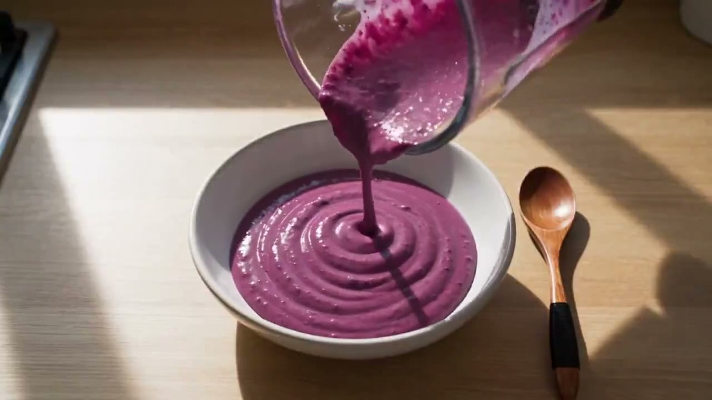</a><br><strong>手绘变实物定格料理</strong><br><sub>以铅笔草图变为真实食材的机制制作混合现实料理短片。</sub><br><a href="styles/video-a2196efe4e/style.json">style.json</a> · <a href="docs/copy-prompts/video-a2196efe4e.md">Copy Prompt</a></td>
<td width="33%" valign="top"><a href="docs/copy-prompts/video-seoul-sunday-dv-home-video-source.md">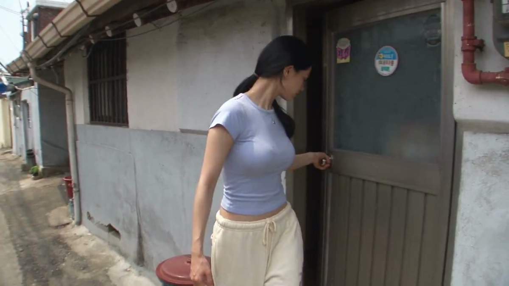</a><br><strong>首尔周日 DV 家庭录像</strong><br><sub>生成一段具有 21 世纪初手持 DV 质感、自然日常互动和连续物体状态的首尔生活记录，适合怀旧 Vlog、城市日常和人物短片。</sub><br><a href="styles/video-seoul-sunday-dv-home-video-source/style.json">style.json</a> · <a href="docs/copy-prompts/video-seoul-sunday-dv-home-video-source.md">Copy Prompt</a> · <a href="docs/copy-prompts/video-seoul-sunday-dv-home-video.md">Linked Version</a></td>
</tr>
<tr>
<td width="33%" valign="top"><strong>竖屏体验型 UGC</strong><br><sub>口播、操作和结果三个节拍组成自然的产品体验。</sub><br><a href="styles/creator-ugc-script/style.json">style.json</a> · <a href="docs/copy-prompts/creator-ugc-script.md">Copy Prompt</a></td>
<td width="33%" valign="top"><a href="docs/copy-prompts/video-watercolor-sketch-parkour-chase-source.md">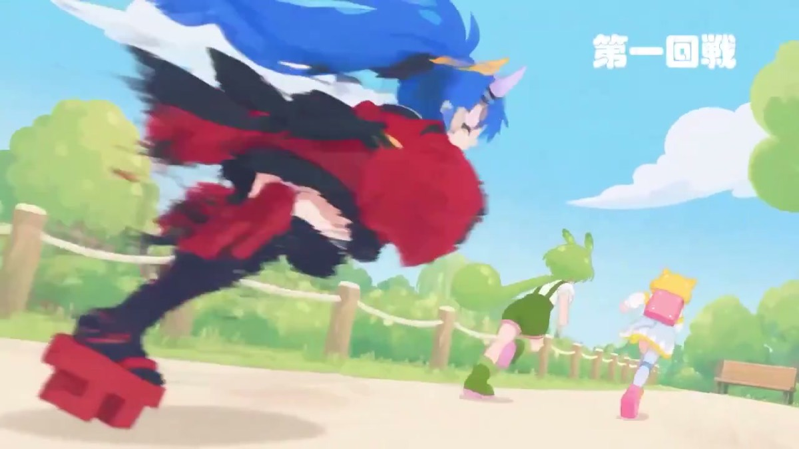</a><br><strong>水彩素描跑酷追逐</strong><br><sub>使用多张角色与场景参考图生成三人跑酷追逐，并把每一帧呈现为不稳定线条和水彩重新绘制的动画。</sub><br><a href="styles/video-watercolor-sketch-parkour-chase-source/style.json">style.json</a> · <a href="docs/copy-prompts/video-watercolor-sketch-parkour-chase-source.md">Copy Prompt</a> · <a href="docs/copy-prompts/video-watercolor-sketch-parkour-chase.md">Linked Version</a></td>
<td width="33%" valign="top"><a href="docs/copy-prompts/video-345a132c7a.md">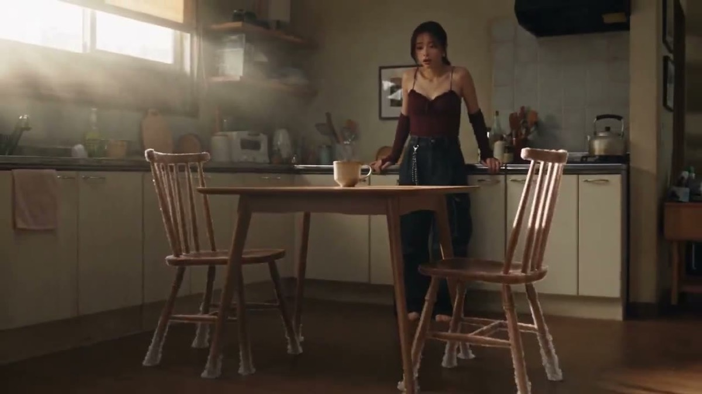</a><br><strong>水晶粒子厨房变身</strong><br><sub>以人物触碰触发器物碎裂和室内空间重构的视觉特效短片。</sub><br><a href="styles/video-345a132c7a/style.json">style.json</a> · <a href="docs/copy-prompts/video-345a132c7a.md">Copy Prompt</a></td>
</tr>
<tr>
<td width="33%" valign="top"><a href="docs/copy-prompts/video-dolly-zoom-space-warp-source.md"></a><br><strong>推拉变焦空间扭曲</strong><br><sub>同步执行摄像机前移和镜头变广，在保持主体尺寸不变的同时拉伸背景空间。</sub><br><a href="styles/video-dolly-zoom-space-warp-source/style.json">style.json</a> · <a href="docs/copy-prompts/video-dolly-zoom-space-warp-source.md">Copy Prompt</a> · <a href="docs/copy-prompts/video-dolly-zoom-space-warp.md">Linked Version</a></td>
<td width="33%" valign="top"><a href="docs/copy-prompts/video-565c5a1550.md">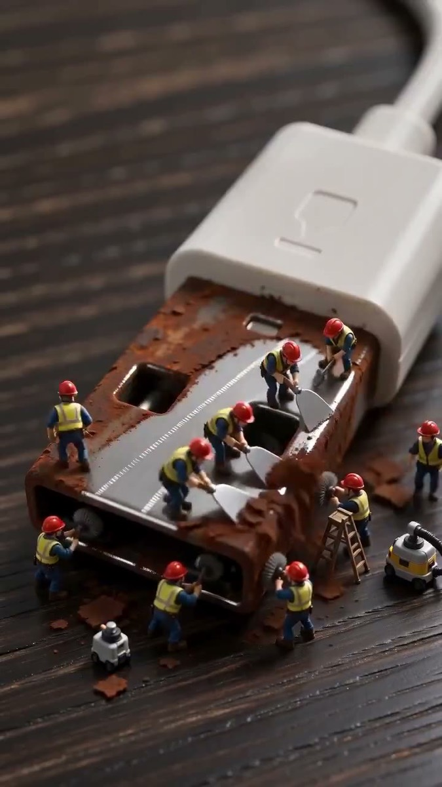</a><br><strong>微型工人维修USB</strong><br><sub>用微距小人协作逐步修复并改造损坏的 USB 闪存盘。</sub><br><a href="styles/video-565c5a1550/style.json">style.json</a> · <a href="docs/copy-prompts/video-565c5a1550.md">Copy Prompt</a></td>
<td width="33%" valign="top"><a href="docs/copy-prompts/video-bedroom-falling-book-catch-source.md"></a><br><strong>卧室接住落书互动</strong><br><sub>基于卧室人物首帧生成书籍滑落、人物及时接住并作出自然反应的连续物体交互。</sub><br><a href="styles/video-bedroom-falling-book-catch-source/style.json">style.json</a> · <a href="docs/copy-prompts/video-bedroom-falling-book-catch-source.md">Copy Prompt</a> · <a href="docs/copy-prompts/video-bedroom-falling-book-catch.md">Linked Version</a></td>
</tr>
<tr>
<td width="33%" valign="top"><a href="docs/copy-prompts/video-drone-orbit-subject-source.md"></a><br><strong>无人机环绕主体</strong><br><sub>让无人机以固定半径和高度匀速环绕主体，利用地平线旋转和视差建立空间感。</sub><br><a href="styles/video-drone-orbit-subject-source/style.json">style.json</a> · <a href="docs/copy-prompts/video-drone-orbit-subject-source.md">Copy Prompt</a> · <a href="docs/copy-prompts/video-drone-orbit-subject.md">Linked Version</a></td>
<td width="33%" valign="top"><strong>物体形状匹配转场</strong><br><sub>用相同轮廓完成两种场景间的流畅切换。</sub><br><a href="styles/object-match-cut/style.json">style.json</a> · <a href="docs/copy-prompts/object-match-cut.md">Copy Prompt</a></td>
<td width="33%" valign="top"><a href="docs/copy-prompts/video-aecc45705d.md">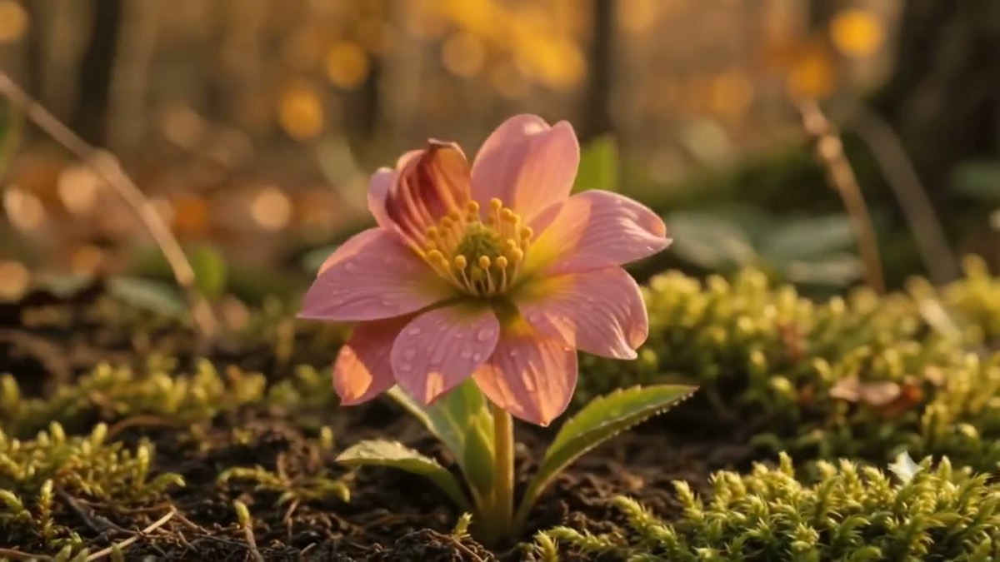</a><br><strong>野花四季微距延时</strong><br><sub>固定一株野花，以微距延时展示盛放、枯萎、结霜和凋零。</sub><br><a href="styles/video-aecc45705d/style.json">style.json</a> · <a href="docs/copy-prompts/video-aecc45705d.md">Copy Prompt</a></td>
</tr>
<tr>
<td width="33%" valign="top"><a href="docs/copy-prompts/video-rainforest-mysterious-light-source.md">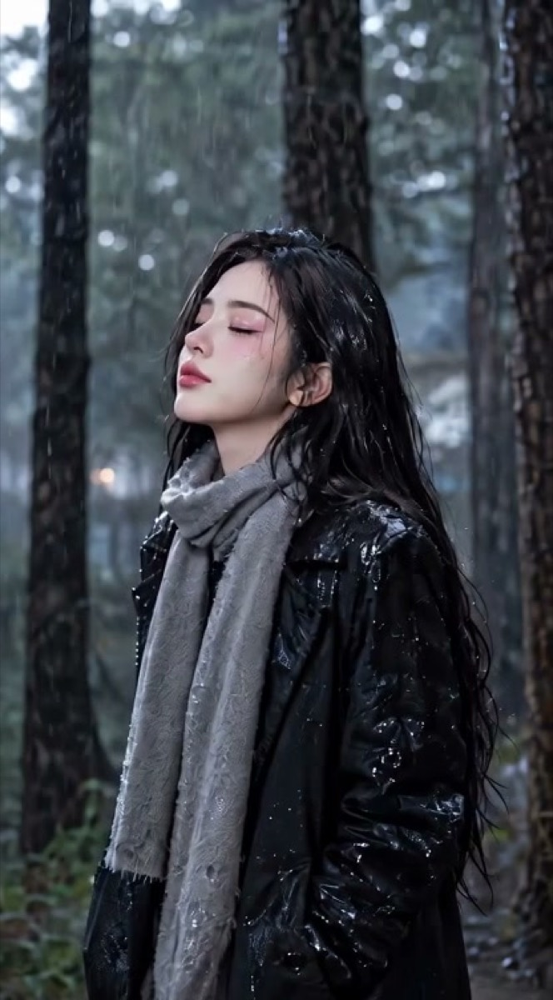</a><br><strong>雨林神秘光源短片</strong><br><sub>基于雨林人物首帧生成女性察觉远处暖光、靠近后光芒消失的氛围悬念短片。</sub><br><a href="styles/video-rainforest-mysterious-light-source/style.json">style.json</a> · <a href="docs/copy-prompts/video-rainforest-mysterious-light-source.md">Copy Prompt</a> · <a href="docs/copy-prompts/video-rainforest-mysterious-light.md">Linked Version</a></td>
<td width="33%" valign="top"><a href="docs/copy-prompts/video-real-person-sticker-poster-motion.md"></a><br><strong>真人贴纸海报动效</strong><br><sub>上传真人贴纸海报，固定镜头与背景，只让真实人物自然活动。</sub><br><a href="styles/video-real-person-sticker-poster-motion/style.json">style.json</a> · <a href="docs/copy-prompts/video-real-person-sticker-poster-motion.md">Copy Prompt</a></td>
<td width="33%" valign="top"><strong>纸雕转场：从静态插画到微动效</strong><br><sub>保持原插画构图，分层加入细微景深与环境运动。</sub><br><a href="styles/paper-cut-loop/style.json">style.json</a> · <a href="docs/copy-prompts/paper-cut-loop.md">Copy Prompt</a></td>
</tr>
<tr>
<td width="33%" valign="top"><a href="docs/copy-prompts/video-cdfbcca0a0.md">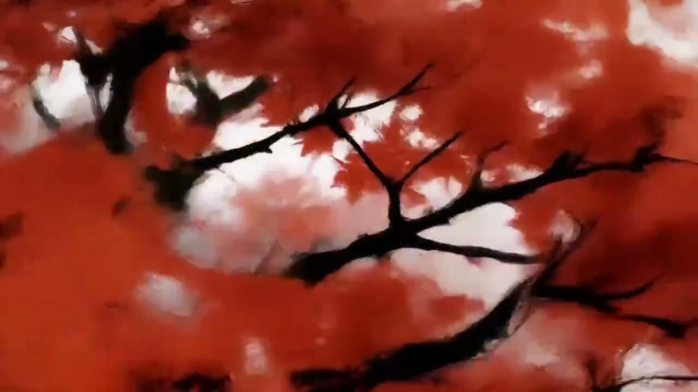</a><br><strong>中国水墨无缝转场</strong><br><sub>用水墨形态变换连续连接海浪、山峦、花枝和月夜场景。</sub><br><a href="styles/video-cdfbcca0a0/style.json">style.json</a> · <a href="docs/copy-prompts/video-cdfbcca0a0.md">Copy Prompt</a></td>
</tr>
</table>
<!-- END GENERATED GALLERY -->

## Contributing and License

See [CONTRIBUTING.md](CONTRIBUTING.md) to add or update a style. Original repository content and site code are licensed under [MIT](LICENSE). Third-party previews, clips, and prompts are not covered by that license; follow the original creator's and platform's terms when reusing them.
