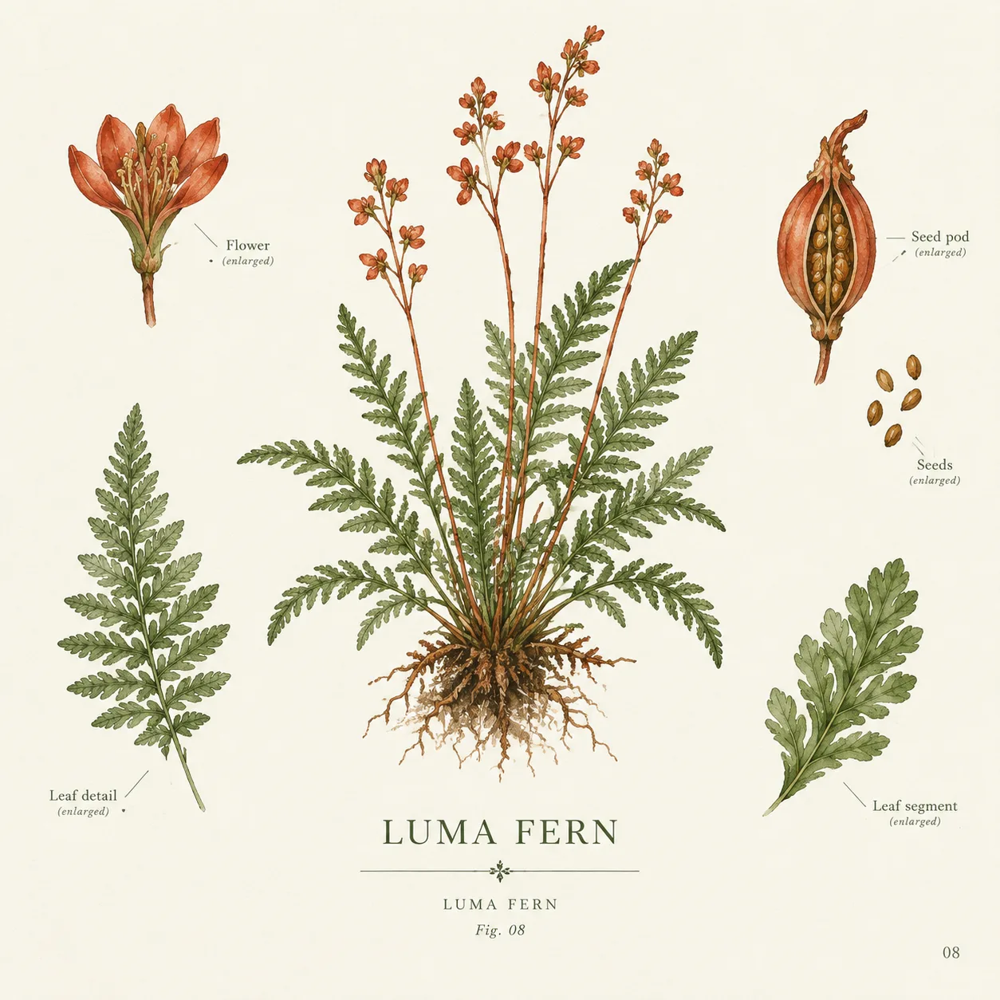

# 虚构植物科学图版

[返回完整目录](../CATALOG.md)



以标本主图和局部放大图组织清晰的植物学图版。

类型：生图 · 原创案例 · 科普与出版

生成信息：gpt-image-2 · RightCodes · 1024x1024 → 1254x1254

## 完整 Prompt

```text
Create a finished editorial scientific botanical plate for an original imaginary alpine plant named Luma fern. Vertical 3:4 composition. Large accurate-looking central botanical watercolor specimen, smaller enlarged seed pod and leaf detail drawings around it, fine leader lines, restrained moss green and vermilion ink with clean off-white paper. Elegant specimen label LUMA FERN and tiny serial number 08 in legible English. Premium museum publication photography, crisp fine details, no logos, no humans, no real brand, no web UI.
```

[打开 style.json](../../styles/botanical-plate/style.json) · [打开条目目录](../../styles/botanical-plate/)

<!-- Generated by scripts/build.mjs. -->
