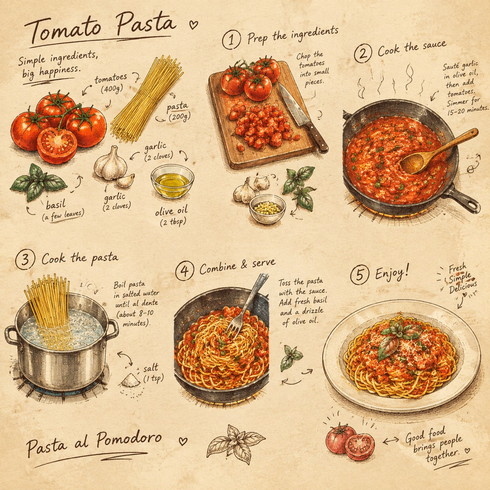

# 烹饪速写插画叙事

[返回完整目录](../CATALOG.md)



将食物或烹饪主题转化为包含食材、准备过程、质地和成品的 4 至 6 格怀旧手绘速写故事。

类型：生图 · 来源案例 · 影视叙事

来源：[@simeon-sanai](https://x.com/Naiknelofar788/status/2096823849702785331)

## 完整 Prompt

```text
将主体转化为一个视觉故事，通过 4–6 个小型插画帧 进行呈现。在保持主体可辨识度的同时，将其重新诠释为迷人的手绘序列，展示其食材、准备过程、质地和最终形态。 使用 暖色调奶油纸背景、精致的墨水轮廓、微妙的手写注释、微小的箭头、食材草图、测量标记以及不完美的印刷纹理。 构图应呈现出 古老烹饪速写本 页面的质感——充满艺术感、灵动、怀旧且经过精心策划。 不要仅仅复制照片，而是将主体转化为一段插画视觉叙事。
```

## English Prompt

```text
Turn the main subject into a visual story told through 4–6 small illustrated frames. Keep the original object recognizable, but reinterpret it as a charming hand-drawn sequence showing its ingredients, preparation, texture, and final form.

Use a warm cream paper background, delicate ink outlines, subtle handwritten annotations, tiny arrows, ingredient sketches, measurement marks, and imperfect print textures.

The composition should feel like a page from an old culinary sketchbook — artistic, intelligent, nostalgic, and highly curated.

Do not simply reproduce the photograph. Transform its subject into an illustrated visual narrative.
```

[打开 style.json](../../styles/image-cooking-sketch-illustration-story/style.json) · [打开条目目录](../../styles/image-cooking-sketch-illustration-story/)

<!-- Generated by scripts/build.mjs. -->
