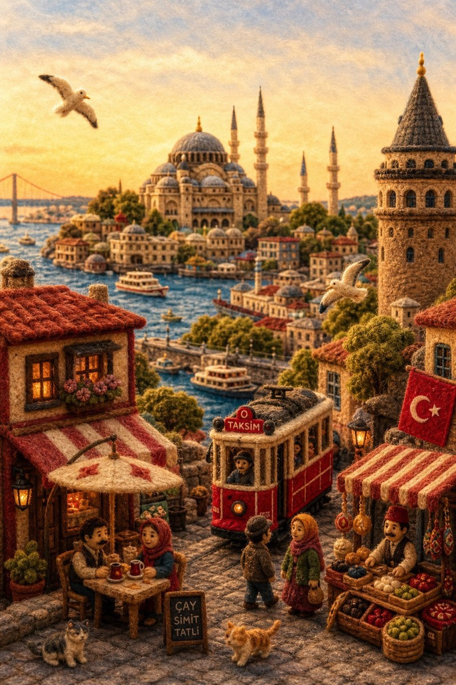

# 羊毛毡国家微缩世界

[返回完整目录](../CATALOG.md)



将国家、城市和代表性地标转化为具有手工羊毛毡质感的微缩世界。

类型：生图 · 来源案例 · 旅行城市

来源：[@volkan_iras](https://x.com/volkan_iras/status/2051403524966141980)

可替换内容：`[插入国家/地区名称]`

## 完整提示词

```text
国家/地区：[插入国家/地区名称]

由蓬松的纱线、羊毛和针线制成的微型毛毡立体模型，设计成一个单一的有凝聚力的小世界（不是拼贴画），反映了这个国家的真实景观、文化和日常生活。

结构：
- 选择 4-7 个自然整合的元素（景观、建筑、交通、街道生活、文化）
- 一切都必须作为一个环境一起流动

前景：
日常生活——小商店、咖啡馆、市场、人们互动、当地服装、街道细节、微妙的动作、温暖的人类存在

中景：
连接流线——街道、桥梁、河流、小路、交通、文化空间，自然地引导视线从前到后

背景：
一个强有力的身份锚点——地标、天际线、山脉或象征性景观，清楚地代表国家（保持干净，不要过度拥挤）

风格：
手工羊毛毡、纱线、针毡纹理、可见纤维、柔软边缘、微型工艺、高级立体模型现实主义

照明：
温暖的黄金时段或明亮的正午，柔和的阴影，清晰的可见度，柔和的辉光增强深度

颜色:
柔和但饱和的调色板反映了该国的自然色调（绿色、天蓝色、建筑色调、文化特色）、温暖而平衡

成分：
垂直框架，平衡或居中视角，轻微自上而下或沉浸式角度，清晰的前景-中景-背景深度

心情：
温暖、感性、平静、精致——就像现实生活的手工童话版本（不幼稚）

规则：
- 无徽标或文字覆盖
- 没有拼贴风格的构图
- 没有随机的符号混乱
- 保持现实，但风格化为手工制作的微型世界

质量：
16K、超细致、超现实的微型纹理、电影深度、锐利的焦点

输出目标：
一个单一、有凝聚力的毛毡立体模型世界，通过整合的景观、文化和日常生活立即传达所选国家的身份和氛围
```

## English Prompt

```text
Country: [INSERT COUNTRY NAME]

A miniature felt diorama made of fluffy yarn, wool, and needlework, designed as a single cohesive small world (not a collage), reflecting the real landscape, culture, and daily life of the country.

Structure:
- Select 4–7 naturally integrated elements (landscape, architecture, transport, street life, culture)
- Everything must flow together as one environment

Foreground:
Everyday life — small shops, cafes, markets, people interacting, local clothing, street details, subtle movement, warm human presence

Midground:
Connecting flow — streets, bridges, rivers, paths, transport, cultural spaces that guide the eye naturally from front to back

Background:
One strong identity anchor — landmark, skyline, mountain, or symbolic landscape clearly representing the country (keep it clean, not overcrowded)

Style:
Handmade wool felt, yarn, needle-felt textures, visible fibers, soft edges, miniature craftsmanship, premium diorama realism

Lighting:
Warm golden hour or bright noon, soft shadows, clear visibility, gentle glow enhancing depth

Color:
Soft but saturated palette reflecting the country’s natural tones (greens, sky blues, architectural hues, cultural accents), warm and balanced

Composition:
Vertical frame, balanced or centered perspective, slight top-down or immersive angle, clear foreground–midground–background depth

Mood:
Warm, emotional, calm, refined — like a handcrafted fairy-tale version of real life (not childish)

Rules:
- No logos or text overlays
- No collage-style composition
- No random symbolic clutter
- Keep it realistic but stylized as a handmade miniature world

Quality:
16K, ultra-detailed, hyper-realistic miniature textures, cinematic depth, sharp focus

output_goal:
A single, cohesive felt diorama world that instantly conveys the identity and atmosphere of the chosen country through integrated landscape, culture, and daily life
```

[打开 style.json](../../styles/image-felt-country-miniature-world/style.json) · [打开条目目录](../../styles/image-felt-country-miniature-world/)

<!-- Generated by scripts/build.mjs. -->
