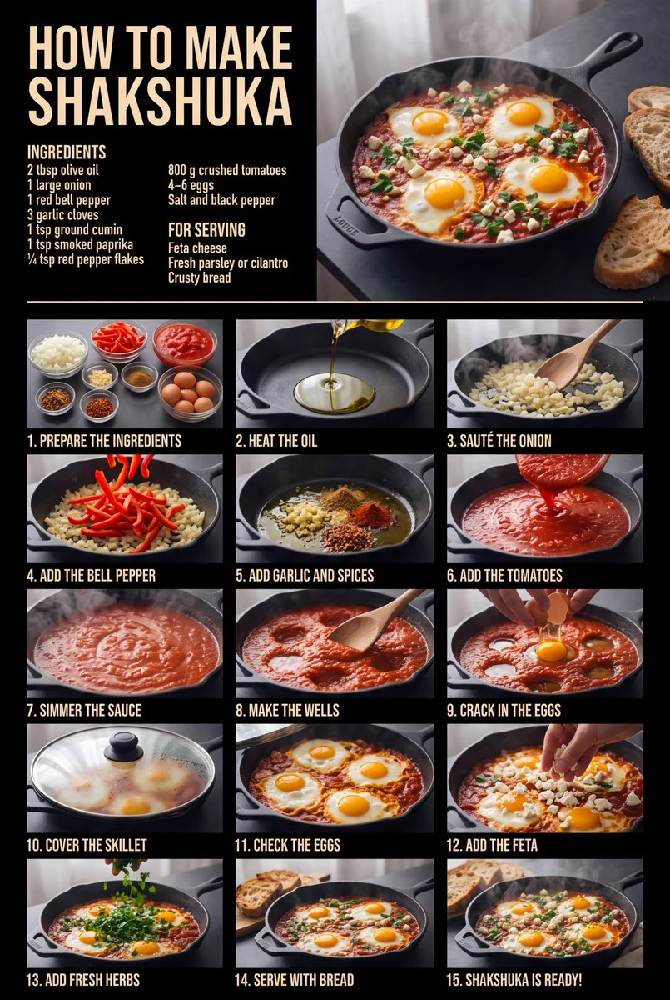

# 十五步写实食谱信息图

[返回完整目录](../CATALOG.md)



把一道菜的食材、15 个连续制作步骤和成品主视觉整理成竖版写实食谱信息图，也可作为后续图生视频的视觉分镜参考。

类型：生图 · 来源案例 · 信息图表

来源：[Oleksa AI（X：`@OleksaFrame`）。](https://x.com/OleksaFrame/status/2097669808800113040)

## 完整提示词

```text
创建一张竖版写实食谱信息图，主题为“如何制作 {菜名}”。整张图以清晰、可执行的烹饪顺序为核心，兼顾专业美食摄影和编辑排版，可直接作为图生视频的视觉分镜参考。

## 画布与版式

- 竖版 2:3 画幅，黑色背景，暖白色粗体无衬线标题与说明文字，细暖白色分隔线。
- 顶部约占画面 30%：左侧为大标题“HOW TO MAKE {英文菜名}”，标题下方分两列列出全部食材和用量；右侧为最终成品的大幅英雄照片。
- 下方约占画面 70%：使用 3 列 x 5 行的规整网格，展示 15 个按真实烹饪顺序排列的步骤。
- 每个步骤格包含一张横向写实照片，以及照片下方的“序号 + 简短英文步骤名”。序号从 1 到 15 连续且不重复。
- 所有网格边距、图片比例、文字基线和列宽保持一致，阅读顺序从左到右、从上到下。

## 内容变量

- 菜名：{菜名}
- 英文菜名：{英文菜名}
- 食材与用量：{完整食材清单}
- 15 个步骤：{步骤1} 至 {步骤15}
- 核心锅具或器皿：{锅具}
- 主色食材：{主色食材}
- 配菜与装饰：{配菜与装饰}

## 图像连续性

- 15 个步骤必须忠实反映输入食谱的真实顺序，不增加、遗漏或颠倒关键步骤。
- 全程使用同一款无品牌、无标识的 {锅具}，保持灶台、台面、采光方向、食材形态和色调连续。
- 每一格只表现一个清楚的动作或状态变化；食材数量与熟度随步骤自然推进。
- 成品英雄图与最后一步保持一致，不能出现步骤中没有加入的食材。

## 摄影风格

柔和的窗边自然光从画面左侧进入，浅色石材台面提供柔和补光。写实商业美食摄影，细腻食物纹理，自然蒸汽、油光、酱汁气泡和手部动作；深色锅具与高饱和度主色食材形成对比。镜头以俯拍中景、三分之四近景和微距特写交替，景深自然，画面干净克制。

## 文字与限制

- 只显示标题、食材、用量、步骤序号和步骤名，不添加宣传文案、Logo、水印、二维码或界面元素。
- 所有文字拼写正确、清晰可读，不使用伪文字或乱码。
- 不出现品牌标识、人物脸部、无关餐具、额外菜品或重复步骤。
- 不把同一张照片复制到多个步骤格；每格构图和动作必须与对应步骤匹配。
```

## English Prompt

```text
Create a vertical photorealistic recipe infographic titled "How to make {dishName}". Center the image on a clear, executable cooking sequence, combining professional food photography with editorial typography. It should also serve directly as a visual storyboard reference for image-to-video generation.

## Canvas and layout

- Vertical 2:3 aspect ratio, black background, bold warm-white sans-serif headings and descriptions, and thin warm-white dividers.
- The top occupies approximately 30% of the canvas: on the left, a large "HOW TO MAKE {englishDishName}" title with all ingredients and quantities listed in two columns below it; on the right, a large hero photograph of the finished dish.
- The lower approximately 70% uses a regular 3-column x 5-row grid to show 15 steps in the actual cooking sequence.
- Each step cell contains a horizontal photorealistic photograph and a "number + short English step name" caption beneath it. Number the steps consecutively from 1 to 15 without repetition.
- Keep grid margins, image proportions, text baselines, and column widths consistent. Read from left to right and top to bottom.

## Content variables

- Dish name: {dishName}
- English dish name: {englishDishName}
- Ingredients and quantities: {completeIngredientList}
- 15 steps: {step1} through {step15}
- Main cookware or vessel: {cookware}
- Main color-defining ingredient: {mainColorIngredient}
- Side dishes and garnishes: {sidesAndGarnishes}

## Continuity

- The 15 steps must faithfully follow the input recipe's actual sequence, without adding, omitting, or reversing key steps.
- Use the same unbranded, unmarked {cookware} throughout all steps. Keep the stove, countertop, lighting direction, ingredient appearance, and color palette continuous.
- Each cell shows only one clear action or change of state. Ingredient quantities and doneness progress naturally through the sequence.
- The finished-dish hero image must match the last step, with no ingredients that were never added during the process.

## Photography style

Soft natural window light enters from the left, with gentle fill from a light-colored stone countertop. Photorealistic commercial food photography with detailed food textures, natural steam, oil sheen, bubbling sauce, and hand movements; dark cookware contrasts with highly saturated main ingredients. Alternate overhead medium shots, three-quarter close-ups, and macro details, with natural depth of field and clean, restrained compositions.

## Text and restrictions

- Show only the title, ingredients, quantities, step numbers, and step names. Do not add promotional copy, logos, watermarks, QR codes, or interface elements.
- All text must be correctly spelled, clear, and legible, with no pseudo-text or garbled characters.
- No brand marks, human faces, unrelated tableware, extra dishes, or repeated steps.
- Do not duplicate one photograph across multiple cells. Each cell's composition and action must match its corresponding step.
```

[打开 style.json](../../styles/image-fifteen-step-photorealistic-recipe/style.json) · [打开条目目录](../../styles/image-fifteen-step-photorealistic-recipe/)

<!-- Generated by scripts/build.mjs. -->
