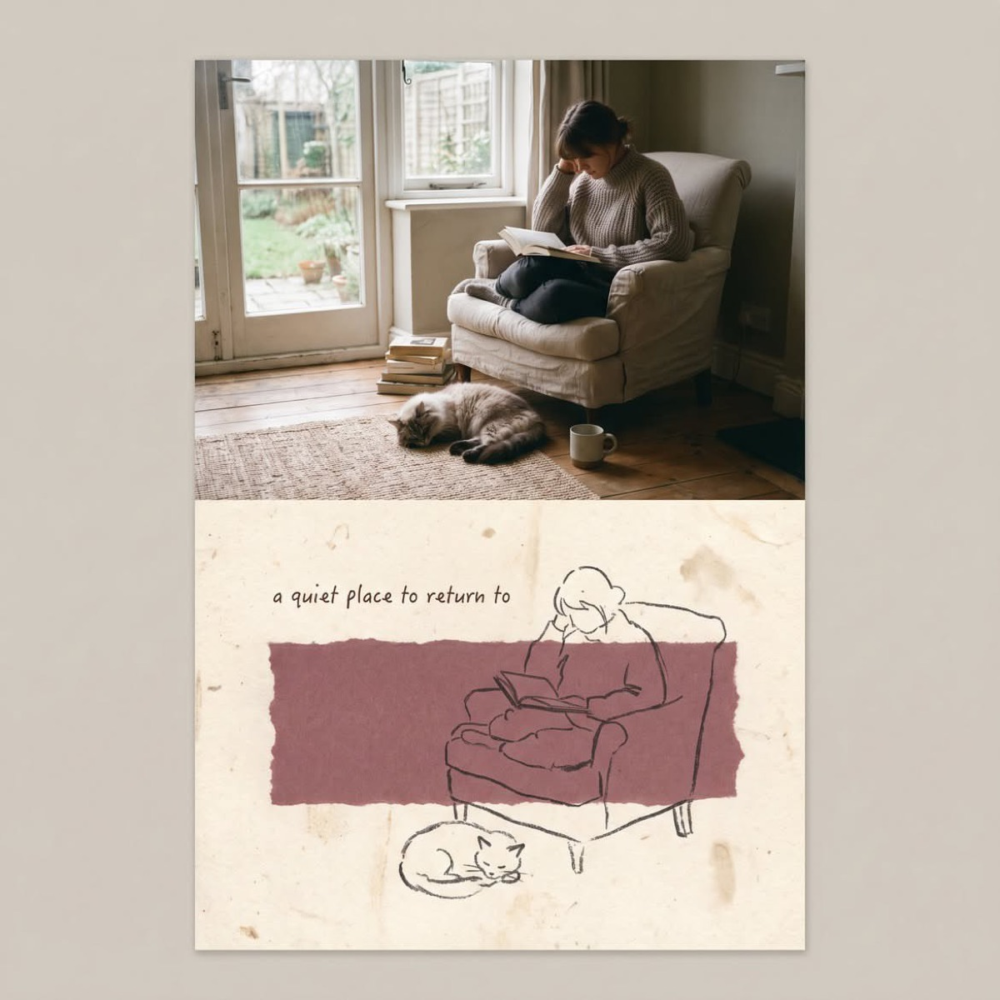

# 五五分混合媒介回忆卡

[返回完整目录](../CATALOG.md)



将原始照片与蜡笔速写严格上下五五分割，生成克制怀旧的混合媒介回忆卡。

类型：生图 · 来源案例 · 海报设计

来源：[@Sairah_0](https://x.com/Sairah_0/status/2093212900160868430)

相关链接：[GitHub 案例](https://github.com/freestylefly/awesome-gpt-image-2/blob/main/docs/gallery-part-2.md#case-541)

## 完整 Prompt

```text
Transform the uploaded photo into a vertical mixed-media memory card with a strict 50/50 split.

Keep the original photo unchanged in the top half. In the bottom half, use textured off-white handmade paper and add a muted, irregular color patch matching the photo’s tones.

Redraw the main subjects as a simple dark wax-crayon sketch with loose, imperfect lines and minimal details. Add a short handwritten English phrase and subtle Risograph grain.

Create a quiet, nostalgic Morandi-style aesthetic with generous negative space. Do not add extra elements or copy the reference composition exactly.
```

[查看关联 Prompt](../copy-prompts/image-half-photo-half-crayon-memory-card.md)

[打开 style.json](../../styles/image-half-photo-half-crayon-memory-card-source/style.json) · [打开条目目录](../../styles/image-half-photo-half-crayon-memory-card-source/)

<!-- Generated by scripts/build.mjs. -->
