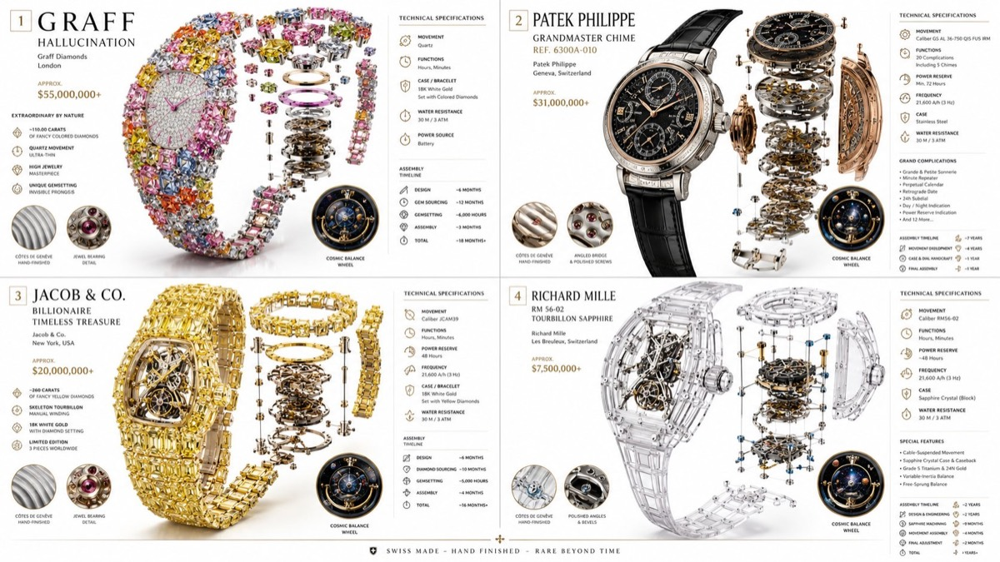

# 奢华机械腕表技术图鉴

[返回完整目录](../CATALOG.md)



生成多款高级机械腕表的透明结构、零件拆解和材质说明图鉴。

类型：生图 · 来源案例 · 信息图表

来源：[@Gdgtify](https://x.com/Gdgtify/status/2056928396991488312)

相关链接：[GitHub 案例](https://github.com/freestylefly/awesome-gpt-image-2/blob/main/docs/gallery-part-2.md#case-449)

## 完整 Prompt

```text
2x2 grid 16:9, do this for 4 most expensive strangest watches ever made:

class Haute_Horlogerie_DNA:
    def __init__(self):
        self.subject = "[TIMEPIECE]"
        self.parents = {
            "composition_parent": "Exploded movement diagram with transparent case",
            "material_parent": "Brushed titanium, sapphire crystal, rose gold gears, alligator leather",
            "graphic_parent": "Swiss manufacture technical brochure with elegant data panels",
            "atmosphere_parent": "Crisp daylight studio, pure white background, subtle reflection on polished surfaces"
        }
        self.mutations = {
            "semantic_mutation": "The balance wheel reveals a miniature cosmos ticking inside",
            "information_mutation": "Power reserve indicator, frequency, complication callouts, hand-finishing grades, assembly timeline",
            "medium_mutation": "Smooth matte premium paper with embossed logo",
            "scale_mutation": "Grain-level view of Côtes de Genève finishing and jewel bearings"
        }
        self.style_mix = [0.30, 0.30, 0.25, 0.10, 0.05]

    def generate_subject(self):
        subject = """
        [TIMEPIECE] shown in its full mechanical glory. The dial, hands, movement,
        and strap float in perfect alignment against a bright, clean background.
        Every gear and spring is highlighted with exacting clarity.
        """
        return render(
            subject,
            format="luxury watch advertisement with technical insert",
            title="[MODEL REFERENCE]",
            subtitle="[MANUFACTURE / COLLECTION]",
            constraints="bright white space, metallic brilliance, hyper-detailed, modern elegance"
        )
```

[查看关联 Prompt](../copy-prompts/image-luxury-mechanical-watch-technical-guide.md)

[打开 style.json](../../styles/image-luxury-mechanical-watch-technical-guide-source/style.json) · [打开条目目录](../../styles/image-luxury-mechanical-watch-technical-guide-source/)

<!-- Generated by scripts/build.mjs. -->
