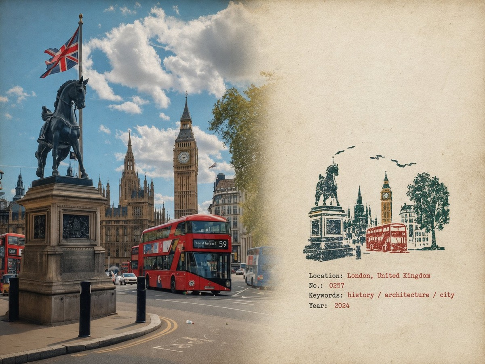

# 橡皮章旅行田野笔记

[返回完整目录](../CATALOG.md)



把旅行照片与手工橡皮章、旧纸张和少量档案文字组合成旅行田野笔记。

类型：生图 · 来源案例 · 旅行城市

来源：[@MahnoorAi12](https://x.com/MahnoorAi12/status/2092221482139349307)

## 完整提示词

```text
橡皮章旅行田野笔记海报——自然写实版

为我上传的每张照片分别制作一张“橡皮章旅行田野笔记海报”。每张照片单独输出，绝不拼贴或合并多张照片。

采用 4:3 横向构图，左侧原始照片与右侧旧纸田野笔记区域之间自然过渡，不添加明显的分割线。

左侧——原始照片

左侧约占画面 58%。

保持上传照片的真实性与可辨识度。保留原有主体、视角、地形、建筑、植物、人物、空间关系、自然光、阴影、纹理与整体氛围。

不要重新设计或重新诠释照片。

只做非常轻微的编辑式照片处理：柔和的明暗平衡、克制的调色、略微柔化的高光，以及极细微的自然胶片颗粒。它仍应像一张在现场拍摄的真实照片，而不是 AI 生成的图像。

如需适配 4:3 版式，可以自然裁切，但不要拉伸、扭曲、移动、替换或重绘主要主体。

避免过度锐化、HDR 效果、人为增强的清晰度、电影式调色或过分完美的细节。

右侧——旧纸田野笔记

右侧约占画面 42%。

使用暖调米白、略显陈旧且具有可信物理质感的纸张。加入极细微的纸纤维、细颗粒、隐约的翻阅痕迹和哑光表面。

让大片区域完全留白。

纸张应像建筑师旅行笔记本或田野日志中的真实一页，而不是设计好的海报背景。

避免过重的污渍、装饰性纹理、复古滤镜或人造做旧效果。

小橡皮章

研究上传的照片，只找出少数几个使该地点一眼可辨的视觉特征。

将这些特征简化成一枚小巧、不完美的多色橡皮章印迹。

不要逐个元素复制照片。

大胆简化，只保留最有意义的视觉关系：

- 独特的建筑及轮廓
- 重要的屋顶、塔楼、穹顶、拱门或结构形状
- 山体或地形轮廓
- 海岸线或道路的走向
- 少量可辨识的树木或植被形态
- 简化的聚落层次
- 在视觉上确实重要的一两个前景形状

去除人群、车辆、密集窗户、重复的建筑、细小植被、装饰品及无关紧要的背景细节。

成品应该像旅行者真的能刻在一枚小橡皮章上的图案，而不是整张照片的微缩插画。

将印章放在右侧纸张区域的中下部，高度约为右侧区域的 30–38%。

在其四周保留充足的纸张留白。

不要将它放大成一幅大插画。

印章色彩与印刷特征

从原始照片中自然提取约 2–4 种低饱和专色。

可能的颜色包括：

- 炭黑
- 深绿
- 砖红或暗红
- 赭黄
- 石板蓝
- 灰褐或泥土棕

如果照片呈现不同的克制色板，不要强行使用上述颜色。

每种颜色都应表现为独立的实体油墨层。

让印迹真正具有手工感：

- 略不均匀的施压力度
- 油墨中的细小空隙
- 局部干印
- 透出的纸面
- 粗糙的雕刻边缘
- 不规则的线条粗细
- 轮廓上的小断口
- 颗粒状油墨质感
- 微弱的重影
- 色层轻微而自然的套印偏差
- 细微的边缘变化

这些不完美之处要小而可信，仿佛印章确实是手压在纸上的。

避免完美对齐的数字图层、光滑的矢量边缘、干净的渐变或刻意夸张的破损。

印章应像实体印制的，而不是数字插画。

田野笔记排版

只根据照片中真实的地点和画面生成少量文字：

Location——英文地点名称
No.——编号
三个简短的英文关键词
公历年份

把文字放在印章下方或旁边的留白中。

采用小字号、低调的打字机或档案田野笔记风格。

文字应有极轻微的机械式不规则感，如同旧笔记本上的打字或印刷。

保持安静克制，在视觉上从属于照片。

地点名称及所有单词必须拼写正确。

不要添加标语、品牌、旅游套话、装饰性引言或多余文字。

整体写实感

成品应像真实旅行照片被装裱在建筑师私人笔记本的一页上，旁边印有一枚小型手工地点印章。

优先考虑细腻的物理真实感，而非视觉上的完美。

照片始终是最强的视觉元素。

印章应像是从照片中提取的一小块记忆，而不是第二幅插画。

使用克制的对比度、自然瑕疵、可信的纸张纹理及稍有偏差的印刷。

最终效果应安静、可触、纪实、值得收藏，并且真正具有手作感。

避免：明显的分割线、圆形印鉴、邮票边框、齿孔、火漆封印、贴纸版式、旅游纪念卡设计、通用旅行模板、光滑的矢量标志、精致的数字插画、卡通造型、3D 渲染、塑料质感、光泽渐变、过度饱和、HDR 效果、过多文字、装饰堆砌、过分整齐的几何形态、完美对齐的油墨层、密集的微缩建筑，以及任何对原始照片的改动或重绘。
```

## English Prompt

```text
Rubber Stamp Travel Field Notes Poster — Natural Realism Version

Create a separate “Rubber Stamp Travel Field Notes Poster” for each photo I upload. Output each photo individually. Never create a collage or combine multiple photos.

Use a 4:3 landscape composition with a natural visual transition between the original photograph on the left and the aged-paper field-note area on the right. Do not add an obvious dividing line.

LEFT — ORIGINAL PHOTOGRAPH

The left side should occupy roughly 58% of the frame.

Keep the uploaded photograph visually authentic and recognizable. Preserve the original subject, perspective, terrain, architecture, plants, people, spatial relationships, natural light, shadows, textures, and overall atmosphere.

Do not redesign or reinterpret the photograph.

Only apply a very subtle editorial photo treatment: gentle tonal balancing, restrained color grading, slightly softened highlights, and extremely fine natural film grain. It should still look like a real photograph taken on location rather than an AI-generated image.

Natural cropping is allowed if needed to fit the 4:3 layout, but do not stretch, distort, move, replace, or redraw the main subject.

Avoid excessive sharpness, HDR effects, artificial clarity, cinematic color grading, or overly perfect details.

RIGHT — AGED PAPER FIELD NOTES

The right side should occupy roughly 42% of the frame.

Use warm off-white, slightly aged paper with a believable physical texture. Include very subtle paper fibers, fine grain, faint handling marks, and a matte surface.

Keep large areas completely unprinted.

The paper should feel like a real sheet from an architect's travel notebook or field journal, not a designed poster background.

Avoid overly strong stains, decorative textures, vintage filters, or artificial grunge.

SMALL RUBBER STAMP

Study the uploaded photograph and identify only the few visual features that make the location immediately recognizable.

Reduce them into a compact, imperfect multi-color rubber stamp impression.

Do not reproduce the photograph element by element.

Simplify aggressively and retain only the most meaningful visual relationships:

- distinctive architecture and silhouette
- important roof, tower, dome, arch, or structural shape
- mountain or terrain contours
- shoreline or road direction
- a few recognizable trees or vegetation forms
- simplified settlement layers
- one or two important foreground shapes when visually relevant

Remove crowds, cars, dense windows, repetitive buildings, tiny vegetation, decorative objects, and insignificant background details.

The result should look like something a traveler could have actually carved into a small rubber stamp, not a miniature illustration of the entire photograph.

Place the stamp in the lower-middle portion of the right paper area, occupying approximately 30–38% of the right section's height.

Keep generous blank paper around it.

Do not enlarge it into a large illustration.

STAMP COLOR & PRINT CHARACTER

Extract approximately 2–4 muted spot colors naturally from the original photograph.

Possible colors include:

- carbon black
- deep green
- brick or muted red
- ochre
- slate blue
- taupe or earthy brown

Do not force these colors if the photograph suggests a different restrained palette.

Each color should appear as a separate physical ink layer.

Make the print feel genuinely handmade:

- slightly uneven pressure
- tiny gaps in the ink
- dry areas
- paper showing through
- rough carved edges
- irregular line thickness
- small contour breaks
- granular ink texture
- faint ghosting
- slight natural color-layer misregistration
- subtle edge variation

The imperfections should be small and believable, as if the stamp was pressed onto paper by hand.

Avoid perfectly aligned digital layers, smooth vector edges, clean gradients, or artificially exaggerated distress.

The stamp should look physically printed, not digitally illustrated.

FIELD-NOTE TYPOGRAPHY

Generate a small amount of text based only on the actual location and imagery in the photograph:

Location — English name
No. — Number
Three short English keywords
Gregorian calendar year

Place the text below or beside the stamp within the available whitespace.

Use a small, understated typewriter or archival field-note style.

The typography should have very slight mechanical irregularity, as though typed or printed on an old field notebook.

Keep it quiet and secondary to the photograph.

Spell the location and all words correctly.

Do not add slogans, brands, tourist phrases, decorative quotes, or unnecessary text.

OVERALL REALISM

The finished image should feel like a real travel photograph mounted beside a small handmade field stamp on an architect's personal notebook page.

Prioritize subtle physical realism over visual perfection.

The photograph should remain the strongest visual element.

The stamp should feel like a small fragment of memory extracted from the photograph rather than a second illustration.

Use restrained contrast, natural imperfections, believable paper texture, and slightly imperfect printing.

The final result should feel quiet, tactile, documentary, collectible, and genuinely handmade.

Avoid

Obvious dividing lines, circular seals, postage-stamp borders, perforations, wax seals, sticker layouts, souvenir-card designs, generic travel templates, smooth vector logos, polished digital illustrations, cartoon styling, 3D rendering, plastic textures, glossy gradients, excessive saturation, HDR effects, excessive text, decorative clutter, overly clean geometry, perfectly aligned ink layers, dense miniature architecture, or any alteration/redrawing of the original photograph.
```

[打开 style.json](../../styles/image-rubber-stamp-travel-field-notes-source/style.json) · [打开条目目录](../../styles/image-rubber-stamp-travel-field-notes-source/)

<!-- Generated by scripts/build.mjs. -->
