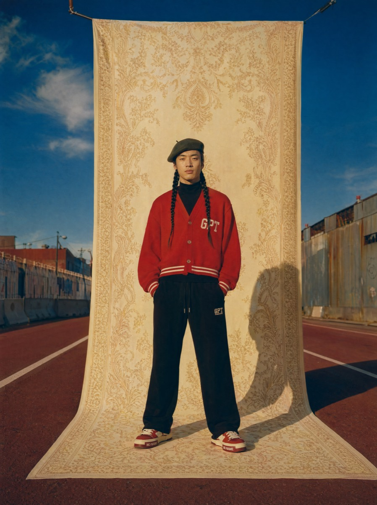

# 街头卷轴背景时尚大片

[返回完整目录](../CATALOG.md)



生成把手工卷轴摄影背景放入真实街道的时尚广告大片，以棚拍秩序和户外环境形成视觉对照。

类型：生图 · 来源案例

**商业广告** 人像摄影 创意摄影

来源：[@renaissance_soda_warm52](https://higgsfield.ai/publications/e17319aa-0fd3-4868-b158-f7f16330c8e1)

可替换内容：`[subjectDescription]` · `[backdropColor]` · `[patternDescription]` · `[outfitDescription]` · `[skyColor]` · `[heroGarmentColor]`

## 完整提示词

```text
创建一张竖版全身时尚广告摄影。人物 `{subjectDescription}` 居中站在一条空旷城市街道上，身后悬挂一张从高处垂落并铺到脚下的巨型手工卷轴布景。布景使用 `{backdropColor}` 与 `{patternDescription}`，像一个便携摄影棚被放进真实街道。

人物正面面对镜头，姿态放松自信，穿着 `{outfitDescription}`，服装无真实品牌标识。卷轴两侧仍能看到真实环境：旧仓库墙、道路标线、低矮路障和开阔天空。让深冷天空占上三分之一，暖色布景与人物占中间，街道路面和标线稳定下方结构。

采用黄金时段自然侧光，人物一侧形成柔和长影，背景略带绘画感柔焦，人物保持锐利。使用中画幅胶片质感、轻微颗粒和柔和高光过渡。配色以 `{skyColor}`、`{backdropColor}`、`{heroGarmentColor}`、黑色和一个鞋履点缀色为主。整体对称、克制、具有 1990 年代时尚杂志大片气质，重点表现“户外实景与棚拍背景并存”的空间错位。
```

## English Prompt

```text
Create a vertical full-body fashion advertising photograph. Center `{subjectDescription}` on an empty city street, with a giant handmade scroll backdrop hanging from above and extending beneath the subject's feet. Use `{backdropColor}` and `{patternDescription}` for the backdrop, as if a portable photography studio had been placed in a real street.

The subject faces the camera in a relaxed, confident pose, wearing `{outfitDescription}` without real brand marks. Keep the real setting visible on both sides of the scroll: old warehouse walls, road markings, low barriers, and open sky. Let a deep cool sky occupy the upper third, the warm backdrop and subject occupy the middle, and the street surface and markings stabilize the lower structure.

Use natural golden-hour side light, with a soft long shadow to one side of the subject. Give the background a slightly painterly soft focus while keeping the subject sharp. Use a medium-format film finish, subtle grain, and gentle highlight roll-off. Favor `{skyColor}`, `{backdropColor}`, `{heroGarmentColor}`, black, and one footwear accent color. Keep the composition symmetrical and restrained, like a 1990s fashion-magazine editorial, emphasizing the spatial dislocation of an outdoor real location coexisting with a studio backdrop.
```

[打开 style.json](../../styles/image-street-scroll-backdrop-fashion-editorial/style.json) · [打开条目目录](../../styles/image-street-scroll-backdrop-fashion-editorial/)

<!-- Generated by scripts/build.mjs. -->
