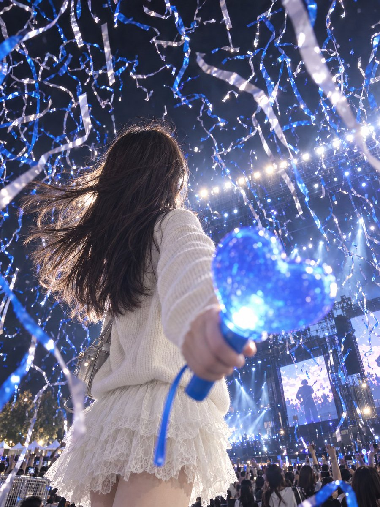

# 演唱会彩带广角氛围照

[返回完整目录](../../CATALOG.md)



用现场人物照和彩带参考照合成低机位、应援棒贴近镜头的演唱会氛围画面。

类型：生图 · 来源案例

**人像摄影** 演唱会 广角透视

来源：[数字生命卡兹克 (@Khazix0918)](https://x.com/Khazix0918/status/2104401048324743646)

可替换内容：`[图一：人物与演唱会现场照片]` · `[图二：同场演出的彩带氛围参考照]`

## 完整提示词

```text
在图一场景下，图一中的人物背对广角镜头，人物的位置偏向画面左边，右手拿着爱心形状的应援棒怼在镜头前并放大，低视角拍摄，人物不留侧脸。画面中的人物长发飘逸，要有风吹动的感觉，发丝间微发光，稍微仰视的拍摄角度，注意整体姿态有美感且协调，并且背景中要有图二的演出会彩带飘落，营造氛围感场景，让整体的光影结构和谐。
```

## English Prompt

```text
In the setting of Image 1, position the person from Image 1 with their back to a wide-angle camera, slightly to the left of the frame. Have them hold a heart-shaped light stick in their right hand very close to the lens so it appears enlarged. Shoot from a low, slightly upward-looking angle without showing the person's profile. Their long hair should flow as if blown by wind, with a subtle glow along the strands. Keep the pose graceful and coherent. Add falling concert streamers from Image 2 to the background, creating an atmospheric scene with harmonious lighting and shadows.
```

使用检查：预览来自作者原帖，不是本仓库重新复测的结果；人物照片、演出画面与第三方媒体不属于仓库 MIT 许可。

[打开 style.json](../../../styles/image/image-concert-confetti-perspective-photo/style.json) · [打开条目目录](../../../styles/image/image-concert-confetti-perspective-photo/)

<!-- Generated by scripts/build.mjs. -->
