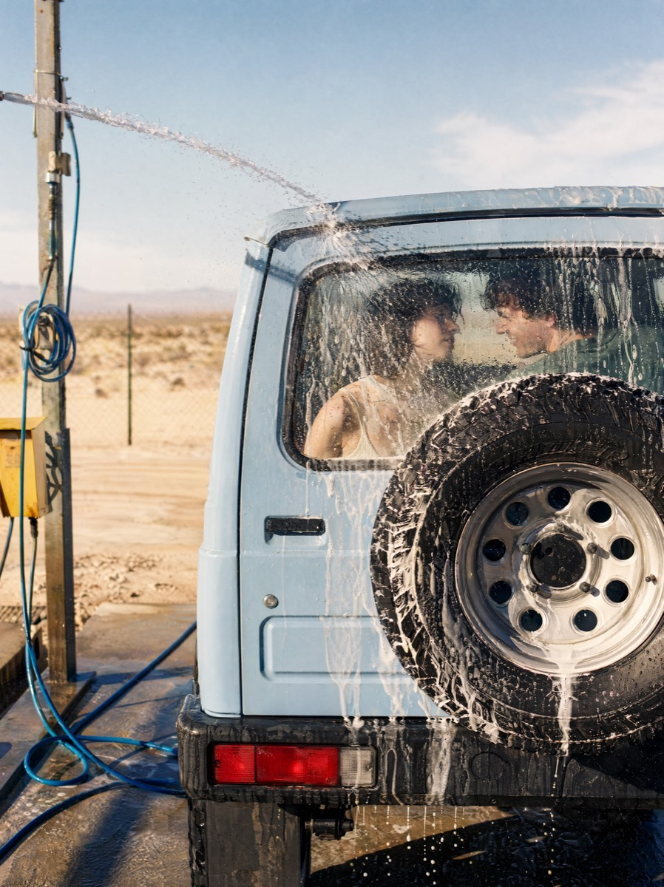

# 沙漠洗车电影感纪实摄影

[返回完整目录](../../CATALOG.md)



生成沙漠露天洗车场的电影感纪实画面，通过车尾备胎、水柱、泡沫玻璃和车内人物形成多层叙事。

类型：生图 · 来源案例

**商业广告** 人像摄影 创意摄影

来源：[@institutional_butterflying](https://higgsfield.ai/publications/bdeaf74f-4300-4ebd-9125-7df4f37d2733)

可替换内容：`[vehicleColor]` · `[relationshipDescription]`

## 完整提示词

```text
创建一张 2:3 竖版电影感纪实摄影。镜头从后侧拍摄一辆无品牌、方正的复古紧凑型越野车，地点是开阔干旱地区中的简陋露天自助洗车场。

车辆使用 `{vehicleColor}`，车尾备胎占据右侧三分之二并形成强圆形视觉锚点。高压水柱从左上角斜向击中后窗，水滴和泡沫覆盖玻璃。透过流动的湿玻璃，隐约看到车内 `{relationshipDescription}` 正在交谈或微笑，人物面部被水幕柔化和扭曲，但关系仍可读。

左侧保留沙地、低矮灌木、远处地平线、金属水管架、付款箱和盘绕水管，形成环境负空间。强烈午后阳光从左侧照射，突出每颗水滴、泡沫和车辆材质，地面被水浸湿并出现深色反射。

配色包含褪色浅色车漆、黑色轮胎、银色轮毂、白色泡沫、红色尾灯、尘土黄沙地、浅蓝天空和一处高饱和水管色。焦点落在备胎、后窗水幕和水柱，使用细腻胶片颗粒、暖高光、冷阴影和轻微水雾。画面要像偶然捕捉到的夏季公路旅行故事，不出现车标、品牌文字或摄影师模仿要求。
```

## English Prompt

```text
Create a vertical 2:3 cinematic documentary photograph. Shoot from the rear side of an unbranded, boxy vintage compact off-road vehicle at a basic open-air self-service car wash in a wide, arid landscape.

Use `{vehicleColor}` for the vehicle. The rear-mounted spare tire occupies the right two thirds and forms a strong circular visual anchor. A high-pressure water jet strikes the rear window diagonally from the upper left, with droplets and foam covering the glass. Through the flowing wet glass, faintly show `{relationshipDescription}` inside the vehicle talking or smiling. The water curtain softens and distorts their faces, but their relationship remains readable.

Leave environmental negative space on the left with sandy ground, low shrubs, a distant horizon, metal pipe framework, a payment box, and a coiled hose. Strong afternoon sunlight comes from the left, highlighting individual droplets, foam, and vehicle materials. Water darkens the ground and creates reflections.

The palette includes faded pale paint, black tires, silver wheels, white foam, red taillights, dusty yellow sand, pale blue sky, and one saturated hose accent. Focus on the spare tire, water-covered rear window, and water jet, using fine film grain, warm highlights, cool shadows, and slight spray haze. The photograph should feel like a spontaneously captured summer road-trip story, without vehicle badges, brand text, or instructions to imitate a photographer.
```

[打开 style.json](../../../styles/image/image-desert-car-wash-documentary-photo/style.json) · [打开条目目录](../../../styles/image/image-desert-car-wash-documentary-photo/)

<!-- Generated by scripts/build.mjs. -->
