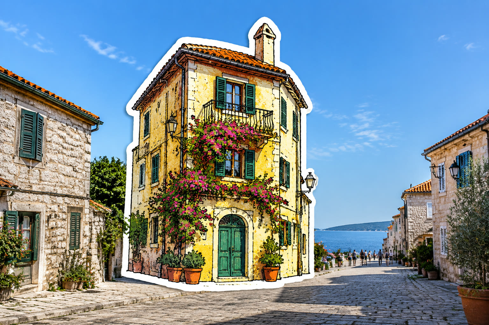

# 实景建筑原位贴纸

[返回完整目录](../../CATALOG.md)



只把照片中的核心建筑重绘成原位覆盖的白边手绘旅行贴纸，其他区域仍是实景。预览为自制示意，未做局部编辑复测。

类型：生图 · 来源案例

**旅行城市** 局部编辑 模切贴纸

来源：[数字生命卡兹克 (@Khazix0918)](https://x.com/Khazix0918/status/2104401048324743646)

可替换内容：`[一张有权使用且含突出建筑的实景照片]`

## 完整提示词

```text
在上传的实景照片中，找到最具辨识度的一座核心建筑，只处理这一处。保留它的轮廓、比例和标志性细节，重绘成手绘旅行贴纸：粗黑手绘线条、明快平涂色块、少量复古印刷纹理，以及沿外轮廓连续而宽的白色模切边。让贴纸在原位置覆盖建筑并略微放大，避免原建筑边缘外露。周围的街道、天空、人物、光线和照片质感全部保持原样；贴纸与真实环境的尺度和遮挡关系自然。不添加文字，也不要把整张照片插画化。
```

## English Prompt

```text
In the uploaded real-world photograph, identify the single most recognizable landmark building and edit only that area. Preserve its silhouette, proportions and defining details while redrawing it as a hand-drawn travel sticker: thick black ink contours, bright flat-color fills, a little vintage print texture and one continuous broad white die-cut border. Overlay the sticker exactly where the building stood and enlarge it slightly so no original building edges remain visible. Keep the surrounding street, sky, people, lighting and photographic texture unchanged; integrate the sticker's scale and occlusion naturally. Add no text and do not turn the whole photograph into an illustration.
```

[打开 style.json](../../../styles/image/image-inplace-landmark-travel-sticker/style.json) · [打开条目目录](../../../styles/image/image-inplace-landmark-travel-sticker/)

<!-- Generated by scripts/build.mjs. -->
