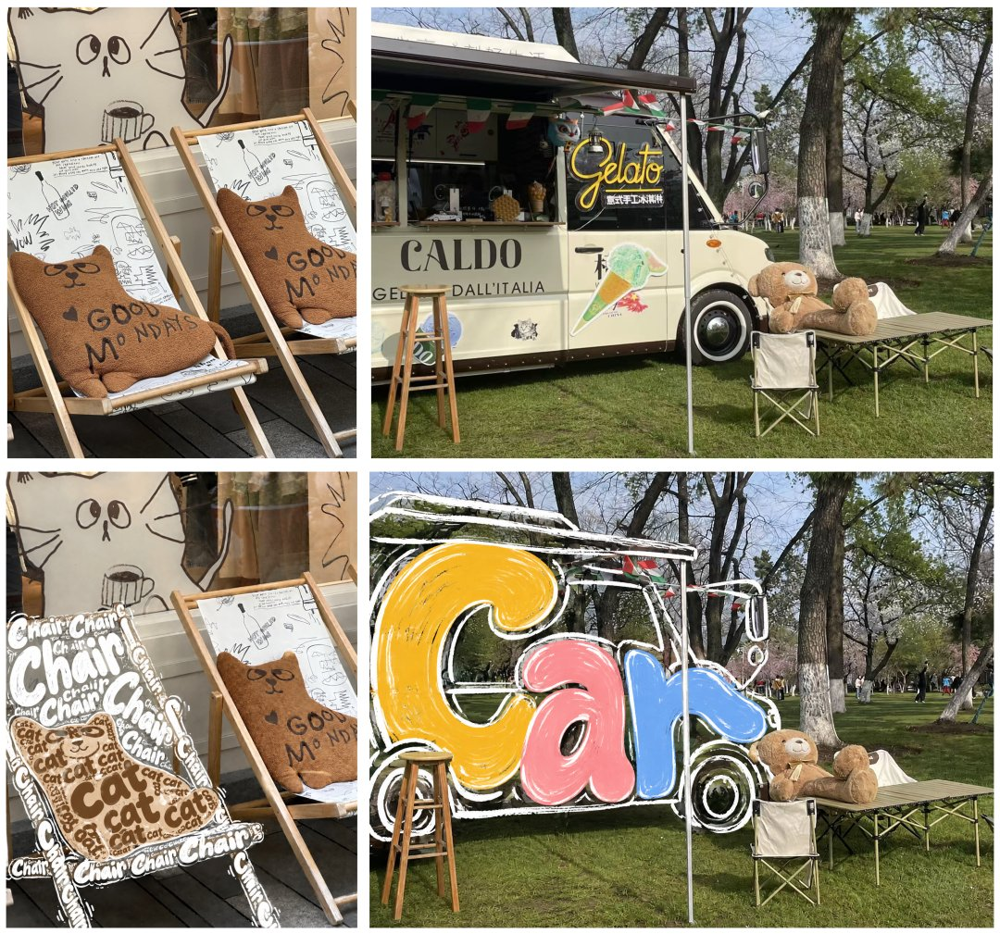

# 物体文字涂鸦原位替换

[返回完整目录](../../CATALOG.md)



只把照片中的椅子和玩偶转成由 Chair、Cat 单词笔画组成的手绘涂鸦。

类型：生图 · 来源案例

**社交媒体** 文字涂鸦 局部编辑

来源：[数字生命卡兹克 (@Khazix0918)](https://x.com/Khazix0918/status/2104401048324743646)

可替换内容：`[一张包含椅子与椅上玩偶的照片]`

## 完整提示词

```text
只修改图中「第一把椅子及其放在椅子上的玩偶」，将这个「椅子」变成由「Chair」这个英文单词构成的彩色（用一种颜色：白色）手绘文字涂鸦，将「椅子上的玩偶」变成由「Cat」这个英文单词构成的彩色（用一种颜色：棕色）手绘文字涂鸦，并且这些文字涂鸦要有质感一些。文字自上而下排列，笔画大胆拉伸、弯曲、嵌合。采用圆润粗笔画、略带抖动的白色描线对整体以及一些空缺的地方进行勾勒补充，文字与描线之间保持透明镂空，除了文字以外，不得出现其他带颜色的色块笔画。让文字本身配合白色手绘描线构成「椅子和玩偶」，而不是在椅子和玩偶上贴字，整体呈现ins风。
```

## English Prompt

```text
Modify only the first chair in the image and the plush toy sitting on it. Transform the chair into hand-drawn typographic doodles made from the English word 'Chair', using a single white color; transform the plush toy into doodles made from the word 'Cat', using a single brown color. Give the lettering a tactile quality. Arrange the words from top to bottom, stretching, bending and interlocking the strokes boldly. Use thick rounded strokes and slightly shaky white outlines to complete the contours and fill small gaps. Leave the areas between letters and outlines transparent; introduce no other colored blocks or marks beyond the lettering. The words and white outlines themselves must form the chair and toy, rather than looking like text pasted onto them. Aim for an Instagram-style hand-drawn finish.
```

使用检查：原文第二组车身涂鸦另有示例，但没有独立的完整提示词；本条仅保留椅子和玩偶的原文，不将车身效果冒充同一提示词验证。

[打开 style.json](../../../styles/image/image-object-word-doodle-overlay/style.json) · [打开条目目录](../../../styles/image/image-object-word-doodle-overlay/)

<!-- Generated by scripts/build.mjs. -->
