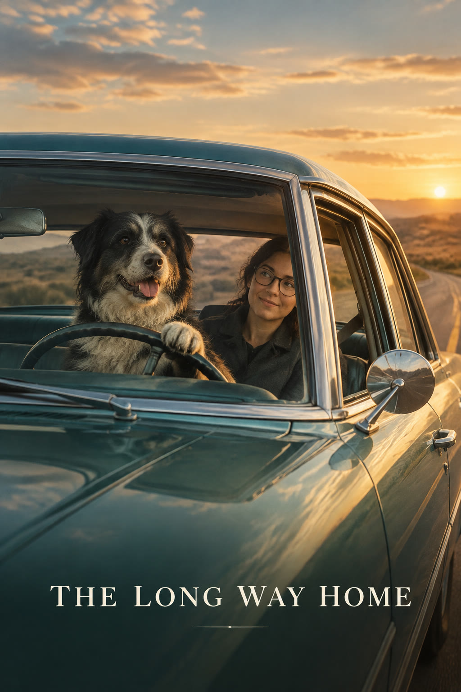

# 宠物驾车电影海报换角

[返回完整目录](../../CATALOG.md)



把电影海报中的驾驶员替换为宠物、乘客替换为指定人物。预览为原创示意，未按三图输入复测。

类型：生图 · 来源案例

**海报设计** 宠物换角 照片合成

来源：[数字生命卡兹克 (@Khazix0918)](https://x.com/Khazix0918/status/2104401048324743646)

可替换内容：`[图一：有权使用的双人驾车海报底图]` · `[图二：小狗照片]` · `[图三：人物角色照片]`

## 完整提示词

```text
仅将图一左侧人物替换为图二中的「小狗」，让「小狗」坐在驾驶位开车，右侧人物包括服装则替换为图三中的「角色」。
```

## English Prompt

```text
Replace only the person on the left in Image 1 with the dog from Image 2, seating the dog in the driver's position as if it is driving. Replace the person on the right, including their clothing, with the character from Image 3.
```

使用检查：使用前须提供有权编辑的双人驾车海报和角色照片。预览由独立文字生图展示视觉方向，没有用原文三张图片完成换角复测；不使用《绿皮书》原海报或演员肖像。

[打开 style.json](../../../styles/image/image-pet-driver-movie-poster-swap/style.json) · [打开条目目录](../../../styles/image/image-pet-driver-movie-poster-swap/)

<!-- Generated by scripts/build.mjs. -->
