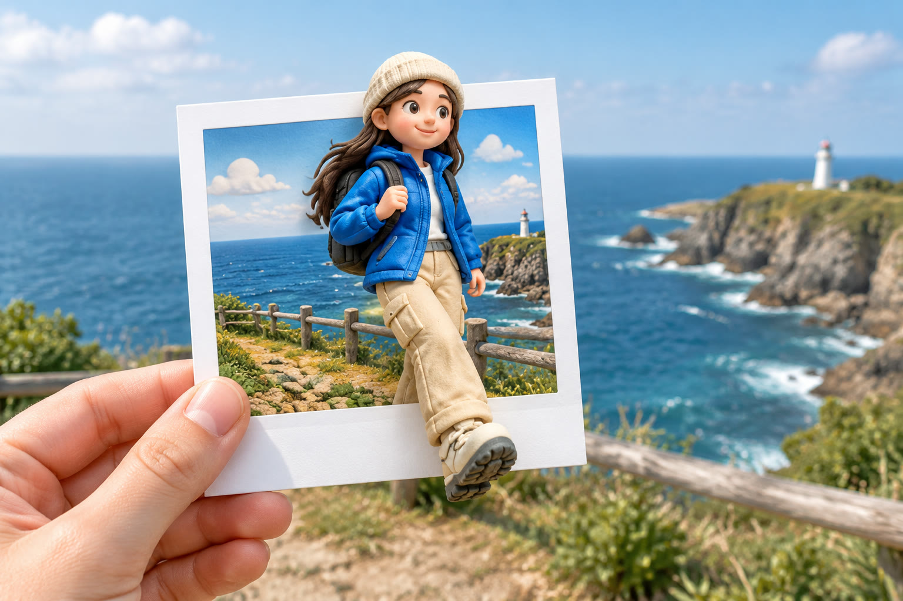

# 拍立得公仔旅行打卡

[返回完整目录](../../CATALOG.md)



将旅行合照中的人物变成突破拍立得相纸边框的 Q 版黏土公仔。预览为自制示意，未用原帖照片编辑复测。

类型：生图 · 来源案例

**旅行城市** 3D公仔 照片合成

来源：[数字生命卡兹克 (@Khazix0918)](https://x.com/Khazix0918/status/2104401048324743646)

可替换内容：`[一张有权使用的人物与景点合照]`

## 完整提示词

```text
根据上传的旅行照片，将其中的人物转化为整体约 1:4 身高比例的全身 3D Q 版黏土公仔，保持可辨识的发型、服装与气质。把公仔放在一张由真实手部持握的拍立得相纸中，呈现公仔从相纸画面突破边框、延伸进入现实空间的效果。相纸中的景点背景与原照片保持同一场景和空间关系，但转绘成 Q 版黏土风格，不要再出现第二个人物。相纸外的现实景色与相纸内的风景自然衔接；手部、纸张厚度、透视、光照与遮挡关系可信。不要品牌标识、额外文字或水印。
```

## English Prompt

```text
Using the uploaded travel photograph, turn its person into a recognizable full-body 3D chibi clay figurine at roughly one-quarter realistic human height. Preserve identifiable hair, clothing and character. Place the figurine inside an instant-film print held by a realistic hand, with the figure breaking through the print border into the real foreground. Continue the original location inside the print as a coherent chibi clay rendition of the same background, without another person. Connect the real scenery outside the print to the scenery inside it naturally; make the hand, paper thickness, perspective, lighting and occlusion believable. No brand marks, extra text or watermark.
```

[打开 style.json](../../../styles/image/image-polaroid-clay-travel-portrait/style.json) · [打开条目目录](../../../styles/image/image-polaroid-clay-travel-portrait/)

<!-- Generated by scripts/build.mjs. -->
