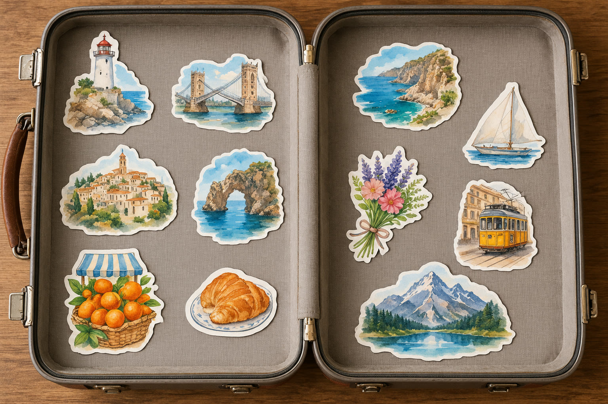

# 旅行碎片行李箱贴纸

[返回完整目录](../../CATALOG.md)



从多张旅行照片提取建筑、风景和美食，转成铺满展开行李箱内衬的水彩贴纸。预览为自制示意，未按十二图输入复测。

类型：生图 · 来源案例

**旅行城市** 多图拼贴 水彩贴纸

来源：[数字生命卡兹克 (@Khazix0918)](https://x.com/Khazix0918/status/2104401048324743646)

可替换内容：`[图一：有权使用的空行李箱展开俯视图]` · `[图二至图十二：同一段旅程的 11 张有权使用的照片]`

## 完整提示词

```text
图一是空行李箱展开的俯视底图；图二至图十二是 11 张同一段旅程的照片。只提取后面照片中有辨识度的建筑、风景、美食等代表性主体，将各主体转绘成带白色模切边的水彩旅行贴纸。把这 11 张贴纸大小错落地贴在行李箱上下两面的内衬上，重点主体放大，其余自然穿插，排列紧凑而有适当间隙。所有贴纸都不越出内衬，不跨过铰链；保留行李箱原有的材质、五金、轮廓与打开方式。呈现真实纸质贴纸的平面拼贴质感，不直接粘贴矩形照片，不变成悬浮物或立体模型。不添加品牌标识和水印。
```

## English Prompt

```text
Image 1 is a top-down view of an open, empty suitcase; Images 2 through 12 are eleven photographs from the same trip. Extract recognizable buildings, landscapes, foods and other representative subjects from the travel photos, and redraw each subject as a watercolor travel sticker with a white die-cut edge. Arrange all eleven stickers at varied sizes across the lining on both halves of the suitcase, enlarging the most important subjects and interleaving the rest with compact but readable spacing. Do not let any sticker leave the lining or cross the hinge. Preserve the suitcase's material, hardware, silhouette and open structure. The result should look like flat physical paper stickers applied to the lining, not pasted rectangular photos, floating objects or a 3D model. No branding or watermark.
```

[打开 style.json](../../../styles/image/image-travel-memory-suitcase-stickers/style.json) · [打开条目目录](../../../styles/image/image-travel-memory-suitcase-stickers/)

<!-- Generated by scripts/build.mjs. -->
