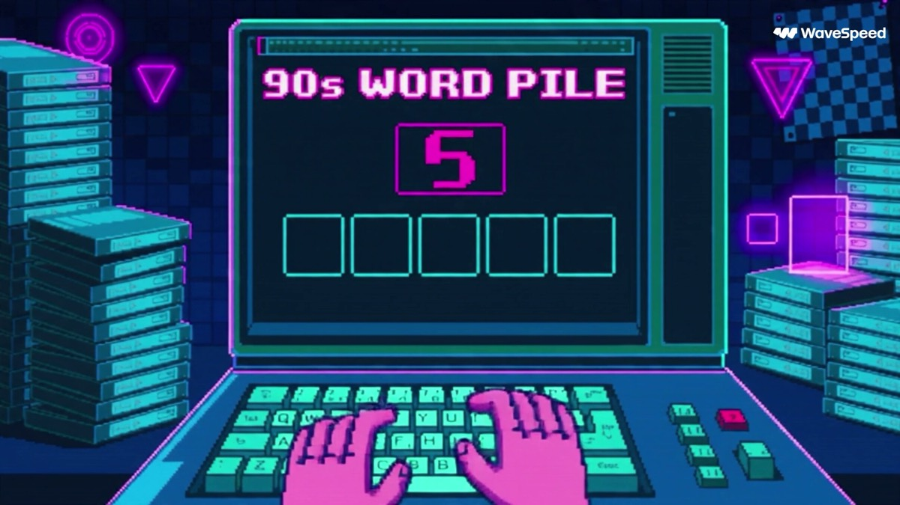

# 90年代像素文字游戏

[返回完整目录](../CATALOG.md)



[播放样片（在线播放器）](https://dingle-kb.github.io/awesome-visual-prompts/?style=video-1990s-pixel-text-game)

用 CRT 像素界面、逐字翻牌和连续挑战节奏制作复古文字游戏概念短片。

类型：生视频 · 来源案例 · 动画

来源：[@BMX / YouMind](https://x.com/bmx_ai13/status/2101593507232387096)

## 完整提示词

```text
30 秒像素风 90 年代复古文字游戏概念

0–3 秒——开场钩子
黑色 CRT 屏幕，静电闪烁。霓虹粉色和紫色的像素图形突然启动。
大而厚重的像素文字显示：
“CAN YOU GUESS THE 90s?”
出现一道五字母谜题。
第一次猜测：MUSIC。
方块快速翻转：⬛ 🟨 🟩 ⬛ 🟩。
播放复古街机“哔哔轰”的音效。

3–8 秒——快速玩法
玩家在厚重的像素键盘上迅速输入另一个单词。
每个字母方块翻转时都发出令人满足的街机音效。
猜对的字母爆开成亮绿色像素；猜错的字母抖动并发生故障闪烁。
顶部界面显示：
STREAK ×7
LEVEL 12
XP +50
背景像一间 1990 年代街机卧室：CRT 辉光、卡带、软盘、棋盘格图案和霓虹几何形状。

8–13 秒——90 年代单词挑战
屏幕故障闪烁后显示“90s WORD PILE”。
单词快速闪现：VHS、DISCO、RADIO、PIXEL、ARCADE。
接着出现一个新的神秘单词：_ _ _ _ _。
倒计时：10… 9… 8…。
玩家开始快速输入。

13–18 秒——险些失败
猜测：GAMES。
只有两个字母变绿。
计时器显示：3… 2…。
屏幕开始闪红。
玩家在最后一秒改动一个字母。
显示 GAME?，最后一个字母落下。

18–22 秒——高潮反馈
五个方块依次全部翻成绿色：P — I — X — E — L。
发生巨大的像素爆炸，CRT 屏幕震动，复古彩纸屑充满屏幕。
文字显示：PERFECT!、STREAK ×8、+250 XP。

22–27 秒——成长钩子
快速玩法蒙太奇：解锁一套新的霓虹主题；弹出“90s KID”徽章；职业地图从 LEVEL 12 前进到 LEVEL 13；再解锁名为 MALL NIGHT 的主题。所有画面转为青色、品红色和紫色霓虹。

27–30 秒——重玩钩子
一道全新谜题立刻出现：_ _ _ _ _。
小字显示：“ONE MORE WORD?”，光标开始闪烁。
随后显示 PRESS START，切到 CRT 静电画面。

视觉方向
做成真正的复古像素游戏画面，不要写实 3D，也不要皮克斯风格。使用低分辨率像素图形、受 8 位与 16 位游戏启发的厚重字体、霓虹青色/品红/紫色/绿色配色、CRT 扫描线、VHS 故障效果、棋盘格图案、街机界面、像素粒子、方块翻转动画和老派音效。

视频应像一款失落的 1990 年代街机文字游戏为现代手机玩法重新制作：节奏快、反馈爽快且容易让人沉迷。

不要照片级写实、3D 冒险角色、电影式环境、动漫风、现代光滑界面或写实的虚幻引擎视觉效果。

最佳开场钩子：“CAN YOU GUESS THE 90s?”
```

## English Prompt

```text
30 Second Pixel 90s Retro Word Game Concept

0–3 sec — Hook
Black CRT screen. Static flicker. Suddenly neon pink/purple pixel graphics boot up.
Big chunky pixel text:

“CAN YOU GUESS THE 90s?”

A 5-letter puzzle appears.

First guess: MUSIC
Tiles rapidly flip — ⬛ 🟨 🟩 ⬛ 🟩

Retro arcade beep-beep-boom sound.
3–8 sec — Fast Gameplay
Player quickly types another word using a chunky pixel keyboard.

Each letter tile flips with satisfying arcade sounds.

Correct letters explode into bright green pixels.
Wrong letters shake and glitch.

Top UI:

STREAK ×7
 LEVEL 12
 XP +50

Background feels like a 1990s arcade bedroom: CRT glow, cassette tapes, floppy disks, checkerboard patterns and neon geometric shapes.

8–13 sec — 90s Word Challenge
Screen glitches into:

“90s WORD PILE”
Words flash quickly:
VHS
 DISCO
 RADIO
 PIXEL
 ARCADE

Then a new mystery word appears:

_ _ _ _ _
Countdown:

10… 9… 8…

Player starts typing fast.

13–18 sec — Almost Fail
Guess:
GAMES
Only two letters turn green.
Timer:
3… 2…

Screen begins flashing red.

The player changes one letter at the last second.

GAME?

Final letter drops in.

18–22 sec — BIG PAYOFF
All five tiles flip GREEN one after another.

P — I — X — E — L
Huge pixel explosion.

CRT screen shakes.

Retro confetti fills the screen.

Text:

PERFECT!

STREAK ×8

+250 XP

22–27 sec — Progression Hook
Rapid gameplay montage:

Unlock a new neon theme.

Badge pops:
“90s KID”

Career map advances:

LEVEL 12 → LEVEL 13

Another theme unlocks:

MALL NIGHT

Everything changes to cyan, magenta and purple neon.

27–30 sec — Replay Hook
A brand-new puzzle instantly appears.

_ _ _ _ _

Small text:

“ONE MORE WORD?”
Cursor starts blinking.

Then:
PRESS START
Cut to CRT static.
Visual direction

Make it true retro pixel-game footage, not realistic 3D and not Pixar. Use low-resolution pixel graphics, chunky 8/16-bit-inspired typography, neon cyan/magenta/purple/green palettes, CRT scanlines, VHS-style glitches, checkerboard patterns, arcade UI, pixel particles, tile-flip animations and old-school sound effects.

The video should feel like a lost 1990s arcade word game rebuilt for modern mobile gameplay—fast, satisfying and addictive.

No photorealism, no 3D adventure character, no cinematic environments, no anime, no modern glossy UI, no realistic Unreal Engine visuals.

Best opening hook:
 “CAN YOU GUESS THE 90s?”
```

[打开 style.json](../../styles/video-1990s-pixel-text-game/style.json) · [打开条目目录](../../styles/video-1990s-pixel-text-game/)

<!-- Generated by scripts/build.mjs. -->
