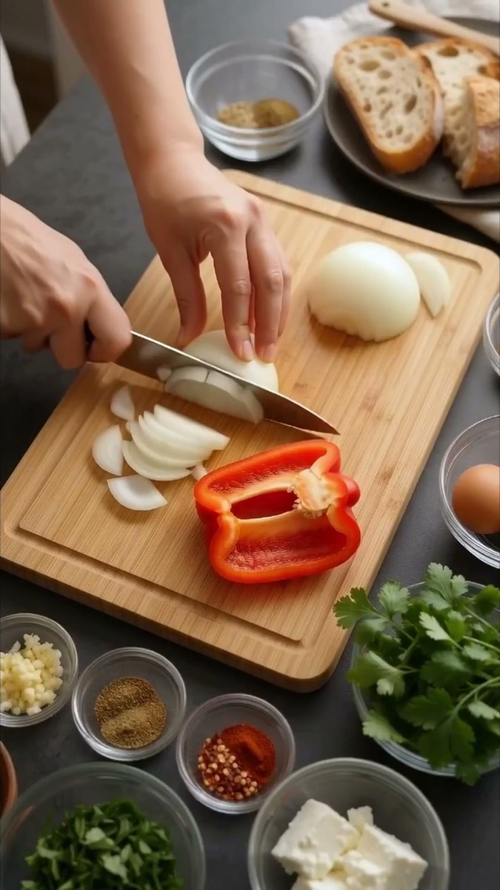

# 食谱信息图转连续烹饪短片

[返回完整目录](../CATALOG.md)



[播放样片](../../styles/video-recipe-infographic-cooking-sequence-source/sample.mp4)

以一张多步骤食谱信息图为视觉分镜，先生成前半段，再续写后半段，得到保持食材状态、厨房环境、声效和烹饪顺序连续的竖屏美食短片。

类型：生视频 · 来源案例 · 烹饪

来源：[Oleksa AI（X：`@OleksaFrame`）。](https://x.com/OleksaFrame/status/2097669808800113040)

## 完整 Prompt

```text
阶段一：首段 10 秒

MODEL: Gemini Omni 1.1 Flash

SHOT STRUCTURE: 5 shots, 10 seconds, vertical 9:16, exactly as listed.

REFS:

@Image1 = visual storyboard reference. It controls the cooking order, black cast-iron skillet, ingredients, finished-dish styling, dark surfaces, and soft window-lit food photography. Convert its picture panels into fresh full-frame live-action cooking shots.

VISUAL CONTENT LOCK:

Every frame contains only food, cookware, ingredients, natural hands, and kitchen surfaces. Live-action cooking imagery fills the entire 9:16 frame. All surfaces remain clean and unlettered. The source poster’s typography, grid, headings, step numbers, captions, logos, and graphic elements remain reference metadata outside the generated video.

AUDIO CONTENT LOCK:

The soundtrack consists exclusively of synchronized cooking sounds and quiet kitchen room tone. Close dry chopping, oil pouring, pan sizzling, wooden-spoon movement, vegetables landing, tomato pouring, bubbling sauce, and soft steam. Spoken voices, narration, vocals, and music remain outside the soundtrack.

GLOBAL LOOK:

70mm large-format film aesthetic, fine organic grain, broad dynamic range, deep food detail, soft highlight roll-off, restrained anamorphic character. Vertical 9:16 composition with the food, cookware, and hands inside the central safe area. Soft diffused daylight enters from camera-left through a white curtain; pale stone counters return gentle fill. Saturated tomato red contrasts with black cast iron and warm neutral kitchen surfaces. Preserve realistic steam, oil flow, translucent onion, red-pepper texture, spice granules, sauce bubbles, and natural hand movement.

SHOT 1 (0–1.5s) — Finished-dish hook

camera: three-quarter close hero view, quick smooth push toward the skillet.

action_visual: finished shakshuka bubbles gently beside crusty bread; steam crosses the soft window light.

sound: close bubbling sauce and faint skillet sizzle.

exit: the circular skillet rim fills the frame.

(MATCH CUT TO)

SHOT 2 (1.5–3.5s) — Prepare ingredients

camera: locked overhead medium shot.

action_visual: hands finish dicing onion and slicing red pepper, then arrange minced garlic, spices, tomatoes, eggs, feta, and herbs in small bowls.

sound: clean knife rhythm, cutting-board taps, bowls touching the stone counter.

exit: one hand lifts an olive-oil bottle.

(CUTTING ON ACTION TO)

SHOT 3 (3.5–5.5s) — Heat oil and sauté onion

camera: macro three-quarter insert shifting into an overhead close shot.

action_visual: golden olive oil pours into the black skillet; diced onion follows immediately and a wooden spoon stirs through the rising sizzle.

sound: smooth oil pour followed by a sharp fresh sizzle and dry wooden scraping.

exit: the spoon sweeps screen-right.

(MATCH ON MOVEMENT TO)

SHOT 4 (5.5–7.5s) — Add pepper, garlic, and spices

camera: overhead close shot with a subtle push-in.

action_visual: red pepper strips fall into the softened onion, followed by minced garlic, cumin, smoked paprika, and chili flakes. The spoon folds everything together in one continuous action.

sound: vegetables landing, brighter pan sizzle, granular spices brushing the skillet.

exit: paprika-red oil spreads beneath the spoon.

(CUT TO)

SHOT 5 (7.5–10s) — Add tomatoes and simmer

camera: low three-quarter close view, short dolly back.

action_visual: crushed tomatoes pour into the skillet. A clean cooking-time jump reveals the sauce bubbling, reducing, and becoming visibly thicker.

sound: dense tomato pour transitioning into wet clustered bubbling.

exit: the thick bubbling red surface fills the final frame; bubbling continues across the extension.

阶段二：续写 10 秒

MODEL: Gemini Omni 1.1 Flash

REFS:

@Video1 = the first 10-second video being extended. It sets the exact starting frame, skillet position, reduced sauce level, kitchen surfaces, lighting direction, color grade, camera character, and cooking-sound palette.

SHOT STRUCTURE: 5 new shots, 10 seconds, vertical 9:16, exactly as listed.

CONTINUITY:

Begin directly from the final bubbling-sauce frame of @Video1. Continue in the same skillet, kitchen, soft window light, color grade, screen direction, and large-format film aesthetic. Preserve the reduced sauce level and every visible ingredient state.

VISUAL CONTENT LOCK:

Every frame contains only the cooking process, food, cookware, natural hands, and kitchen surfaces. Live-action imagery fills the entire 9:16 frame. All surfaces remain clean and unlettered. Captions, titles, step numbers, logos, watermarks, graphic overlays, interface elements, and the source poster grid remain outside the generated video.

AUDIO CONTENT LOCK:

The soundtrack consists exclusively of synchronized kitchen foley and quiet room tone. Sauce bubbling, spoon pressure, eggshell cracking, lid contact, escaping steam, feta crumbling, herbs falling, bread touching the counter, and gentle skillet sizzling. Spoken voices, narration, vocals, and music remain outside the soundtrack.

SHOT 1 (0–2s) — Make the wells

camera: pull back from the bubbling surface into a locked overhead close shot.

action_visual: the thick sauce settles slightly and a wooden spoon presses four evenly spaced wells into it.

sound: wet spoon movement through dense sauce with soft bubbling underneath.

exit: the final well forms at frame center.

(MATCH CUT TO)

SHOT 2 (2–4s) — Crack in the eggs

camera: macro three-quarter insert with a gentle push-in.

action_visual: one egg cracks into the center well; three rapid cut-on-action beats place eggs into the remaining wells. Every yolk remains whole.

sound: four distinct eggshell cracks, soft egg contact with the sauce, steady skillet sizzle.

exit: the final shell lifts as a glass lid descends.

(CUTTING ON ACTION TO)

SHOT 3 (4–6s) — Cover and check

camera: medium three-quarter view shifting overhead as the lid lifts.

action_visual: the glass lid seats on the skillet and condensation spreads across it. A concise cooking-time jump reveals set whites and glossy soft yolks as the lid rises.

sound: soft glass-and-iron clink, muted simmer beneath the lid, then a brief rush of escaping steam.

exit: released steam fills the bright upper frame.

(WHIP THROUGH LIGHT TO)

SHOT 4 (6–8s) — Finish and serve

camera: overhead macro moving into a low lateral slide.

action_visual: fingertips scatter creamy feta between the yolks, fresh herbs fall across the sauce, and a hand places warm crusty bread beside the skillet in one flowing finishing action.

sound: dry feta crumble, delicate herb rustle, bread making soft contact with the stone counter.

exit: the lateral camera slide reveals the complete skillet.

(CONTINUOUS — NO CUT)

SHOT 5 (8–10s) — Final dish

camera: settle into a three-quarter hero composition and hold with a nearly imperceptible push-in.

action_visual: finished shakshuka bubbles softly; steam curls through the window light, golden yolks remain intact, feta and herbs stay naturally scattered, and crusty bread frames the skillet.

sound: gentle sauce bubbling, faint skillet sizzle, quiet kitchen room tone fading naturally at the final frame.
```

[查看关联 Prompt](../copy-prompts/video-recipe-infographic-cooking-sequence.md)

[打开 style.json](../../styles/video-recipe-infographic-cooking-sequence-source/style.json) · [打开条目目录](../../styles/video-recipe-infographic-cooking-sequence-source/)

<!-- Generated by scripts/build.mjs. -->
