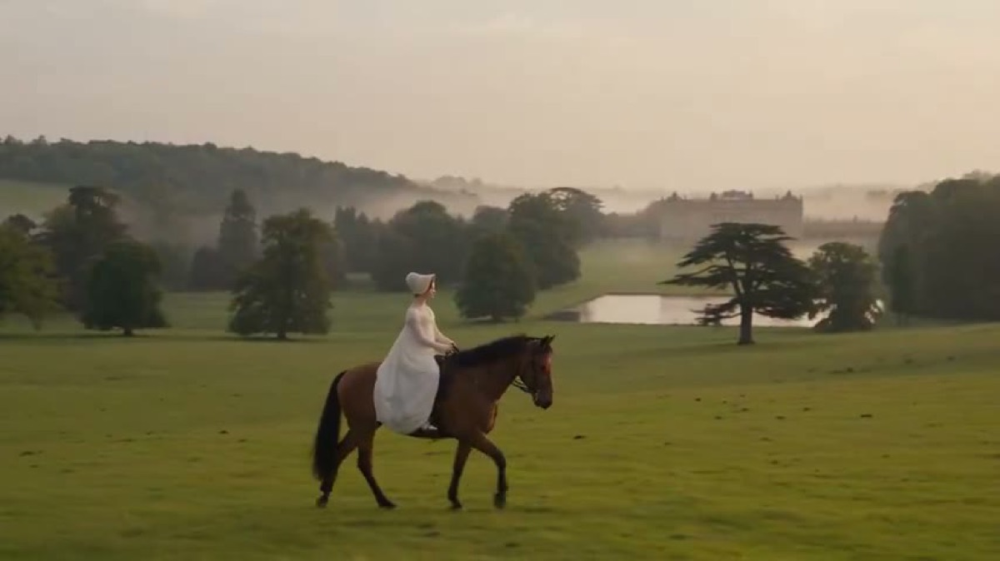

# 摄政时期电影蒙太奇

[返回完整目录](../CATALOG.md)



[播放样片（在线播放器）](https://dingle-kb.github.io/awesome-visual-prompts/?style=video-regency-film-montage)

通过服饰、场景与光线连续性制作摄政时期人物蒙太奇。

类型：生视频 · 来源案例 · 电影感

来源：[@anj / YouMind](https://x.com/anjmaxx/status/2102052600426504362)

## 完整提示词

```text
创作一段 25 秒、超照片级写实的电影感时代蒙太奇，背景设在约 1811–1812 年的英格兰，即乔治王朝晚期至摄政时代早期。整体呈现高水准英国时代电影的质感：自然的 35mm 胶片肌理、细微颗粒与光晕、真实的皮肤、织物、水、植物和马匹运动物理效果、柔和的空气层次、克制的镜头运动、优雅构图、低饱和暖色调，以及真正可信的历史细节。

人物锁定——全片同一位女性：一名极其美丽的二十多岁英国女性，面部为精致的椭圆形，鼻梁端正笔直，颧骨微高，下颌线柔和清晰，嘴唇自然红润；浅色偏暖的皮肤透亮但保留真实纹理。她有富于表现力的杏仁形深榛棕色眼睛、柔和弧度的深色眉毛；浓郁的深栗棕色微卷头发挽成低位摄政时代发髻，留有几缕松散发丝。神情平静、聪慧、略带怅惘。每个镜头都穿完全相同的象牙白色飘逸摄政时代帝国腰线长裙：轻薄的棉布或棉丝混纺、端庄的领口、贴合的长袖、精细的植物刺绣、细蕾丝滚边、低调的象牙色丝带和自然的布料褶皱；户外佩戴同一顶蕾丝镶边软帽。绝不改变她的脸、头发、长裙、配饰或身材比例。

镜头顺序

0–2 秒——开场：巨大的垂柳框住金色黎明中被薄雾覆盖的观赏湖。女子穿白裙站在湖畔；远处的石桥消失在雾中，鸭子从湖面滑过。镜头缓缓穿过垂下的柳枝向前移动，露出她微微转身望向发光景观的身影。

2–4 秒：她走过古老的石桥，长裙随微风自然摆动。平滑的后退跟拍揭示水面、垂柳和远方的庄园花园。

4–6 秒：她走近一扇风化的拱形石门，门上攀着淡粉色玫瑰。她轻轻推开陈旧的绿色木门，进入一座规整的乔治王朝花园。转场时玫瑰叶自然遮住镜头。

6–8 秒：睡莲池旁，她跪下用两根手指触碰水面。真实的同心涟漪扭曲她的倒影。镜头贴近水面，使用亲密的浅焦点。

8–10 秒：一匹栗色马站在古老橡树下等候。她轻抚马颈，自然地上马，安稳地侧坐。镜头围绕马与骑手缓慢、优雅地弧形移动。

10–12 秒：宽阔的横向跟拍，她缓缓骑马穿过辽阔的英格兰园林：起伏的绿丘、古树、观赏湖，远处一栋宏伟的蜜色乔治王朝乡间宅邸。她的白裙和软帽丝带随风自然摆动。

12–14 秒：她穿过繁茂的野花草甸，手指掠过高草，摘下一朵花，微微一笑。镜头轻柔地环绕。

14–16 秒：环绕镜头揭示辽阔草坪对面宏伟而对称的乔治王朝庄园，成熟的树木将其框住。她停下脚步望向庄园。

16–18 秒：安静的视觉停顿：乔治王朝宅邸倒映在湖中，鸭子从前景游过，轻轻打碎倒影；柳枝在画面边缘摇动。镜头以几乎无法察觉的幅度推进。

18–21 秒：让湖面倒影匹配转场到庄园内部一架符合历史年代的乔治王朝三角钢琴的抛光木面。女子依然穿完全相同的长裙，在俯瞰同一湖泊与垂柳的高大上下推拉窗旁轻柔弹琴。镜头从她肩后向侧脸缓慢斜向移动。

21–23 秒：特写她自然弹奏象牙琴键的双手，呈现袖子的运动、抛光木面的反射和细微的烛火跳动。焦点从琴键移到手指，再移到柔和虚化的脸。

23–25 秒：镜头缓缓从会客厅后退，移向高窗，揭示弹琴的女子，以及窗外同一片湖、垂柳和石桥。最后一个琴音渐弱，画面轻轻切黑。

环境：构建一处地理关系连贯、优美的英格兰乔治王朝庄园，包括大型倒影观赏湖、巨大的垂柳、睡莲、芦苇、旧石桥、玫瑰覆盖的石砌花园入口、修剪整齐的树篱、砾石小径、淡粉色玫瑰、毛地黄、薰衣草、蕨类、野花草甸、古老橡树、起伏的园林，以及一座具有上下推拉窗和古典细节的宏伟对称蜜色乔治王朝乡间宅邸。室内包括奶油色灰泥墙、深胡桃木、高大的上下推拉窗、大理石壁炉、植物绘画、瓷器、蜡烛和抛光的乔治王朝三角钢琴。

光线、色彩与物理效果：只用自然的英格兰阳光，包括柔和的金色黎明、温和的午后日光、温暖的傍晚高光；室内使用真实窗光与少量烛光。奶油白、低饱和鼠尾草绿、苔绿、陈旧石色、灰粉、暖金，以及柔和的蓝灰阴影。绿色略微去饱和，不用青橙调色。反射、阴影、水纹、马匹运动、衣料运动、植物、薄雾和烛火都应符合物理规律。

镜头与剪辑：只用有动机的电影镜头运动，包括缓慢轨道推拉、横向跟拍、轻柔弧形运动、克制的推近、贴近水面的视角，以及以前景遮挡的转场。沿动作剪切，用倒影、枝叶和匹配的动作形成视觉节奏。广阔的风景镜头与亲密细节交替出现，让蒙太奇像一段连续回忆，而不是彼此无关的美丽画面。

声音：自然的英格兰乡村环境音，包括鸟鸣、风吹柳叶、水声、鸭子、马的呼吸、马蹄声、砾石声和花园声响。使用极简、受时代启发的室内乐，以细腻弦乐和钢琴为主；室内自然过渡到女子实际弹奏的钢琴声。不要对白、旁白或字幕。

排除项：现代物件、服装、发型、妆容或建筑；维多利亚或爱德华时代风格、奇幻城堡、现代婚纱、合成面料、CGI 感植物、假水、不可能的倒影、畸形的手或马、过强辉光、过饱和、青橙调色、美颜滤镜皮肤、随意的镜头运动、服装或人物改变，以及不连贯的地点。

16:9、25 秒、照片级写实、电影感、宁静、惊奇、浪漫、符合历史；全片严格保持人物、服装和色彩风格一致。
```

## English Prompt

```text
Create a 25-second ultra-photorealistic cinematic period montage set in England around 1811–1812, late Georgian / early Regency era. Make it feel like prestigious British period cinema: natural 35mm film texture, subtle grain and halation, realistic skin, fabric, water, foliage and horse physics, soft atmospheric depth, restrained camera movement, elegant compositions, muted warm color grading and genuine historical realism.

CHARACTER LOCK — SAME WOMAN THROUGHOUT: exceptionally beautiful English woman in her mid-20s, delicate oval face, refined straight nose, subtle high cheekbones, softly defined jaw, naturally rosy lips, luminous fair warm skin with realistic texture, expressive almond-shaped dark hazel-brown eyes, softly arched dark eyebrows, rich dark chestnut-brown softly wavy hair in a low Regency chignon with loose tendrils. Calm, intelligent, slightly wistful expression. She wears exactly the same ivory-white flowing Regency Empire-waist gown in every shot: lightweight muslin/cotton-silk, modest neckline, long fitted sleeves, delicate botanical embroidery, fine lace edging, subtle ivory ribbons and natural fabric folds; identical lace-trimmed bonnet outdoors. Never change her face, hair, gown, accessories or proportions.

SHOT SEQUENCE

0–2s — HOOK:

A huge weeping willow frames a mist-covered ornamental lake at golden dawn. The woman stands beside the water in her white gown; a distant stone bridge disappears into haze, ducks glide across the lake. Slow dolly through hanging willow branches reveals her as she turns slightly toward the glowing landscape.

2–4s:

She walks across the old stone bridge, gown moving naturally in the breeze. Smooth backward tracking shot reveals water, willows and distant estate gardens.

4–6s:

She approaches a weathered arched stone doorway covered in pale pink climbing roses, gently opens the aged green wooden door and enters a formal Georgian garden. Rose leaves naturally obscure the lens during the transition.

6–8s:

Beside a lily-pad pond, she kneels and touches the water with two fingers. Realistic concentric ripples distort her reflection. Low waterline camera, intimate shallow focus.

8–10s:

A chestnut horse waits beneath an ancient oak. She gently touches its neck, mounts naturally and settles sidesaddle. Slow elegant camera arc around horse and rider.

10–12s:

Wide lateral tracking shot as she rides slowly across enormous English parkland: rolling green hills, ancient trees, ornamental lake and grand honey-colored Georgian country house in the distance. Her white gown and bonnet ribbons respond naturally to the wind.

12–14s:

She walks through a dense wildflower meadow, fingers brushing tall grasses. She picks a single flower and smiles subtly. Gentle circular camera movement.

14–16s:

The circular movement reveals the magnificent symmetrical Georgian estate across a vast lawn, framed by mature trees. She pauses and looks toward it.

16–18s:

Quiet visual pause: the Georgian manor reflected in the lake while ducks glide across the foreground, gently breaking the reflection. Willow branches move at the edges. Almost imperceptible push-in.

18–21s:

Match the lake reflection into the polished wood of a historically plausible Georgian grand piano inside the estate. The woman, still wearing the identical gown, plays softly beside tall sash windows overlooking the same lake and willows. Slow diagonal dolly from behind her shoulder toward her profile.

21–23s:

Close-up of her hands naturally playing the ivory piano keys; sleeve movement, polished wood reflections and subtle candle flame movement. Rack focus from keys → fingers → softly blurred face.

23–25s:

Slow dolly backward through the drawing room toward the tall windows, revealing the woman at the piano and the same lake, willow trees and stone bridge outside. Her final piano note fades as the image gently cuts to black.

ENVIRONMENT

Build one geographically coherent, beautiful English Georgian estate: large reflective ornamental lake, enormous weeping willows, lily pads, reeds, old stone bridge, rose-covered stone garden entrance, clipped hedges, gravel paths, pale pink roses, foxgloves, lavender, ferns, wildflower meadows, ancient oaks, rolling parkland and a grand symmetrical honey-colored Georgian country house with sash windows and classical detailing. Interior: cream plaster, dark walnut, tall sash windows, marble fireplace, botanical paintings, porcelain, candles and polished Georgian grand piano.

LIGHT / COLOR / PHYSICS

Natural English sunlight only: soft golden dawn, gentle afternoon daylight, warm late-afternoon highlights and realistic window light indoors with subtle candlelight. Creamy whites, muted sage, moss green, aged stone, dusty rose, warm gold and soft blue-gray shadows. Slightly desaturated greens, no teal-orange grade. Physically accurate reflections, shadows, water ripples, horse movement, cloth movement, foliage, mist and candle flames.

CAMERA / EDITING

Use motivated cinematic movement only: slow dolly, lateral tracking, gentle arcs, restrained push-ins, waterline perspective and foreground-obscured transitions. Cut on movement and use reflections, foliage and matching motion for visual punctuation. Alternate expansive landscape shots with intimate details so the montage feels like one continuous memory rather than disconnected pretty images.

AUDIO

Natural English countryside ambience: birds, wind through willow leaves, water, ducks, horse breathing, hoofbeats, gravel and garden sounds. Minimal period-inspired chamber music with delicate strings and piano; transition into the woman's diegetic piano playing indoors. No dialogue, no voice-over, no subtitles.

NEGATIVE

No modern objects, clothing, hairstyles, makeup, architecture, Victorian/Edwardian styling, fantasy castle, modern wedding dress, synthetic fabrics, CGI-looking vegetation, artificial water, impossible reflections, distorted hands or horses, excessive bloom, oversaturation, teal-orange grading, beauty-filter skin, random camera movement, wardrobe changes, character changes, or inconsistent locations.

16:9, 25 seconds, photorealistic, cinematic, serene, wondrous, romantic, historically grounded, exact character/costume/color-grade continuity throughout.
```

[打开 style.json](../../styles/video-regency-film-montage/style.json) · [打开条目目录](../../styles/video-regency-film-montage/)

<!-- Generated by scripts/build.mjs. -->
