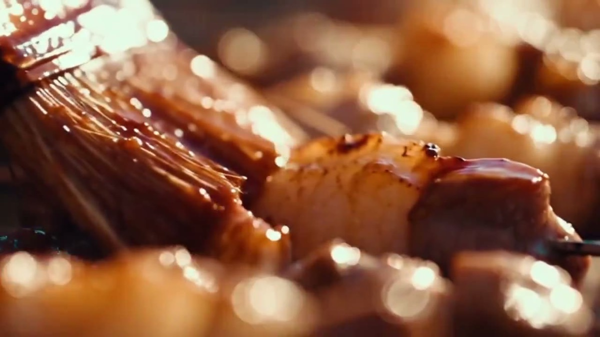

# 烧烤美食微距短片

[返回完整目录](../../CATALOG.md)



[播放样片（在线播放器）](https://dingle-kb.github.io/awesome-visual-prompts/?style=video-barbecue-macro-food-film)

组合烤架火焰、肉串和人物动作的微距美食镜头。

类型：生视频 · 来源案例

**烹饪** 电影感 横屏

来源：[@Zoya / YouMind](https://x.com/Zoyavelle/status/2102641743669961207)

## 完整提示词

```text
电影感特写：一位年轻亚洲女性穿着黑色连帽衫、戴着深色头巾，站在传统的户外烧烤炉旁。烟雾在她周围升起，她慢慢地用双手调整头上的布料。切换至微距细节镜头：金属烤串上多汁的肉块在炽热的木炭上滋滋作响，释放出浓郁而诱人的烟雾。特写展现肉块在猛烈的明火上炙烤，金橙色火光映照食物，并呈现真实的烟雾与热浪扭曲。采用超写实食物电影摄影、电影感布光、浅景深和戏剧性的暖色调；纹理高度精细，动作自然，火焰和烟雾符合真实物理效果。4K、8K 画质，专业数码单反相机与微距镜头，镜头运动平滑，画面照片级写实，氛围沉浸。
```

## English Prompt

```text
A cinematic close-up of a young Asian woman wearing a black hoodie and a dark head covering, standing beside a traditional outdoor barbecue grill. She slowly adjusts the cloth on her head with both hands while smoke rises around her. Cut to detailed macro shots of juicy pieces of grilled meat on metal skewers over glowing charcoal, sizzling and releasing thick aromatic smoke. Close-up of the meat being grilled over intense open flames, golden-orange firelight reflecting on the food, realistic smoke and heat distortion. Ultra-realistic food cinematography, cinematic lighting, shallow depth of field, dramatic warm tones, highly detailed textures, natural movement, realistic fire and smoke physics, 4K, 8K, professional DSLR camera, macro lens, smooth camera movement, photorealistic, immersive atmosphere.
```

[打开 style.json](../../../styles/video/video-barbecue-macro-food-film/style.json) · [打开条目目录](../../../styles/video/video-barbecue-macro-food-film/)

<!-- Generated by scripts/build.mjs. -->
