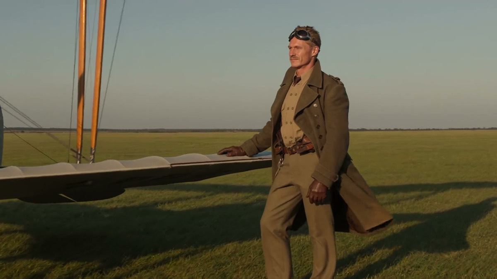

# 无人机环绕主体

[返回完整目录](../../CATALOG.md)



[播放样片（在线播放器）](https://dingle-kb.github.io/awesome-visual-prompts/?style=video-drone-orbit-subject)

让无人机以固定半径和高度匀速环绕主体，利用地平线旋转和视差建立空间感。

类型：生视频 · 来源案例

**镜头运动** 无人机环绕 横屏

来源：[Higgsfield.AI Team。](https://higgsfield.ai/academy/how-to-use/turn-your-video-into-cinema-using-wan-camera-control)

可替换内容：`[主体]` · `[右侧]`

## 完整提示词

```text
无人机围绕主体进行平滑、匀速的圆周飞行：环绕半径为[8]米，高度为[4]米，向画面[右侧]移动，从上方俯视为顺时针方向，整个镜头覆盖约[200]度的弧线。地平线在主体身后持续旋转；不得改变高度、漂移环绕半径、变焦或使用速度渐变。
```

## English Prompt

```text
A smooth constant-speed circular drone flight around the subject — [8]-meter radius, [4]-meter altitude, traveling screen-[right] (clockwise seen from above), covering roughly a [200]-degree arc across the shot. The horizon rotates continuously behind the subject; no altitude change, no radius drift, no zoom, no speed ramps.
```

[打开 style.json](../../../styles/video/video-drone-orbit-subject/style.json) · [打开条目目录](../../../styles/video/video-drone-orbit-subject/)

<!-- Generated by scripts/build.mjs. -->
