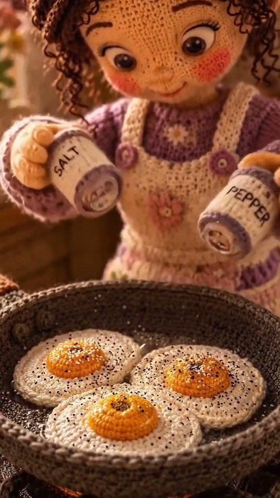

# 毛线娃娃早餐定格动画

[返回完整目录](../../CATALOG.md)



[播放样片（在线播放器）](https://dingle-kb.github.io/awesome-visual-prompts/?style=video-knitted-doll-breakfast-stop-motion)

用四段针织材质镜头串联打蛋、调味、装盘和用餐的定格动画。

类型：生视频 · 来源案例

**动画** 定格动画 竖屏

来源：[@Maya / YouMind](https://x.com/MayaAiCreator/status/2098365565781917862)

## 完整提示词

```text
场景详情：
动作：毛线娃娃在钩针编织的炉灶上，把鸡蛋打进深灰色针织平底锅。
物件：针织鸡蛋与光泽的黄色毛线蛋黄、写有“SALT”和“PEPPER”的钩针编织盐罐与胡椒罐、标有“Made with Love”等文字的毛线罐子，以及由窗外柔和晨光照亮的温馨木质背景。
风格：微距移轴摄影、可触摸的羊毛与棉线肌理、高度精细的针脚纹样、定格动画美学、温暖舒适的氛围、景深、8K 分辨率。--ar 9:16 --v 6.0

片段 1：打鸡蛋（0:00–0:08）
提示词：一只棕色发髻、身穿紫色针织服装的可爱钩针毛线娃娃，手拿钩织蛋壳，在温馨炉灶上的深灰色针织平底锅里打入生鸡蛋。光亮的黄色毛线蛋黄轻轻落入锅中，柔和晨光从窗户照入。3D 定格动画、可触摸的羊毛肌理、微距机位。

片段 2：调味特写（0:08–0:15）
提示词：极近距离微距镜头，定格动画风格。钩针毛线女孩拿着标有“SALT”和“PEPPER”的微型钩织调料罐，把细小的黑白珠子撒在针织平底锅中正在滋滋作响的三个毛线煎蛋上。可触摸的羊毛细节、温暖舒适的布光、浅景深。

片段 3：装盘（0:15–0:23）
提示词：中景，定格动画。钩针毛线女孩用一把小木铲，将煎好的毛线鸡蛋从深灰色钩织平底锅滑到一个装饰性针织餐盘里。温馨厨房背景里摆满毛线罐和钩织细节；明亮晨光、逐帧可触的动作质感。

片段 4：吃早餐（0:23–0:32）
提示词：定格动画特写。钩针娃娃坐在一张小桌前，用微型金属叉子和刀切开钩织餐盘里的毛线煎蛋。柔和舒适的光线、她的毛衣与围裙上精细的针脚图案，以及可触摸的手工艺质感。
```

## English Prompt

```text
Scene Details:
​Action: The doll is cracking eggs into a dark grey knitted frying pan on a crocheted stove top.
​Objects: Knitted eggs with glossy yellow yarn yolks, crocheted salt and pepper shakers labeled "SALT" and "PEPPER", yarn jars with labels like "Made with Love", and a cozy wooden backdrop illuminated by soft morning sunlight streaming through a window.
​Style: Macro tilt-shift photography, tactile wool and cotton yarn textures, highly detailed stitch patterns, stop-motion animation aesthetic, warm cozy aesthetic, depth of field, 8k resolution. --ar 9:16 --v 6.0

Clip 1: Cracking Eggs (0:00 - 0:08)
​Prompt: A cute amigurumi yarn doll with a brown hair bun and a purple knitted outfit holds a crocheted egg shell and cracks raw eggs into a dark grey knitted frying pan on a cozy stove. Glossy yellow yarn yolks gently settle into the pan, soft morning sunlight streaming through the window, 3D stop-motion animation, tactile wool textures, macro camera angle.
​Clip 2: Seasoning Close-Up (0:08 - 0:15)
​Prompt: Extreme macro shot, stop-motion animation style. An amigurumi yarn girl holds miniature crocheted shakers labeled "SALT" and "PEPPER", sprinkling tiny black and white beads over three fried yarn eggs sizzling in a knitted pan. Tactile wool details, warm cozy lighting, shallow depth of field.
​Clip 3: Plating the Food (0:15 - 0:23)
​Prompt: Medium shot, stop-motion animation. The amigurumi girl uses a tiny wooden spatula to slide cooked yarn eggs from a dark grey crocheted pan onto a decorative knitted plate. Cozy kitchen backdrop filled with yarn jars and crocheted details, bright morning light, frame-by-frame tactile motion.
​Clip 4: Eating Breakfast (0:23 - 0:32)
​Prompt: Close-up stop-motion animation. The amigurumi doll sits at a small table, using a miniature metal fork and knife to slice into a fried yarn egg on a crocheted plate. Soft cozy lighting, detailed stitch patterns on her sweater and apron, tactile craft aesthetic.
```

[打开 style.json](../../../styles/video/video-knitted-doll-breakfast-stop-motion/style.json) · [打开条目目录](../../../styles/video/video-knitted-doll-breakfast-stop-motion/)

<!-- Generated by scripts/build.mjs. -->
