# 生图案例

[返回首页](../README.md) · [浏览画廊](../index.html)

按画面浏览案例，下方对应完整提示词与来源。

## 精选预览

<table>
<tr><td width="33%" valign="top" align="center"><a href="../assets/previews/botanical.webp">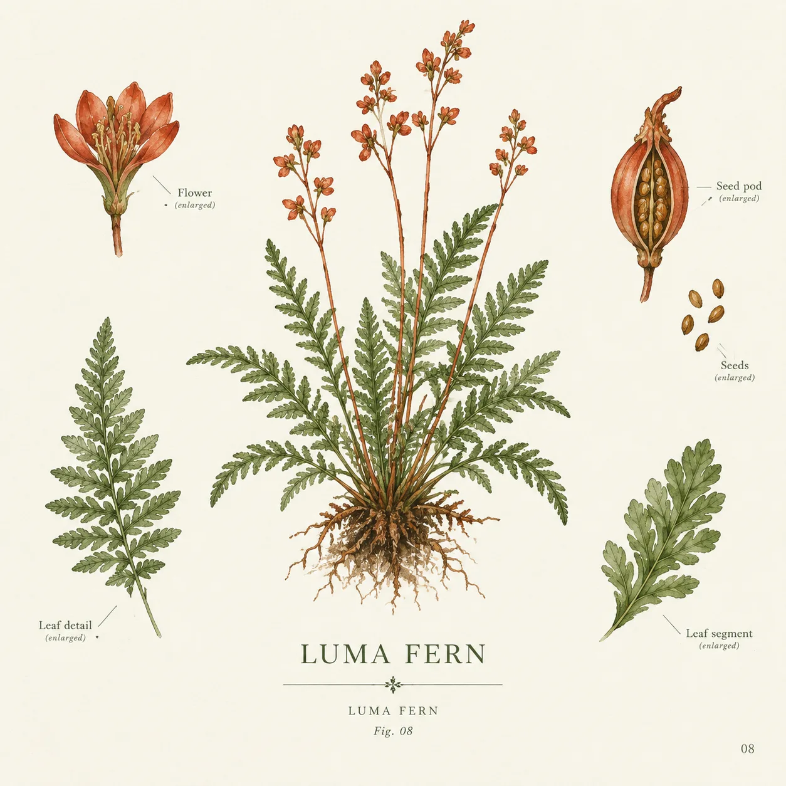</a><br><a href="#botanical-plate">虚构植物科学图版</a></td><td width="33%" valign="top" align="center"><a href="../assets/previews/beverage.webp">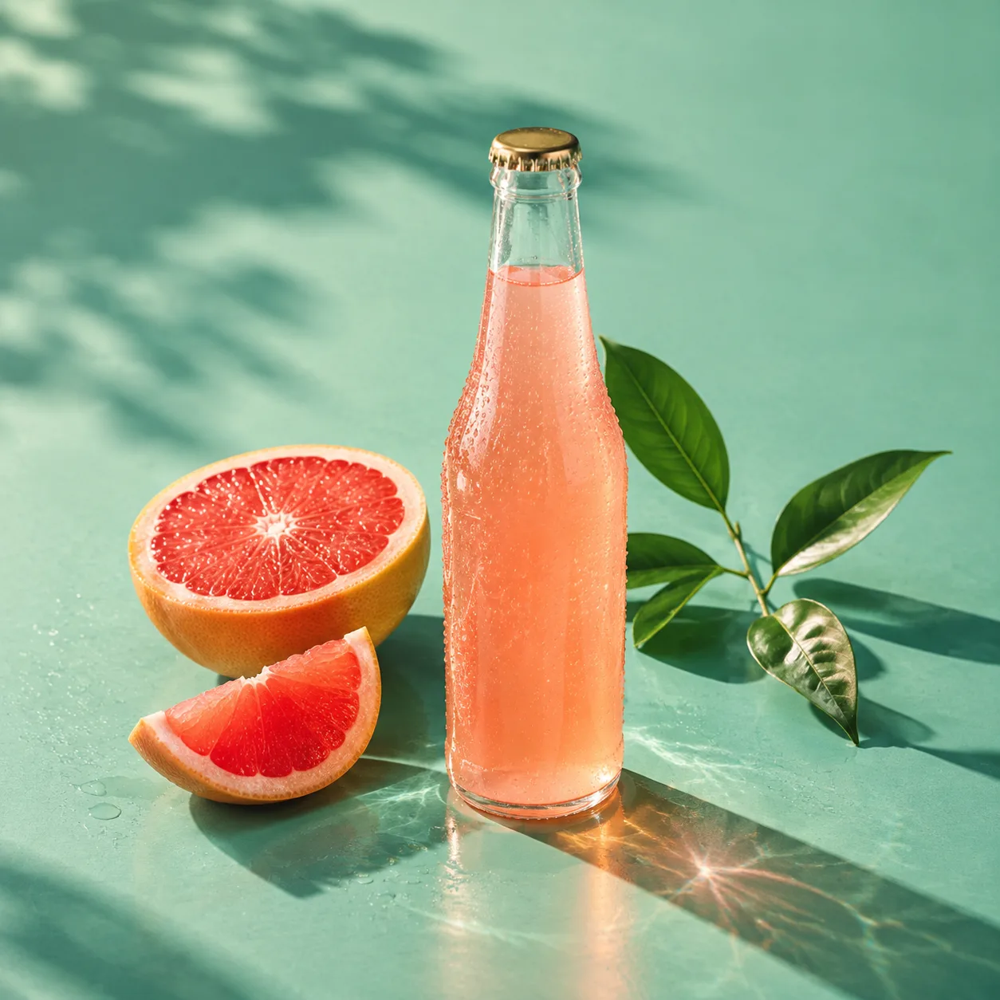</a><br><a href="#botanical-soda">植物汽水商业静物</a></td><td width="33%" valign="top" align="center"><a href="../assets/previews/travel.webp">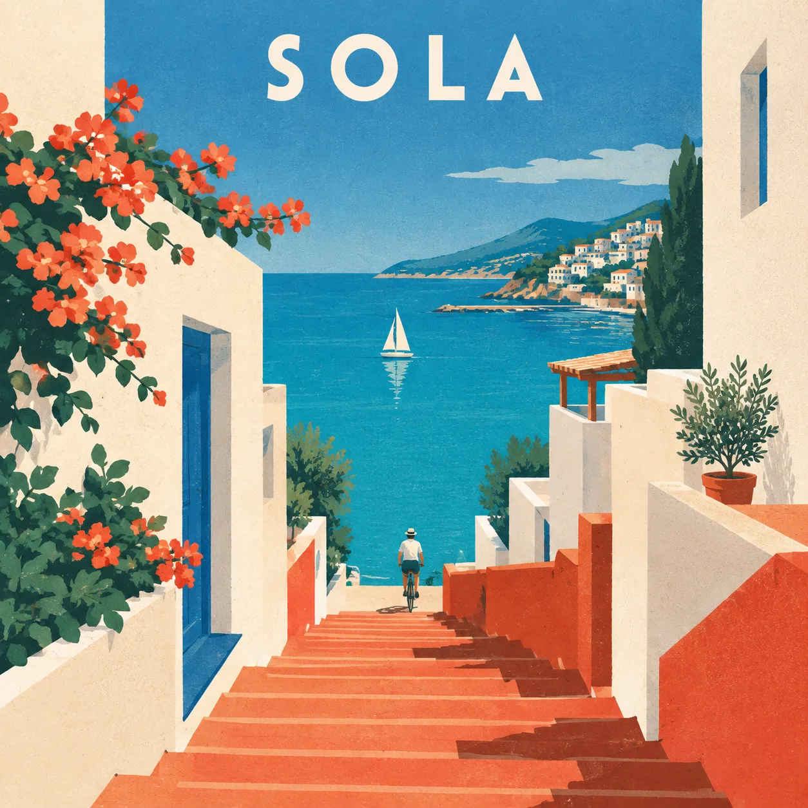</a><br><a href="#coastal-poster">虚构海岸城市旅行海报</a></td></tr>
<tr><td width="33%" valign="top" align="center"><a href="../assets/previews/storyboard.webp">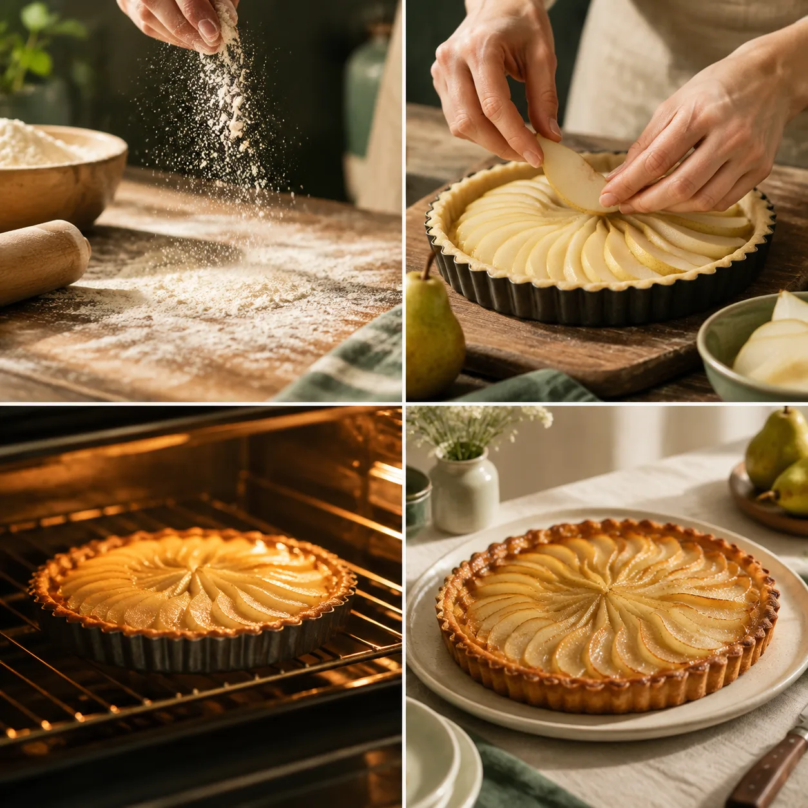</a><br><a href="#pear-tart-storyboard">梨挞广告四镜头分镜</a></td><td width="33%" valign="top" align="center"><a href="../assets/cases/image-828d8ade3e.jpg"></a><br><a href="#image-828d8ade3e">杯内鱼眼夏日冰饮广告</a></td><td width="33%" valign="top" align="center"><a href="../assets/cases/image-5b85051bd1.jpg"></a><br><a href="#image-5b85051bd1">便当化食品包装创意</a></td></tr>
<tr><td width="33%" valign="top" align="center"><a href="../assets/cases/image-5573ad414d.jpg"></a><br><a href="#image-5573ad414d">丙烯手绘风格海报设计</a></td><td width="33%" valign="top" align="center"><a href="../assets/cases/image-6f7c8e1479.jpg">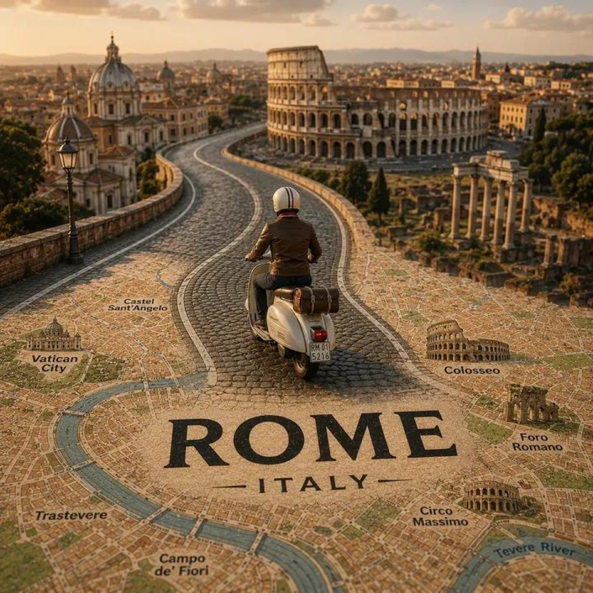</a><br><a href="#image-6f7c8e1479">城市地图微缩旅行海报</a></td><td width="33%" valign="top" align="center"><a href="../assets/cases/image-91099d2e69.jpg">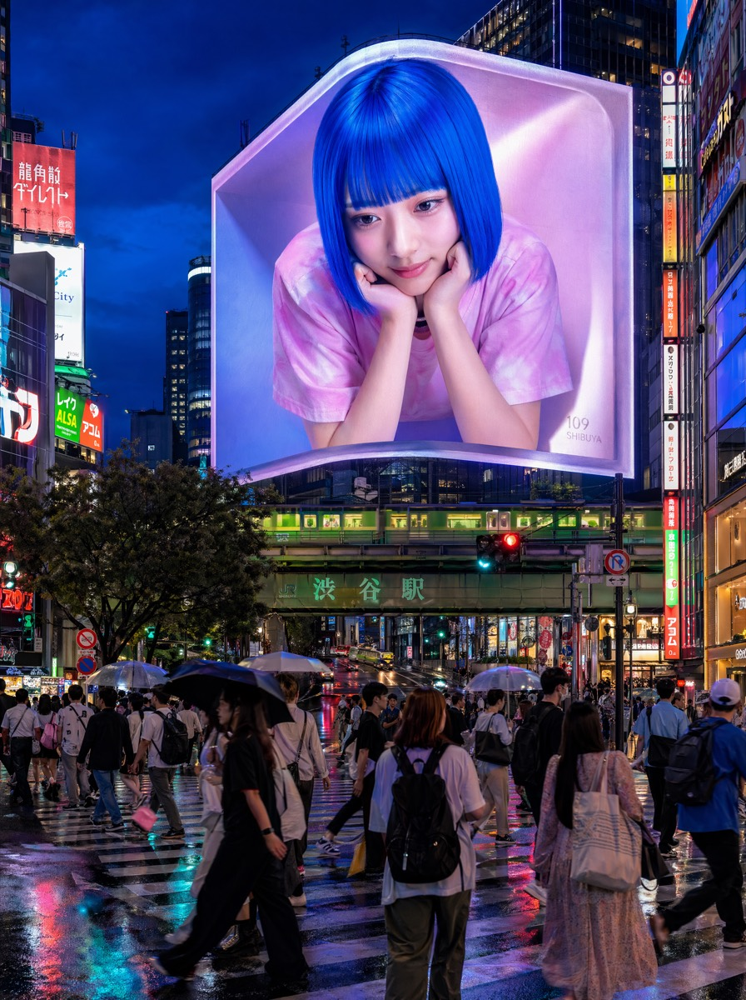</a><br><a href="#image-91099d2e69">城市巨幕三维广告摄影</a></td></tr>
<tr><td width="33%" valign="top" align="center"><a href="../assets/cases/image-797a09fdbc.jpg">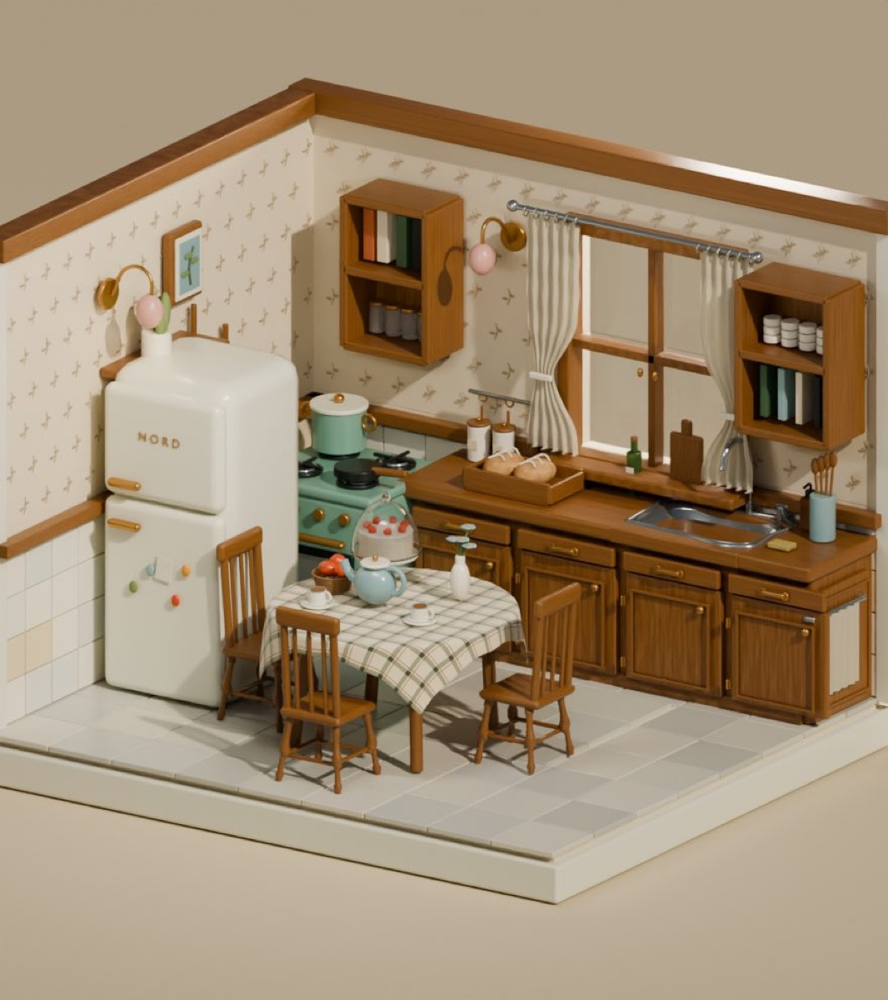</a><br><a href="#image-797a09fdbc">等轴测微缩厨房</a></td><td width="33%" valign="top" align="center"><a href="../assets/cases/image-5ad5dba080.jpg">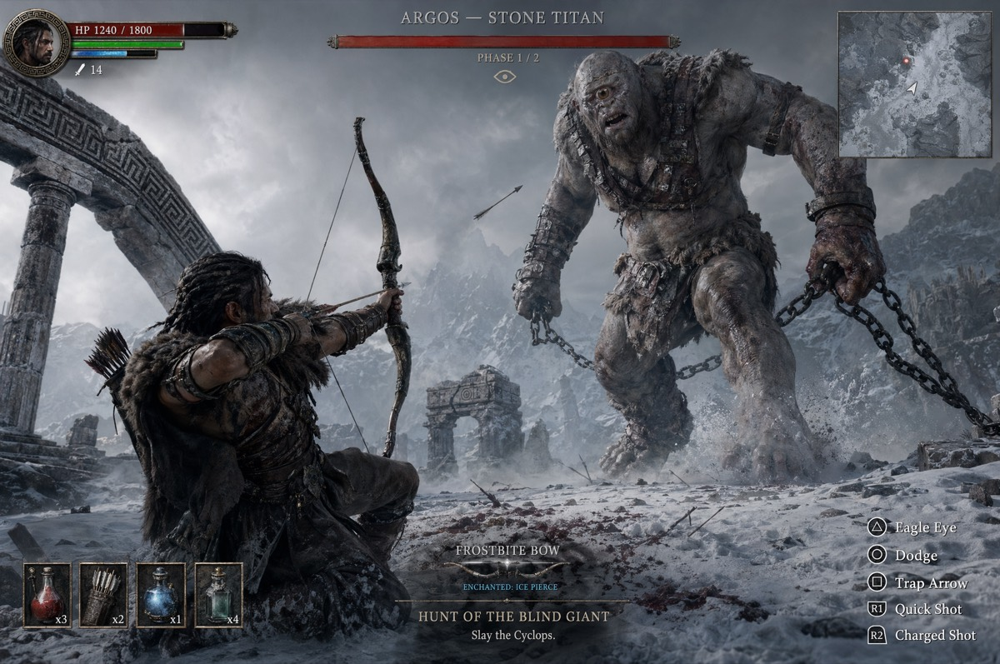</a><br><a href="#image-5ad5dba080">电影级动作角色扮演游戏截图</a></td><td width="33%" valign="top" align="center"><a href="../assets/cases/image-3c7b07b9df.jpg">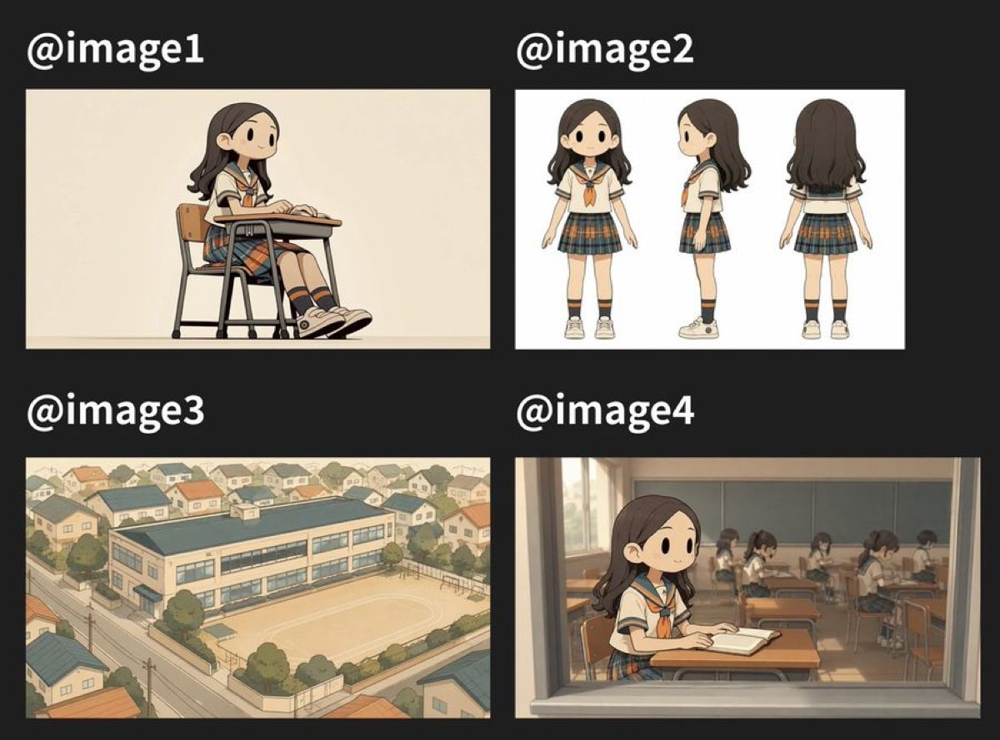</a><br><a href="#image-3c7b07b9df">动画校园世界观参考面板</a></td></tr>
</table>

## 全部案例

- [虚构植物科学图版](#botanical-plate)
- [植物汽水商业静物](#botanical-soda)
- [虚构海岸城市旅行海报](#coastal-poster)
- [梨挞广告四镜头分镜](#pear-tart-storyboard)
- [杯内鱼眼夏日冰饮广告](#image-828d8ade3e)
- [便当化食品包装创意](#image-5b85051bd1)
- [丙烯手绘风格海报设计](#image-5573ad414d)
- [城市地图微缩旅行海报](#image-6f7c8e1479)
- [城市巨幕三维广告摄影](#image-91099d2e69)
- [等轴测微缩厨房](#image-797a09fdbc)
- [电影级动作角色扮演游戏截图](#image-5ad5dba080)
- [动画校园世界观参考面板](#image-3c7b07b9df)
- [二十四节气编辑视觉设计](#image-2d9c1779c7)
- [法新浪潮撕纸电影海报](#image-617c5d786a)
- [反射式滑雪装备落地页](#image-ed61eb227d)
- [分割画布编辑艺术海报](#image-aa535c1f0d)
- [分级英语杂志阅读页](#image-5efc7ec9c3)
- [复古科学植物学海报](#image-9dc00fd4c2)
- [复古手账海报排版](#image-909ac5b599)
- [复古网点插画转绘](#image-0cac842543)
- [概念沙发研发板](#image-36c0a55d6b)
- [高定时尚杂志封面](#image-e60a5d30a1)
- [高端食品商业广告分镜](#image-7ebb9401a5)
- [格林童话木刻版画海报](#image-f1b82a90e6)
- [极简抽象几何解构海报](#image-ae6e4d57d6)
- [极简概念线条艺术海报](#image-0b30d56a9e)
- [建筑照片概念草图双联海报](#image-05bd56fd6f)
- [浆果冰沙商业摄影](#image-25ed063581)
- [街头卷轴背景时尚大片](#image-89fc3234ea)
- [界面交互设计图](#image-efcccbca0c)
- [精品电商产品平铺网格](#image-6b83c7fc5b)
- [科技产品评测缩略图](#image-908d8579d8)
- [可颂烘焙流程分镜板](#image-dd9bf06fe9)
- [老照片人像保真修复](#image-326b2a7f37)
- [里约旅行票据纸雕立体海报](#image-611724620e)
- [六宫格饮料微缩广告](#image-a9d112ca87)
- [旅行纪念珐琅徽章](#image-540528c039)
- [烹饪速写插画叙事](#image-05e87c8c9f)
- [千禧街头服饰移动落地页](#image-d3a00a1ea9)
- [千禧虚拟试衣游戏界面](#image-1587ef7030)
- [青花敦煌刺绣四拼海报](#image-90154ddf7b)
- [趣味陶瓷电商首页主视觉](#image-d0024a7f32)
- [人像摄影灯光方案网格](#image-626facaf10)
- [沙漠洗车电影感纪实摄影](#image-97796819d8)
- [奢华机械腕表技术图鉴](#image-d4e3564190)
- [社交媒体赠礼活动横幅](#image-7c53920b6a)
- [深海自由潜水探险摄影](#image-c352a86ebd)
- [十五步写实食谱信息图](#image-231adaeba9)
- [食物爆炸拆解信息图](#image-2be108496e)
- [手工撕纸海报风格](#image-fda124aba7)
- [双色调摄影棚商业肖像](#image-60806a74e0)
- [水彩风格编辑插画海报](#image-9457327362)
- [水墨双重曝光人物海报](#image-2b779f2991)
- [四城极简旅行海报系列](#image-966a4fde71)
- [四格奶昔食谱过程拼图](#image-de6feddf44)
- [同一人脸十二款发型图鉴](#image-8c99b1b29f)
- [未来亲生物中庭空间](#image-f932193426)
- [五格咖啡馆人物拼贴](#image-0d498d4702)
- [五五分混合媒介回忆卡](#image-2a8d580cf7)
- [武汉复古地图海报](#image-f466b7610c)
- [武汉过早美食地图信息图](#image-bf146d83bb)
- [现代艺术活动传单](#image-de94c8b709)
- [箱内仰视农场广告海报](#image-6160fd8cca)
- [橡皮章旅行田野笔记](#image-8e8bcb2b18)
- [羊毛毡国家微缩世界](#image-c7200c726a)
- [一致性室内空间多视角网格](#image-89e8a705fc)
- [一周穿搭信息图](#image-054cd4752d)
- [饮料食品营销主视觉](#image-ee84e012bf)
- [真人切模贴纸海报](#image-81c5c8e11d)
- [纸雕浮雕街区网格](#image-24c5febb05)
- [中文奢华美妆海报](#image-ed6e569904)
- [足球球员数据涂鸦海报](#image-3ed96383d6)

## 完整案例

<a id="botanical-plate"></a>

## 虚构植物科学图版

<a href="../assets/previews/botanical.webp"></a>

以标本主图和局部放大图组织清晰的植物学图版。 · 科普与出版

模型：gpt-image-2 · 服务：RightCodes · 请求尺寸：1024x1024 · 实际输出：1254x1254

**完整提示词**

```text
Create a finished editorial scientific botanical plate for an original imaginary alpine plant named Luma fern. Vertical 3:4 composition. Large accurate-looking central botanical watercolor specimen, smaller enlarged seed pod and leaf detail drawings around it, fine leader lines, restrained moss green and vermilion ink with clean off-white paper. Elegant specimen label LUMA FERN and tiny serial number 08 in legible English. Premium museum publication photography, crisp fine details, no logos, no humans, no real brand, no web UI.
```

**可复用模板**

[浏览生图 Prompt 模板](../templates/image.md)

<a id="botanical-soda"></a>

## 植物汽水商业静物

<a href="../assets/previews/beverage.webp"></a>

用光线、冷凝水和水果切片突出饮品材质。 · 产品与广告

模型：gpt-image-2 · 服务：RightCodes · 请求尺寸：1024x1024 · 实际输出：1254x1254

**完整提示词**

```text
A polished commercial still-life photograph for a fictional botanical soda called MIRA. One clear unbranded glass bottle with pale coral liquid on a vivid sea-green tabletop, condensation, sliced ruby grapefruit and a single leafy stem, directional late afternoon sunlight, sharp caustic shadows, premium beverage advertising composition with generous negative space, bright believable materials. No people, no visible words, no brand logos, no collage or mockup frame. Square image.
```

**可复用模板**

[浏览生图 Prompt 模板](../templates/image.md)

<a id="coastal-poster"></a>

## 虚构海岸城市旅行海报

<a href="../assets/previews/travel.webp"></a>

以大色块、几何建筑和丝网印刷肌理构成旅行海报。 · 海报与编辑

模型：gpt-image-2 · 服务：RightCodes · 请求尺寸：1024x1024 · 实际输出：1254x1254

**完整提示词**

```text
An original editorial travel poster for a fictional coastal city named SOLA. A sunlit terracotta stairway descends between white modernist houses toward a turquoise harbor, distant sailboat and hill, one small cyclist for scale. Sophisticated flat screen-print look with subtle paper grain, palette of coral red, cobalt, cream and sea green, strong geometric composition and negative space. One small readable heading SOLA at the top, no logos, no real place names, vertical 3:4 poster.
```

**可复用模板**

[浏览生图 Prompt 模板](../templates/image.md)

<a id="pear-tart-storyboard"></a>

## 梨挞广告四镜头分镜

<a href="../assets/previews/storyboard.webp"></a>

四格镜头从原料、制作、烘烤过渡到成品。 · 分镜与叙事

模型：gpt-image-2 · 服务：RightCodes · 请求尺寸：1024x1024 · 实际输出：1254x1254

**完整提示词**

```text
A premium four-panel storyboard image for an original bakery campaign about a hand-made pear tart. Four distinct cinematic frames in a precise 2 by 2 grid: close-up flour dust falling over a pastry board; hands carefully arranging fresh pear slices; tart baking inside a warmly lit oven; finished golden pear tart served on a simple table. Photoreal food cinematography, coherent warm daylight and amber oven glow, cream and dark green art direction, clear shot progression and consistent tart, thin gutters between frames. No captions, no logos, no text, no real brands.
```

**可复用模板**

[浏览生图 Prompt 模板](../templates/image.md)

## 来源案例

<a id="image-828d8ade3e"></a>

### 杯内鱼眼夏日冰饮广告

<a href="../assets/cases/image-828d8ade3e.jpg"></a>

从透明饮料杯内部使用鱼眼视角拍摄人物饮用冰饮的夏日商业广告。 · 商业广告

来源：[@lovimg_com](https://x.com/lovimg_com/status/2077036659028484375) · 来源提示词 / 翻译整理

**完整提示词**

```text
主題：
氷越しの夏

主体：
縦長2:3のリアル写真。透明な大型プラスチックカップの内側から見上げるような超広角フィッシュアイ構図。画面下半分いっぱいに赤いいちご果肉とクラッシュアイスが迫り、中央から太いグリーンのストローが奥へ一直線に伸びる。丸く歪んだカップの開口部の向こうに、女性の顔が中央に大きく収まる。

人物・表情：
自然で現実感のある若い女性。黒髪に近いダークブラウンの髪を高めのお団子にまとめ、薄い前髪と顔まわりの後れ毛が日差しで細く光っている。透明感のあるナチュラルメイク、淡いピンクの頬、つやのあるリップ。目を大きく開いてカメラをまっすぐ見つめ、唇を小さく丸めてストローをくわえている。少し驚いたような、可愛らしく無邪気な表情。

服装・ポーズ：
白いレース素材のブラウス。首元と肩まわりに細かなフリルがあり、夏らしく軽い質感。人物はカップの向こう側に顔を近づけ、両肩は下部に少しだけ見える。ストローは人物の口元に自然に接触し、奥から手前の赤い氷へ向かって強い奥行きを作る。

背景・光：
背景は晴れた夏の日の古い商店街。木造風の店先、かき氷屋の暖簾、苺柄の看板、白い小さな旗、街路樹が見える。文字はすべてぼかされた読めない装飾として扱う。左上から強い太陽光が入り、透明カップの水滴、カップ縁、氷、赤い果肉に細かな反射とハイライトが出る。影は右下へ落ち、白いクリームの残りがカップ内側にリング状についている。

構図・カメラ：
カメラはカップの底付近、赤い氷のすぐ上に置いたような極端なローアングル。フィッシュアイレンズでカップの円形リムが大きく湾曲し、周囲の商店街も軽く歪む。画面下45％は赤い氷と果肉の前ボケ、中央はストローと女性の顔、上部は青空とカップの透明な縁。ピントは女性の目と口元、手前の氷はきらめく浅いボケ。

質感・スタイル：
プロ用カメラで撮影した夏の広告写真風。透明プラスチックの屈折、水滴の粒、氷の冷たさ、いちご果肉の瑞々しさを高精細に表現。青空、赤い氷、グリーンのストロー、白いブラウスの色の対比を鮮やかにする。肌は自然な質感を残し、過度な美肌補正はしない。明るくポップで、少しユーモラスな日本の夏スイーツ写真。

ネガティブ：
実在ブランドロゴ、読める文字、商標の再現、不自然な顔、不自然な視線、歯や唇の崩れ、ストローとの接触不良、余分な指、欠けた指、手足の融合、氷の浮遊、不自然な重力、誤った遠近法、光源と矛盾する影、文字化け、透かし、過度な美肌補正、プラスチックのような肌。
```

**可复用模板**

[查看对应模板](../templates/image.md#image-inside-cup-fisheye-summer-drink-ad)

<a id="image-5b85051bd1"></a>

### 便当化食品包装创意

<a href="../assets/cases/image-5b85051bd1.jpg"></a>

把食品或包装商品重新设计为便当式分区陈列创意图。 · 产品视觉

来源：[@小小东](https://x.com/xiaoxiaodong01/status/2096609211870576683) · 来源提示词 / 翻译整理

**完整提示词**

```text
请将我上传的每一张照片分别制作成一张独立的高级设计海报，不多图拼接，每张照片单独输出。整体采用 3:4 竖版构图，上下两个区域高度严格 1:1，各占画面 50%。 上半部分保留原始照片，保持主体身份、结构、姿态、真实质感、自然光影和原有色彩氛围，仅进行轻微高级调色，使其具有艺术杂志、独立出版物与展览图像质感。为适配画幅，可自然扩展环境背景，但不得拉伸、扭曲或改变主体。 下半部分提取照片中最具识别性的主体、轮廓、结构、姿态与叙事关系，重构为 Bento-fication / 饭盒化的便利店熟食包装视觉。不要逐物复制原图，而是理解原画面的核心视觉关系，将人物、建筑、植物、天空、水面、器物或其他元素进行食材语义映射与材质置换，用米饭、蔬菜、鸡蛋、水果、海苔、奶酪、酱汁、果冻、鱼籽、香草等食材重新组织，使人第一眼仍能认出原画面的灵魂，第二眼才发现所有内容其实都是食物。 所有视觉信息最终收纳进一个明确的透明便利店熟食盒、便当托盘或分格食品容器中。保留原图最重要的构图层级，但允许重新导演：删减无关背景，通过裁切、比例变化、位置重组、食材模块化和容器分区，让原本复杂或普通的画面重新变成一件成立的商品视觉。不要为了还原而塞满食材，只保留真正决定身份的元素。 下半部分以俯拍产品摄影 / top-view packaged-food photography 为主要视角，强调真实透明盒材质、食材颗粒、切面、湿润度、新鲜感和自然光感，使其像真正可以放在精品便利店货架上的商品。构图保持主体包装清晰、四周有充足留白，整体干净、精致、有呼吸感，不做拥挤的食物拼盘。 配色从上方照片中提取最有辨识度、最鲜活的颜色，再转换为自然食材色彩。颜色应明亮、清爽、诱人、有生活感，例如绿色可转化为蔬菜与香草，黄色转化为鸡蛋、玉米或水果，暖红转化为番茄、鱼籽或酱汁，冷色可通过果冻、包装、餐盒底纸或其他合理食材关系表达。避免灰暗、油腻、脏色和廉价食品广告感。 包装加入少量商品标签系统，可根据原图主题自由生成品名、短句、价格、重量、条码、保质信息或微型说明，不限制语种，也不要求固定字段。标签应像真实日系便利店或精品食品包装，层级清楚、尺寸克制，与透明盒和食材构图自然结合。 整体呈现 Japanese konbini deli packaging aesthetic / packaged-food reinterpretation / semantic food substitution / containerized composition / retail product visualization 的视觉语言。核心原则是：不是把照片画成食物，而是保留原画面的视觉灵魂，用食材、容器和商品包装重新导演一次。
```

**可复用模板**

[查看对应模板](../templates/image.md#image-bento-food-packaging-concept)

<a id="image-5573ad414d"></a>

### 丙烯手绘风格海报设计

<a href="../assets/cases/image-5573ad414d.jpg"></a>

将上传照片制作成上半部真实摄影、下半部极简丙烯手绘插画的 3:4 高级设计海报。 · 海报设计

来源：[@小小东](https://x.com/xiaoxiaodong01/status/2089997569829093688) · 来源提示词 / 翻译整理

**完整提示词**

```text
请将我上传的每一张照片分别制作成一张独立的高级设计海报，不多图拼接，每张照片单独输出。整体采用 3:4 竖版构图，上下两个区域高度严格1:1，各占画面50%。 上半部分保留原始照片，保持主体结构、真实质感、自然光影和原有色彩氛围，仅进行轻微高级摄影调色，使其具有杂志摄影和艺术出版物质感。为适配画幅，可自然扩展天空、地面或环境背景，但不得拉伸、扭曲或改变主体。 下半部分提取照片中最具识别性的主体、轮廓、姿态与叙事关系，重构为极简纸感手绘封面插画。高度提炼并删减复杂细节，只保留最关键的视觉特征，以纤细、略带不稳定感的手绘线条和少量明确的丙烯平涂色块重新表达，让人一眼识别原始主题。主体保持小而集中，约占下半部分 10%–20%，四周大面积留白，背景以粗糙白纸或浅色纸张为主，仅用极少量线条或色面暗示环境。 配色从上方照片提取并压缩为不超过4种主要颜色，色块鲜明、完整、克制，保留纸张颗粒、手工涂抹和轻微不规则边缘。线条负责提示结构，色块负责建立主体。避免彩铅、蜡笔、水彩晕染、纯线稿、复杂写实、厚重油画、光滑数字插画和3D质感。 可加入少量简洁文字，根据照片内容灵活使用标题、主题词、对象名称、地点、年份、编号或短句，不局限于城市题材。文字排版疏朗克制，与留白和插画自然融合，具有艺术书封、独立出版物和儿童绘本式设计感。整体呈现小主体、大留白、强提炼、高识别度、安静、童趣、轻松、诗意而高级的视觉气质，避免商业卡通感、电商感和模板感。
```

**可复用模板**

[查看对应模板](../templates/image.md#image-acrylic-hand-painted-split-poster)

<a id="image-6f7c8e1479"></a>

### 城市地图微缩旅行海报

<a href="../assets/cases/image-6f7c8e1479.jpg"></a>

把城市地图、弯曲道路、交通工具和地标融合成写实微缩旅行海报。 · 海报设计

来源：[@SimplyAnnisa](https://x.com/SimplyAnnisa/status/2062358269172101240) · 来源提示词 / 翻译整理

**完整提示词**

```text
Create a highly detailed cinematic miniature tilt-shift travel scene of [CITY NAME] featuring a realistic [VEHICLE NAME] driving along a winding elevated road that emerges naturally from a printed vintage-style city map. The road should curve dramatically toward the background skyline and landmarks of [CITY NAME], while the vehicle remains the clear focal point in the foreground.

Blend the real city seamlessly with the illustrated map surface so the road appears integrated into the map itself. Include recognizable local landmarks, waterways, architecture, vegetation, and atmosphere associated with [CITY NAME], but keep the composition clean and uncluttered.

Show large bold typography of "[CITY NAME]" printed directly on the map in the foreground. Use warm golden-hour lighting, shallow depth of field, realistic textures, cinematic shadows, aerial perspective, and photorealistic detail. The overall aesthetic should feel like a premium Instagram travel poster mixed with a miniature diorama.

Aspect ratio 1:1.
```

**可复用模板**

[查看对应模板](../templates/image.md#image-miniature-city-map-travel-poster)

<a id="image-91099d2e69"></a>

### 城市巨幕三维广告摄影

<a href="../assets/cases/image-91099d2e69.jpg"></a>

生成蓝调时刻城市街头摄影，核心是一块包裹建筑转角、具有裸眼三维错觉的巨型户外广告屏。 · 商业广告

来源：[@gaziziz](https://higgsfield.ai/publications/4ca41020-ddce-4ddb-90b5-6e0aa5e91bc7) · 来源提示词 / 翻译整理

**完整提示词**

```text
创建一张 4:5 竖版蓝调时刻城市街头摄影，地点为 `{cityDistrict}`。一块包裹高层建筑转角的弧形 LED 巨幕占据画面上方三分之二，屏幕中的 `{heroSubject}` 以摩天楼尺度呈现，并通过身体、手臂或物体越过屏幕边缘的透视关系，形成逼真的裸眼三维广告错觉。

巨幕发出 `{screenColorA}` 与 `{screenColorB}` 的强烈柔光，真实照亮周围建筑、行人和湿润街道。中景加入高架交通、路标、街树和多层店铺；背景由密集窗灯、不同尺寸广告屏和深钴蓝天空组成；前景是正在穿越路口的人群，轻微运动模糊，雨后地面反射多种光源。

使用平视街拍角度、四层景深和清楚的尺度参照。巨幕人物面部或产品必须锐利，城市环境保持真实复杂但不抢主体。调色使用深钴蓝、洋红、青色、暖琥珀、少量酸绿和红色，保留阴影细节、轻微光晕与胶片颗粒。所有招牌使用虚构品牌或不可辨识通用文字，不复制真实城市地标标识。
```

**可复用模板**

[查看对应模板](../templates/image.md#image-city-corner-3d-billboard-photography)

<a id="image-797a09fdbc"></a>

### 等轴测微缩厨房

<a href="../assets/cases/image-797a09fdbc.jpg"></a>

生成等轴测视角的完整微缩厨房空间。 · 建筑空间

来源：[@Berryxia.AI](https://x.com/berryxia/status/2096158415894835518) · 来源提示词 / 翻译整理

**完整提示词**

```text
创建一个高度精细的等轴测 3D 微缩立体模型，呈现一个温馨的美式厨房角落，如同在 Blender 中渲染出的手工娃娃屋场景，并带有柔和的全局光照。房间为一个开放式立方体，两面米色壁纸墙在角落交汇，底部为凸起的方形瓷砖地板，顶部和护墙板高度处饰有温暖的中棕色木饰条。使用暖米色摄影棚背景，并采用 3/4 俯视角的正交相机。厨房风格怀旧、可爱且略带玩具感，具有圆润的边缘、抛光的木材、逼真的材质和整洁的微缩比例。包含 12 个主要的家具和固定装置元素：左侧 1 台带有 NORD 字样、彩色小圆磁铁和黄铜把手的奶油色复古冰箱；1 台带有黑色炉头和带盖锅具的薄荷绿燃气灶；右侧 1 组长条木质地柜，配有抽屉、镶板橱柜门、黄铜旋钮和水槽；水槽上方 1 扇双开窗，配有挂在银色杆上的米色系带窗帘；2 个壁挂式木质方盒搁板（分别位于炉灶上方和窗户右侧），内放书籍和白色罐子；中心 1 张铺有白绿格纹桌布的方形餐桌；桌边 3 把木椅；左侧墙上 1 幅小框画；以及 1 对带有圆形灯罩和淡粉色球形装饰的黄铜壁灯。添加 10 个清晰可见的桌面或台面配件：1 个放有面包的托盘、1 个木质砧板、1 个绿色小瓶、1 个装有木勺的餐具杯、1 个洗手液泵瓶、餐桌上 1 个蓝色茶壶或水壶、1 个装有红色顶部甜点的玻璃甜点罩、1 个小杯碟、1 个放有食物的小盘子，以及水槽旁 1 块矩形小海绵。材质应包括光泽奶油色珐琅、薄荷绿喷漆金属、清漆木纹、半透明玻璃、柔软织物窗帘、陶瓷砖和拉丝金属。光照应温暖柔和，伴有柔和的阴影和环境光遮蔽，以强调微缩比例和精细细节。配色方案：warm medium brown、奶油色、薄荷绿、米色、淡粉色、柔和的绿色、黄铜色和柔和的灰色瓷砖。画面中不包含人物，无水印，除复古冰箱和炉灶外无现代家电，立方体房间外无杂物。
```

**可复用模板**

[查看对应模板](../templates/image.md#image-isometric-miniature-kitchen)

<a id="image-5ad5dba080"></a>

### 电影级动作角色扮演游戏截图

<a href="../assets/cases/image-5ad5dba080.jpg"></a>

生成一张包含玩家角色、巨型首领、战斗瞬间、环境叙事和完整 HUD 的电影级第三人称动作角色扮演游戏截图。 · 游戏视觉

来源：[@karimsky_dev](https://higgsfield.ai/publications/4051f3f1-9e66-418d-aa75-024f2c5ffc62) · 来源提示词 / 翻译整理

**完整提示词**

```text
创建一张 16:9 电影级第三人称动作角色扮演游戏截图，世界设定为 `{worldSetting}`，战斗地点为 `{battleLocation}`。

玩家角色 `{playerClass}` 位于左侧前景，采用低机位动态姿态，装备具有真实磨损、材质层次和环境附着物。巨型首领 `{bossName}` 占据右上方，体型、重心、肌肉或机械结构清楚。定格一个即将命中的关键战斗瞬间：武器、弹道、飞散颗粒和首领反应形成明确动作线，但不使用无法解释的炫光。

环境需要包含天气、地表痕迹、废墟或植被、远景层次和与战斗对应的破坏证据。光线使用 `{lightingCondition}`，全局照明自然，阴影柔和，色调克制，角色与背景有清楚分离。

叠加统一、可读、不过度装饰的 HUD：左上角色头像与生命、耐力、能量；顶部中央首领名、阶段和生命条；右上小地图；左下四格物品栏；底部中央武器名与当前效果；右下操作提示；下方任务目标。所有名称、图标和数值使用原创设定。画面应像真实暂停的游戏实机截图，HUD 与场景透视一致，不引用现有游戏名称、角色或标志。
```

**可复用模板**

[查看对应模板](../templates/image.md#image-cinematic-action-rpg-screenshot)

<a id="image-3c7b07b9df"></a>

### 动画校园世界观参考面板

<a href="../assets/cases/image-3c7b07b9df.jpg"></a>

生成角色、校园外观和教室场景保持统一的四格世界观参考板。 · 影视叙事

来源：[@さんかくてん](https://x.com/sankakuten91256/status/2096447146614747210) · 来源提示词 / 翻译整理

**完整提示词**

```text
目标：创建一个 2x2 的对比拼贴画，展示四张为短视频概念生成的动漫风格参考图，背景为深炭灰色，并配有醒目的白色标签。 画布：横向 3:2 构图，尺寸约为 1200x900 像素。使用哑光黑/深灰色背景。将 4 个矩形图像面板整齐排列成网格，留出充足的边距和间隙。每个面板上方都有一个醒目的白色粗体标签：共 4 个标签，左上角为“@image1”，右上角为“@image2”，左下角为“@image3”，右下角为“@image4”。 整体视觉风格：柔和的手绘动漫插画，温暖柔和的色调，细腻的线条，微妙的水彩质感阴影，怀旧的日本校园氛围，简洁的角色设计，无写实感。核心人物为 一位可爱的日本初中女生，留着齐肩深棕色波浪卷发，简单的豆豆眼，带着浅浅的微笑，身穿水手服风格校服。她的服装在各面板中保持一致：奶油色短袖水手衫配海军蓝滚边，橙色领巾，深色格子百褶裙（带有橙色和青色线条），海军蓝中筒袜（带有橙色条纹），以及米色运动鞋。 面板 @image1：温暖米色背景上的单幅插画。展示 1 名女生坐在经典的学校课桌椅上，侧面四分之三视角，面向右侧。她姿态放松，双手放在桌面上，仿佛正在书写或阅读。包含 1 张课桌和 1 把椅子，带有细黑金属桌腿和木质座椅/靠背。她的双腿微微向前伸展，可见运动鞋。背景保持简洁明了。 面板 @image2：纯白背景上的角色三视图。展示 3 个相同女生的全身视图，均匀分布：左侧为正面，中间为侧面（面向左侧），右侧为背面。比例保持类似 Q 版但不过分夸张，大头小身，面部特征简洁。面板内不含额外道具或文字。 面板 @image3：一所小型日本郊区学校 的鸟瞰图插画。展示 1 栋主教学楼，矩形双层结构，带有深青色屋顶和成排的长窗。包含 1 个沙地操场（带有淡淡的白色球场标记）、1 堵围墙，以及周围的住宅区房屋、树木、狭窄街道、电线杆和温暖的午后光线。视角应为高空俯瞰/等轴测视图，类似于 3D 场景的参考图。 面板 @image4：透过大窗框看向教室内部的视角，仿佛观众从室外向内窥视。前景中，展示 1 名女生坐在窗边的课桌旁，略微面向右侧，桌上放着打开的书本或笔记本。在她身后，展示 6 名背景学生坐在各自的课桌前，经过柔化处理且简化，面向前方或低头，仿佛正在学习。包含温暖的阳光、窗户倒影、教室墙板和成排的课桌。窗框应清晰地勾勒出面板边缘，营造出电影般的镜头感。 约束条件：保持所有 4 个面板的插画风格和色调一致。除四个 @image 标签外，不得添加额外的面板、标签、水印、说明文字或徽标。拼贴画应看起来像是一篇展示四张 AI 生成参考图的社交媒体帖子。
```

**可复用模板**

[查看对应模板](../templates/image.md#image-animated-campus-world-reference-board)

<a id="image-2d9c1779c7"></a>

### 二十四节气编辑视觉设计

<a href="../assets/cases/image-2d9c1779c7.jpg"></a>

生成具有三层平面空间、跨界核心形态和现代纸印质感的二十四节气竖版编辑视觉。 · 海报设计

来源：[@小小东](https://x.com/xiaoxiaodong01/status/2089291663466508680) · 来源提示词 / 翻译整理

**完整提示词**

```text
围绕 二十四节气之处暑 内容生成一张极窄长的竖版编辑视觉，让外部大色场、中央暖白纸页与纸页内缩的主题画窗构成三层清楚的平面空间。先从主题的状态对照与情绪温度中推导两种结构色，以一条硬水平分界覆盖画面绝大面积；在内嵌画窗中用相同方向和相近比例缩小复述这组分区，外场更明、更空，窗内更深、更密，纸白作为全画最高明度的隔层。画面重量集中在中段，上部保留宽阔标题区，下部留出舒展的情绪落点；纸页边缘平直，不使用厚重悬浮阴影，画窗下方保留宽阔注释带。 从主题的方向、过程、结构连接与时间变化中提取一条连续可识别的核心形态，把它组织成贯穿中段的单一斜轴，使其从画窗内部跨过至少两道边界，压住窗框、进入纸面留白并延伸到外部色场。跨界形态保持完整连续，越过边缘的端点保留最清楚的识别轮廓，内部细节适度压缩；局部形态沿斜轴由密到疏，其余辅助对象缩成安静的小型几何焦点，稳定留在画窗内部并靠近色场分界。让水平色界、竖向画幅、矩形纸页和内窗维持严格正交秩序，只有核心主题获得破格权，以准确遮挡关系建立空间，而不是依靠透视或戏剧投影。 在主题动势的一侧边缘布置少量同源回声：将核心形态放大、裁切、降低透明与对比，强烈失焦到只剩柔软色块，局部越出画布；中心主体保持清楚，另一侧保持干净，使平面色场获得浅层空气 and 记忆感。色彩保持清晰的面积秩序，两个结构色共同占据约八成画面，主题中介色跨越两场并缝合冷暖或状态差异，一个小面积强调色只在窗内视觉焦点与纸页外文字手势处远距离出现两次。具体色相随主题改变，但纸白最高、少量深轮廓压住结构、强调色以饱和度而非面积取胜的明度关系保持稳定。 文字系统延续图像的秩序与越界关系。主标题使用瘦长、细锐、笔画反差明显、端点精致的编辑衬线骨架，中文采用纤细而有书刊气质的字形，字距舒展；将一个关键词转化为连续自由的手写细线，轻轻穿过或邻接印刷标题，形成与主题斜轴呼应的私人笔迹。解释性信息缩进纸页下部，以两组中细小字 and 日期型微字分列；纸页外下方可用一组带长收笔的手写文字承接第二个强调色，最底边只保留极小元数据。让标题、图像、注释 and 页脚依次降低密度，不让文字压住核心识别边缘。 以无方向的柔和日光 and 低阴影处理对象，使主题保留有限的真实材质，却仍服从平面色块。全图覆盖极轻的艺术纸纤维、细印刷网点与低对比扫描颗粒，纸页 and 画幅中的纹理略明显，外部纯色场更克制；对象边缘允许微小印刷柔化与溢色，关键轮廓 and 字形仍保持清洁。最终画面第一眼呈现双色长幅中的白色纸窗 and 从窗内连续生长到窗外的主题形态，随后才显露失焦边影、精细题头、手写干预 and 微型注释，形成严格编辑秩序与鲜活时间感并存的现代纸印视觉。 主题：二十四节气之处暑 比例3:4
```

**可复用模板**

[查看对应模板](../templates/image.md#image-solar-terms-editorial-visual)

<a id="image-617c5d786a"></a>

### 法新浪潮撕纸电影海报

<a href="../assets/cases/image-617c5d786a.jpg">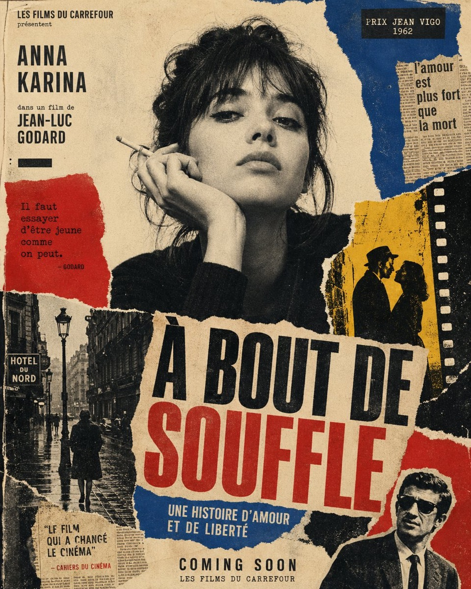</a>

生成具有撕纸、复印颗粒、网点和手工拼贴质感的法国新浪潮电影海报。 · 影视叙事

来源：[@bananaprompts](https://x.com/bananaprompts/status/2048541390900994476) · 来源提示词 / 翻译整理

**完整提示词**

```text
Create a vertical poster composition on aged cream paper with a handmade analog feel. Use rough ripped paper edges, layered magazine cutouts, photocopy grain, halftone texture, ink bleed, and slightly imperfect screen-print registration. Keep the subject as the main black-and-white photographic portrait, placed prominently in the center or upper center. Surround the subject with graphic blocks of deep red, cobalt blue, warm yellow, black, and ivory.

Add supporting collage fragments such as a rainy European street, film-strip borders, newspaper clippings, urban silhouettes, and cinematic details, arranged like a handmade 1960s art-house movie poster. Use bold condensed typography with a strong visual hierarchy. Add large headline text: "[MAIN TITLE]". Add smaller subtitle text: "[SUBTITLE]". Add bottom text: "[BRAND NAME / EVENT NAME / COMING SOON / DATE]". If needed, include a small top line reading "[TAGLINE]".

The final result should feel cinematic, intellectual, rebellious, and editorial — like a lost 1960s European film poster with a strong point of view. Keep it raw, tactile, printed, imperfect, and handmade. Avoid a glossy modern finish.
```

**可复用模板**

[查看对应模板](../templates/image.md#image-french-new-wave-torn-paper-poster)

<a id="image-ed61eb227d"></a>

### 反射式滑雪装备落地页

<a href="../assets/cases/image-ed61eb227d.jpg">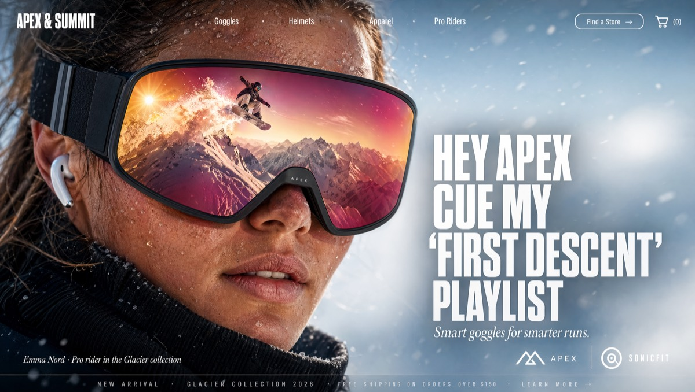</a>

生成高端滑雪装备品牌的横版网页主视觉，以护目镜特写和镜片内动作反射讲述产品场景。 · 网页界面

来源：[@surreal_pencil_sage24](https://higgsfield.ai/publications/0a69afb4-50d7-4ed7-aa39-48b16353f4e2) · 来源提示词 / 翻译整理

**完整提示词**

```text
创建一张 16:9 横版高端滑雪装备品牌落地页主视觉，品牌为“{brandName}”，产品为“{productName}”。背景从雪白过渡到浅冰蓝，漂浮少量带运动模糊的雪粒。

顶部设置极简导航、门店按钮和购物袋图标。主体是偏左构图的运动员超近景肖像，佩戴无真实标识的超大镜面滑雪护目镜。镜片由琥珀金过渡到深洋红，并清晰反射另一位运动员从雪山山脊跃起、粉雪飞散的动作瞬间；反射需要跨越两片镜片自然连续，成为画面核心。人物面部和镜片锐利，边缘逐渐柔化，雪地反光为皮肤提供自然补光。

右侧使用四行紧凑的粗窄体大标题“{headline}”，表达语音命令或产品主张；其下放斜体副标题“{subheadline}”。底部加入原创品牌组合标识、运动员信息和新品服务条。

整体呈现高性能、科技感、年轻而克制的商业摄影。配色以冰蓝、雪白、琥珀金、洋红、自然肤色和深炭灰为主。确保反射场景可辨识、文字不压住眼镜主体，不出现真实品牌 Logo。
```

**可复用模板**

[查看对应模板](../templates/image.md#image-reflective-ski-gear-landing-page)

<a id="image-aa535c1f0d"></a>

### 分割画布编辑艺术海报

<a href="../assets/cases/image-aa535c1f0d.jpg">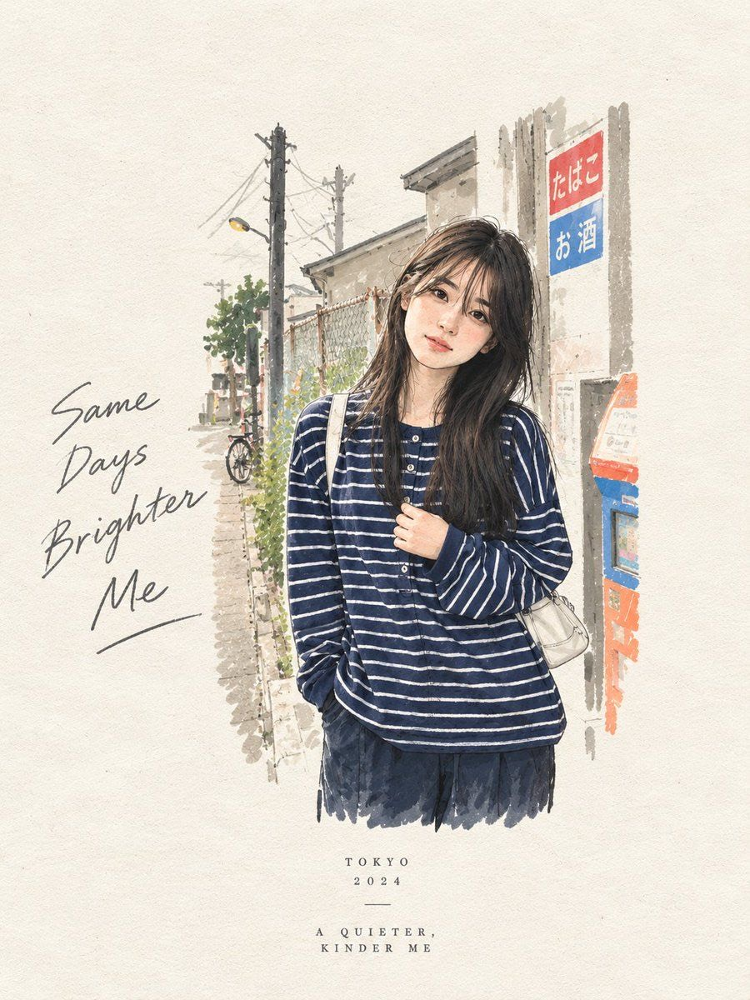</a>

生成具有分割画布、人物与编辑排版关系的艺术海报。 · 海报设计

来源：[@𝗦𝗮𝗻𝗶𝗮](https://x.com/saniaspeaks_/status/2097176979497791899) · 来源提示词 / 翻译整理

**完整提示词**

```text
为每一张上传的照片创作一张高级编辑艺术海报，将每张图像视为独立的构图，切勿将多张照片合并在一起。使用严格的 3:4 竖版格式，将画布水平平分为两等份：上半部分应保持对原始图像忠实且逼真的呈现，保留主体确切的身份、面部特征、比例、姿势、服装、物体、构图、光影、氛围和自然色彩，仅在必要时通过精致的编辑级调色和无缝的环境扩展进行增强；下半部分应将视觉叙事转化为完全不同的艺术诠释——在一个宽广且温暖的 ivory 留白空间中心，放置一件构图精巧、微小的手工混合媒介艺术品，其占下半部分的比例不超过 10%–20%。使用富有表现力的水墨素描、层叠的水粉色块、微妙的拼贴纹理、撕纸边缘、不完美的笔触、可见的纤维、柔和的颜料变化以及迷人的人文瑕疵，同时保留原始照片中最具辨识度的轮廓、姿态、物体和情感叙事。从每张照片中提取最多四种主导的和谐色彩，并以柔和、高级的色调重新诠释。仅在真正提升构图效果时添加偶尔出现的低调编辑排版，例如诗意的标题、地点、日期或单个单词。整体效果应如同可收藏的当代艺术出版物封面——极简、诗意、有质感、优雅、情感宁静、视觉独特，并与原始照片有着不可磨灭的联系。
```

**可复用模板**

[查看对应模板](../templates/image.md#image-split-canvas-editorial-art-poster)

<a id="image-5efc7ec9c3"></a>

### 分级英语杂志阅读页

<a href="../assets/cases/image-5efc7ec9c3.jpg"></a>

根据指定主题、CEFR（欧洲语言共同参考框架）英语等级和正文词数，生成一张高级黑白报刊社论风英文杂志阅读页。适合作为不同英语水平的分级阅读材料。 · 教育科普

来源：[knowledgefxg](https://x.com/knowledgefxg/status/2096249812194869289) · 来源提示词 / 翻译整理

**完整提示词**

```text
主题：{主题} / 英语等级：{A1-C2} / 正文词数：{推荐350–550词}

生成一张高级黑白报刊社论风英文文章版式，整体视觉像高端文学杂志、文化期刊或报纸专题页。

文章语言必须使用英语，并严格按照第一行指定的 CEFR 英语水平进行写作。英语等级可填写 A1、A2、B1、B2、C1 或 C2；“主题”为文章主题；“正文词数”为目标英文正文词数。

英语内容难度要求：

- A1：使用非常基础、高频词汇和简单短句，句式清晰直接，适合英语初学者。
- A2：使用常见生活词汇、简单连接词和基础复合句，表达自然易懂。
- B1：使用较丰富的日常与抽象词汇，加入原因、例子和观点表达，句式有一定变化。
- B2：使用较成熟的议论文表达、较丰富词汇和复杂句式，观点清晰、有逻辑层次。
- C1：使用高级、准确且自然的英语，词汇丰富，句式复杂，具有文学和评论文章质感。
- C2：使用接近高水平母语文化评论或文学社论的英语，允许细腻修辞、复杂句法、抽象概念与富有层次的论证，但保持自然、清晰和可读性。

无论选择哪个等级，都必须确保文章真正符合该 CEFR 难度，而不是只更换少量高级或简单词汇。根据语言等级自动调整观点复杂度、句子长度、词汇难度、抽象程度和论证深度。

文章必须围绕第一行指定的主题展开，并尽量将正文控制在指定词数左右，允许约 ±10% 的浮动。

页面顶部设置简洁的英文报刊刊头、栏目名称、日期和细横线分隔，例如：

“THE LITERARY REVIEW”

“ESSAY / CULTURE”

以及英文日期。

页面中央使用超大号优雅高对比度衬线字体作为英文主标题。主标题应根据主题自动生成自然、简洁、有编辑感的英文标题，不要机械地直接复制主题。

标题下方居中放置英文作者署名，例如：

“By Knwoledgefxg”

页面采用严格的编辑设计网格和经典多栏排版。正文为三栏窄幅英文文章，两端对齐，段落紧凑、字距自然，呈现真实英文报刊文章视觉效果。

左侧设置一块醒目的粗体斜体英文引言或金句区域，内容从文章核心观点中提炼，长度约 1–3 句，并搭配粗细适中的横线。该引言的语言难度必须与指定英语等级保持一致。

页面中部放置一张大幅黑白纪实摄影，摄影内容应根据文章主题自动选择与内容相关的现实场景。摄影风格真实、克制、纪实，不使用插画风格。照片下方设置小号英文图片说明文字，语言简洁自然，并符合指定英语等级。

整体视觉克制、理性、文学感强、知识感强，具有传统新闻出版物和高端文化杂志的高级感。字体以高对比度衬线字体为主，视觉气质类似 Didot、Bodoni、Times 或经典报刊字体。标题优雅而庄重，正文紧凑规整，斜体仅用于引言、署名或强调信息。

页面使用暖白色、略带泛黄感的新闻纸材质，加入轻微纸张褶皱、自然折痕、印刷颗粒、轻微油墨晕染、细微套印误差和胶片颗粒感，形成真实传统纸媒印刷效果。

整体仅使用黑色、深灰色和米白色，不使用鲜艳颜色，不使用渐变，不使用现代 UI 元素，不使用插画，不使用未来科技感，不使用霓虹效果。

页面底部设置一个细线边框的信息框或行动号召区域，内部使用居中的大号斜体衬线英文文字。内容应是一句与文章主题相关的简短总结、反思或行动号召，并符合指定英语等级。

竖版构图，完整单页英文杂志专题设计，正面视角，充足留白，严格编辑网格，精致排版，高级、克制、经典、文学、知识型、editorial design aesthetic。

重要要求：

1. 页面中的所有可见文章文字必须为英语。
2. 所有正文、标题、副标题、引言、图片说明和底部文案都必须语义自然，不使用随机乱码或无意义占位文本。
3. 英语内容必须严格符合第一行指定的英语等级。
4. 正文长度尽量接近第一行指定的词数。
5. 正文必须围绕第一行指定的主题展开，并像一篇真实完整的英文文章，而不是文字填充。
6. 保持版面视觉高级感的同时，确保英文正文具有足够可读性。
7. 更换第一行参数后，其余提示词无需修改即可重复使用。
```

**可复用模板**

[查看对应模板](../templates/image.md#image-graded-english-magazine-reading-page)

<a id="image-9dc00fd4c2"></a>

### 复古科学植物学海报

<a href="../assets/cases/image-9dc00fd4c2.jpg"></a>

生成带解剖编号、手写注记和科学图版排版的植物学海报。 · 教育科普

来源：[@AlexAImaginator](https://x.com/TraffAlex/status/2095583733264879803) · 来源提示词 / 翻译整理

**完整提示词**

```text
一张印在米色纸张上的科学植物学海报。画面中心是一朵巨大的 勿忘我 水彩画，包含根部，茎和花瓣上带有细小的编号标签。顶部为斜体衬线字体标题："FORGET-ME-NOT"。副标题："A FIELD PLATE"。底部："PLATE VII · 1887"。边缘处有铅笔笔记。米色、靛蓝色、绿色，2:3 纵横比。
```

**可复用模板**

[查看对应模板](../templates/image.md#image-vintage-scientific-botanical-poster)

<a id="image-909ac5b599"></a>

### 复古手账海报排版

<a href="../assets/cases/image-909ac5b599.jpg">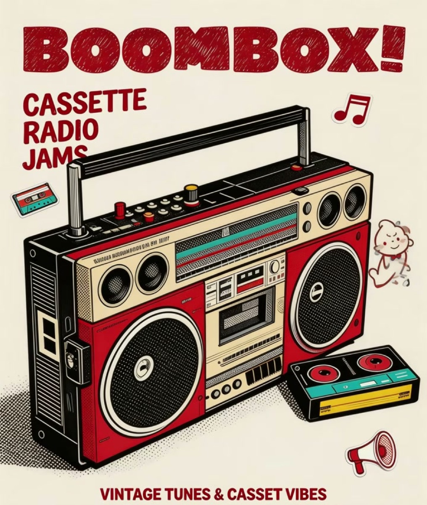</a>

以一张排版参考图和一张主体插画，设计主题一致的复古手账海报。 · 海报设计

来源：[小洁AI实战](https://www.douyin.com/video/7624869691328485361) · 根据来源整理的适配提示词

**完整提示词**

```text
输入约定：图一为海报排版与文字风格参考，图二为已经完成的复古插画主体。只有图二的主体可以出现在最终海报中，不复制图一的角色、产品、品牌或其他具体素材。

参考图一的标题层级、字形气质、排版节奏、留白比例和装饰图案风格，为图二生成一张新的竖版复古手账海报。严格保持图二主体的身份、轮廓、姿态、关键结构、网点纹理和绘画风格，不重新设计主体。

标题、简短副标题、底部说明和小型装饰围绕图二主题展开，文案与配色根据图二内容对应调整。使用粗体复古展示字、少量手写感辅助字、相关的小图标和纸张印刷纹理。文字清晰可读，不遮挡主体，整体层级明确、留白合理。

如果已提供具体文案，原样使用；否则只生成与图二主题一致的简短描述，不编造功效、价格或商业承诺。不出现图一的品牌、标志或水印，不输出参考图对比、教程字幕或分屏。
```

**可复用模板**

[查看对应模板](../templates/image.md#image-retro-scrapbook-poster)

<a id="image-0cac842543"></a>

### 复古网点插画转绘

<a href="../assets/cases/image-0cac842543.jpg">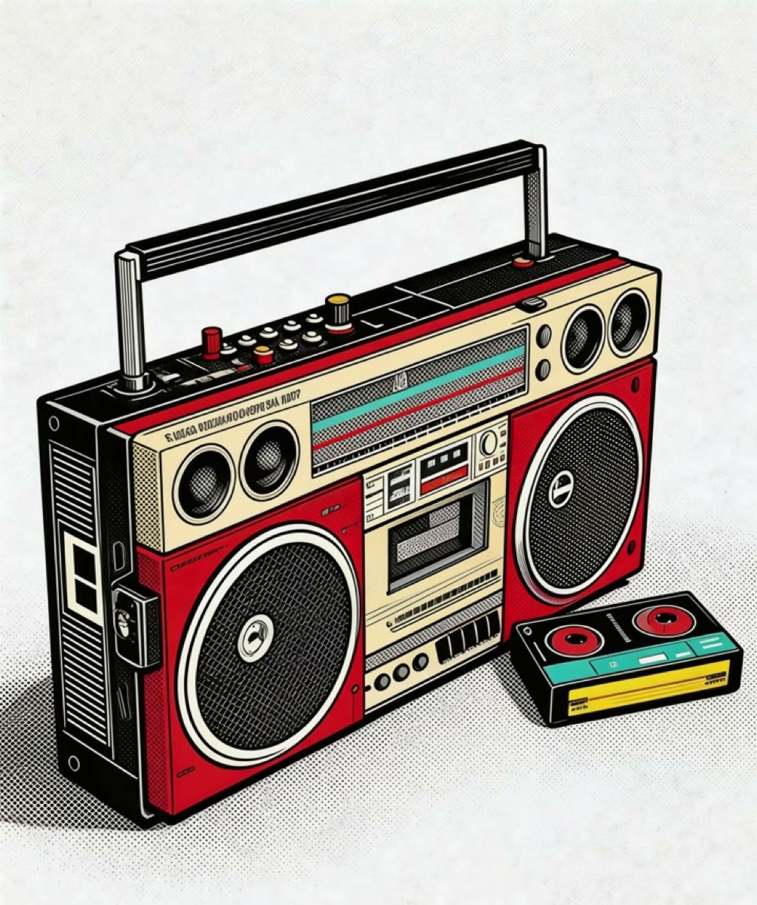</a>

上传原照片，将主体转绘为粗黑轮廓、半色调网点与有限配色的复古插画。 · 图片转绘

来源：[小洁AI实战](https://www.douyin.com/video/7624869691328485361) · 根据来源整理的适配提示词

**完整提示词**

```text
将上传的原照片转绘为复古网点插画。以照片中的主体为依据，保持主体身份、数量、主要轮廓、姿态、视角和关键结构，不添加无关对象。

采用矢量平面插画般的二维造型、波普艺术、复古漫画与儿童绘本风格，带有怀旧 1950 至 1960 年代印刷艺术质感。轮廓使用粗黑线，线条清晰，造型简洁、可爱俏皮、高对比。使用鲜艳饱和但有限的配色，不使用渐变，通过半色调网点的密度表现明暗，不使用写实光影。

突出点状纹理、粗糙印刷质感和略有不规则的手绘痕迹，不追求机械地完美一致。背景为白色细腻颗粒纹理纸，主体完整、清晰，四周留出适度空白。

仅输出插画，不添加标题、说明文字、标志、水印、海报边框或分屏对比。
```

**可复用模板**

[查看对应模板](../templates/image.md#image-retro-halftone-illustration)

<a id="image-36c0a55d6b"></a>

### 概念沙发研发板

<a href="../assets/cases/image-36c0a55d6b.jpg">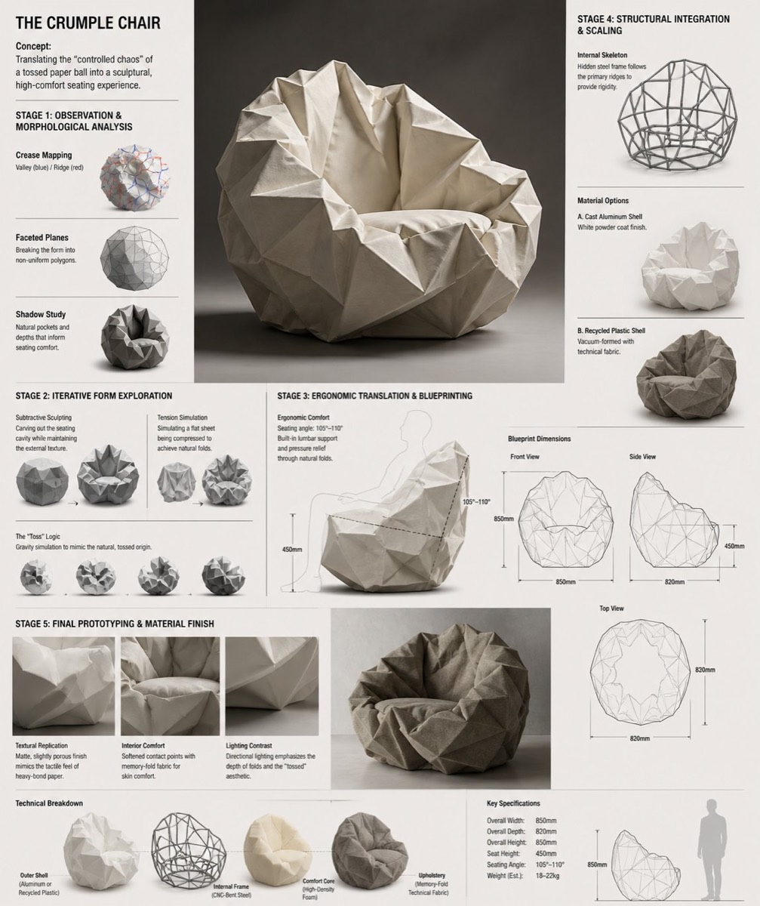</a>

生成从形态观察、结构推导到成品展示的概念家具研发视觉板。 · 设计参考

来源：[@ShamsAmin56](https://x.com/ShamsAmin56/status/2050281206139461780) · 来源提示词 / 翻译整理

**完整提示词**

```text
Design Concept: The Crumple Chair Core Philosophy: Translating the "controlled chaos" of a tossed paper ball into a sculptural, high-comfort seating experience.

Stage 1: Observation & Morphological Analysis The goal is to deconstruct the image of the crumpled paper into usable geometric data. Crease Mapping: Identify the primary "valley" and "ridge" lines. These represent potential structural ribs or seams in the chair. Faceted Planes: Break down the sphere into a series of non-uniform polygons. Each flat surface of the paper becomes a potential panel for the chair’s upholstery or shell. Shadow Study: Analyze how the "tossed" form creates deep recesses. These natural pockets guide where the user’s weight will be cradled.

Stage 2: Iterative Form Exploration Moving from a sphere to a seat through "Digital Crumpling." Subtractive Sculpting: Imagine the paper ball as a solid mass. Use Boolean operations to "carve out" a seating cavity that fits the human form while maintaining the external jagged texture. Tension Simulation: Use 3D software (like Rhino or Blender) to simulate a flat sheet of material being compressed. This ensures the folds look authentic and not "modeled." The "Toss" Logic: Experiment with gravity-based simulation dropping a digital mesh to see how it settles naturally, mimicking the "tossed" origin.

Stage 3: Ergonomic Translation & Blueprinting Refining the raw aesthetic into a functional object. The Comfort Core: Overlay a standard ergonomic template (Seating Angle: 105°–110°) over the crumpled form. Adjust the internal "folds" to provide lumbar support and pressure relief. Blueprint Generation: Create technical orthographic views (Front, Side, Top). Map out the dimensions: Seat Height: 450mm Total Width: 850mm Surface Smoothing: Maintain the sharp "paper edges" on the exterior shell while softening the interior contact points for skin comfort.

Stage 4: Structural Integration & Scaling Making the concept physically viable. The Skeleton: Design a hidden internal frame (likely CNC-bent steel rods or a 3D-printed lattice) that follows the most prominent ridges of the paper folds to provide rigidity. Material Selection: * Option A (High-End): Faceted, cast aluminum with a white powder coat. Option B (Soft): Vacuum-formed recycled plastic shell covered in "memory-fold" technical fabric that retains a wrinkled appearance.

Stage 5: Final Prototyping & Material Finish Textural Replication: Apply a matte, slightly porous finish to the material to mimic the tactile feel of heavy-bond paper. Lighting Contrast: Use directional studio lighting in the final renders to emphasize the "tossed" shadows, making the chair look like a giant piece of discarded inspiration. Design Tip: To keep the "tossed" look authentic, avoid symmetry. The most compelling aspect of a crumpled paper ball is its unique irregularity—ensure the left and right sides of the chair are balance-equivalent but not identical
```

**可复用模板**

[查看对应模板](../templates/image.md#image-concept-sofa-development-board)

<a id="image-e60a5d30a1"></a>

### 高定时尚杂志封面

<a href="../assets/cases/image-e60a5d30a1.jpg">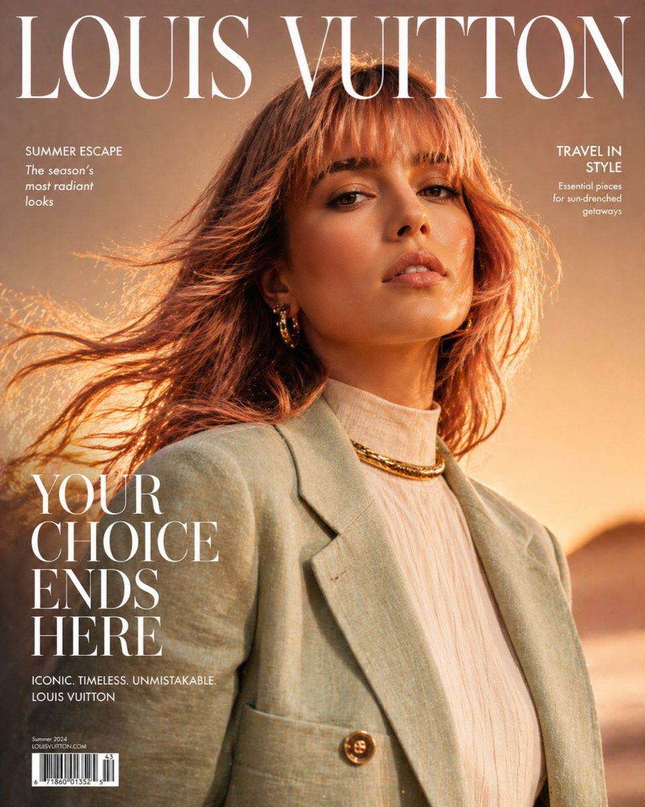</a>

生成带高定人像、夏日金色光线和奢侈时尚排版的杂志封面。 · 海报设计

来源：[@SPEEDAI07](https://x.com/SPEEDAI07/status/2048573343066992919) · 来源提示词 / 翻译整理

**完整提示词**

```text
Ultra high-fashion magazine cover, Louis Vuitton-style editorial. Close-up portrait of a confident woman with soft rose-gold hair and natural airy bangs, slightly wind-blown for movement. She is wearing a luxury summer outfit: a structured lightweight linen or silk jacket in warm golden-yellow tones, layered over a modest high-neck top, paired with a bold gold choker necklace and subtle statement earrings.

Fabric flows naturally with a summer breeze, slightly textured and breathable, capturing a premium seasonal feel. Styling is elegant, modest, and refined — no revealing clothing.

Lighting is high-end studio mixed with natural golden hour glow: warm highlights, soft shadows, luminous skin with glossy editorial finish.

Background is a rich summer gradient (sunset gold fading into soft coral or warm beige), clean but visually striking.

Composition is dynamic and slightly cinematic: hair in motion, shallow depth of field, sharp focus on face.

Typography: large elegant serif masthead "Louis Vuitton" at the top, bold cover line "YOUR CHOICE ENDS HERE" in premium editorial layout, minimal supporting text.

Ultra-realistic, hyper-detailed skin texture, 8K resolution, sharp focus, glossy magazine print quality, cinematic color grading, luxury fashion photography, no nudity, tasteful and editorial.
```

**可复用模板**

[查看对应模板](../templates/image.md#image-haute-couture-fashion-magazine-cover)

<a id="image-7ebb9401a5"></a>

### 高端食品商业广告分镜

<a href="../assets/cases/image-7ebb9401a5.jpg">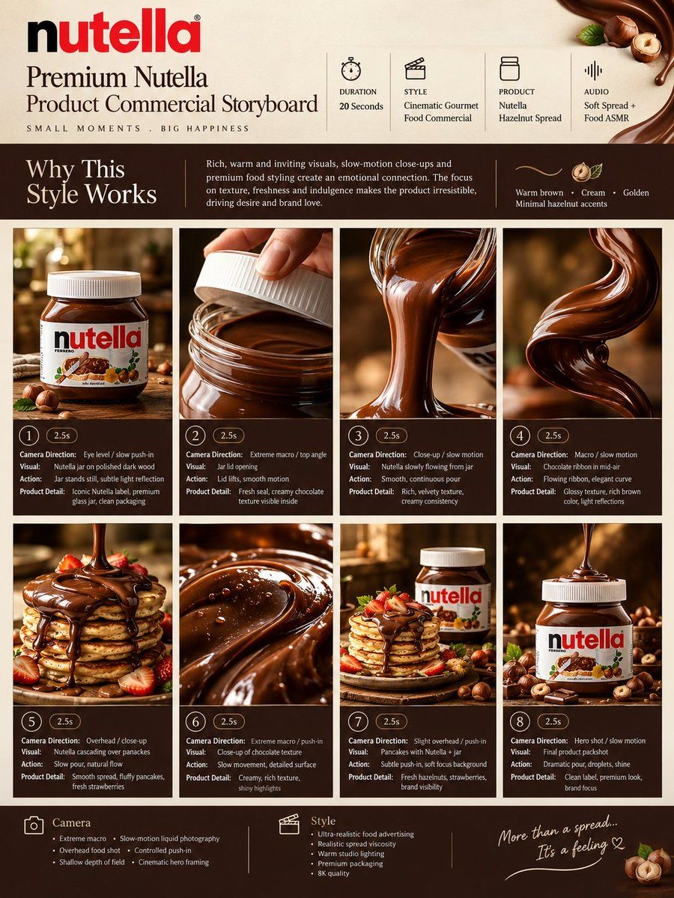</a>

生成单页高端食品广告分镜与镜头项目板。 · 影视叙事

来源：[@ÀBDŪLLÂH](https://x.com/itxabdullaa/status/2096915887504982258) · 来源提示词 / 翻译整理

**完整提示词**

```text
标题： 高端 {productName} 产品商业项目 格式： • 单页高端项目 • 3:4 竖屏比例 • 奢华食品广告 • 8 个电影级产品特写场景 • 产品始终作为核心主角 • 高端广告代理商演示风格 页眉： • 优雅的衬线字体 • 信息卡片： - 时长：20 秒 - 风格：电影级美食广告 - 产品：{productName} - 音频：柔和的涂抹声 + 食物 ASMR • “为何这种风格有效”板块 • 温暖的棕色、奶油色和金色美学 • 极简的榛子装饰元素 项目： 1. 高端 {productName} 罐装产品放置在抛光的深色木质表面上 2. 极微距视角下的瓶盖开启瞬间 3. 奶油质感的 {productName} 从罐中缓慢涂抹而出 4. 巧克力酱在半空中形成光泽丝带状 5. {productName} 倾泻在松软的煎饼上 6. 展现浓郁巧克力质感与微小反光的极微距镜头 7. 煎饼塔与主角罐装产品及榛子环绕陈列 8. 带有戏剧性 {productName} 涂抹效果的最终奢华产品定格画面 每个面板： • 场景编号 • 时长标签 • 运镜方向 • 视觉画面 • 动作描述 • 产品细节 摄像机： 极微距、慢动作涂抹摄影、俯视食物拍摄、受控推入镜头、浅景深、电影级主角构图。 风格： 超写实食品广告、逼真的涂抹粘稠度、光泽巧克力质感、温暖的摄影棚灯光、高端玻璃包装、精致的美食呈现、8K 分辨率。
```

**可复用模板**

[查看对应模板](../templates/image.md#image-premium-food-commercial-storyboard)

<a id="image-f1b82a90e6"></a>

### 格林童话木刻版画海报

<a href="../assets/cases/image-f1b82a90e6.jpg">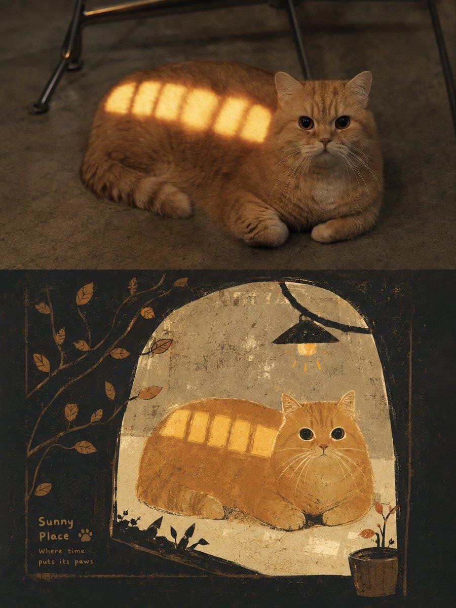</a>

将人物、动物、建筑或场景照片转化为具有童话叙事、木刻版画和手工印刷质感的海报。 · 海报设计

来源：[@小小东](https://x.com/xiaoxiaodong01/status/2089987808664719723) · 来源提示词 / 翻译整理

**完整提示词**

```text
请将我上传的每一张照片分别制作成一张独立的高级设计海报，不多图拼接，每张照片单独输出。整体采用3:4竖版构图，上下两个区域高度严格1:1，各占画面50%，并确保该表达方式可适配人物、动物、建筑、静物、自然场景等不同主题，而不限于城市题材。 上半部分保留原始照片，保持主体身份、动作、空间关系、真实质感、自然光影和原有色彩氛围，仅进行轻微高级摄影调色，使其具有杂志摄影与艺术出版物的质感。为适配画幅，可自然扩展天空、地面或环境背景，但不得拉伸、扭切或改变主体。 下半部分提取照片中最具识别性的主体、轮廓、姿态与叙事关系，重构为童话版画式手绘图像。不要机械描摹细节，而是将主体压缩为一两个清楚的大体块，以钝拙剪影、略微夸张的比例和少量关键边缘，保留原始对象的身份、动作、功能与情绪。画面从原图内容中提炼出一个大面积低明度或高反差的结构场，作为包裹主体的容器、路径、框架或密度层；背景像故事发生的外壳一样从原图空间与意义中生长出来，形成遮挡、裁切、吞没与局部露出的结构叙事。整体采用平面叙事透视和绘本页面式层级，可使用俯视压缩、侧向移动、正面框架、路径引导、尺度跳跃或边缘裁切组织阅读。 配色从上方照片提取，并保持明确的三层关系：大面积暗结构色负责重量与边界，适量浅色或留白负责呼吸，小面积高饱和情绪色负责读图路线与故事信号。最重要的信息仅以少量鲜明色块集中在面部、姿态、路径、器物功能点、环境标识或叙事焦点上，并始终被深色结构或浅色负形压住，让画面鲜艳但不平均。色相可随主题情绪调整，但面积比例与明度秩序保持稳定。 线条只在功能、路径、边界、纹理和识别处出现，保持稀疏、手绘、略不准的细线。所有色块保持平面化处理，同时保留干刷、颗粒、飞白、纸纹、喷点和轻微套印错位，呈现丝网印刷与粉蜡笔共同完成的手工质感，避免写实光影、复杂体积、光滑矢量边缘、3D渲染和塑料质感。 整体构图简洁、低细节、高识别，暗场包裹亮色信号，兼具可爱叙事与厚重版画感。若画面包含文字，可将文字处理为小标识、物体面板或边缘注释，数量精简，服从图形结构；字形圆钝，粗细略不均，密度低，带有自然手写感，使其像画面的一部分而不是后期贴上去的说明。整体参考童话绘本、手工版画、编辑插画与艺术出版物气质，呈现统一、鲜明、可迁移的作者化视觉语言。
```

**可复用模板**

[查看对应模板](../templates/image.md#image-grimm-fairy-tale-woodcut-poster)

<a id="image-ae6e4d57d6"></a>

### 极简抽象几何解构海报

<a href="../assets/cases/image-ae6e4d57d6.jpg">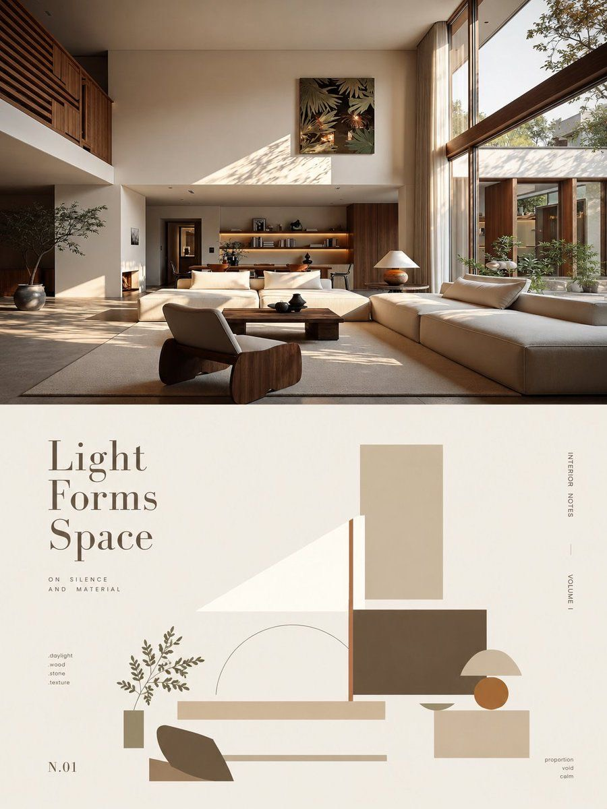</a>

把照片中的结构、色彩和记忆点解构为极简几何形体，并结合艺术出版物式微排版生成海报。 · 海报设计

来源：[@小小东](https://x.com/xiaoxiaodong01/status/2090123569984679990) · 来源提示词 / 翻译整理

**完整提示词**

```text
请将我上传的每一张照片分别制作成一张独立的高级设计海报，不多图拼接，每张照片单独输出。整体采用3:4竖版构图，上下两个区域高度严格1:1，各占画面50%。

上半部分保留原始照片，保持主体结构、空间关系、真实材质、自然光影和原有色彩氛围，仅进行轻微高级摄影调色，使其具有艺术杂志、独立出版物与展览摄影质感。为适配画幅，可自然扩展环境背景，但不得拉伸、扭曲或改变主体。

下半部分以干净象牙色背景，提取照片中最具识别性的主体、轮廓、姿态与叙事关系，按照“解构—筛选—提炼—重构”的逻辑转化为极简抽象视觉。重点保留最独特的体量比例、轴线、曲线、穿插、层叠、遮挡、负空间与非对称关系，用少量几何形体重新组织；不完整复刻细节，但必须一眼感受到与上方原图的对应。构图强调视觉重心、尺度差、主次层级、正负形和留白节奏，避免图标化、平均排列和零碎堆积。

配色全部从上方照片中提取并精简为1个主色、1个深色结构色、1个浅/中性色，最多加入少量关键强调色。优先保留原图中最有辨识度、最有精气神的颜色，通过面积比例、深浅关系和局部对比建立层次，保持干净、克制而有生命力，避免整体灰化与平均用色。

文字建立完整的高级编辑式微排版系统：从照片的光影、空间、动作、材质或情绪中提炼一个2–5词的诗意英文主标题，同时搭配2–4组极小辅助文字，可由短句、状态词、地点或对象信息、编号、章节标记、序列号、尺度式数字、方向词、材质词、档案式标签或微型说明自由组合，不使用年份。主标题负责情绪，小字负责秩序与细节，使文字像艺术书、建筑期刊或展览图录中的编辑注释，而不是普通标题。

文字必须与抽象图形共同构图，可沿几何轴线、边缘、轮廓或负空间排列，也可纵排、旋转、分栏、拉开字距、贴边、压角、跨越色块、嵌入形体之间或与主体形成穿插和对齐；允许一组文字极小、一组稍大，通过字号反差、字距、方向和位置建立阅读路径。整体使用克制的衬线字体与细瘦编辑字体组合，让抽象形体负责视觉记忆，文字负责结构、节奏与高级感。

整体呈现真实摄影 × 抽象记忆 × 编辑排版的视觉气质，现代、安静、克制、精致、艺术化且具有收藏感，避免复杂拼贴、廉价装饰、商业模板感和无意义抽象。
```

**可复用模板**

[查看对应模板](../templates/image.md#image-minimal-abstract-geometric-deconstruction-poster)

<a id="image-0b30d56a9e"></a>

### 极简概念线条艺术海报

<a href="../assets/cases/image-0b30d56a9e.jpg">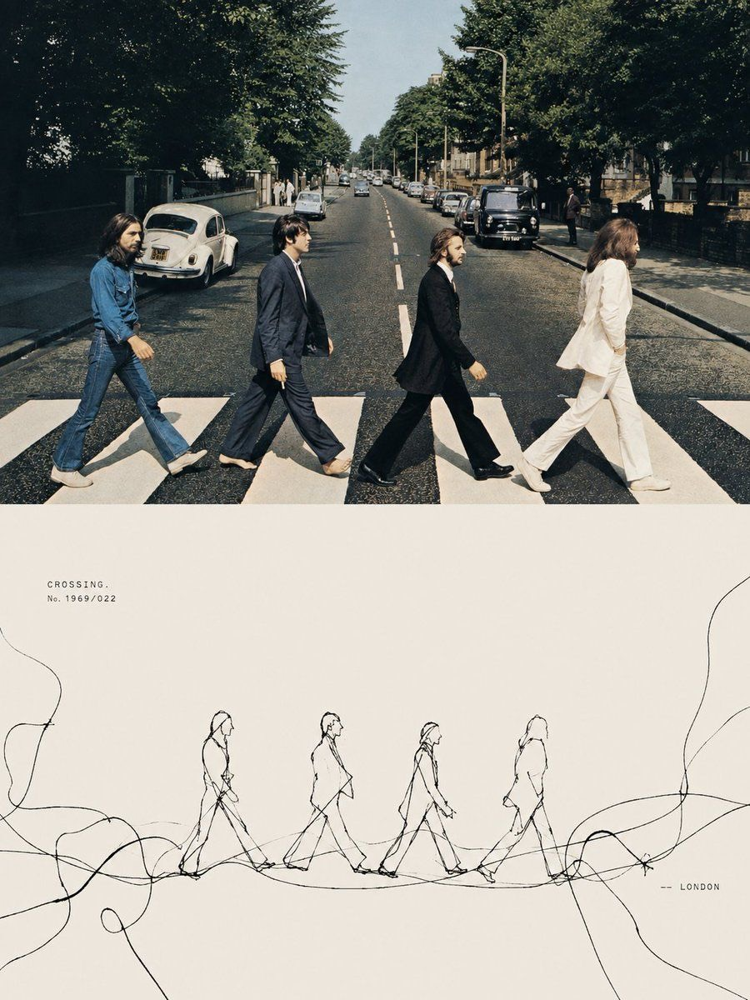</a>

把照片重构为带有公共议题气质、强调张力与留白的极简概念线条艺术海报。 · 海报设计

来源：[@小小东](https://x.com/xiaoxiaodong01/status/2089959872876228689) · 来源提示词 / 翻译整理

**完整提示词**

```text
请将我上传的每一张照片分别制作成一张独立的高级设计海报，不多图拼接，每张照片单独输出。整体采用3:4竖版构图，上下两个区域高度严格1:1，各占画面 50%。 上半部分保留原始照片，保持主体结构、真实质感、自然光影和原有色彩氛围，仅进行轻微高级摄影调色，使其具有杂志摄影、艺术出版物和公共议题影像的克制质感。为适配画幅，可自然扩展天空、地面或环境背景，但不得拉伸、扭曲或改变主体。 下半部分提取照片中最具识别性的主体、轮廓、姿态与叙事关系，重构为一幅极简、克制、带有公共议题气质的观念线条插画。不机械描边，不复制背景、光影和复杂细节，而是提炼原图中的方向、连接、矛盾、压力与转机，将其压缩成一组连续的黑色手绘线条。线条如被拉紧的细铁丝、路径、束缚或伤口，从画面边缘进入，在下方盘绕、交错、回折与收紧，再沿内在力量逐渐向上或向外抬升，并在运动中自然显露出与原主体有关的象征轮廓；保持一眼可感知原物，但不必完整封闭或直接解释。 画面以冷白、米白或低饱和浅色为底，大面积留白，主体偏下、偏侧或靠近边缘，不居中、不铺满。线条粗细略有变化，保留墨线的摩擦、迟疑、断裂与压力感；尖刺、结点、倒钩或短横仅出现在受力、交叉和方向改变的位置。整体安静而紧张，简洁却不轻松，意义在线条的缠绕、限制、穿越、收紧与释放之间逐渐显现。 文字只作极少量使用，可加入简短英文主题词、编号、地点或适配金句，但必须像线条系统中的一个微小痕迹，以纤细、克制、略带手工感的排版融入空白或线条转折处，不成为视觉中心，也不直接解释画面。整体参考现代主义观念海报、社会议题视觉、艺术出版物和实验编辑设计，避免复杂场景、写实光影、三维质感、多色填充、卡通感、商业广告感、装饰性曲线和无意义的视觉丰富。
```

**可复用模板**

[查看对应模板](../templates/image.md#image-minimal-conceptual-line-art-poster)

<a id="image-05bd56fd6f"></a>

### 建筑照片概念草图双联海报

<a href="../assets/cases/image-05bd56fd6f.jpg">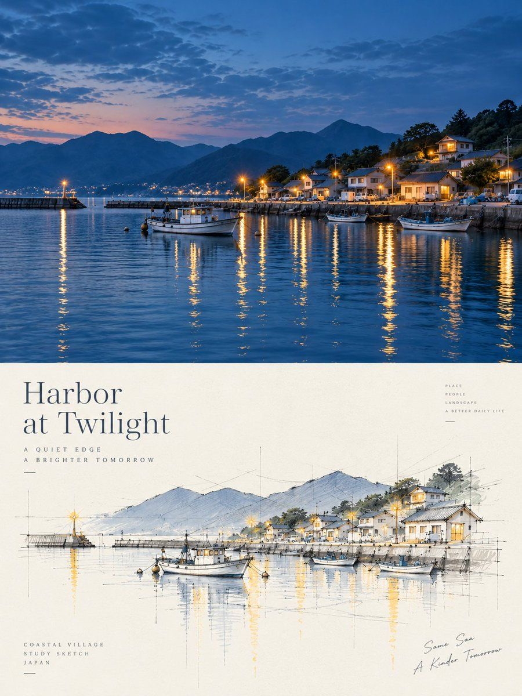</a>

把上传照片转化为上方实景、下方建筑概念草图的双联海报。 · 设计参考

来源：[@小小东](https://x.com/xiaoxiaodong01/status/2096290195792642498) · 来源提示词 / 翻译整理

**完整提示词**

```text
请将我上传的每一张照片分别制作成一张独立的高级设计海报，不多图拼接，每张照片单独输出。整体采用 3:4 竖版构图，上下两个区域高度严格 1:1，各占画面 50%。上半部分保留原始照片，保持主体身份、结构、姿态、真实质感、自然光影和原有色彩氛围，仅进行轻微高级调色，使其具有艺术杂志与展览图像质感。为适配画幅，可自然扩展环境背景，但不得拉伸、扭曲或改变主体。下半部分只提取照片中最具识别性的主体、轮廓、结构、姿态与叙事关系，重构为建筑概念透视草图 / 建筑方案表现手绘。不要完整保留场景，不要逐物复制照片；主动删去大部分背景、配景和无关细节，只留下最能代表原始主题的核心形体、空间关系与视觉记忆点。下半部分重新做美术判断。哪怕原图构图差、背景乱、主体小，也要通过删减、重组、裁切、尺度变化和留白，把它救成一张成立的作品，真正赋予模型重新导演画面的权力。画风采用自由徒手透视线稿 + 少量选择性色块。线条松弛、克制、略带重复与停顿感，可保留少量辅助线、延长线、构造线与建筑手绘的几何参考线，形成明确的设计推敲感。色彩只在少数关键部位轻微铺陈，用于强调主体、结构层次、局部阴影或空间重点，其余区域尽量不画。画面必须以大量有意识的留白为核心。主体应更小、更精炼，其余空间大面积留空。留白不是空背景，而是构图的一部分，要与主体、线稿、参考线、阴影和少量色块共同形成呼吸感、空间感与节奏感。主体可偏心、贴边、局部裁切或缩小尺度；宁可少画，也不要填满。可加入少量几何阴影色块强化体量、进深与空间层次，但避免厚重渲染、复杂环境和写实效果图感。背景保持极简，只保留极少量必要的场地暗示。配色从上方照片中提取 2–4 种最具识别度和生命力的颜色，重新整理为更干净、克制、耐看的草图色系。整体可适度提亮、提纯、去灰，以米白、浅灰、暖灰、柔和绿色、淡木色、浅蓝灰等为主，局部保留少量更鲜明但不刺眼的点睛色。避免脏灰、暗沉、过度复古和廉价高饱和感。文字只作极少量编辑性介入，不限制语种。可根据主体、地点、动作或情绪生成少量字词、短句或注记，安静地落在留白区域，与画面形成克制的图文关系。整体呈现建筑概念手绘、自由线稿、几何参考线、少量色块、几何阴影、超大量留白与编辑式排版共同构成的高级视觉效果。避免完整场景保留、逐物复制、复杂背景、满幅上色、写实效果图、粗重描边、卡通感、3D感和模板化表现。
```

**可复用模板**

[查看对应模板](../templates/image.md#image-architecture-photo-concept-sketch-diptych)

<a id="image-25ed063581"></a>

### 浆果冰沙商业摄影

<a href="../assets/cases/image-25ed063581.jpg">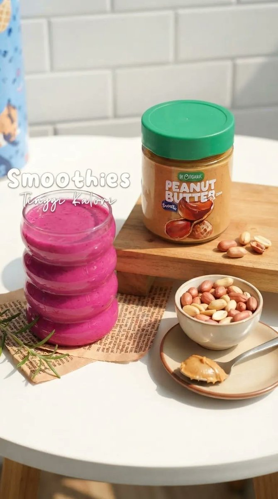</a>

生成具有广告质感的饮品产品摄影。 · 商业广告

来源：[@Dua Fatima](https://x.com/DuaFatimaAi/status/2096555489073279173) · 来源提示词 / 翻译整理

**完整提示词**

```text
在明亮舒适的现代厨房中，创作一张超写实的高端食品摄影作品。左侧的白色圆桌上，垂直摆放着一组 鲜艳浓郁的粉色浆果冰沙，盛装在 三个小型透明玻璃罐叠放 中。冰沙质地浓稠细腻，带有细微的浆果颗粒和光泽感。右侧放置一个带有绿色盖子的透明 有机花生酱 罐，里面装满了金棕色的奶油花生酱。请准确还原产品包装、标签位置、颜色和比例。在罐子旁边自然地散落几颗完整的花生。前景处放置一个装有混合烤花生的小陶瓷碗，以及一个米色陶瓷盘，盘中放着一把盛有满满一勺奶油花生酱的勺子。在冰沙旁点缀几枝精致的绿色香草。背景：整洁的白色地铁砖厨房墙面，侧面照射的柔和自然光，微妙的阴影，营造出温暖舒适的氛围。将食物放置在一个小型木制项目上，下方垫着一张复古印花纸。在左上角添加优雅的手写风格白色文字“Smoothies”，下方配以较小的草书文字“Tingi Kalori”。垂直 9:16 构图，高端商业食品摄影，逼真的质感，自然日光，浅景深，柔和的背景虚化，清晰的产品细节，平衡的构图，温暖的生活方式美学，照片级真实感，高分辨率，无人物。
```

**可复用模板**

[查看对应模板](../templates/image.md#image-berry-smoothie-commercial-photo)

<a id="image-89fc3234ea"></a>

### 街头卷轴背景时尚大片

<a href="../assets/cases/image-89fc3234ea.jpg">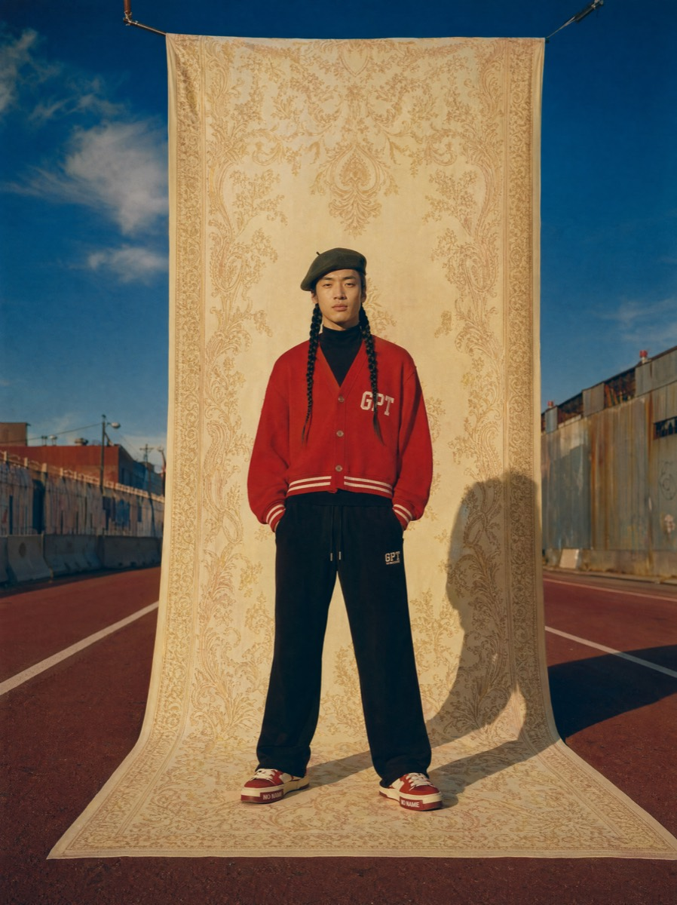</a>

生成把手工卷轴摄影背景放入真实街道的时尚广告大片，以棚拍秩序和户外环境形成视觉对照。 · 商业广告

来源：[@renaissance_soda_warm52](https://higgsfield.ai/publications/e17319aa-0fd3-4868-b158-f7f16330c8e1) · 来源提示词 / 翻译整理

**完整提示词**

```text
创建一张竖版全身时尚广告摄影。人物 `{subjectDescription}` 居中站在一条空旷城市街道上，身后悬挂一张从高处垂落并铺到脚下的巨型手工卷轴布景。布景使用 `{backdropColor}` 与 `{patternDescription}`，像一个便携摄影棚被放进真实街道。

人物正面面对镜头，姿态放松自信，穿着 `{outfitDescription}`，服装无真实品牌标识。卷轴两侧仍能看到真实环境：旧仓库墙、道路标线、低矮路障和开阔天空。让深冷天空占上三分之一，暖色布景与人物占中间，街道路面和标线稳定下方结构。

采用黄金时段自然侧光，人物一侧形成柔和长影，背景略带绘画感柔焦，人物保持锐利。使用中画幅胶片质感、轻微颗粒和柔和高光过渡。配色以 `{skyColor}`、`{backdropColor}`、`{heroGarmentColor}`、黑色和一个鞋履点缀色为主。整体对称、克制、具有 1990 年代时尚杂志大片气质，重点表现“户外实景与棚拍背景并存”的空间错位。
```

**可复用模板**

[查看对应模板](../templates/image.md#image-street-scroll-backdrop-fashion-editorial)

<a id="image-efcccbca0c"></a>

### 界面交互设计图

<a href="../assets/cases/image-efcccbca0c.jpg">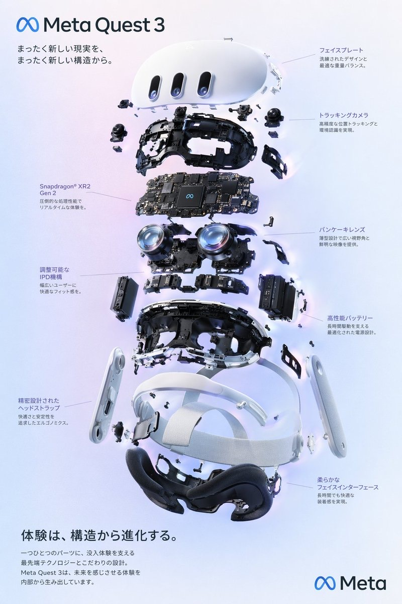</a>

生成带产品部件分层、功能标注和科技视觉效果的 VR 头显爆炸拆解展示图。 · 信息图表

来源：[@wory37303852](https://x.com/wory37303852) · 来源提示词 / 翻译整理

**完整提示词**

```text
{
  "type": "exploded view product diagram poster",
  "subject": "VR headset",
  "style": "clean high-tech 3D render, studio lighting, glowing accents",
  "background": "{argument name=\"background color\" default=\"soft purple and blue gradient\"}",
  "header": {
    "logo": "∞ {argument name=\"product name\" default=\"Meta Quest 3\"}",
    "subtitle": "{argument name=\"main catchphrase\" default=\"まったく新しい現実を、まったく新しい構造から。\"}"
  },
  "layout": {
    "centerpiece": "vertically stacked exploded view of a VR headset showing 9 distinct layers of internal components: outer shell, camera sensors, motherboard with chip, pancake lenses, internal frame, battery packs, side straps, top strap, and facial interface cushion.",
    "callout_labels": {
      "count": 8,
      "left_side": [
        "Snapdragon® XR2 Gen 2\n圧倒的な処理性能でリアルタイムな体験を。",
        "調整可能なIPD機構\n幅広いユーザーに快適なフィット感を。",
        "精密設計されたヘッドストラップ\n快適さと安定性を追求したエルゴノミクス。"
      ],
      "right_side": [
        "フェイスプレート\n洗練されたデザインと最適な重量バランス。",
        "トラッキングカメラ\n高精度な位置トラッキングと環境認識を実現。",
        "パンケーキレンズ\n薄型設計で広い視野角と鮮明な映像を提供。",
        "高性能バッテリー\n長時間駆動を支える最適化された電源設計。",
        "柔らかなフェイスインターフェース\n長時間でも快適な装着感を実現。"
      ]
    },
    "footer": {
      "left_text_block": {
        "headline": "{argument name=\"bottom headline\" default=\"体験は、構造から進化する。\"}",
        "body": "一つひとつのパーツに、没入体験を支える最先端テクノロジーとこだわりの設計。Meta Quest 3は、未来を感じさせる体験を内部から生み出しています。"
      },
      "right_logo": "∞ Meta"
    }
  }
}
```

**可复用模板**

[查看对应模板](../templates/image.md#image-vr-headset-exploded-interface-diagram)

<a id="image-6b83c7fc5b"></a>

### 精品电商产品平铺网格

<a href="../assets/cases/image-6b83c7fc5b.jpg">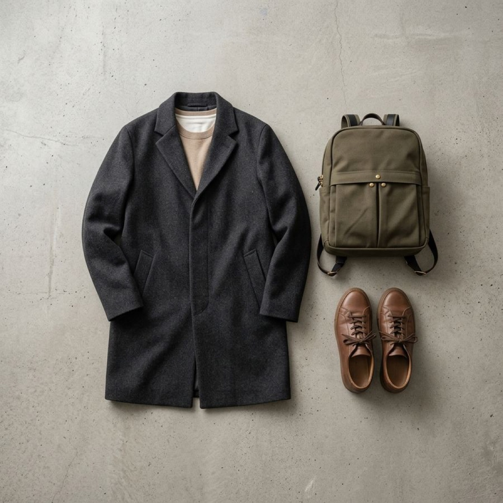</a>

生成精品服饰、配件和生活方式商品的平铺电商展示网格。 · 电商视觉

来源：[@AI Guide-Note - 実務で使えるAI活用メディア](https://x.com/AIGuideNote/status/2096906819713081810) · 来源提示词 / 翻译整理

**完整提示词**

```text
[品牌/产品信息] - 品牌名称：{brandName} - 系列名称：{collection} - 典型商品价格：{backpackPrice} [图像质量、呈现与构图规范] - 风格：适用于日本时尚/生活方式品牌电商网站的极简且精致的 Lookbook 照片。 - 构图：在自然光照射的摄影棚内，将服装单品（包袋、外套、鞋履等）整齐地平铺或有序排列在硬木地板或水泥地面上。 - 排版布局（适用于 GPT-image / Nano Banana Pro）：在画布角落隐约呈现品牌名称 {brandName}、{collection} 文字以及价格标注 {backpackPrice}，并使用超细字体。 - 灯光/色彩：如阴天自然光般柔和，低对比度，以大地色系（米色、橄榄绿、炭灰色、灰白色）为主的沉稳色调。 [布局与输出的严格限制（强制性）] - 输出成品设计本身，并填满整个画布。设计内部的背景和场景描绘（墙壁、空间、阴影）可遵循正文中的说明。 - 禁止事项：带相框的海报照片、贴在墙上的海报照片、放置在桌子或纸张上的样机照片、纸张边缘的透视变形或投影。 - 输出成品 2D 平面设计本身，并填满整个画布。允许包含上述描述的场景元素（墙壁、房间、阴影）。绝对禁止任何海报样机效果：不得出现相框、不得出现贴在墙上或放在桌上的照片、不得出现艺术品边缘的透视变形或投影。 - 宽高比："--ar 1:1" 或 "--ar 4:3"
```

**可复用模板**

[查看对应模板](../templates/image.md#image-boutique-ecommerce-product-flatlay-grid)

<a id="image-908d8579d8"></a>

### 科技产品评测缩略图

<a href="../assets/cases/image-908d8579d8.jpg">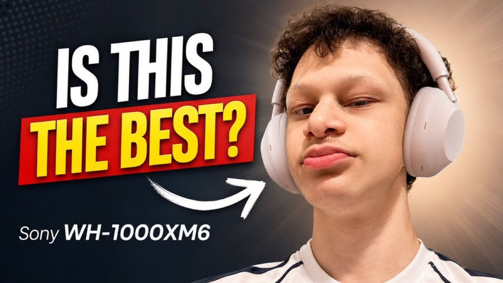</a>

生成科技产品评测视频使用的高点击率横版缩略图。 · 视频缩略图

来源：[@BLCNYY](https://x.com/BLCNYY/status/2090897198351368575) · 来源提示词 / 翻译整理

**完整提示词**

```text
制作一张 16:9 横屏格式、视觉冲击力强的 YouTube 科技评测缩略图。在右半部分，展示一位留着深色短卷发年轻男性的特写人像，他佩戴着大型浅灰色头戴式耳机，自信地看向镜头，下巴微抬，带着一丝微妙的微笑；采用胸部以上构图，确保耳机清晰可见。在左半部分，顶部放置醒目的粗体缩略图文本 {headline}，使用白色大写字母；下方放置一个红色矩形横幅，内含亮黄色大写文本 {questionText}，并带有强烈的投影和略微倾斜的动态布局。在主文本下方，添加较小的白色产品文本 {productName}。添加一个粗体手绘白色弯曲箭头，从文本区域指向耳机。左侧背景使用深海军蓝至黑色的渐变，带有微妙的圆点半调纹理；右侧人物背后呈现暖米色径向光晕。设计需清晰、色彩饱和且具有点击吸引力，具备戏剧性的对比度、摄影棚灯光、锐利的面部细节、干净的抠图边缘，且不含任何多余的 Logo、水印或其他文本。
```

**可复用模板**

[查看对应模板](../templates/image.md#image-tech-product-review-thumbnail)

<a id="image-dd9bf06fe9"></a>

### 可颂烘焙流程分镜板

<a href="../assets/cases/image-dd9bf06fe9.jpg">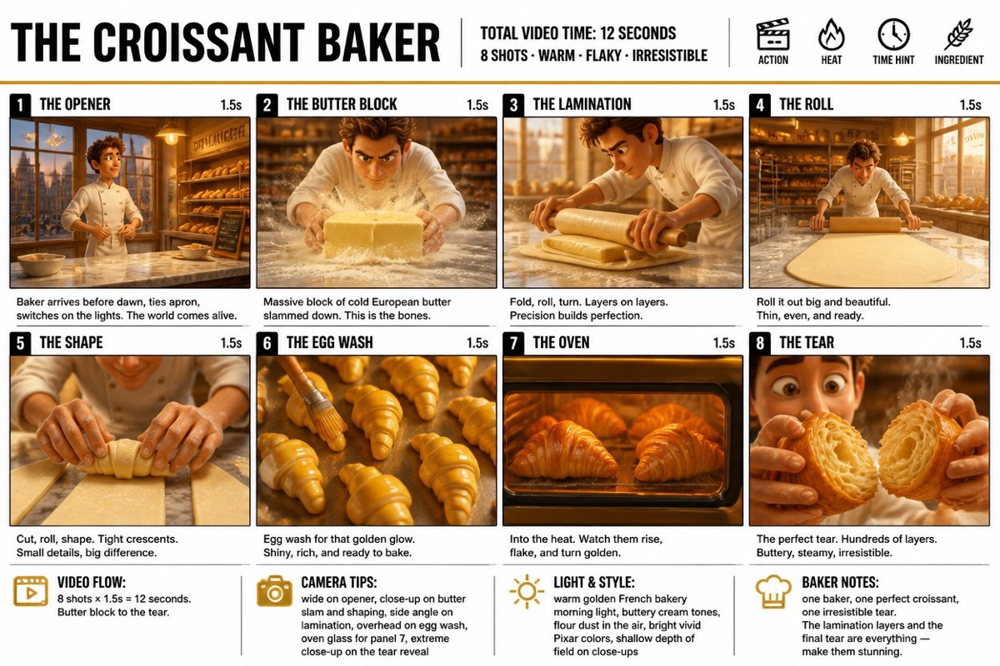</a>

生成展示可颂制作过程、镜头顺序和成品诱惑力的食品商业分镜板。 · 影视叙事

来源：[@TechieBySA](https://x.com/TechieBySA/status/2053523784481554759) · 来源提示词 / 翻译整理

**完整提示词**

```text
Create a crisp, clean infographic storyboard poster for THE CROISSANT BAKER. Wide 16:9 layout, white background, black borders, bold black typography, premium Pixar 3D stylized rendering, bright vivid colors — warm golden yellows, rich buttery creams, flaky browns, soft pastry whites, warm French bakery morning light.
Top header:

THE CROISSANT BAKER
TOTAL VIDEO TIME: 12 SECONDS
8 SHOTS · WARM · FLAKY · IRRESISTIBLE
Legend icons: ACTION, HEAT, TIME HINT, INGREDIENT
Thin warm golden accent line running full width beneath header

Same Pixar-style young French male baker throughout: white baker's jacket, flour-dusted hands, warm authentic French boulangerie setting, marble countertop, warm morning light streaming through windows, bread racks in background. Bright, warm, delicious. Every panel a completely different composition and color.
8 panels:

THE OPENER — Wide shot of baker arriving at the boulangerie before dawn, tying apron, switching on the warm kitchen lights, marble counter visible, bread racks behind, flour dusting the air, full world established, bright and cinematic
THE BUTTER BLOCK — Baker slams a massive cold block of European butter onto the marble counter with both hands, dramatic impact, flour cloud puffing up, close-up on hands, this is the bones moment — the start of everything
THE LAMINATION — Baker folding the dough over the butter block precisely, rolling pin pressing down hard, layers building, side angle shot showing the beautiful layering beginning, confident and skilled
THE ROLL — Dough rolled out into a large thin sheet, baker leaning into the rolling pin with full body weight, marble counter, flour dusting everywhere, wide shot showing the scale of the dough
THE SHAPE — Triangles cut from the dough, baker rolling each one from the wide end into a tight crescent, hands moving fast and confident, close-up on the shaping, beautiful and precise
THE EGG WASH — Baker brushing golden egg wash over each shaped croissant with a pastry brush, each one glistening beautifully, close-up overhead angle, warm golden color, stunning composition
THE OVEN — Croissants slid into the blazing hot oven on a tray, oven door closed, through the oven glass croissants visibly puffing and turning deep golden, layers separating dramatically, warm orange glow
THE TEAR — Baker pulls a perfect golden croissant from the rack, holds it up, tears it open slowly revealing hundreds of impossibly flaky buttery layers inside, steam escaping, butter glistening — this is the cheese pull moment, the hero shot of the entire video

Footer:

VIDEO FLOW: 8 shots × 1.5s = 12 seconds. Butter block to the tear.
CAMERA TIPS: wide on opener, close-up on butter slam and shaping, side angle on lamination, overhead on egg wash, oven glass for panel 7, extreme close-up on the tear reveal
LIGHT & STYLE: warm golden French bakery morning light, buttery cream tones, flour dust in the air, bright vivid Pixar colors, shallow depth of field on close-ups
BAKER NOTES: one baker, one perfect croissant, one irresistible tear. The lamination layers and the final tear are everything — make them stunning.
```

**可复用模板**

[查看对应模板](../templates/image.md#image-croissant-baking-storyboard)

<a id="image-326b2a7f37"></a>

### 老照片人像保真修复

<a href="../assets/cases/image-326b2a7f37.jpg">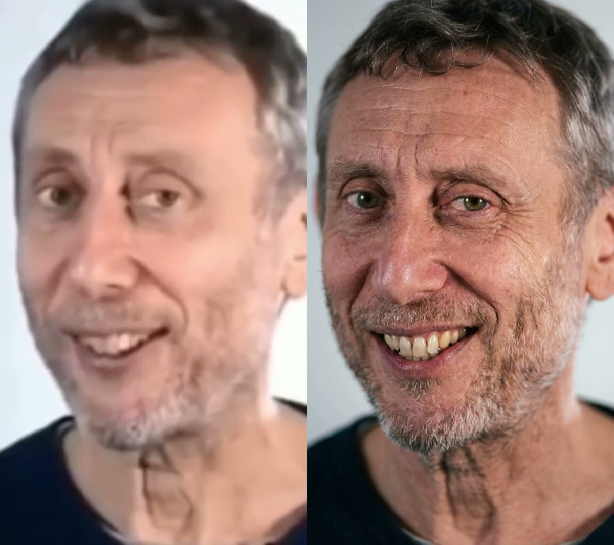</a>

以一张有人物的旧照或低清照片作为参考图，提升人像画质，同时要求保留人物身份、表情、脸型和背景。适合以人物为主体、需要尽量忠于原图的照片修复场景。 · 人像摄影

来源：[@一枚卓子（创意来源：aliailab）](https://www.douyin.com/video/7631071260739646650) · 来源提示词 / 翻译整理

**完整提示词**

```text
Enhance the portrait while strictly preserving the subject's identity with accurate facial geometry. Do not change their expression or face shape. Only allow subtle feature cleanup without altering who they are. Keep the exact same background from the reference image. No replacements, no changes, no new objects, no layout shifts. The environment must look identical. The image must be recreated as if it was shot on a Sony A1, using an 85mm f1.4 lens, at f1.6, ISO 100, 1/200 shutter speed
```

**可复用模板**

[浏览生图 Prompt 模板](../templates/image.md)

<a id="image-611724620e"></a>

### 里约旅行票据纸雕立体海报

<a href="../assets/cases/image-611724620e.jpg">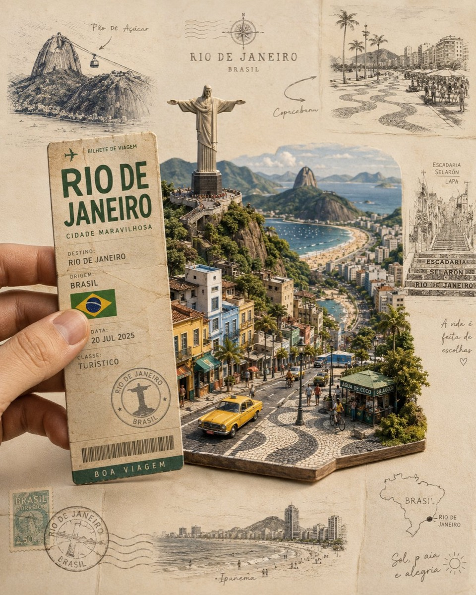</a>

把旅行票据、城市地标与纸雕场景组合成具有收藏感的立体旅行海报。 · 旅行城市

来源：[@john_my07](https://x.com/john_my07/status/2091408386466214031) · 来源提示词 / 翻译整理

**完整提示词**

```text
Create a highly detailed, photorealistic miniature travel-poster diorama inspired by Rio de Janeiro, arranged as a handcrafted 3D paper scene on a warm ivory, slightly textured background.

In the foreground, a realistic human hand holds a vintage Brazilian travel ticket or Rio-themed transit card vertically on the left side. Give the card aged paper texture, subtle printing imperfections, elegant typography, and authentic-looking travel details. From behind the card, a miniature Rio de Janeiro landscape physically rises outward like an intricate pop-up diorama.

Make Christ the Redeemer the dominant central landmark, positioned high above a miniature cityscape with lush green mountains surrounding it. Below, build a tiny realistic Rio street featuring a classic yellow taxi, colorful buildings, palm trees, pedestrians, cyclists, street lamps, tiled sidewalks, and small Brazilian urban details. Add Copacabana beach elements in the distance with tiny umbrellas, beachgoers, and a glimpse of the Atlantic Ocean. Layer the architecture and terrain so everything appears physically constructed from paper, wood, plaster, and miniature materials, with convincing depth, cast shadows, overlapping surfaces, and a slight three-quarter perspective.

Around the main 3D scene, incorporate delicate black, charcoal, and muted sepia hand-drawn travel illustrations on the cream paper. Include a small Sugarloaf Mountain sketch in the upper left, an artistic Copacabana promenade illustration in the upper right, a detailed Selarón Steps sketch along the right side, and a small Ipanema beachfront skyline drawing near the bottom. Add subtle handwritten travel notes, tiny map markings, architectural outlines, compass symbols, postage-stamp details, and understated Brazilian travel annotations.

Keep the composition refined rather than crowded. Blend realistic miniature photography with vintage travel-journal design, tactile paper fibers, faint ink bleed, imperfect hand-drawn lines, warm natural studio lighting, gentle shadows, subtle film grain, and a sophisticated cream, charcoal, muted green, ocean blue, and Brazilian yellow palette.

The final image should feel like a premium collectible Rio de Janeiro travel postcard transformed into a physical miniature world, with the central diorama sharply detailed and the surrounding illustrations slightly softer. Highly realistic human hand and fingers, believable miniature materials, cinematic product photography, editorial travel-magazine aesthetic, shallow depth of field, ultra-fine textures, photorealistic 3D details, vertical 4:5 composition, 8K quality.
```

**可复用模板**

[查看对应模板](../templates/image.md#image-rio-travel-ticket-paper-diorama-poster)

<a id="image-a9d112ca87"></a>

### 六宫格饮料微缩广告

<a href="../assets/cases/image-a9d112ca87.jpg">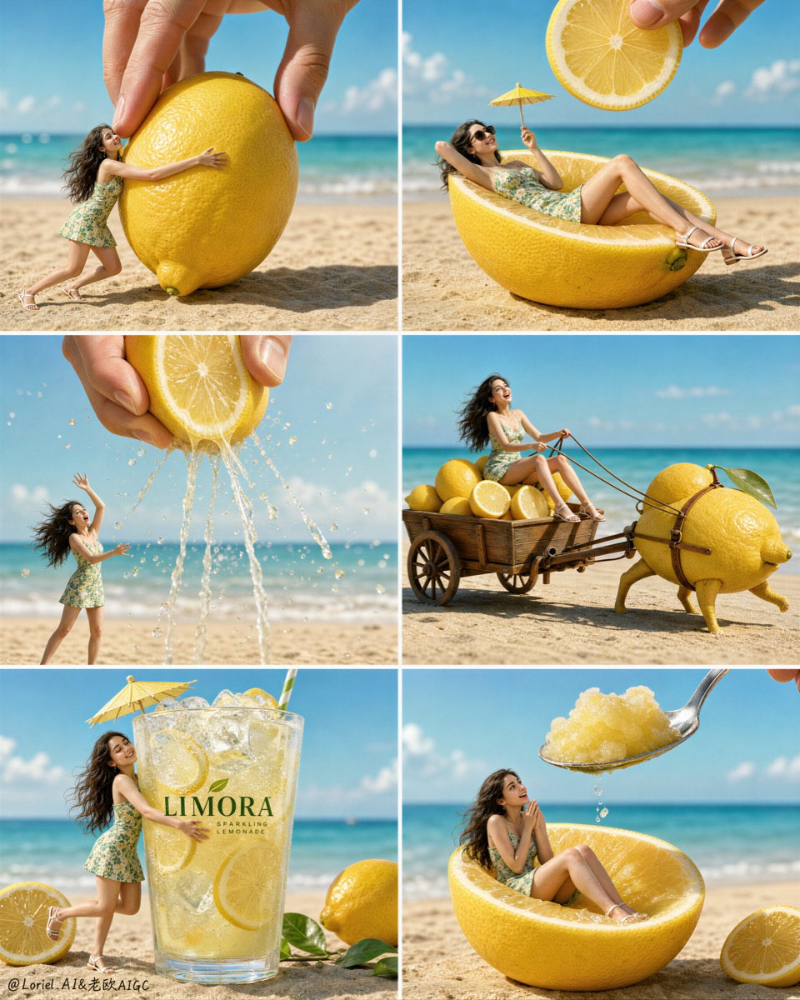</a>

使用严格六宫格与微缩人物，生成围绕同一饮料品牌展开的完整商业广告系列。 · 商业广告

来源：[@ou_zhen599](https://x.com/ou_zhen599/status/2091160215928574397) · 来源提示词 / 翻译整理

**完整提示词**

```text
Create a Cannes-level premium summer beverage campaign poster for a fictional lemon drink brand called "LIMORA", using a strict 2-column by 3-row grid layout with six perfectly aligned panels. Preserve the exact structural logic of the composition: each panel shows the same tiny ultra-realistic young woman on a bright sandy beach interacting with oversized lemons, lemon slices, lemon juice, or the final branded drink, while selected panels include a giant realistic human hand entering from above. The full poster must feel like one unified high-end advertising storyboard in motion, where the eye flows continuously from fresh citrus fruit to crafted beverage desire. The lemon product world must remain the absolute visual hero across all six panels.

Overall composition:
Use a clean six-panel grid with thin white dividers, equal panel proportions, consistent horizon line, consistent beach-ocean background, and unified lighting. Every panel should feel self-contained yet rhythmically connected, as if six consecutive scenes from the same luxury summer commercial were frozen at their most iconic moments. Keep the miniature woman and the oversized lemon-related object centered in each frame, with the sea softly blurred in the background and the sand sharply rendered in the foreground. The full page must read instantly from a distance, with strong commercial clarity and polished editorial control.

Orbit visual flow:
Design the entire set around one strong circulation of motion from panel 1 to panel 6. The action should escalate visually: touch, recline, squeeze, travel, embrace, taste. Use repeating directional rhythms in hair movement, arm gestures, leg angles, juice droplets, spoon angle, lemon slice placement, straw tilt, and the position of the entering hand so the eye naturally sweeps across the poster in a flowing wave. Build subtle diagonal energy inside every panel, making the citrus world feel alive, breezy, sparkling, and in motion. The whole set should feel like summer energy orbiting around the brand’s lemon drink.

Narrative panel sequence:
Panel 1: the tiny woman hugs a giant whole lemon on the sand while a giant adult hand descends from above, delicately positioning the lemon. Her pose is lively and slightly off-balance, as if the scene has just begun.
Panel 2: she reclines elegantly inside a halved lemon as though it were a luxury beach chaise, wearing dark sunglasses and holding a tiny parasol drink pick, while a floating lemon slice is lowered from above like a radiant citrus sun.
Panel 3: a giant hand squeezes a vertically cut lemon from above, sending translucent juice streams and droplets downward in a sparkling arc. The woman reacts dynamically beneath it, arms raised, body tilted, caught in the middle of the citrus action.
Panel 4: she rides in a small refined wooden cart piled with lemons, being pulled by a whimsical premium lemon-shaped creature or rolling lemon harness. The cart must feel physically grounded, artisanal, and stylish rather than cartoonish.
Panel 5: the hero climax panel. A tall branded LIMORA lemonade glass dominates the frame, packed with ice cubes, lemon slices, pale sparkling liquid, condensation, a fresh green straw, and a refined cocktail umbrella. The tiny woman hugs the cold glass joyfully, and this panel must be the strongest product-selling moment in the entire composition.
Panel 6: she sits inside a halved lemon while a large polished spoon descends from above carrying glossy lemon sorbet or crushed lemon ice, creating a final delicious serving beat with playful anticipation.

Hero product focus:
The real hero is the lemon beverage system: whole citrus fruit, sliced fruit, squeezed juice, ice, sparkling drink, sorbet, and premium serving details. Every lemon must feel hyper-real, fragrant, sunlit, juicy, and tactile, with detailed skin pores, subtle waxy oil sheen, translucent membranes, wet cut surfaces, and bright natural citrus pulp. The branded glass in panel 5 must be the most visually dominant product object in the set, with crystal-clear glass, refined original English branding reading "LIMORA", elegant condensation, premium ice refraction, and luminous pale-yellow drink clarity.

Character design:
Depict one recurring ultra-realistic miniature young woman across all six panels, wearing the same fitted green floral mini dress and white sandals, with long dark wavy hair and naturally expressive features. She must look like a real scaled-down human placed into a surreal oversized citrus world. Keep anatomy coherent and believable in every frame: correct head-to-body proportion, realistic shoulders, collarbones, arms, waist, hips, thighs, knees, calves, ankles, and feet, with perfectly formed hands and five fingers clearly visible. Her expressions should shift panel by panel: surprised delight, relaxed confidence, playful alarm, exhilaration, joyful refreshment, amused anticipation. Skin must remain photorealistic with pores, natural tonal shifts, faint knee and elbow texture, realistic skin elasticity, and no plastic AI beauty finish.

Lighting:
Use bright premium seaside daylight with a soft upper-left sun direction and gentle atmospheric diffusion. Maintain luminous fresh summer lighting across all six scenes, with short, soft-edged shadows and crisp dimensional highlights. Juice droplets, lemon pulp, ice cubes, spoon edges, sunglasses, glass rim, and condensation should all catch clean sparkling highlights. Lighting must feel luxurious, refreshing, and physically consistent from panel to panel.

Materials:
Lemons: ultra-detailed peel pores, subtle dimpling, natural rind thickness, glistening wet pulp, believable cut translucency, realistic juice behavior.
Drink glass: high-clarity premium glass, accurate refraction, heavy base, condensation beads, crisp logo print, ice transparency, sparkling carbonated liquid feel.
Sorbet and juice: glossy, semi-translucent, cold, wet, appetizing, physically accurate.
Dress: lightweight summer cotton with tiny green floral print, natural wrinkles, fabric tension, and wind-responsive edges.
Hair and skin: realistic strands, fine flyaways, natural shine, believable skin texture.
Large hand: realistic adult fingers, soft skin compression, natural nails, coherent scale perspective.
Cart and props: refined warm wood grain, polished wheels, believable joints and harness elements.
Beach environment: fine sunlit sand with miniature footprints and pressure marks, soft shoreline blur, clean turquoise sea with pale foam.

Color system:
Build the palette around lemon yellow, fresh citrus green, turquoise sea, pale sky blue, warm beach beige, crisp white highlights, and restrained natural skin tones. Yellow must remain the dominant hero color, supported by green and turquoise. Keep the image bright, appetizing, summery, clean, and internationally commercial. Avoid random accent colors.

Typography and branding:
Do not copy any text from the sample. Keep typography minimal and original. Place refined English branding only on the hero glass and optionally a tiny campaign line below the full grid, such as: "LIMORA — Bright in Motion". Typography must feel premium, modern, minimal, and secondary to the visual storytelling.

Art direction:
Hyper-real premium surreal advertising photography, luxury FMCG campaign, storyboard energy, elegant humor, cinematic micro-world illusion, high-end beverage styling, global summer launch poster, polished magazine-grade finish, sharp product realism, strong narrative rhythm, premium brand coherence.

Negative prompt:
copied text, Chinese text, existing brand names, cartoon style, toy-like figure, grotesque oversized head, deformed anatomy, extra fingers, missing fingers, fused fingers, twisted wrists, broken limbs, distorted feet, AI plastic skin, over-smoothed skin, fake citrus texture, unrealistic juice physics, muddy lemon pulp, cloudy glass, weak product focus, inconsistent lighting, inconsistent horizon, messy grid, cluttered props, meme aesthetic, cheap humor, childish illustration, low-resolution detail, oversaturated colors, dead black patches, distorted giant hand perspective
```

**可复用模板**

[查看对应模板](../templates/image.md#image-six-panel-miniature-beverage-ad)

<a id="image-540528c039"></a>

### 旅行纪念珐琅徽章

<a href="../assets/cases/image-540528c039.jpg">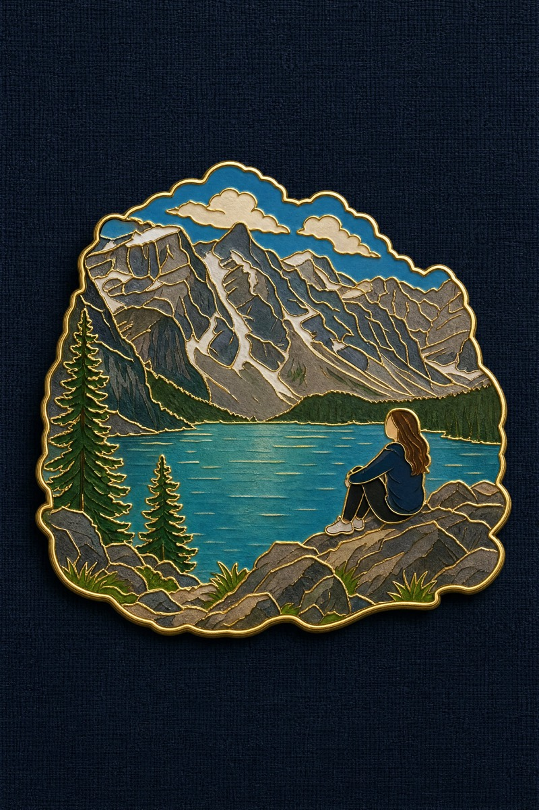</a>

将旅行照片中的地形、地标和人物比例转化为场景式珐琅纪念徽章。 · 产品视觉

来源：[@Emmma__0](https://x.com/Emmma__0/status/2093194689222705645) · 来源提示词 / 翻译整理

**完整提示词**

```text
Turn the reference photo into a travel souvenir enamel pin badge. Compose it as a SCENE, not a single isolated object.

Subject hierarchy: the defining landscape, terrain or landmark of the photo forms the main body of the badge and occupies most of its area. If a person appears prominently in the photo, keep them in the badge as a small, simplified figure at true relative scale within that landscape — the person is an accent, the landscape is the subject. Preserve the original spatial relationship and scale between the figure and the surroundings.

How to render the person: flat enamel color blocks matching their real clothing and hair color from the photo. The face is a smooth plain area of light skin-tone enamel with no drawn facial features — do NOT render the person as a dark or black silhouette, and do NOT black out the face or head. Skin reads as a warm light enamel color, clearly lighter than the clothing.

Styling: thin polished gold outline around the silhouette and along every internal divider, glossy enamel color fill, gentle even lighting with only a soft sheen on the gold lines, very subtle drop shadow. Outer contour follows the scene's own shape, not a plain rectangle.

Background: flat dark navy coarse linen texture. Badge centered, filling about 60% of the frame.

Avoid: black silhouette figure, blacked-out face, dark featureless head, portrait close-up, detailed facial features, person dominating the badge, cropping out the landscape, three-quarter angle, macro product photography, heavy specular glare, cartoon, realistic scene, text, watermark.
```

**可复用模板**

[查看对应模板](../templates/image.md#image-travel-souvenir-enamel-pin)

<a id="image-05e87c8c9f"></a>

### 烹饪速写插画叙事

<a href="../assets/cases/image-05e87c8c9f.jpg">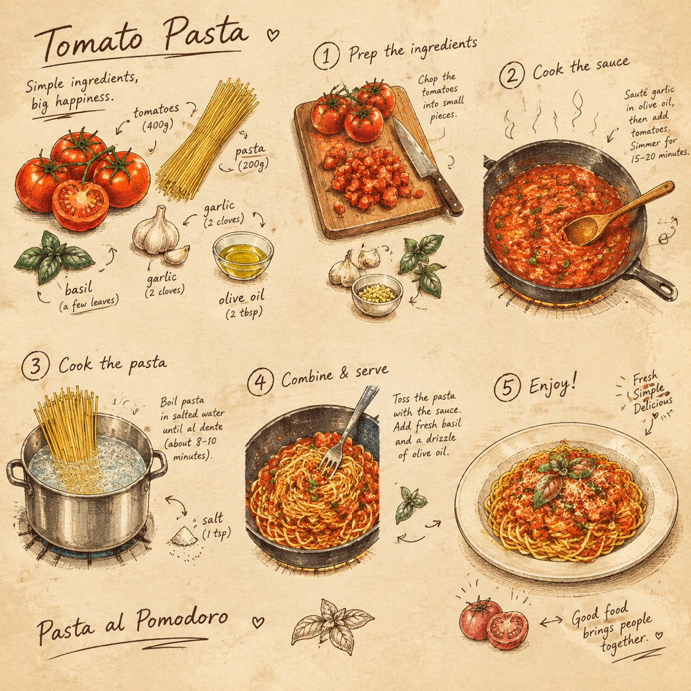</a>

将食物或烹饪主题转化为包含食材、准备过程、质地和成品的 4 至 6 格怀旧手绘速写故事。 · 影视叙事

来源：[@simeon-sanai](https://x.com/Naiknelofar788/status/2096823849702785331) · 来源提示词 / 翻译整理

**完整提示词**

```text
将主体转化为一个视觉故事，通过 4–6 个小型插画帧 进行呈现。在保持主体可辨识度的同时，将其重新诠释为迷人的手绘序列，展示其食材、准备过程、质地和最终形态。 使用 暖色调奶油纸背景、精致的墨水轮廓、微妙的手写注释、微小的箭头、食材草图、测量标记以及不完美的印刷纹理。 构图应呈现出 古老烹饪速写本 页面的质感——充满艺术感、灵动、怀旧且经过精心策划。 不要仅仅复制照片，而是将主体转化为一段插画视觉叙事。
```

**可复用模板**

[查看对应模板](../templates/image.md#image-cooking-sketch-illustration-story)

<a id="image-d3a00a1ea9"></a>

### 千禧街头服饰移动落地页

<a href="../assets/cases/image-d3a00a1ea9.jpg">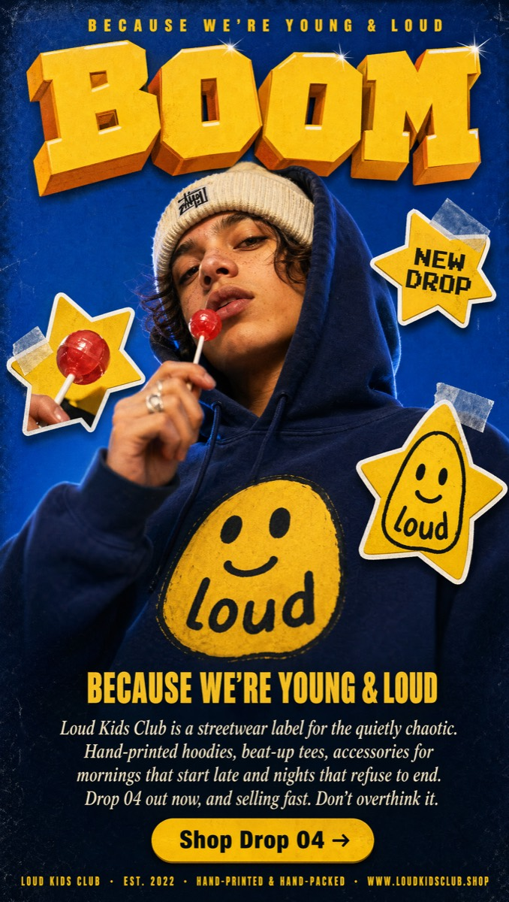</a>

生成一张海报式 9:16 移动端街头服饰品牌落地页，融合人物主视觉、夸张字标、贴纸拼贴、商品文案和购买按钮。 · 网页界面

来源：[@cezanne_cupcake_haze12](https://higgsfield.ai/publications/0bbfc974-900c-4a1e-8561-3d9ada80177a) · 来源提示词 / 翻译整理

**完整提示词**

```text
创建一张 9:16 竖版、移动端优先的街头服饰品牌落地页，整体像一张可直接使用的全屏品牌海报。

品牌名为“{brandName}”，主口号为“{headline}”，系列名称为“{collectionName}”。背景使用深皇家蓝到藏蓝的竖向渐变，叠加轻微胶片颗粒与复古屏幕暖色。顶部放置小号全大写口号；其下是巨大、略微错位的粗厚衬线字标，使用明亮金盏花黄、深黄橙色立体阴影和少量金属高光。

画面中央是一位穿着品牌主打服装的年轻模特胸像，姿态松弛、自信，手持一个与系列相关的小道具。人物使用柔和蓝色轮廓光和自然暖肤色。服装胸前放置原创、无品牌联想的手绘角色图形。

在人物周围加入三枚不规则星形贴纸：产品细节特写、原创角色图形和“NEW DROP”短标签。贴纸带白色裁切边、轻微旋转、胶带角和柔和投影，形成真实 DIY 拼贴感。

底部依次排布：短标题、3 至 4 行品牌介绍、醒目的 `{ctaText}` 按钮、极细品牌信息条。确保文字层级清楚、按钮可辨识、人物不遮挡主要文案。配色锁定为深蓝、金盏花黄、奶油白、炭黑和一个高饱和点缀色。整体呈现千禧年滑板与冲浪街头文化、复古丝网印刷和高完成度电商视觉，不出现真实品牌 Logo 或现成卡通角色。
```

**可复用模板**

[查看对应模板](../templates/image.md#image-y2k-streetwear-mobile-landing-page)

<a id="image-1587ef7030"></a>

### 千禧虚拟试衣游戏界面

<a href="../assets/cases/image-1587ef7030.jpg">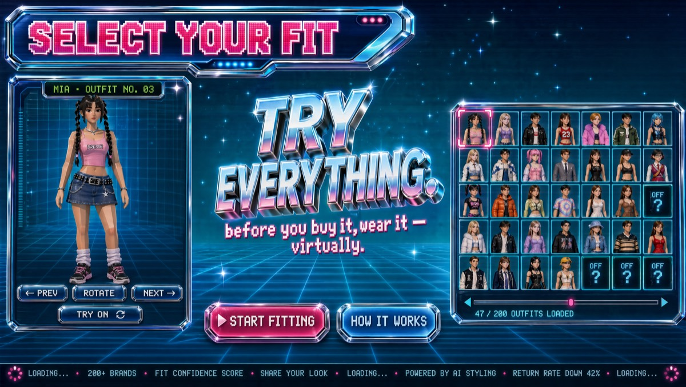</a>

生成一张把虚拟试衣服务设计成千禧年主机游戏角色选择界面的横版网页视觉。 · 网页界面

来源：[@steampunk_donut_jade65](https://higgsfield.ai/publications/fb624032-7cc1-47b5-8df4-d8a8cfc5823e) · 来源提示词 / 翻译整理

**完整提示词**

```text
创建一张 16:9 横版虚拟试衣服务落地页，品牌名为“{brandName}”。视觉语言来自千禧年前后主机游戏的角色选择界面：低多边形 3D 角色、青蓝透视网格、半透明亮面面板、镀铬斜面、像素字体、扫描线和轻微屏幕光晕。

左上放置大型“SELECT YOUR FIT”游戏标题面板；右上堆叠状态、玩家编号和试衣间等级 HUD。左侧三分之一是当前角色预览：完整低多边形人物、服装编号、旋转与前后切换按钮、已加载单品数和搭配置信度。

画面中央用巨大镀铬立体字显示“{headline}”，下方放一句简短价值主张。右侧建立 7×5 角色缩略图网格，展示不同服装和人物外观；当前选择项使用粉色发光边框，少量未解锁位置显示问号。网格下方放滚动条和加载数量。

底部安排“{primaryCta}”与“{secondaryCta}”两个主按钮、数据统计面板、小地图式导航和极细滚动信息条。配色使用深青蓝、亮洋红、荧光青、镀铬银、像素绿和白色。界面信息丰富但分区清楚，所有文字与按钮可辨识，不使用任何真实游戏、平台或服装品牌标识。
```

**可复用模板**

[查看对应模板](../templates/image.md#image-y2k-virtual-try-on-game-ui)

<a id="image-90154ddf7b"></a>

### 青花敦煌刺绣四拼海报

<a href="../assets/cases/image-90154ddf7b.jpg">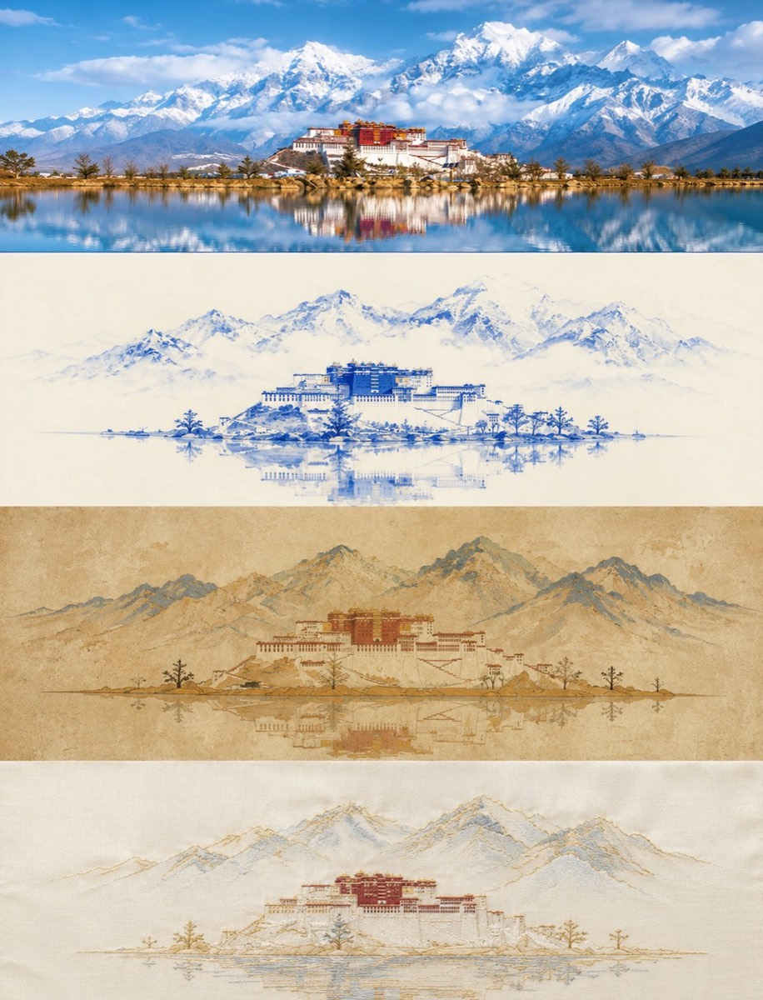</a>

将同一主体转译为青花瓷、敦煌、刺绣等中国传统视觉语言的四拼风格海报。 · 传统文化

来源：[@zhidawang219555](https://x.com/zhidawang219555/status/2090310144190218272) · 来源提示词 / 翻译整理

**完整提示词**

```text
请将我上传的照片制作成一张竖版拼图海报，整体采用 3:4 竖版构图。画面从上到下严格四等分为四个横向区域，每个区域的高度必须精确控制为整体画面高度的25%（四层比例严格为1:1:1:1，不允许出现比例偏差），区域之间无缝衔接，不设分隔线、不留间隙，顺序为：原图→风格1→风格2→风格3。由于每层为约3:1的极扁宽幅比例，各层主体建议横向居中排布，强调左右开阔留白与呼吸感，避免元素纵向拉伸变形或贴边拥挤。四层在人物站位、场景结构、视线方向上保持连贯呼应，呈现同一画面、四种转译的整体感。风格层（第二至四层）须遵循极简原则：每层视觉元素数量压缩至最低限度，只保留1个最核心的主体符号，其余次要装饰、背景细节与陪衬元素一律省略，画面留白占比不低于60%。

第一层保留原始照片的主体结构、人物真实互动关系与姿态、真实质感、自然光影与原有色彩氛围，仅进行轻微高级摄影调色，呈现杂志摄影质感，不改变人物关系与构图逻辑，并可在不改变人物关系与构图逻辑的前提下自然扩展天空、地面或环境背景，使整体更具空间感与叙事感。

第二层为青花瓷绘风格：借鉴青花瓷绘画技法，以钴蓝色线条与晕染在米白底上表现人物与场景，呈现瓷器纹样的疏朗雅致感。色彩以钴蓝与米白为主的单色系。避免蓝色浓淡层次过多显杂，避免图案化装饰堆砌。

第三层为敦煌壁画风格：借鉴敦煌壁画矿物重彩质感，表现古朴斑驳的美感，需简化线条与色块。背景为土黄或赭石底色，带斑驳壁画肌理感。色彩以赭石、石青、朱砂、土黄为主。避免裂纹肌理过多堆砌，避免复杂纹样装饰。

第四层为刺绣锦缎风格：以刺绣针脚肌理表现人物与场景轮廓，呈现丝缎光泽与针线纹理感，图案需极简概括。背景为米白或浅灰缎面底色。色彩以2至3种柔和色搭配金线点缀。避免针脚过密显繁琐，避免金线过多显浮夸。

每一层需将主体与场景统一转换为对应风格，整体表达极度克制与简化，只保留最核心的一个主体符号及其基本轮廓关系，删除一切非必要的背景元素、装饰细节与陪衬物；人物之间的关键位置关系、互动方向与姿态特征需保留，但应抽象为可识别的轮廓关系，做到“元素越少、关系越清晰”。色彩均从原图中提取归纳，每层严格控制在2-4种主色以内。四个区域的高度比例须严格保持1:1:1:1（各占25%），不可出现拼接错位或比例偏差。整体避免朋克/赛博朋克风格、写实照片质感强行叠加、卡通风格、3D渲染感、商业海报感、复杂背景堆砌、元素过多或画面拥挤、相邻两层风格雷同，以及任何文字、Logo、水印或标题。
```

**可复用模板**

[查看对应模板](../templates/image.md#image-blue-white-dunhuang-embroidery-quadriptych)

<a id="image-d0024a7f32"></a>

### 趣味陶瓷电商首页主视觉

<a href="../assets/cases/image-d0024a7f32.jpg">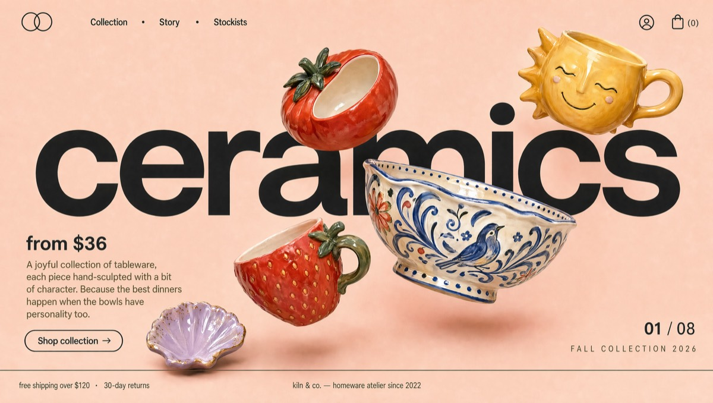</a>

生成横版电商首页主视觉，用悬浮陶瓷产品、超大字标和克制网页信息结构展示一组具有统一角色语言的商品。 · 网页界面

来源：[@impressionist_cookie_haze96](https://higgsfield.ai/publications/2f589a2f-cc4e-422c-9285-97d65fd49540) · 来源提示词 / 翻译整理

**完整提示词**

```text
创建一张 16:9 横版电商首页主视觉，品牌名为“{brandName}”，主打产品为 `{productType}`，系列名为“{collectionName}”。整体采用极简编辑式网页布局与趣味角色化产品渲染。

背景使用柔和暖粉色纸张纹理。顶部是一行轻量导航：品牌图形、系列、品牌故事、经销商、账户和购物袋。画面中央横跨约 90% 宽度放置超大写产品类别字标，使用深炭灰现代无衬线字体。

在字标前方安排 5 件悬浮产品，从右上到左下形成清楚的对角线。每件产品使用不同但协调的釉色，并绘有同一套原创手绘角色语言，分别表达好奇、困倦、顽皮、害羞和自信。保持造型、线条、笔触和材质一致，呈现手工工作室品质，而不是廉价卡通商品。产品需要有真实陶瓷釉面、细微不规则和柔和悬浮投影。

左下角放置价格、两至三行产品介绍和“{ctaText}”按钮；右下角放置页码与系列季节信息；底部使用极细服务信息条。整体配色包含暖粉、炭黑、陶土橙、鼠尾草绿、钴蓝、灰粉和奶油黄。文字准确、间距克制、产品不遮挡关键界面信息，不出现真实品牌 Logo。
```

**可复用模板**

[查看对应模板](../templates/image.md#image-playful-ceramic-ecommerce-hero)

<a id="image-626facaf10"></a>

### 人像摄影灯光方案网格

<a href="../assets/cases/image-626facaf10.jpg">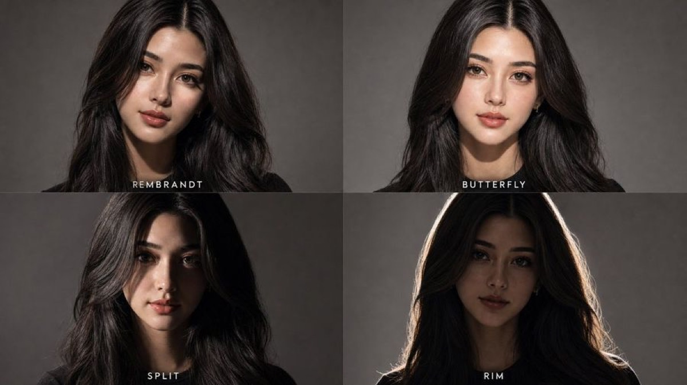</a>

生成同一人物在多种专业摄影灯光方案下的对比网格。 · 设计参考

来源：[@M. Asif](https://x.com/meAsifAi/status/2095857760537805130) · 来源提示词 / 翻译整理

**完整提示词**

```text
选取参考图像中的人物，创建一个 2x2 的网格，展示同一张特写肖像在四种不同专业灯光设置下的效果。身份锁定：每个面板中的面部、表情（冷静中性）、发型、深色上衣、头部大小和拍摄角度必须完全一致，仅改变灯光。面板 1 伦勃朗光 (REMBRANDT)：主光位于左上方 45 度，阴影侧脸颊呈现小三角形光斑，光影过渡富有质感。面板 2 蝴蝶光 (BUTTERFLY)：主光位于相机正上方，鼻下形成柔和对称的阴影，呈现美妆肖像光泽。面板 3 侧光 (SPLIT)：主光完全从侧面照射，半边脸受光，另半边处于黑暗中。面板 4 轮廓光 (RIM)：主光位于主体后方，勾勒出头发和肩膀的明亮轮廓，面部仅由微弱的补光提亮，营造近乎剪影的戏剧感。全程使用相同的 medium-gray 背景，85mm 镜头感，焦点清晰对准眼睛。每个面板下方标注白色小标签：“REMBRANDT”、“BUTTERFLY”、“SPLIT”、“RIM”。
```

**可复用模板**

[查看对应模板](../templates/image.md#image-portrait-lighting-scheme-grid)

<a id="image-97796819d8"></a>

### 沙漠洗车电影感纪实摄影

<a href="../assets/cases/image-97796819d8.jpg">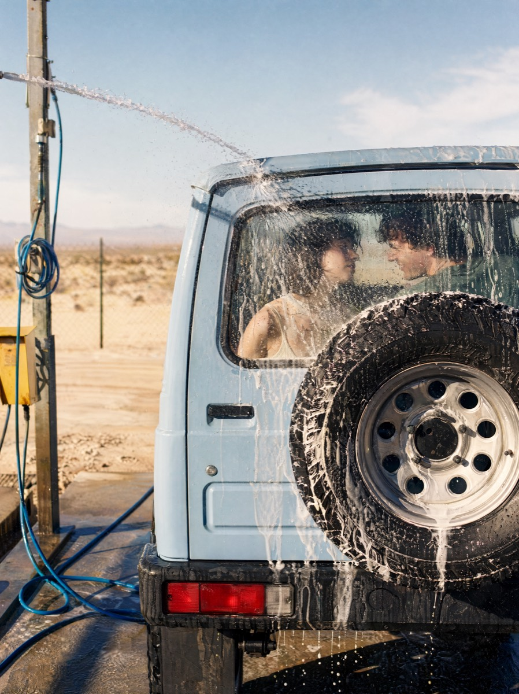</a>

生成沙漠露天洗车场的电影感纪实画面，通过车尾备胎、水柱、泡沫玻璃和车内人物形成多层叙事。 · 商业广告

来源：[@institutional_butterflying](https://higgsfield.ai/publications/bdeaf74f-4300-4ebd-9125-7df4f37d2733) · 来源提示词 / 翻译整理

**完整提示词**

```text
创建一张 2:3 竖版电影感纪实摄影。镜头从后侧拍摄一辆无品牌、方正的复古紧凑型越野车，地点是开阔干旱地区中的简陋露天自助洗车场。

车辆使用 `{vehicleColor}`，车尾备胎占据右侧三分之二并形成强圆形视觉锚点。高压水柱从左上角斜向击中后窗，水滴和泡沫覆盖玻璃。透过流动的湿玻璃，隐约看到车内 `{relationshipDescription}` 正在交谈或微笑，人物面部被水幕柔化和扭曲，但关系仍可读。

左侧保留沙地、低矮灌木、远处地平线、金属水管架、付款箱和盘绕水管，形成环境负空间。强烈午后阳光从左侧照射，突出每颗水滴、泡沫和车辆材质，地面被水浸湿并出现深色反射。

配色包含褪色浅色车漆、黑色轮胎、银色轮毂、白色泡沫、红色尾灯、尘土黄沙地、浅蓝天空和一处高饱和水管色。焦点落在备胎、后窗水幕和水柱，使用细腻胶片颗粒、暖高光、冷阴影和轻微水雾。画面要像偶然捕捉到的夏季公路旅行故事，不出现车标、品牌文字或摄影师模仿要求。
```

**可复用模板**

[查看对应模板](../templates/image.md#image-desert-car-wash-documentary-photo)

<a id="image-d4e3564190"></a>

### 奢华机械腕表技术图鉴

<a href="../assets/cases/image-d4e3564190.jpg">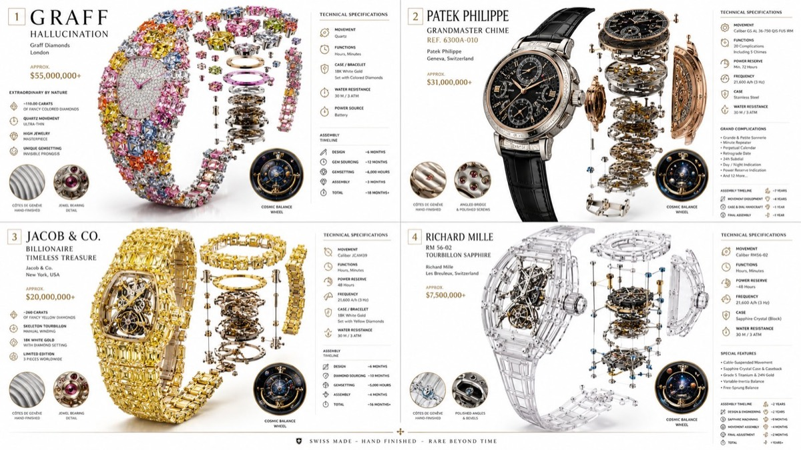</a>

生成多款高级机械腕表的透明结构、零件拆解和材质说明图鉴。 · 信息图表

来源：[@Gdgtify](https://x.com/Gdgtify/status/2056928396991488312) · 来源提示词 / 翻译整理

**完整提示词**

```text
2x2 grid 16:9, do this for 4 most expensive strangest watches ever made:

class Haute_Horlogerie_DNA:
    def __init__(self):
        self.subject = "[TIMEPIECE]"
        self.parents = {
            "composition_parent": "Exploded movement diagram with transparent case",
            "material_parent": "Brushed titanium, sapphire crystal, rose gold gears, alligator leather",
            "graphic_parent": "Swiss manufacture technical brochure with elegant data panels",
            "atmosphere_parent": "Crisp daylight studio, pure white background, subtle reflection on polished surfaces"
        }
        self.mutations = {
            "semantic_mutation": "The balance wheel reveals a miniature cosmos ticking inside",
            "information_mutation": "Power reserve indicator, frequency, complication callouts, hand-finishing grades, assembly timeline",
            "medium_mutation": "Smooth matte premium paper with embossed logo",
            "scale_mutation": "Grain-level view of Côtes de Genève finishing and jewel bearings"
        }
        self.style_mix = [0.30, 0.30, 0.25, 0.10, 0.05]

    def generate_subject(self):
        subject = """
        [TIMEPIECE] shown in its full mechanical glory. The dial, hands, movement,
        and strap float in perfect alignment against a bright, clean background.
        Every gear and spring is highlighted with exacting clarity.
        """
        return render(
            subject,
            format="luxury watch advertisement with technical insert",
            title="[MODEL REFERENCE]",
            subtitle="[MANUFACTURE / COLLECTION]",
            constraints="bright white space, metallic brilliance, hyper-detailed, modern elegance"
        )
```

**可复用模板**

[查看对应模板](../templates/image.md#image-luxury-mechanical-watch-technical-guide)

<a id="image-7c53920b6a"></a>

### 社交媒体赠礼活动横幅

<a href="../assets/cases/image-7c53920b6a.jpg">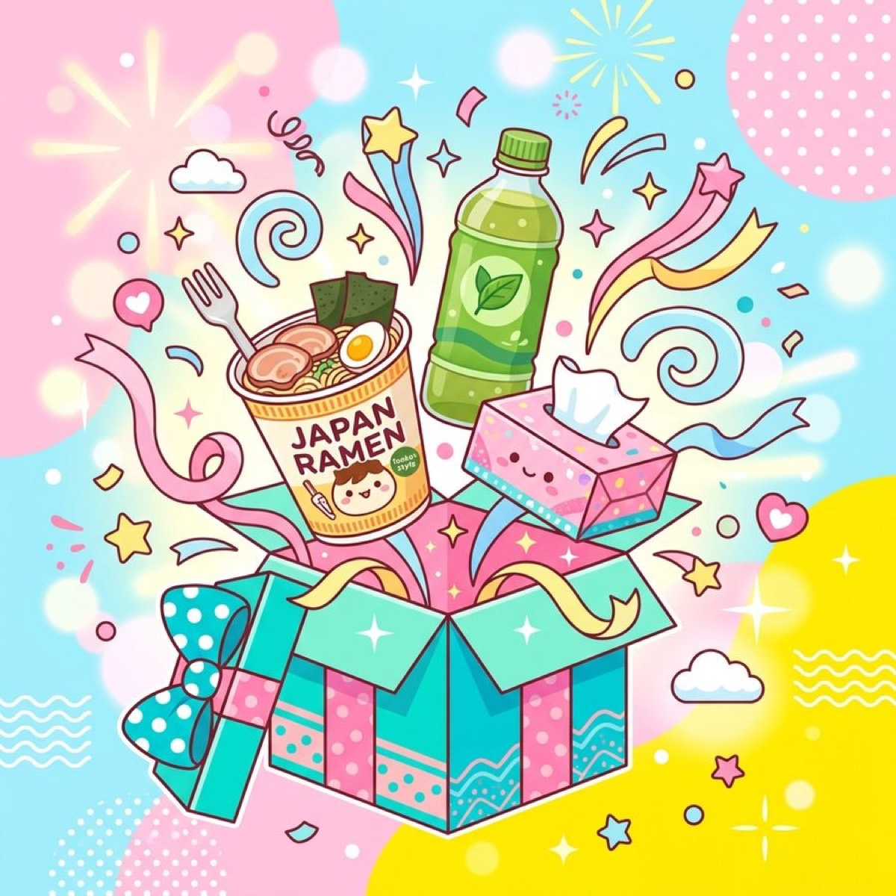</a>

生成适合赠品、抽奖和活动发布的社交媒体宣传横幅。 · 社交媒体

来源：[@AI Guide-Note - 実務で使えるAI活用メディア](https://x.com/AIGuideNote/status/2097183473601569109) · 来源提示词 / 翻译整理

**完整提示词**

```text
[活动信息] - 活动名称：{campaignName} - 奖品列表：{prizes} - 参与条件/步骤：{entrySteps} [图像质量、呈现方式与构图规范] - 风格：流行、明亮且友好的社交媒体宣传横幅。设计引人注目。 - 主体：{prizes} 的插画或真实产品照片从礼盒中弹出，周围环绕着华丽的丝带和星星装饰，位于画面中心。 - 色彩/色调：采用明亮的粉色、黄色、浅蓝色等柔和色调，营造兴奋感。 - 文字信息（适用于 GPT-image / Nano Banana Pro）：屏幕顶部的文字 {campaignName} 和底部的简易参与步骤 {entrySteps} 需使用粗体、可爱的圆体字清晰排版。 - 光照：扁平、均匀、明亮的光照，带有柔和的阴影。 [布局与输出的严格限制（强制执行）] - 输出成品设计本身，填满整个画布。设计内部的背景和场景描绘（墙壁、空间、阴影）可遵循正文说明。 - 禁止事项：带相框的海报照片、贴在墙上的海报照片、放置在桌子或纸张上的样机照片、纸张边缘的透视变形或投影。 - 输出成品扁平 2D 设计本身，填满整个画布。允许使用上述描述的设计内部场景元素。绝对禁止海报样机照片：不得包含相框、不得拍摄贴在墙上或桌上的海报、不得在艺术品边缘出现透视变形或投影。 - 宽高比："--ar 1:1" 或 "--ar 16:9"
```

**可复用模板**

[查看对应模板](../templates/image.md#image-social-media-giveaway-banner)

<a id="image-c352a86ebd"></a>

### 深海自由潜水探险摄影

<a href="../assets/cases/image-c352a86ebd.jpg">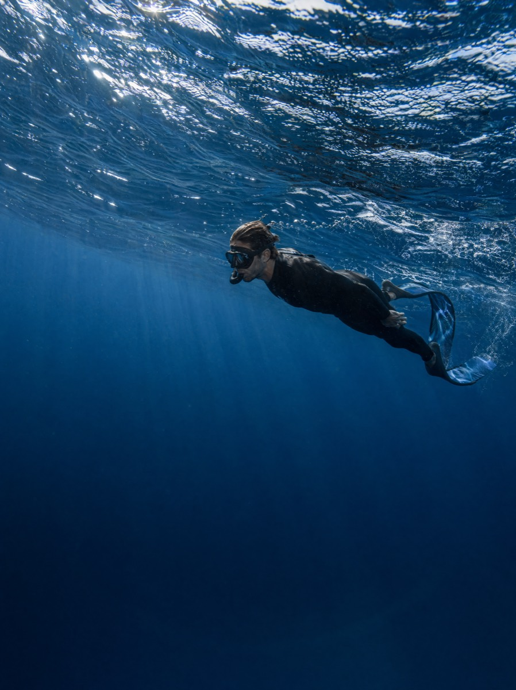</a>

生成从水下仰拍自由潜水者的电影感探险摄影，通过水面纹理、深蓝渐变和大面积负空间表现孤独与尺度。 · 体育视觉

来源：[@steampunk_donut_jade65](https://higgsfield.ai/publications/32410751-27ee-425f-aa0f-dbc0a67aaf34) · 来源提示词 / 翻译整理

**完整提示词**

```text
创建一张 4:5 竖版电影感水下探险摄影。镜头位于潜水者下方，略微向上仰拍。一名自由潜水者沿水面下方水平滑行，身体位于右上三分之一并形成对角线，穿哑光深色潜水服、面镜和长脚蹼，动作流线，少量银色气泡从身后延伸。

画面顶部是占据主要纹理的波动水面，阳光形成银白色反射、焦散高光和深蓝波谷。水体从水面附近的钴蓝与青色逐渐过渡到画面底部的藏蓝和靛黑，斜向自然光束照亮少量悬浮颗粒。左下方保留大面积深蓝负空间，强调孤独、深度和尺度。

仅使用自然环境光，不使用人工闪光。潜水者清晰对焦，深处具有柔和水雾与颗粒感。配色锁定为钴蓝、藏蓝、银白、哑光黑和少量自然肤色。画面真实、安静、具有高端户外与探险摄影品质，不出现装备品牌、水印或不合理发光效果。
```

**可复用模板**

[查看对应模板](../templates/image.md#image-deep-sea-freediving-adventure-photo)

<a id="image-231adaeba9"></a>

### 十五步写实食谱信息图

<a href="../assets/cases/image-231adaeba9.jpg">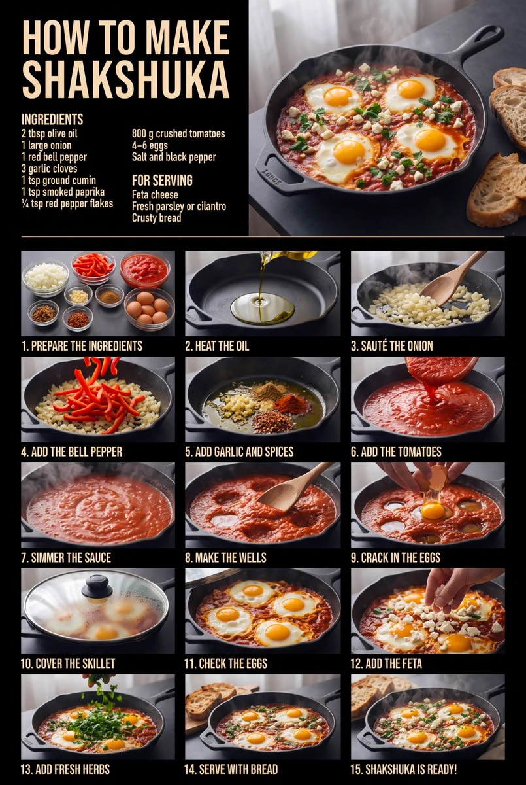</a>

把一道菜的食材、15 个连续制作步骤和成品主视觉整理成竖版写实食谱信息图，也可作为后续图生视频的视觉分镜参考。 · 信息图表

来源：[Oleksa AI（X：`@OleksaFrame`）。](https://x.com/OleksaFrame/status/2097669808800113040) · 根据来源整理的适配提示词

**完整提示词**

```text
创建一张竖版写实食谱信息图，主题为“如何制作 {菜名}”。整张图以清晰、可执行的烹饪顺序为核心，兼顾专业美食摄影和编辑排版，可直接作为图生视频的视觉分镜参考。

## 画布与版式

- 竖版 2:3 画幅，黑色背景，暖白色粗体无衬线标题与说明文字，细暖白色分隔线。
- 顶部约占画面 30%：左侧为大标题“HOW TO MAKE {英文菜名}”，标题下方分两列列出全部食材和用量；右侧为最终成品的大幅英雄照片。
- 下方约占画面 70%：使用 3 列 x 5 行的规整网格，展示 15 个按真实烹饪顺序排列的步骤。
- 每个步骤格包含一张横向写实照片，以及照片下方的“序号 + 简短英文步骤名”。序号从 1 到 15 连续且不重复。
- 所有网格边距、图片比例、文字基线和列宽保持一致，阅读顺序从左到右、从上到下。

## 内容变量

- 菜名：{菜名}
- 英文菜名：{英文菜名}
- 食材与用量：{完整食材清单}
- 15 个步骤：{步骤1} 至 {步骤15}
- 核心锅具或器皿：{锅具}
- 主色食材：{主色食材}
- 配菜与装饰：{配菜与装饰}

## 图像连续性

- 15 个步骤必须忠实反映输入食谱的真实顺序，不增加、遗漏或颠倒关键步骤。
- 全程使用同一款无品牌、无标识的 {锅具}，保持灶台、台面、采光方向、食材形态和色调连续。
- 每一格只表现一个清楚的动作或状态变化；食材数量与熟度随步骤自然推进。
- 成品英雄图与最后一步保持一致，不能出现步骤中没有加入的食材。

## 摄影风格

柔和的窗边自然光从画面左侧进入，浅色石材台面提供柔和补光。写实商业美食摄影，细腻食物纹理，自然蒸汽、油光、酱汁气泡和手部动作；深色锅具与高饱和度主色食材形成对比。镜头以俯拍中景、三分之四近景和微距特写交替，景深自然，画面干净克制。

## 文字与限制

- 只显示标题、食材、用量、步骤序号和步骤名，不添加宣传文案、Logo、水印、二维码或界面元素。
- 所有文字拼写正确、清晰可读，不使用伪文字或乱码。
- 不出现品牌标识、人物脸部、无关餐具、额外菜品或重复步骤。
- 不把同一张照片复制到多个步骤格；每格构图和动作必须与对应步骤匹配。
```

**可复用模板**

[查看对应模板](../templates/image.md#image-fifteen-step-photorealistic-recipe)

<a id="image-2be108496e"></a>

### 食物爆炸拆解信息图

<a href="../assets/cases/image-2be108496e.jpg">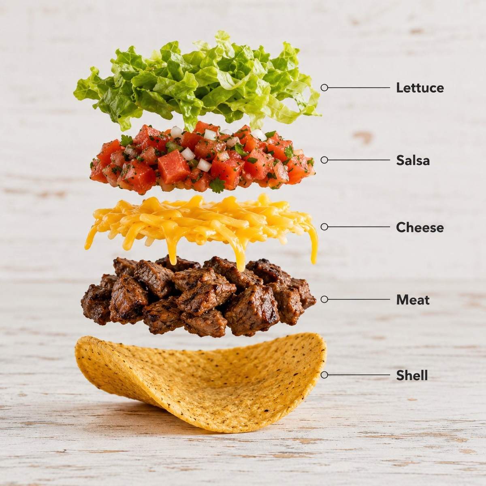</a>

把食物的不同组成部分按垂直顺序悬浮排列，生成写实爆炸拆解信息图。 · 信息图表

来源：[@Strength04_X](https://x.com/Strength04_X/status/2056018963084226866) · 来源提示词 / 翻译整理

**完整提示词**

```text
Create a hyper-realistic exploded vertical infographic composition of tacos.

Top → Bottom structure:
Fresh Lettuce (crisp green texture with natural folds)
→ Tomato & Salsa Layer (juicy diced tomatoes and salsa mix)
→ Melted Cheese (smooth cheddar texture)
→ Grilled Meat Filling (juicy seasoned meat detail)
→ Taco Shell Base (crispy golden shell texture)
Perfect vertical alignment, rustic background, soft studio lighting, realistic shadows beneath each floating element.

Add clean infographic text labels with thin pointer lines using these exact labels:
“Lettuce”
“Salsa”
“Cheese”
“Meat”
“Shell”
Ultra-detailed food textures, premium commercial aesthetic, 8K.
```

**可复用模板**

[查看对应模板](../templates/image.md#image-exploded-food-infographic)

<a id="image-fda124aba7"></a>

### 手工撕纸海报风格

<a href="../assets/cases/image-fda124aba7.jpg">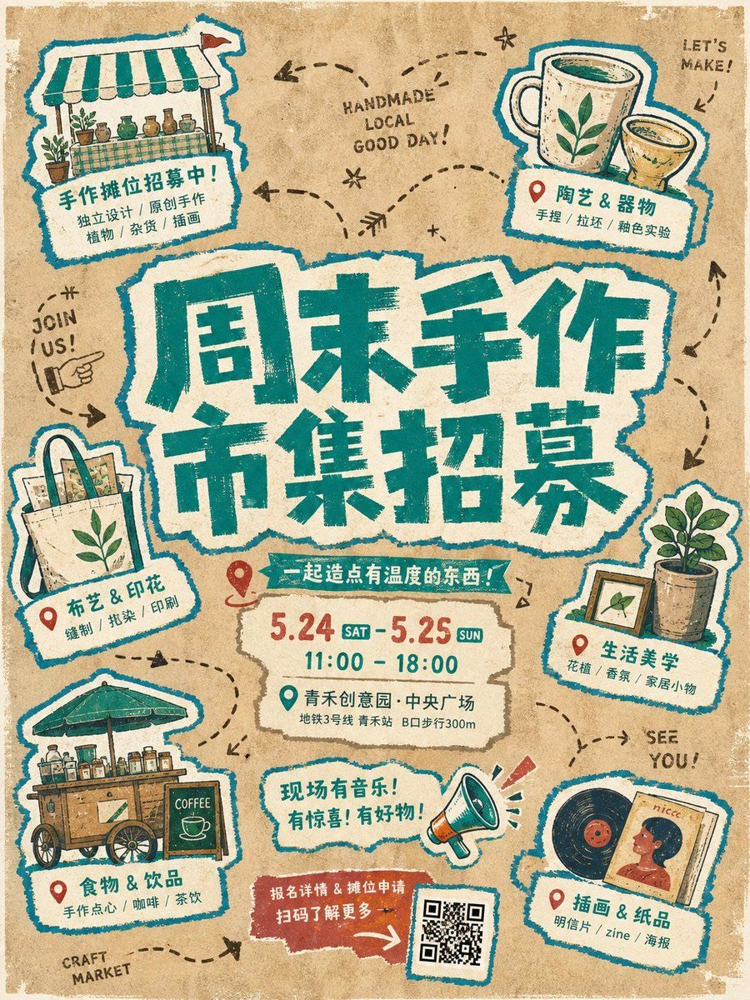</a>

生成以荧光撕纸标题、手绘贴纸徽章和陈旧纸张为核心的城市文化活动海报。 · 活动物料

来源：[@小小东](https://x.com/xiaoxiaodong01/status/2089252321603862547) · 来源提示词 / 翻译整理

**完整提示词**

```text
创建一个由一组不规则层叠的荧光撕纸标题块组成的视觉焦点：主标题 巨大且居中，分为错落的几行，由粗犷的笔刷字体和剪纸形式组合而成，具有厚重的笔触、参差不齐的边缘、夸张的转角、不均匀的字怀，以及轻微的局部套印不准，使文字看起来像是手工印刷的图形形状，而非整齐的排版。围绕标题构建一个圆形、松散但引导清晰的活动信息系统，周围分布着几个蓝白轮廓的手绘贴纸徽章；每个徽章将主题相关的小插图、位置标记或符号连接到白色标签上，大小和方向各异，呈现出随意粘贴在纸上的感觉。主体和标签共享鲜艳的蓝色外轮廓和黄色填充，形成统一的跨元素描边。背景使用温暖的纤维纸和陈旧海报质感，大面积的 赭褐色 区域保留纸张纹理、压痕、细微的色彩变化和印刷溢色；用深棕色手绘虚线、弧线、箭头和少量英文字母几何图形来组织留白，且不与主要信息产生视觉竞争。将主色调锁定为赭棕色、亮黄色、鲜艳蓝色和暖米白色，使用平涂填充和有限的色彩重叠，不使用现代渐变、玻璃效果或过度润色的数字阴影。赋予每个图形、文字、贴纸和背景同样略显不稳定的手工轮廓、丝网印刷套印偏差、多变的笔触粗细和局部磨损感，保留不完美的制作痕迹；保持信息层级清晰，中心标题权重最高，周围模块营造节奏感和呼吸空间，使整幅作品看起来像是一张由拼贴、手绘、丝网印刷和陈旧纸张组装而成的城市文化活动海报。
```

**可复用模板**

[查看对应模板](../templates/image.md#image-hand-torn-paper-poster)

<a id="image-60806a74e0"></a>

### 双色调摄影棚商业肖像

<a href="../assets/cases/image-60806a74e0.jpg">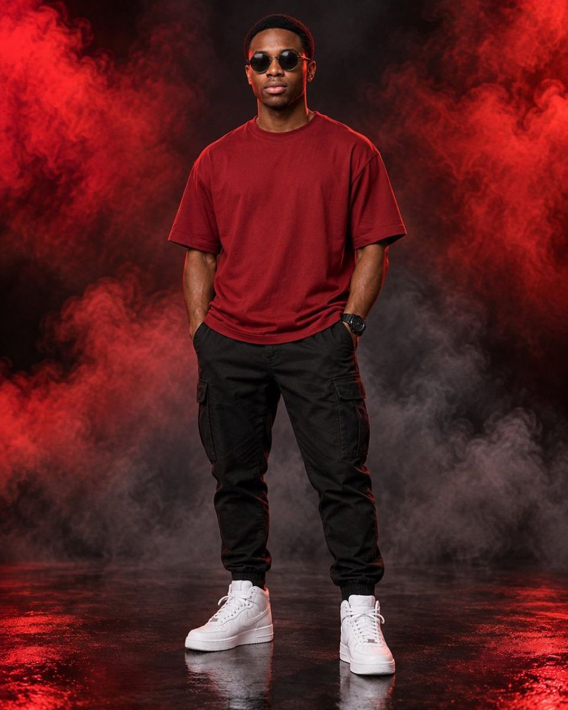</a>

生成具有品红与电光蓝双色布光的高端商业肖像。 · 商业广告

来源：[@Abkr Sadiq](https://x.com/abs_uiux/status/2097210827652968512) · 来源提示词 / 翻译整理

**完整提示词**

```text
创作一张超写实的特写摄影棚肖像，主角是一位神情自信、深思熟虑的成年男性，采用高端现代编辑风格，取景范围从胸部以上。 他留着浓密且打理整齐的黑色短发，顶部自然蓬松，两侧修剪利落。配以修剪精致、边缘自然锐利的络腮胡和八字胡。他戴着透明的长方形眼镜，镜片上带有摄影棚灯光的细微反光。 他身穿修身黑色高领毛衣，外搭一件剪裁考究、翻领结构分明的黑色西装外套。整体造型保持极简的单色风格，不佩戴任何珠宝或多余配饰。 让他呈现微微侧身面对镜头的姿态，头部轻微上扬，双眼望向画面的右上角，营造出冷静、睿智且富有抱负的氛围。 使用戏剧性的双色调摄影棚灯光：鲜艳的品红色/紫色轮廓光照亮他左侧的头发和脸部，充满活力的电光蓝/青色光照亮右侧。脸部保持柔和的中性正面补光，确保皮肤质感真实、细节丰富且曝光准确。 背景采用模糊的未来感摄影棚设计，呈现从左侧深紫色和品红色过渡到右侧电光蓝的丰富渐变。在左下角背景中添加一条发光的对角线霓虹品红色光条，以增加视觉深度。 强调真实的皮肤纹理、细致的胡须毛发、锐利的双眼、自然的眼镜反光、清晰的织物纹理、电影级对比度、浅景深、平滑的彩色虚化效果、高端个人品牌摄影、高端企业编辑美学、超写实主义、85mm 肖像镜头感、f/1.8 光圈、8K 细节、4:5 竖构图。
```

**可复用模板**

[查看对应模板](../templates/image.md#image-duotone-studio-commercial-portrait)

<a id="image-9457327362"></a>

### 水彩风格编辑插画海报

<a href="../assets/cases/image-9457327362.jpg">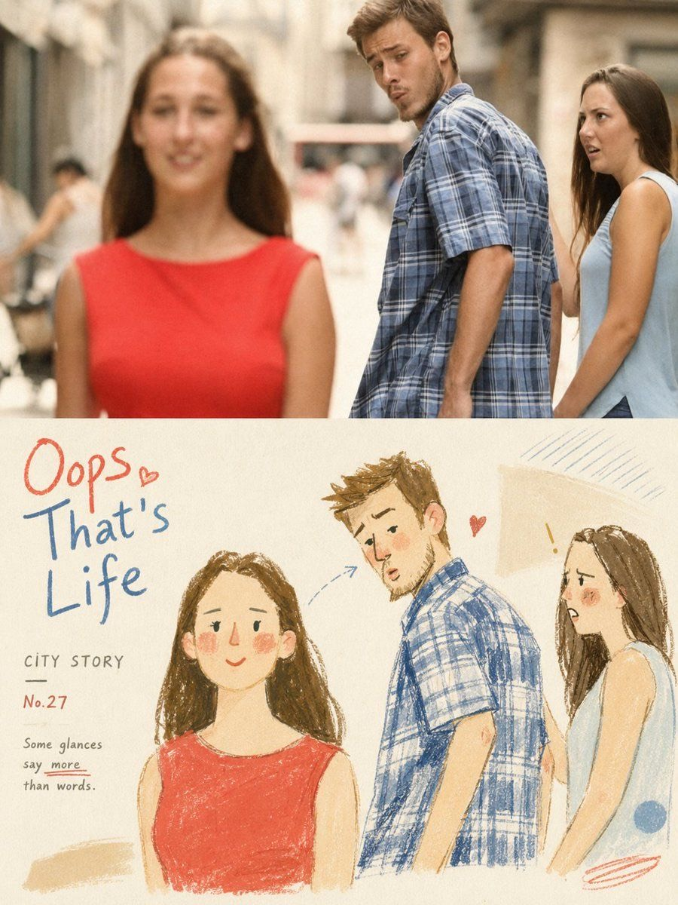</a>

将照片转化为上半部真实摄影、下半部复古水彩编辑插画的 3:4 分屏海报。 · 海报设计

来源：[@小小东](https://x.com/xiaoxiaodong01/status/2089893684527730867) · 来源提示词 / 翻译整理

**完整提示词**

```text
请将我上传的每一张照片分别制作成一张独立的高级设计海报，不多图拼接，每张照片单独输出。整体采用3:4竖版构图，上下两个区域高度严格1:1，各占画面50%。 上半部分保留原始照片，准确保持主体身份、情绪、姿态、空间关系、真实质感、自然光影和原有色彩氛围，仅进行轻微高级摄影调色，使其具有时尚杂志、艺术出版物与展览摄影质感。为适配画幅，可自然扩展天空、地面或环境背景，但不得拉伸、扭曲或改变主体。 下半部分提取照片中最具识别性的主体、轮廓、姿态与叙事关系，重构为轻盈、稚拙、复古的手绘编辑插画。不要机械复刻细节，以概括造型、适度夸张比例、符号化特征和幽默视觉隐喻重新表达，同时保持原物一眼可辨。融合现代主义编辑插画、包豪斯平面构成、儿童绘本、稚拙艺术与时尚速写气质，形体简练，轮廓略带迟疑与手工误差，局部特征可适度放大，让画面兼具故事感、时尚感与俏皮感。 配色从上方照片中提取，采用高明度、低至中等饱和度的柔和有限色盘，以近似色统一氛围，小面积互补色制造视觉跳点。使用水彩、水粉、彩铅、粉蜡笔与干刷混合质感，保留纸张颗粒、透底、笔触断裂、边缘毛糙、轻微脏色与旧印刷套色偏差。背景大面积留白，仅以松散淡彩、局部斜线或简单几何元素承托主体，避免复杂场景堆积、写实光影、光滑矢量、3D渲染和过度精修。 文字从照片的地点、人物、场景或主题中提炼少量英文关键词、标题、编号或适配金句，并延续下半部分的手绘编辑语言。主标题采用略带稚拙与复古感的手写艺术字，辅助文字使用克制温和的无衬线或衬线字体，可轻微错位、倾斜、拉伸、叠色或产生旧印刷套色偏移，让文字像插画的一部分自然生长在画面中，而不是后期贴上的排版元素。 整体使用米白或浅色背景与大量留白，上下画面通过相同的主体特征、色彩、姿态和视觉符号形成呼应。整体气质轻松、俏皮、复古、温柔、聪明、时髦、幽默、浪漫、松弛，略带笨拙与古怪自信，像一页被精心保存的旧时尚绘本与现代艺术杂志。
```

**可复用模板**

[查看对应模板](../templates/image.md#image-watercolor-editorial-illustration-poster)

<a id="image-2b779f2991"></a>

### 水墨双重曝光人物海报

<a href="../assets/cases/image-2b779f2991.jpg">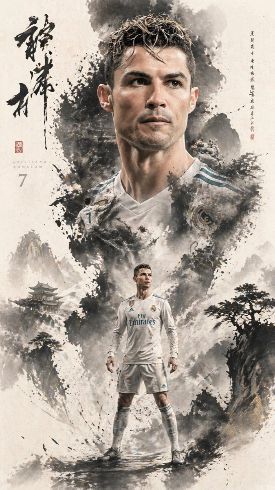</a>

生成融合人物轮廓、东方水墨、叙事场景和留白的双重曝光竖版海报。 · 海报设计

来源：[@Goodmanprotocol](https://x.com/Goodmanprotocol/status/2049002279051895243) · 来源提示词 / 翻译整理

**完整提示词**

```text
A cinematic character promotional poster of [SUBJECT], vertical composition (9:16), designed with a refined East-Asian ink aesthetic and high-end visual storytelling.

STRUCTURE:
Top-heavy hierarchical layout. The upper half features a large, highly recognizable silhouette of [SUBJECT]'s head / face / mask / upper body, forming a bold, iconic primary shape. The silhouette should be instantly identifiable.

The middle-lower section contains the full-body version of [SUBJECT] as a secondary subject, standing in a stable pose or subtle action stance, forming the visual core.

COMPOSITION STYLE:
Inside the large silhouette and around the character, use double exposure and collage storytelling. Integrate multiple elements:
- key scenes related to [SUBJECT]
- symbolic imagery and environment
- small narrative figures and interactions
- supporting visual motifs

Blend everything seamlessly using clouds, mist, ink diffusion, and negative space.

VISUAL FLOW:
Create a continuous flowing visual path from top to bottom, connecting:
- upper silhouette
- inner collage elements
- full-body subject

Ensure smooth eye guidance and compositional cohesion.

SIDE ELEMENTS:
Add balanced supporting elements on left and right sides to create tension, depth, and spatial variation.

STYLE & ATMOSPHERE:
- Large areas of negative space
- Ink-wash diffusion edges, soft fading, subtle fragmentation
- Eastern aesthetic: balance of emptiness and detail
- Calm, premium, restrained, cinematic tone

QUALITY:
Ultra-detailed, high resolution, layered depth, soft lighting, atmospheric perspective, cohesive series-style design.

OUTPUT:
9:16 aspect ratio, poster-ready composition.
```

**可复用模板**

[查看对应模板](../templates/image.md#image-ink-double-exposure-portrait-poster)

<a id="image-966a4fde71"></a>

### 四城极简旅行海报系列

<a href="../assets/cases/image-966a4fde71.jpg">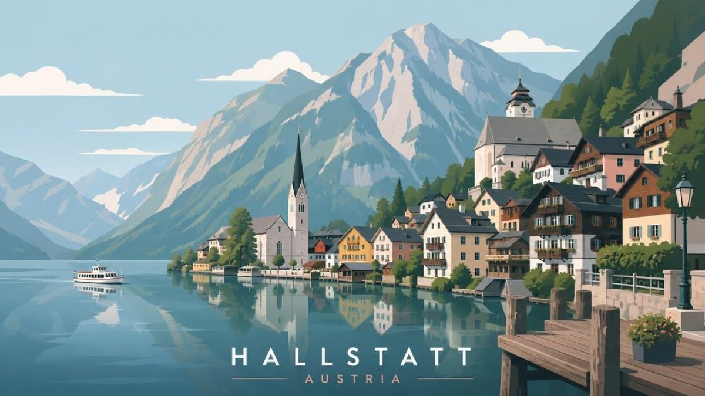</a>

以统一的极简矢量风格生成多个城市或目的地的系列旅行海报。 · 海报设计

来源：[@Taaruk_](https://x.com/Taaruk_/status/2059188921096085888) · 来源提示词 / 翻译整理

**完整提示词**

```text
Minimalist flat travel poster illustration series of iconic destinations around the world, clean vector art style, Scandinavian color palette, soft pastel tones, calm atmospheric scenery, Hallstatt Austria lakeside village with alpine mountains and reflections, Bergen Norway colorful harbor houses with fjord background, Kyoto Japan traditional riverside town with cherry blossoms and pagoda, Santorini Greece white architecture with blue domes overlooking the sea, ultra clean composition, geometric landscape shapes, smooth gradients, elegant typography with destination names, modern tourism poster aesthetic, serene travel mood, crisp vector lines, cinematic wide-angle scenery, peaceful skies with stylized clouds, highly detailed environment art, contemporary flat illustration, premium editorial travel design, balanced composition, minimal shadows, dreamy vacation atmosphere, soft morning lighting, high-end Airbnb poster vibe, Behance trending style, 4k, ultra detailed
```

**可复用模板**

[查看对应模板](../templates/image.md#image-four-city-minimal-travel-poster-series)

<a id="image-de6feddf44"></a>

### 四格奶昔食谱过程拼图

<a href="../assets/cases/image-de6feddf44.jpg">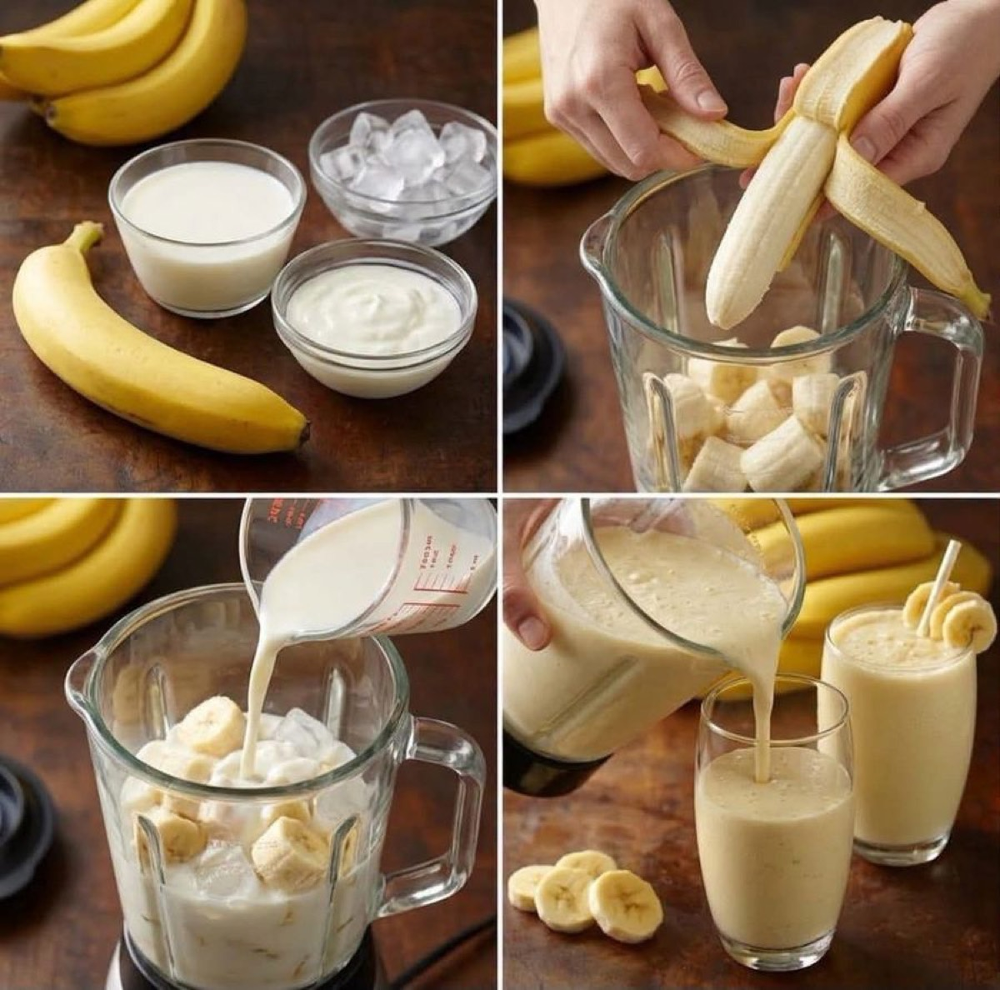</a>

生成用四个连续画面展示食材、处理、混合和成品的写实食谱过程拼图。 · 食品饮料

来源：[@Dua Fatima](https://x.com/DuaFatimaAi/status/2096033405259682193) · 来源提示词 / 翻译整理

**完整提示词**

```text
创建一个 2x2 的四格写实风格食谱拼图，展示在乡村风格深色木质餐桌上制作奶油香蕉奶昔的过程。

左上角：几根成熟的黄香蕉、一根剥皮的香蕉、一杯牛奶、一小碗浓稠的白酸奶以及一碗冰块，食材摆放整齐。

右上角：双手剥开成熟香蕉并将香蕉块放入透明玻璃搅拌杯的特写镜头。

左下角：牛奶从透明量杯中倒入装有香蕉块、酸奶和冰块的搅拌机中。

右下角：浓稠的奶油香蕉奶昔从搅拌机倒入透明玻璃杯中，背景中还有另一杯成品奶昔，木桌上散落着几片香蕉切片。

温暖的自然厨房光线，逼真的食物质感，奶油般的淡黄色奶昔，透明玻璃器皿，浅景深，乡村木质背景，构图简洁，专业美食摄影，高度细节，逼真的手部细节，自然阴影，4K 写实感，无文字，无标签，无水印。
```

**可复用模板**

[查看对应模板](../templates/image.md#image-four-panel-milkshake-recipe)

<a id="image-8c99b1b29f"></a>

### 同一人脸十二款发型图鉴

<a href="../assets/cases/image-8c99b1b29f.jpg">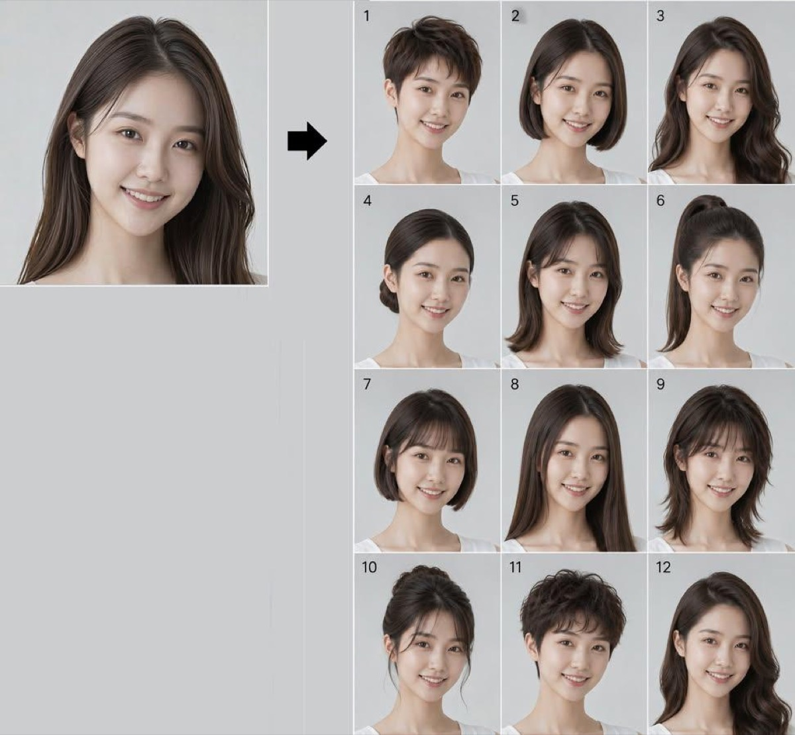</a>

保持参考人物身份、服装和光线一致，仅更换十二种发型并生成对照图鉴。 · 设计参考

来源：[@Ciri_ai](https://x.com/Ciri_ai/status/2092452220768002400) · 来源提示词 / 翻译整理

**完整提示词**

```text
Create a 12-panel grid (3 columns × 4 rows, numbered 1 to 12) showing the SAME person from the reference photo with 12 different hairstyles. This is a hairstyle lookbook. Final image aspect ratio: 4:5 (vertical/portrait).
THE ONLY THING THAT CHANGES BETWEEN PANELS IS THE HAIR ON THE HEAD (shape, style and length only). Everything else stays exactly as in the reference photo.
Identity Anchor (Critical)
The face must be IDENTICAL to the reference photo in every single panel. Preserve exactly: facial bone structure, jawline, cheekbones, nose shape, lips, eye shape and spacing, eyebrows, skin tone, skin texture (pores, natural imperfections), and overall facial proportions. This is the same real person in all 12 frames. Do NOT beautify, slim, or alter the face. Same age, same expression as in the reference.
Mandatory Rules (Do Not Violate)
- NO SUNGLASSES. Eyes must be fully visible in all 12 panels.
- NO ENVIRONMENTAL BACKGROUNDS. Every panel must have a plain, uniform, solid light grey studio backdrop with zero objects, zero textures, zero gradients. Just flat neutral grey.
- Hair COLOR stays exactly as it appears in the reference photo in all 12 panels. Only the shape, length and style changes, never the color.
Keep Identical in Every Panel (Do Not Change)
- MAKEUP AND SKIN: If the person in the reference photo wears makeup, replicate it identically in every panel. Same lip color, same eye makeup, same brow grooming. If they wear no makeup, keep all panels makeup-free. Do NOT add, remove, or alter makeup between panels.
- Clothing: the same clothing visible in the reference photo, replicated exactly.
- Accessories: preserve ALL visible accessories from the reference photo (earrings, necklaces, rings, bracelets, piercings, watch, glasses, etc.). Do not omit, resize, recolor, or restyle any accessory. If the person wears prescription glasses (not sunglasses), keep them in every panel.
- Background: plain solid light grey studio backdrop in every panel. No room, no furniture, no environment.
The 12 Hairstyles
1. Pixie cut: very short, textured, slightly tousled on top with tapered sides and nape
2. Classic bob: chin-length, straight, blunt ends, clean middle part
3. Long layered waves: past the shoulders, soft voluminous waves with face-framing layers
4. Sleek low bun: hair pulled back smoothly into a tight low bun at the nape, no flyaways
5. Curtain bangs with medium-length hair: soft parted fringe framing the face, hair falling just past the shoulders
6. High ponytail: hair pulled up into a sleek high ponytail, smooth crown, length falling behind
7. French bob: short bob ending at the jawline with a soft blunt micro-fringe across the forehead
8. Long straight hair with middle part: very long, sleek, pin-straight, falling well past the shoulders
9. Shaggy wolf cut: medium length, heavy layers, choppy fringe, textured and voluminous with a slightly wild look
10. Elegant updo: hair swept up into a polished chignon with soft face-framing tendrils
11. Short curly crop: short voluminous curls all over, natural texture, tapered at the sides
12. Side-swept Hollywood waves: long glamorous deep side part, sculpted vintage waves cascading over one shoulder
Photographic Specs
Shot on a Canon EOS R5 with an 85mm f/1.4 lens, studio portrait lighting (soft key light, subtle fill), shallow depth of field with sharp focus on the face. PLAIN SOLID LIGHT GREY STUDIO BACKGROUND in every panel. Natural skin rendering with visible pores and realistic hair strands (no plastic or CGI look). Consistent lighting, color grading and exposure across all 12 panels. Photorealistic, high detail, hyperrealistic, 8K. No illustration, no painterly effect, no over-smoothing. NO SUNGLASSES.
Each panel clearly numbered 1 to 12 in the top-left corner. Overall output aspect ratio 4:5.
```

**可复用模板**

[查看对应模板](../templates/image.md#image-same-face-twelve-hairstyles)

<a id="image-f932193426"></a>

### 未来亲生物中庭空间

<a href="../assets/cases/image-f932193426.jpg">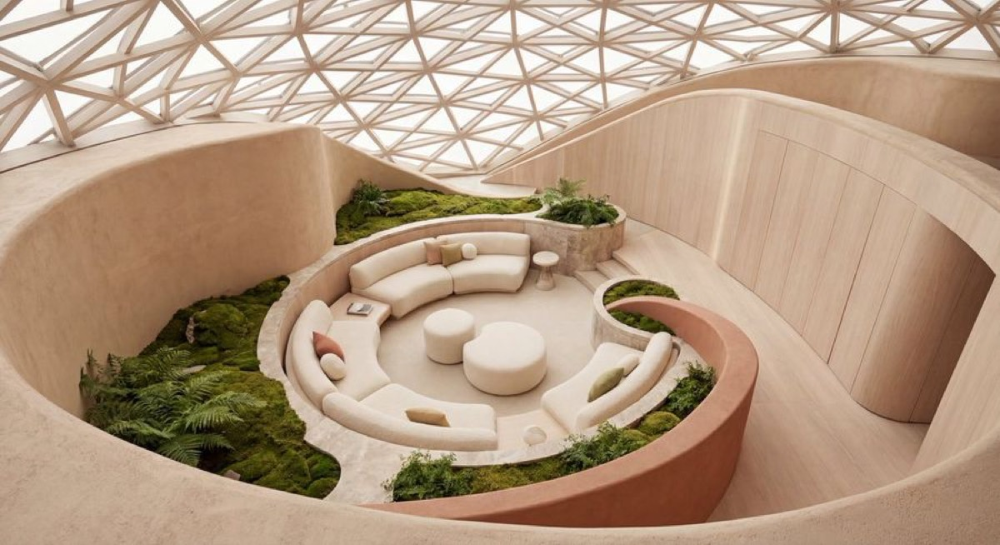</a>

生成融合自然植被、采光和未来建筑语言的中庭休息空间。 · 设计参考

来源：[@Christopher J. DiMarco](https://x.com/chrisjdimarco/status/2097067604531646936) · 来源提示词 / 翻译整理

**完整提示词**

```text
创建一个宁静的未来感亲生物室内休息室，采用温暖的中性色调，位于一个 大型穹顶状中庭 内，顶部设有由三角形切面组成的几何玻璃木格栅屋顶。使用高角度广角建筑摄影视角，俯瞰圆形的下沉式休息区。空间具有流畅的有机建筑风格：浅色灰泥弧形墙壁、浅橡木垂直木镶板、圆润的坡道和分层的圆形挡土墙，右前方有一面醒目的赤陶色弧形墙壁。中心是一个圆形谈话坑，周围环绕着 3 张奶油色弧形组合沙发、2 张圆形奶油色脚凳咖啡桌、1 张小型圆形边桌，以及 4 个可见的柔和桃色、米色、橄榄色和棕褐色装饰靠垫。休息室周围环绕着茂密的绿色苔藓床和蕨类植物，分为 4 个种植区：一个大型左侧花园床、一个狭窄的后部苔藓床、一个小型抬高式后部花槽和一个右前方弧形花槽。营造宁静、舒适、奢华且与自然融合的氛围，天窗透出柔和的漫射日光，无人像，无文字，无杂物，超写实渲染，触感光滑的材质，柔和的阴影，建筑文摘风格，超广角构图，浅橡木和温暖灰泥，柔和赤陶色，宁静的避风港。
```

**可复用模板**

[查看对应模板](../templates/image.md#image-futuristic-biophilic-atrium)

<a id="image-0d498d4702"></a>

### 五格咖啡馆人物拼贴

<a href="../assets/cases/image-0d498d4702.jpg">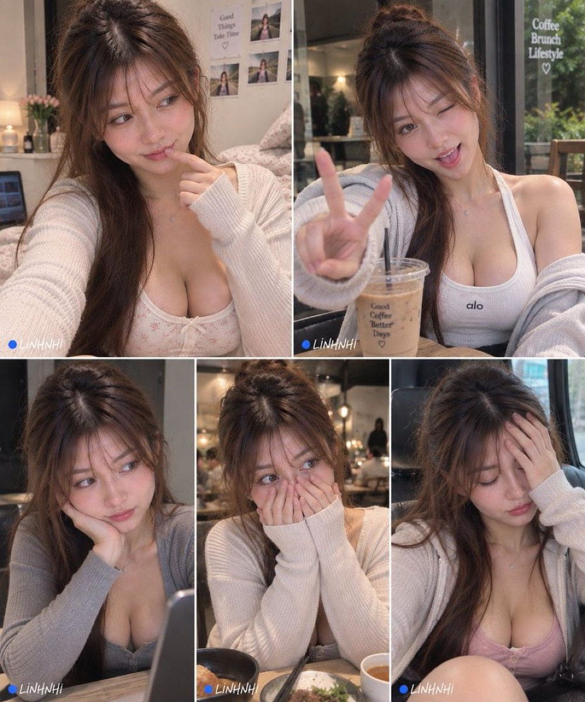</a>

生成适合社交媒体发布的五格咖啡馆人物生活方式拼贴。 · 社交媒体

来源：[@🇻🇳 Gdragon_stk 🇸🇪](https://x.com/zaizai36077041/status/2097032853410197878) · 来源提示词 / 翻译整理

**完整提示词**

```text
目标：为 LINH NHI 创建一张写实的社交媒体风格照片拼贴画。她是位年轻的东亚咖啡馆生活方式网红，画面包含五张抓拍肖像，采用柔和暖光，展现自然的皮肤纹理，留着棕色长发和空气刘海，身穿舒适的米色开衫/连帽衫，佩戴精致项链，穿着女性化的休闲背心。氛围可爱、俏皮、略带梦幻且亲密，如同个人的 Instagram 照片集。 画布：垂直 4:5 拼贴画，尺寸约为 1000 x 1250 像素，面板间有细白分割线。采用写实的智能手机摄影风格，浅景深，温馨的室内咖啡馆和卧室灯光，细腻的胶片颗粒感，以及柔和的调色。 布局：使用 5 个照片面板。顶行有 2 个等宽的大面板。底行有 3 个等宽的小垂直面板。在多个面板的左下角添加一个小水印：一个蓝点，后跟手写白色文字“LINHNHI”。 面板数量及内容： 1. 左上角面板：卧室自拍视角。女子身穿米色针织开衫，内搭浅色碎花吊带，坐在床边和墙面照片旁，眼神看向一侧，表情羞涩，手指轻触嘴唇。背景包括台灯、鲜花、床上用品、墙面小画，以及一张写有“Good Things Take Time”并带有爱心的便签。 2. 右上角面板：窗边的咖啡馆餐桌肖像。她身穿带有微小“alo”标志的白色罗纹背心，浅灰色拉链连帽衫滑落至一侧肩头。她眨眼，轻微吐舌，对着镜头比出大大的剪刀手。面前是一杯印有“Good Coffee Better Days”字样和爱心的冰咖啡。背景窗户上的文字写着“Coffee Brunch Lifestyle”并带有爱心。 3. 左下角面板：餐桌旁的咖啡馆肖像。她身穿灰色开衫，单手托腮，眼神看向一侧，表情无聊或沉思。前景可见笔记本电脑边缘，背景经过柔焦处理。 4. 中下角面板：餐厅/咖啡馆晚餐场景。她身穿米色开衫，双手捂住嘴巴和脸颊，眼神看向一侧，表情害羞。底部边缘可见一碗食物、筷子和饮料；身后是温暖的焦外成像灯光。 5. 右下角面板：车内或靠窗座位肖像。她身穿米色连帽衫，内搭粉色吊带，闭眼或低头，一只手放在额头上，仿佛疲惫或沉思。窗外透进柔和日光，背景为黑色座椅和模糊的城市景观。 视觉风格：超写实的亚洲网红摄影，经过柔和的美颜处理但真实可信，自然的面部表情，温暖的米色和奶油色调，舒适的咖啡馆美学，光泽感秀发，淡淡的腮红，无强硬阴影，无夸张的影棚灯光。 约束条件：确保 5 个面板中的女性形象保持一致。严格使用列出的 5 种姿势，采用 2 上 3 下的拼贴结构，细白边框，以及重复出现的小蓝点“LINHNHI”水印。避免出现多余面板、多余人物、手部畸形、主要文字无法辨认或卡通/动漫风格。
```

**可复用模板**

[查看对应模板](../templates/image.md#image-five-panel-cafe-character-collage)

<a id="image-2a8d580cf7"></a>

### 五五分混合媒介回忆卡

<a href="../assets/cases/image-2a8d580cf7.jpg">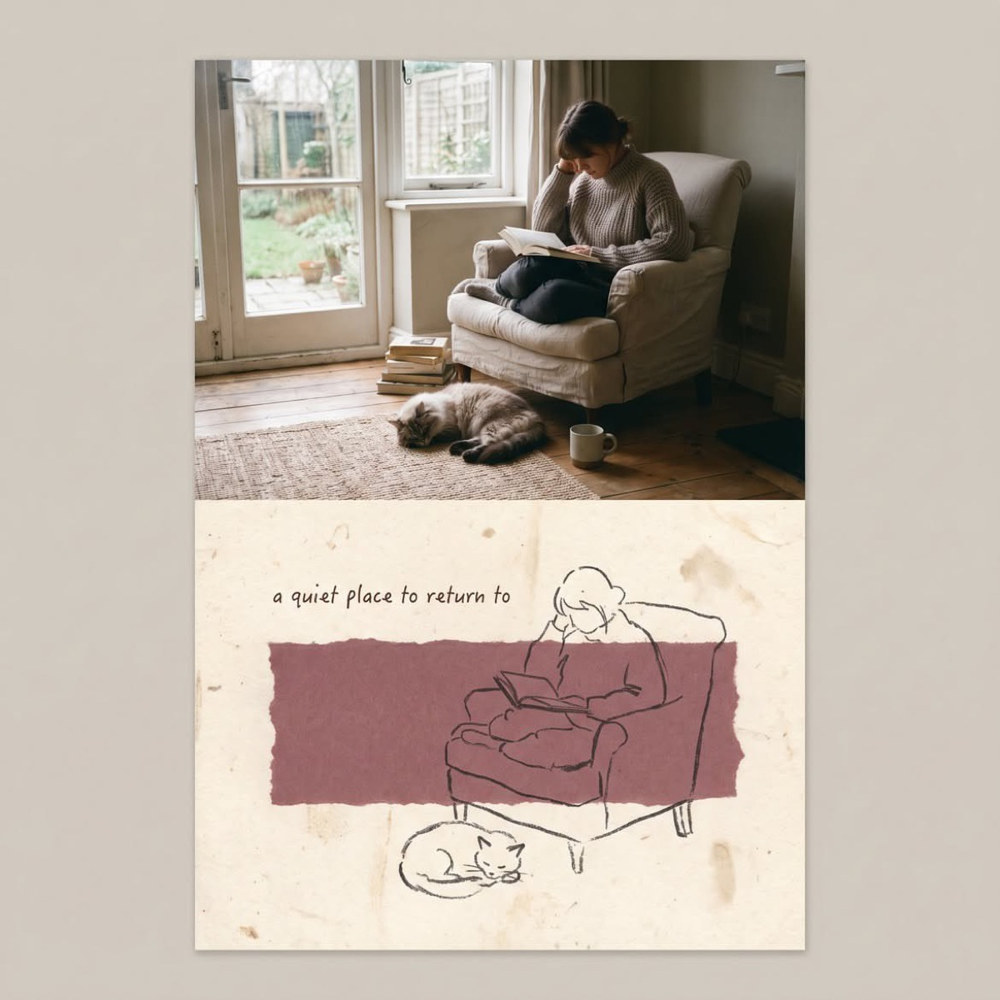</a>

将原始照片与蜡笔速写严格上下五五分割，生成克制怀旧的混合媒介回忆卡。 · 海报设计

来源：[@Sairah_0](https://x.com/Sairah_0/status/2093212900160868430) · 来源提示词 / 翻译整理

**完整提示词**

```text
Transform the uploaded photo into a vertical mixed-media memory card with a strict 50/50 split.

Keep the original photo unchanged in the top half. In the bottom half, use textured off-white handmade paper and add a muted, irregular color patch matching the photo’s tones.

Redraw the main subjects as a simple dark wax-crayon sketch with loose, imperfect lines and minimal details. Add a short handwritten English phrase and subtle Risograph grain.

Create a quiet, nostalgic Morandi-style aesthetic with generous negative space. Do not add extra elements or copy the reference composition exactly.
```

**可复用模板**

[查看对应模板](../templates/image.md#image-half-photo-half-crayon-memory-card)

<a id="image-f466b7610c"></a>

### 武汉复古地图海报

<a href="../assets/cases/image-f466b7610c.jpg">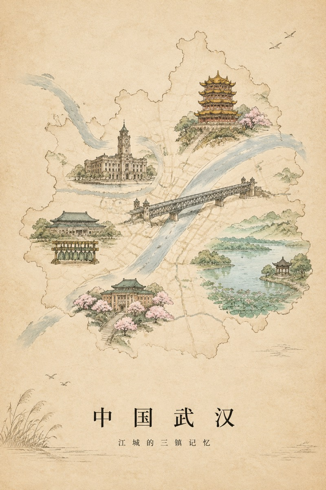</a>

生成一张以武汉城市地图、两江交汇和代表性地标为主体的复古羊皮纸线条艺术旅游海报，适合城市文化展示、旅行纪念和地方主题视觉创作。 · 海报设计

来源：[雪瑜（@xueyu1125）](https://x.com/xueyu1125/status/2094015423775994116) · 来源提示词 / 翻译整理

**完整提示词**

```text
创作一张精致的复古线条艺术旅游海报，竖版 4:5 构图，背景为温暖的陈旧羊皮纸，画面中心为中国武汉的精细手绘轮廓地图。地图应以武汉真实城市地理关系为基础进行优雅的艺术化简化，清晰表现长江由西南向东北穿城而过、汉江从西北汇入长江的两江交汇结构，并让武昌、汉口、汉阳三镇的空间关系可以被辨认，但不作为导航地图使用。

使用纤细的棕褐色墨水线条，搭配极克制的微妙水彩渲染，并留出大量米色空白空间。在地图内部放置 6 个精确、可辨认、互不拥挤的武汉地标插画元素：

1. 武昌蛇山附近的黄鹤楼，采用层叠飞檐、金色琉璃瓦与传统楼阁轮廓，作为地图上方偏右的核心地标。
2. 横跨长江的武汉长江大桥，以双层钢桁架桥和桥头堡表现，桥梁必须真实跨越地图中的长江水道。
3. 汉口江岸的江汉关大楼，突出古典钟楼、石质立面与端正的历史建筑比例。
4. 武汉大学老图书馆与少量樱花，表现绿色琉璃瓦、山地台阶和克制的淡粉色花枝。
5. 湖北省博物馆的曾侯乙编钟，以小型青铜编钟组作为文化符号，保持精细但不喧宾夺主。
6. 东湖水域与绿道，以舒展湖岸、淡蓝绿色水面、荷叶和一座小型湖畔亭子表现武汉的湖城气质。

让长江和汉江使用极淡的灰蓝色水彩，东湖使用柔和的青绿色；黄鹤楼屋顶、樱花、编钟和树木只使用少量低饱和金色、粉色、青铜绿和墨绿作为点缀。地图外围可添加极少量细小水纹、芦苇或候鸟线稿，但不要添加无关装饰。

保持构图优雅、极简，呈现博物馆收藏级旅游海报质感，具备精细的建筑细节、淡淡的纸张斑点、自然墨迹变化和轻微印刷颗粒。仅在地标插画内部使用柔和哑光色彩，其余区域保持羊皮纸与棕褐线稿。

在底部中心添加准确清晰的中文标题“中国武汉”，采用字间距较宽的黑色衬线字体；下方添加较小的中文副标题“江城的三镇记忆”。只允许出现这两组中文文字，不添加英文、地标标签或其他说明文字。

画面中不包含人物，不使用现代数字 UI，不使用霓虹、渐变、3D 塑料质感或照片拼贴，无边框，无水印，无品牌标志。确保地图、河流与地标之间层级清楚，武汉长江大桥必须跨越长江，地标不能漂浮在地图轮廓之外。
```

**可复用模板**

[查看对应模板](../templates/image.md#image-wuhan-vintage-map-poster)

<a id="image-bf146d83bb"></a>

### 武汉过早美食地图信息图

<a href="../assets/cases/image-bf146d83bb.jpg">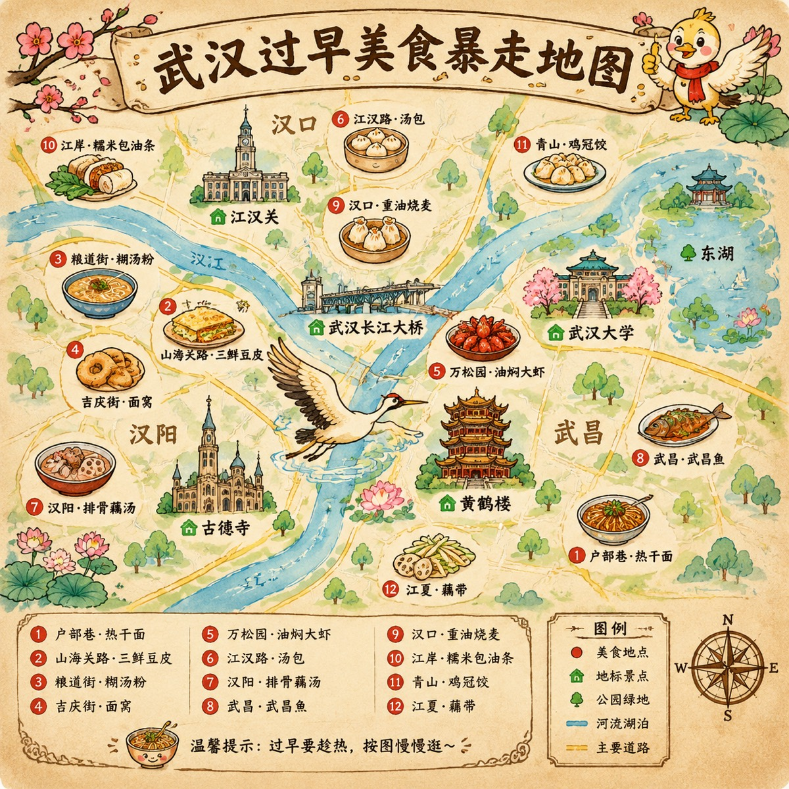</a>

生成一张以武汉两江交汇、三镇格局、代表性地标和“过早”美食为主体的复古手绘城市地图信息图。 · 信息图表

来源：[@mm_zzm44854](https://x.com/mm_zzm44854) · 来源提示词 / 翻译整理

**完整提示词**

```text
生成一张方形 1:1 的武汉手绘地图信息图，整体为复古羊皮纸上的水彩与墨线插画，保留清晰的信息图层级、丰富但有秩序的城市地图细节。

标题区域：

- 主标题必须准确写成“武汉过早美食暴走地图”。
- 配一个戴红围巾、竖起大拇指的可爱卡通黄鹤吉祥物。
- 标题周围以梅花枝、荷叶和少量芝麻粒图案形成手绘装饰边框。

地图结构：

- 使用有纹理的米色羊皮纸背景。
- 以武汉城市地图为主体，明显表现长江、汉江交汇以及武昌、汉口、汉阳三镇关系。
- 道路使用黄色双线，长江和汉江使用蓝色水彩，公园与湖泊使用绿色。
- 地图为旅游信息图式艺术化示意，不用于精确导航。

地标景点区，共 6 个手绘小插画并配准确中文标签：

1. 黄鹤楼：传统多层飞檐楼阁。
2. 江汉关：带钟楼的历史建筑。
3. 武汉长江大桥：横跨长江的双层钢桁架桥。
4. 武汉大学：老图书馆、台阶与樱花。
5. 东湖：湖面、荷叶、绿道与亭子。
6. 古德寺：具有独特穹顶与尖塔轮廓的历史建筑。

美食地点区，共 12 个手绘食物图标，使用红色编号并配准确中文标签：

1. 户部巷·热干面
2. 山海关路·三鲜豆皮
3. 粮道街·糊汤粉
4. 吉庆街·面窝
5. 万松园·油焖大虾
6. 江汉路·汤包
7. 汉阳·排骨藕汤
8. 武昌·武昌鱼
9. 汉口·重油烧麦
10. 江岸·糯米包油条
11. 青山·鸡冠饺
12. 江夏·藕带

地图中心设置一只体量较大的卡通黄鹤，展开翅膀飞过两江交汇处，周围点缀少量莲花和水纹，不遮挡地图与标签。

右下角加入复古指南针和图例。图例标题必须写成“图例”，包含 5 项：

- 红点：美食地点
- 绿色房屋：地标景点
- 绿色树木：公园绿地
- 蓝线：河流湖泊
- 黄色双线：主要道路

底部加入小号提示文字：“温馨提示：过早要趁热，按图慢慢逛～”，旁边配一只微笑的热干面小碗图标。

要求：中文文字清晰准确，不出现乱码，不增加未指定的店名、品牌、英文和无意义文字。保持水彩墨线手绘、复古旅行地图、轻松亲切、信息丰富但不拥挤的视觉效果。
```

**可复用模板**

[查看对应模板](../templates/image.md#image-wuhan-breakfast-food-map-infographic)

<a id="image-de94c8b709"></a>

### 现代艺术活动传单

<a href="../assets/cases/image-de94c8b709.jpg">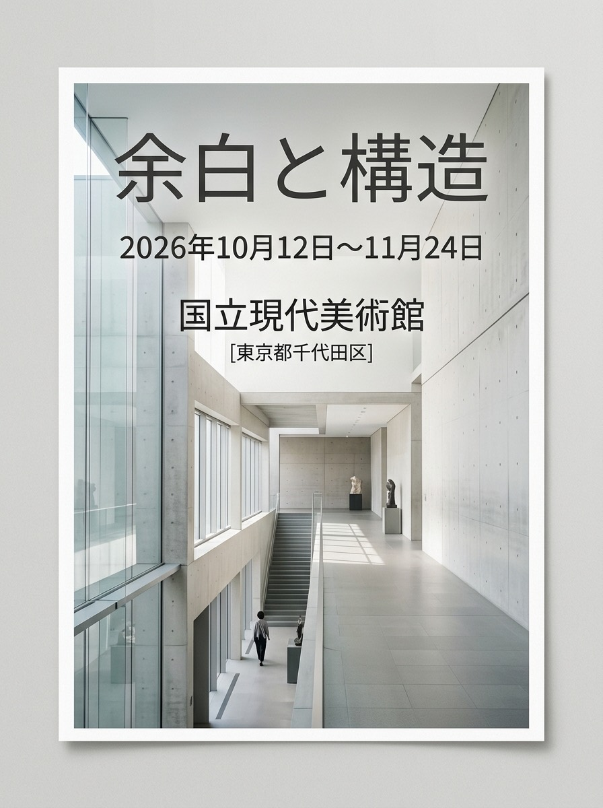</a>

生成适合展览、讲座和文化活动的现代艺术传单。 · 活动物料

来源：[@AI Guide-Note - 実務で使えるAI活用メディア](https://x.com/AIGuideNote/status/2096710919900582307) · 来源提示词 / 翻译整理

**完整提示词**

```text
[活动信息] - 活动名称：Margin and Structure - 日期与时间：2026 年 10 月 12 日 – 11 月 24 日 - 地点：国家现代艺术博物馆 [质量、方向与构图] - 风格：当代艺术展览或现代设计活动海报，采用干净、极简的编辑排版。 - 视觉元素：构图精美的摄影作品，包含几何抽象艺术品或混凝土与玻璃建筑空间，营造出宁静与智慧的氛围。 - 排版位置（适用于 GPT-image / Nano Banana Pro）：活动名称“Margin and Structure”、日期“2026 年 10 月 12 日 – 11 月 24 日”以及地点信息“国家现代艺术博物馆”需使用精致的现代无衬线字体，优美地排布在留白处。文字应与图像和谐共存，且不破坏整体美感。 - 光影与色彩：以干净的白色为主基调，采用冷色调自然光及柔和的光影渐变，配色以中性色为主，辅以点缀色（如海军蓝或深灰色）。 [严格的布局与输出限制（必填）] - 输出成品设计本身，并填满整个画布。设计内部的场景描述（墙壁、空间、阴影等）可遵循主要说明。 - 禁止事项：禁止输出相框中的海报照片、贴在墙上的海报照片、放置在桌面或纸张上的样机照片、纸张边缘的透视变形或投影。 - 输出成品平面 2D 设计本身，并填满整个画布。允许包含上述描述的设计内部场景元素（墙壁、房间、阴影）。绝对禁止任何海报样机效果：禁止画框、禁止墙上海报或桌上海报的拍摄视角、禁止艺术品边缘的透视变形或投影。 - 宽高比：--ar 3:4
```

**可复用模板**

[查看对应模板](../templates/image.md#image-modern-art-event-flyer)

<a id="image-6160fd8cca"></a>

### 箱内仰视农场广告海报

<a href="../assets/cases/image-6160fd8cca.jpg">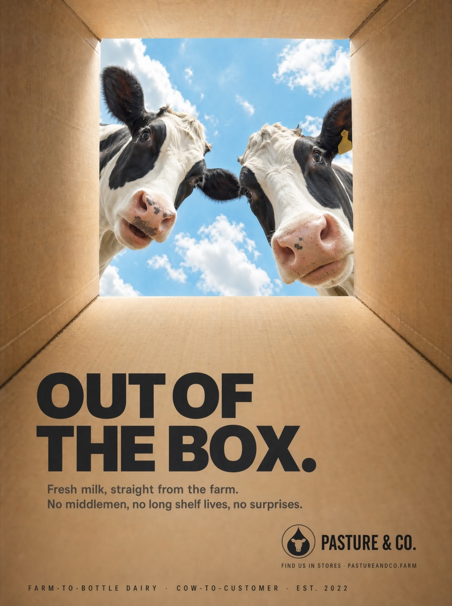</a>

生成从纸箱内部向上仰视的概念广告海报，通过强透视开口、动物探头和底部品牌文案表达新鲜直达的产品卖点。 · 商业广告

来源：[@wer](https://higgsfield.ai/publications/bf3260f9-7da3-4eda-a8b4-04ca42bed096) · 来源提示词 / 翻译整理

**完整提示词**

```text
创建一张 3:4 竖版概念广告海报。镜头位于打开的牛皮纸箱底部，以第一人称视角垂直向上拍摄。四面纸箱内壁以强烈单点透视汇聚到画面顶部中央的方形开口，纸板保留瓦楞、折痕、磨损和真实阴影。

开口外是明亮浅蓝天空和少量白云。两只 `{animalType}` 从开口左右两侧好奇地探头向下看，眼神友好，距离略有差异，形成自然不对称和尺度反差。阳光从开口照入，照亮纸板上缘，主体清晰，近处纸箱略微虚化。

海报底部在纸板区域排布大号标题“{headline}”、两行卖点“{supportingCopy}”、小型原创品牌标识“{brandName}”、配送或产地信息以及极细页脚。标题使用粗体现代无衬线字体，正文使用中等字重，元信息使用带字距的大写字体。

配色以牛皮纸棕、天空蓝、自然主体色、炭黑和柔和灰为主。整体要像成熟创意广告：概念一眼可懂、留白充足、文字可读、摄影质感真实，不出现真实品牌或水印。
```

**可复用模板**

[查看对应模板](../templates/image.md#image-inside-box-farm-ad-poster)

<a id="image-8e8bcb2b18"></a>

### 橡皮章旅行田野笔记

<a href="../assets/cases/image-8e8bcb2b18.jpg">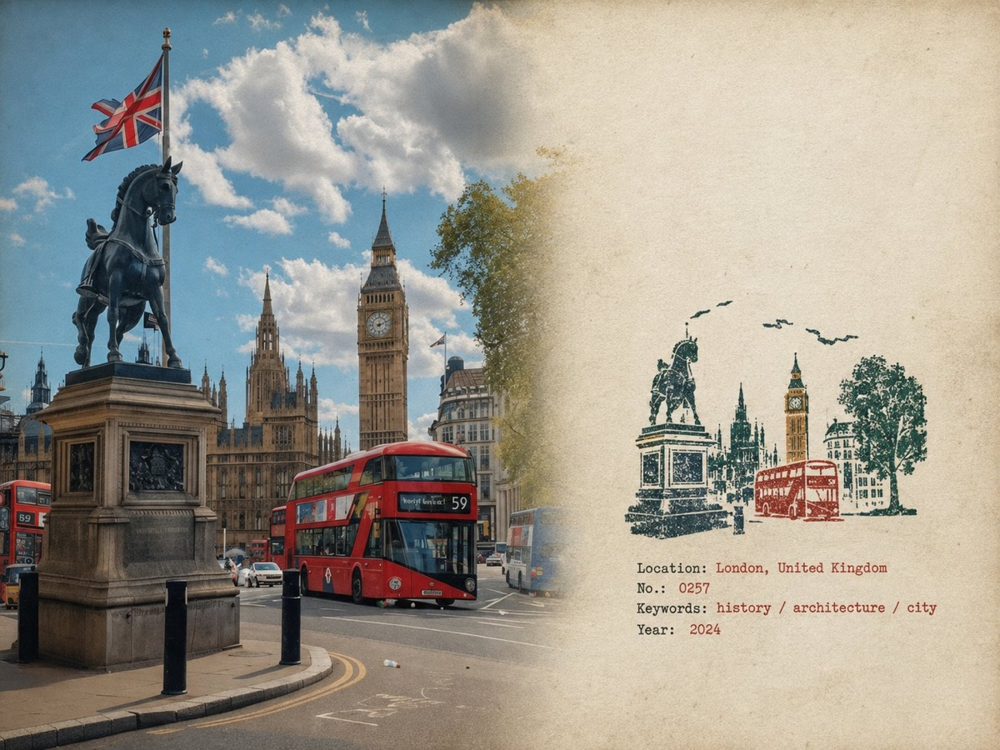</a>

把旅行照片与手工橡皮章、旧纸张和少量档案文字组合成旅行田野笔记。 · 旅行城市

来源：[@MahnoorAi12](https://x.com/MahnoorAi12/status/2092221482139349307) · 来源提示词 / 翻译整理

**完整提示词**

```text
Rubber Stamp Travel Field Notes Poster — Natural Realism Version

Create a separate “Rubber Stamp Travel Field Notes Poster” for each photo I upload. Output each photo individually. Never create a collage or combine multiple photos.

Use a 4:3 landscape composition with a natural visual transition between the original photograph on the left and the aged-paper field-note area on the right. Do not add an obvious dividing line.

LEFT — ORIGINAL PHOTOGRAPH

The left side should occupy roughly 58% of the frame.

Keep the uploaded photograph visually authentic and recognizable. Preserve the original subject, perspective, terrain, architecture, plants, people, spatial relationships, natural light, shadows, textures, and overall atmosphere.

Do not redesign or reinterpret the photograph.

Only apply a very subtle editorial photo treatment: gentle tonal balancing, restrained color grading, slightly softened highlights, and extremely fine natural film grain. It should still look like a real photograph taken on location rather than an AI-generated image.

Natural cropping is allowed if needed to fit the 4:3 layout, but do not stretch, distort, move, replace, or redraw the main subject.

Avoid excessive sharpness, HDR effects, artificial clarity, cinematic color grading, or overly perfect details.

RIGHT — AGED PAPER FIELD NOTES

The right side should occupy roughly 42% of the frame.

Use warm off-white, slightly aged paper with a believable physical texture. Include very subtle paper fibers, fine grain, faint handling marks, and a matte surface.

Keep large areas completely unprinted.

The paper should feel like a real sheet from an architect's travel notebook or field journal, not a designed poster background.

Avoid overly strong stains, decorative textures, vintage filters, or artificial grunge.

SMALL RUBBER STAMP

Study the uploaded photograph and identify only the few visual features that make the location immediately recognizable.

Reduce them into a compact, imperfect multi-color rubber stamp impression.

Do not reproduce the photograph element by element.

Simplify aggressively and retain only the most meaningful visual relationships:

- distinctive architecture and silhouette
- important roof, tower, dome, arch, or structural shape
- mountain or terrain contours
- shoreline or road direction
- a few recognizable trees or vegetation forms
- simplified settlement layers
- one or two important foreground shapes when visually relevant

Remove crowds, cars, dense windows, repetitive buildings, tiny vegetation, decorative objects, and insignificant background details.

The result should look like something a traveler could have actually carved into a small rubber stamp, not a miniature illustration of the entire photograph.

Place the stamp in the lower-middle portion of the right paper area, occupying approximately 30–38% of the right section's height.

Keep generous blank paper around it.

Do not enlarge it into a large illustration.

STAMP COLOR & PRINT CHARACTER

Extract approximately 2–4 muted spot colors naturally from the original photograph.

Possible colors include:

- carbon black
- deep green
- brick or muted red
- ochre
- slate blue
- taupe or earthy brown

Do not force these colors if the photograph suggests a different restrained palette.

Each color should appear as a separate physical ink layer.

Make the print feel genuinely handmade:

- slightly uneven pressure
- tiny gaps in the ink
- dry areas
- paper showing through
- rough carved edges
- irregular line thickness
- small contour breaks
- granular ink texture
- faint ghosting
- slight natural color-layer misregistration
- subtle edge variation

The imperfections should be small and believable, as if the stamp was pressed onto paper by hand.

Avoid perfectly aligned digital layers, smooth vector edges, clean gradients, or artificially exaggerated distress.

The stamp should look physically printed, not digitally illustrated.

FIELD-NOTE TYPOGRAPHY

Generate a small amount of text based only on the actual location and imagery in the photograph:

Location — English name
No. — Number
Three short English keywords
Gregorian calendar year

Place the text below or beside the stamp within the available whitespace.

Use a small, understated typewriter or archival field-note style.

The typography should have very slight mechanical irregularity, as though typed or printed on an old field notebook.

Keep it quiet and secondary to the photograph.

Spell the location and all words correctly.

Do not add slogans, brands, tourist phrases, decorative quotes, or unnecessary text.

OVERALL REALISM

The finished image should feel like a real travel photograph mounted beside a small handmade field stamp on an architect's personal notebook page.

Prioritize subtle physical realism over visual perfection.

The photograph should remain the strongest visual element.

The stamp should feel like a small fragment of memory extracted from the photograph rather than a second illustration.

Use restrained contrast, natural imperfections, believable paper texture, and slightly imperfect printing.

The final result should feel quiet, tactile, documentary, collectible, and genuinely handmade.

Avoid

Obvious dividing lines, circular seals, postage-stamp borders, perforations, wax seals, sticker layouts, souvenir-card designs, generic travel templates, smooth vector logos, polished digital illustrations, cartoon styling, 3D rendering, plastic textures, glossy gradients, excessive saturation, HDR effects, excessive text, decorative clutter, overly clean geometry, perfectly aligned ink layers, dense miniature architecture, or any alteration/redrawing of the original photograph.
```

**可复用模板**

[查看对应模板](../templates/image.md#image-rubber-stamp-travel-field-notes)

<a id="image-c7200c726a"></a>

### 羊毛毡国家微缩世界

<a href="../assets/cases/image-c7200c726a.jpg">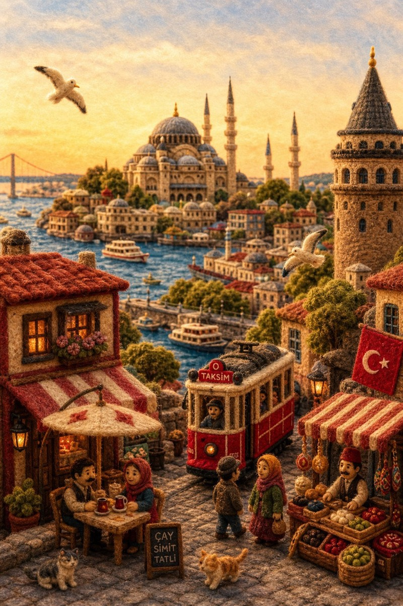</a>

将国家、城市和代表性地标转化为具有手工羊毛毡质感的微缩世界。 · 旅行城市

来源：[@volkan_iras](https://x.com/volkan_iras/status/2051403524966141980) · 来源提示词 / 翻译整理

**完整提示词**

```text
Country: [INSERT COUNTRY NAME]

A miniature felt diorama made of fluffy yarn, wool, and needlework, designed as a single cohesive small world (not a collage), reflecting the real landscape, culture, and daily life of the country.

Structure:
- Select 4–7 naturally integrated elements (landscape, architecture, transport, street life, culture)
- Everything must flow together as one environment

Foreground:
Everyday life — small shops, cafes, markets, people interacting, local clothing, street details, subtle movement, warm human presence

Midground:
Connecting flow — streets, bridges, rivers, paths, transport, cultural spaces that guide the eye naturally from front to back

Background:
One strong identity anchor — landmark, skyline, mountain, or symbolic landscape clearly representing the country (keep it clean, not overcrowded)

Style:
Handmade wool felt, yarn, needle-felt textures, visible fibers, soft edges, miniature craftsmanship, premium diorama realism

Lighting:
Warm golden hour or bright noon, soft shadows, clear visibility, gentle glow enhancing depth

Color:
Soft but saturated palette reflecting the country’s natural tones (greens, sky blues, architectural hues, cultural accents), warm and balanced

Composition:
Vertical frame, balanced or centered perspective, slight top-down or immersive angle, clear foreground–midground–background depth

Mood:
Warm, emotional, calm, refined — like a handcrafted fairy-tale version of real life (not childish)

Rules:
- No logos or text overlays
- No collage-style composition
- No random symbolic clutter
- Keep it realistic but stylized as a handmade miniature world

Quality:
16K, ultra-detailed, hyper-realistic miniature textures, cinematic depth, sharp focus

output_goal:
A single, cohesive felt diorama world that instantly conveys the identity and atmosphere of the chosen country through integrated landscape, culture, and daily life
```

**可复用模板**

[查看对应模板](../templates/image.md#image-felt-country-miniature-world)

<a id="image-89e8a705fc"></a>

### 一致性室内空间多视角网格

<a href="../assets/cases/image-89e8a705fc.jpg">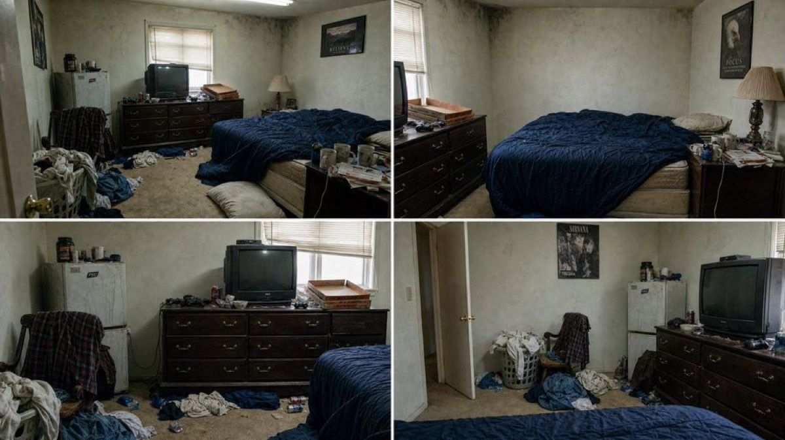</a>

生成同一室内空间的多角度一致性设计网格。 · 设计参考

来源：[@M. Asif](https://x.com/meAsifAi/status/2095979782068666556) · 来源提示词 / 翻译整理

**完整提示词**

```text
请以附带的照片作为该房间的精确参考，创建一个分为 2x2 网格的单张图像，包含四个相等的面板。每个面板均为从不同墙面拍摄的同一房间的写实广角视图，要求家具、颜色、米色地毯、灰白色墙面、平淡的阴天窗外光线以及 35mm 胶片质感保持完全一致，且所有面板中均不得出现人物。 面板 1（左上）—— 参考视图：站在门口看向窗户所在的墙面；木制梳妆台上放着电视，左侧是黑色迷你冰箱，右侧墙边是铺得凌乱的深蓝色被子，近右角处放着洗衣篮和椅子。 面板 2（右上）—— 看向右侧墙面：从侧面看床，床头靠墙，木制床头柜上放着蓝色台灯、咖啡杯和一叠信件，上方挂着带框的老鹰海报，窗户现在位于画面左边缘。 面板 3（左下）—— 看向左侧墙面：木制梳妆台上放着旧式大头电视、麦片碗和游戏手柄，旁边是黑色迷你冰箱，窗户现在位于画面右边缘，床尾可见于最右侧。 面板 4（右下）—— 回看房门所在的墙面，即参考视图的反向角度：打开的卧室门带有黄铜门把手，洗衣篮和放着法兰绒衬衫的椅子现在位于左侧，梳妆台和电视现在位于右侧，床尾位于近处前景。 每个物体都需保持其在房间内的真实位置，以确保所有四个视图共同描述一个空间一致的场景。
```

**可复用模板**

[查看对应模板](../templates/image.md#image-consistent-interior-multiview-grid)

<a id="image-054cd4752d"></a>

### 一周穿搭信息图

<a href="../assets/cases/image-054cd4752d.jpg">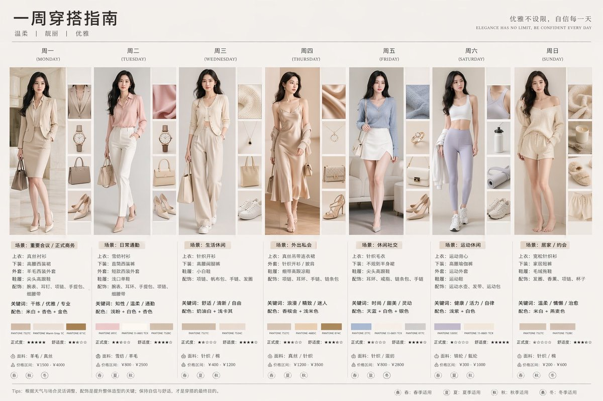</a>

生成按星期排列的七日穿搭图鉴，集中展示人物造型、服装细节、颜色和适用场景。 · 信息图表

来源：[@yyyole](https://x.com/yyyole) · 来源提示词 / 翻译整理

**完整提示词**

```text
{
  "type": "7-day fashion lookbook infographic",
  "header": {
    "title": "{argument name=\"main title\" default=\"一周穿搭指南\"}",
    "subtitle": "{argument name=\"style keywords\" default=\"温柔 | 靓丽 | 优雅\"}",
    "slogan_cn": "优雅不设限，自信每一天",
    "slogan_en": "{argument name=\"english slogan\" default=\"ELEGANCE HAS NO LIMIT, BE CONFIDENT EVERY DAY\"}"
  },
  "subject": "{argument name=\"subject description\" default=\"young elegant Asian woman\"}",
  "layout": {
    "columns": 7,
    "column_elements": [
      "day_header",
      "main_portrait",
      "4_detail_thumbnails",
      "outfit_specs",
      "keywords_colors",
      "3_color_swatches",
      "star_ratings",
      "fabric_price",
      "4_season_icons"
    ],
    "days": [
      { "day": "周一 (MONDAY)", "outfit": "beige blazer suit", "scene": "场景：重要会议 / 正式商务" },
      { "day": "周二 (TUESDAY)", "outfit": "pink blazer suit", "scene": "场景：日常通勤" },
      { "day": "周三 (WEDNESDAY)", "outfit": "cream knit cardigan set", "scene": "场景：生活休闲" },
      { "day": "周四 (THURSDAY)", "outfit": "champagne slip dress", "scene": "场景：外出私会" },
      { "day": "周五 (FRIDAY)", "outfit": "blue knit top, white skirt", "scene": "场景：休闲社交" },
      { "day": "周六 (SATURDAY)", "outfit": "white sports bra, purple leggings", "scene": "场景：运动休闲" },
      { "day": "周日 (SUNDAY)", "outfit": "beige lounge knitwear", "scene": "场景：居家 / 约会" }
    ]
  },
  "footer": {
    "tips": "{argument name=\"footer tips\" default=\"Tips: 根据天气与场合灵活调整，配饰是提升整体造型的关键；保持自信与舒适，才是穿搭的最终目的。\"}",
    "legend": [
      "春: 春季适用",
      "夏: 夏季适用",
      "秋: 秋季适用",
      "冬: 冬季适用"
    ]
  }
}
```

**可复用模板**

[查看对应模板](../templates/image.md#image-weekly-outfit-infographic)

<a id="image-ee84e012bf"></a>

### 饮料食品营销主视觉

<a href="../assets/cases/image-ee84e012bf.jpg">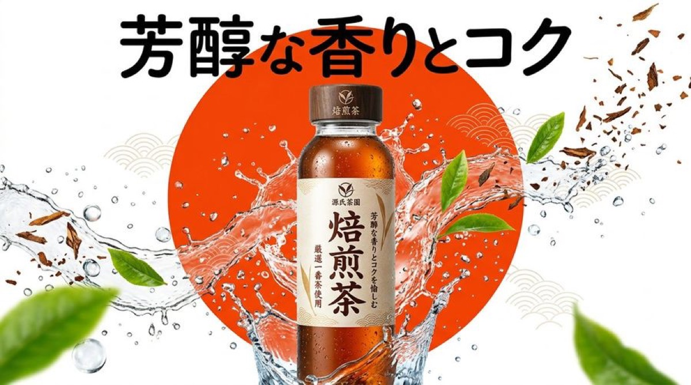</a>

生成饮料、冷冻食品和包装商品的商业营销主视觉。 · 商业广告

来源：[@AI Guide-Note - 実務で使えるAI活用メディア](https://x.com/AIGuideNote/status/2097040165009252374) · 来源提示词 / 翻译整理

**完整提示词**

```text
[产品/包装] - 产品名称/类型：{productName} - 吸引力/宣传语：{subText} [设计巧思] - 背景视觉元素：{circleColor} [图像质量、呈现与构图规范] - 风格：流行且生动的日本便利店或食品制造商营销主视觉。具有强烈的诱人感与视觉冲击力。 - 主体：将 {productName} 的罐装、瓶装或包装放置在中心。冰块碎片、水滴、水花或新鲜原材料（如茶叶或水果）在周围动态飞溅。 - 背景：高对比度、清晰的纯色或渐变背景，以 {circleColor} 作为主要图形元素。 - 排版（适用于 GPT-image / Nano Banana Pro）：文案 {subText} 使用粗体、充满活力的字体，放置在不遮挡产品的位置。 - 灯光/色彩：明亮生动的摄影棚灯光、晶莹剔透的反射效果以及充满活力的色彩构成。 [布局与输出的严格限制（强制执行）] - 输出成品设计本身，填满整个画布。设计内部的背景和场景描绘（墙壁、空间、阴影）可遵循正文中的说明。 - 禁止事项：带边框的海报照片、贴在墙上的海报照片、放置在桌子或纸张上的样机照片、纸张边缘的透视变形或投影。 - 输出成品平面 2D 设计本身，填满整个画布。允许使用上述描述的设计内部场景元素。绝对禁止海报样机照片：不得包含相框、不得拍摄贴在墙上或桌上的海报，不得出现艺术品边缘的透视变形或投影。 - 长宽比：--ar 16:9
```

**可复用模板**

[查看对应模板](../templates/image.md#image-beverage-food-marketing-hero)

<a id="image-81c5c8e11d"></a>

### 真人切模贴纸海报

<a href="../assets/cases/image-81c5c8e11d.jpg">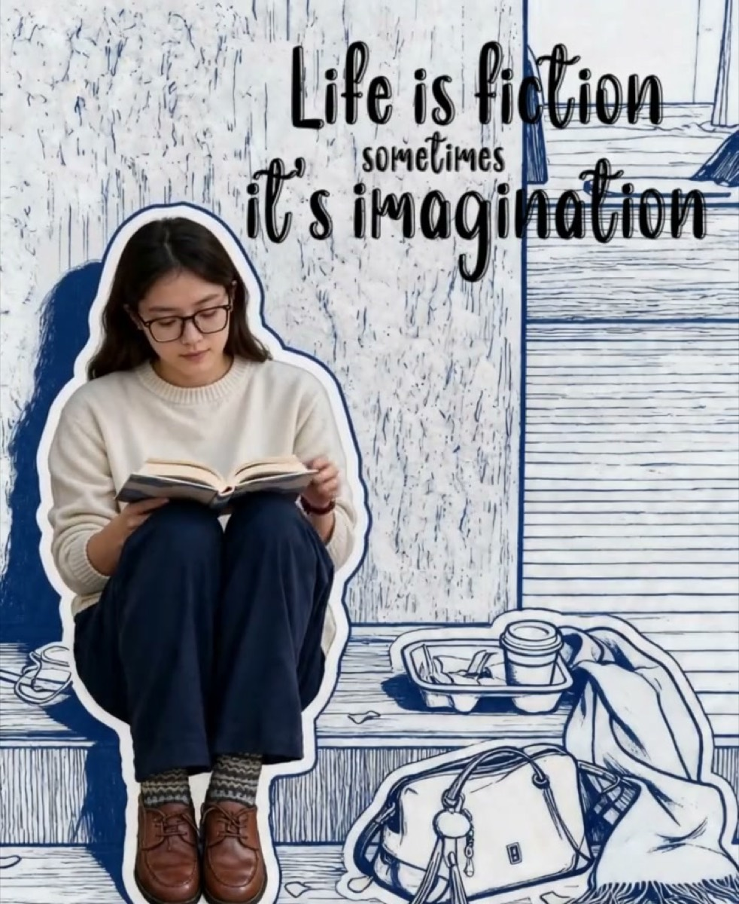</a>

上传人物照片，保留真人摄影质感，将环境改为带白色裁切边的黑白手绘贴纸。 · 图片转绘

来源：[小洁AI实战](https://www.douyin.com/video/7683887650173032805) · 根据来源整理的适配提示词

**完整提示词**

```text
以上传的人物照片为唯一主体与场景参考，生成一张真人与手绘切模贴纸背景结合的复古海报。

原图中的真实人物主体完整保留，严格保持人物身份、五官长相、原有姿态、可见四肢、服装及鞋子细节，以及人物手中拿着的物品。人物始终保留真实、清晰的高清摄影质感，不将人物漫画化、插画化或贴纸化，不改变人数，不补造原图未显示的身体部位。

将原照片中的环境背景，包括人物实际坐着的椅子等非人物元素，转换为极简黑白单线轮廓的切模贴纸：粗黑色轮廓、少量纯黑色块阴影、纯黑白无渐变。背景贴纸自带一圈白色裁切边，呈现手账贴纸叠加效果、扁平极简手绘与 ins 简约涂鸦风。人物边缘可有白色裁切边，但人物内部仍为真实摄影，不绘制成平面人物。

保留原图的主要构图、物体位置与透视关系，让真实人物与二维贴纸背景自然融合。仅转换原场景中已有的环境元素，不新增无关物品、人物、标题、标语、商业主张、水印或教程字幕。人物和物品边界清晰，纸张及裁切边自然，不出现多余肢体、融化或模糊。
```

**可复用模板**

[查看对应模板](../templates/image.md#image-real-person-die-cut-sticker-poster)

<a id="image-24c5febb05"></a>

### 纸雕浮雕街区网格

<a href="../assets/cases/image-24c5febb05.jpg">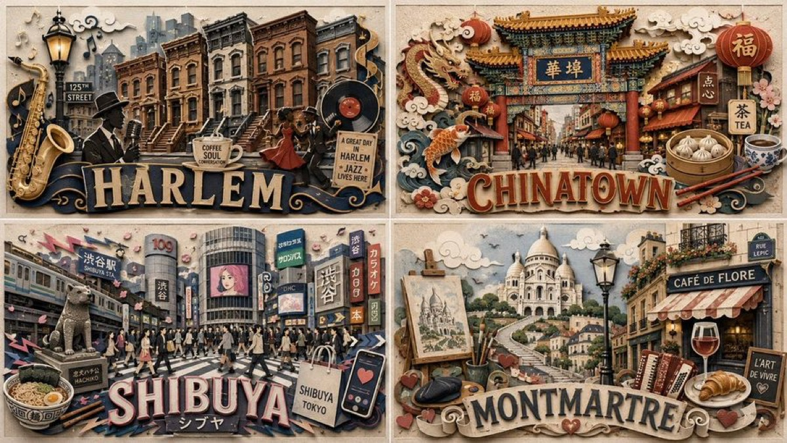</a>

生成多组统一纸雕浮雕风格的街区或社区场景。 · 设计参考

来源：[@Gadgetify](https://x.com/Gdgtify/status/2096022497791721564) · 来源提示词 / 翻译整理

**完整提示词**

```text
2x2 网格，16:9，选择 4 个街区 并展现其全貌： PAPER_RELIEF(TOPIC) ::= layer_00 = 平面衬纸层 layer_01 = 宽幅剪影层 layer_02 = 主要面部 / 物体平面层 layer_03 = 内部轮廓线层 layer_04 = 符号化物体与图表层 layer_05 = 流动卷轴与丝带层 layer_06 = 立体标题排版层 layer_07 = 微小压印细节层 规则： - 每一层都投射出柔和可见的阴影 - 边缘应呈现出物理切割、堆叠、折叠或卷曲的效果 - 细节密度在焦点区域附近增加 - 背景保持简洁且具有纸张质感 - 所有深度均源自真实的材质分层，而非数字渐变
```

**可复用模板**

[查看对应模板](../templates/image.md#image-paper-relief-neighborhood-grid)

<a id="image-ed6e569904"></a>

### 中文奢华美妆海报

<a href="../assets/cases/image-ed6e569904.jpg">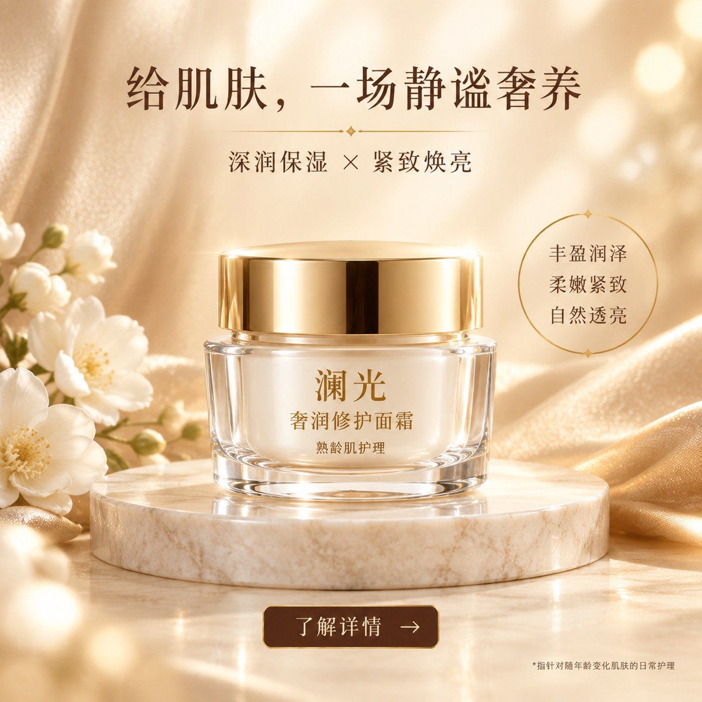</a>

生成一张以面霜产品为视觉中心，使用香槟金丝绸、大理石台面、中文标题和中文卖点的高端美妆广告海报。 · 商业广告

来源：[@panchaaan_2](https://x.com/panchaaan_2) · 来源提示词 / 翻译整理

**完整提示词**

```text
生成一张方形 1:1 的高端中文美妆产品广告海报。画面中心是一只优雅的单只透明玻璃面霜罐，配有光泽金色罐盖，稳稳放在浅色圆形大理石台面上。瓶身金色文字必须准确写成品牌名“澜光”，产品名“奢润修护面霜”，下方小字“熟龄肌护理”。

背景由柔软垂落、带细腻闪光的香槟金色丝绸组成，左侧点缀少量精致白色花朵。光线温暖、空灵、如阳光洒入，具有柔和散景、金色轮廓光和高级护肤广告质感。

海报顶部中央使用优雅的深棕色中文衬线字体，主标题必须准确写成“给肌肤，一场静谧奢养”。主标题下方放置一条细小的金色装饰分隔线，再写副标题“深润保湿 × 紧致焕亮”。

面霜罐右侧放置一个纤细金色圆环，圆环内使用排版清晰的中文短句：“丰盈润泽 / 柔嫩紧致 / 自然透亮”。

画面底部中央设置深棕色矩形行动按钮，带纤细金色边框，按钮文字必须准确写成“了解详情”，右侧配一个小型向右箭头。

右下角加入极小号中文说明：“*指针对随年龄变化肌肤的日常护理”。

整体配色限定为香槟金、暖白、浅米色、深棕和少量金色。保持留白、对称平衡、精致克制、奢华但不过度装饰。产品罐必须是视觉焦点，材质真实，玻璃、金属、大理石和丝绸质感清晰。所有可见文字必须为上述中文，不出现日文、英文、乱码、额外品牌、水印或无意义小字。
```

**可复用模板**

[查看对应模板](../templates/image.md#image-chinese-luxury-beauty-poster)

<a id="image-3ed96383d6"></a>

### 足球球员数据涂鸦海报

<a href="../assets/cases/image-3ed96383d6.jpg">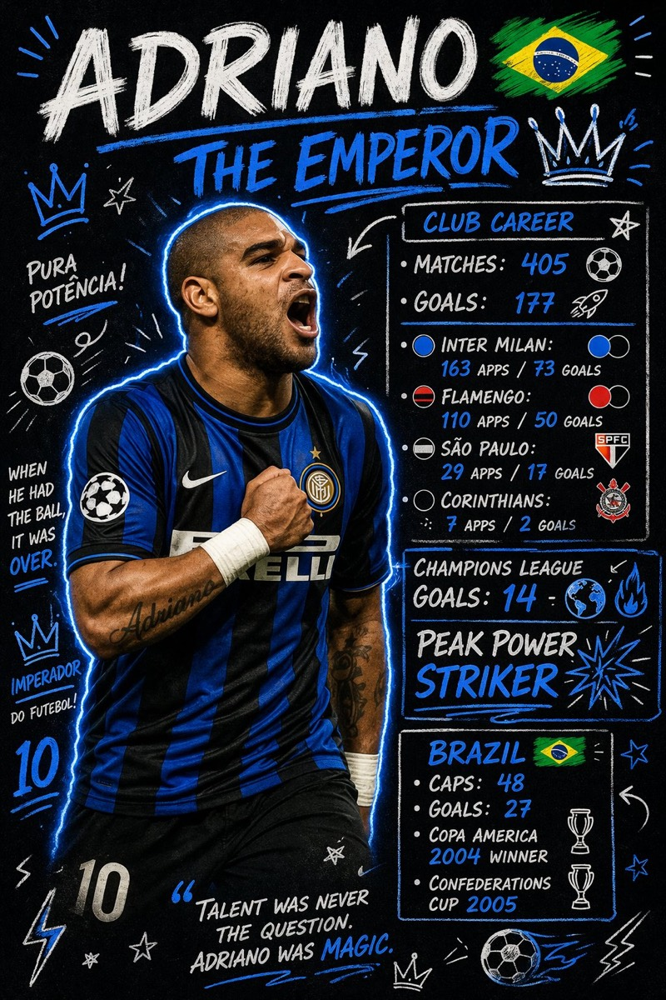</a>

生成以足球运动员、比赛数据和霓虹手写涂鸦为核心的体育宣传海报。 · 体育视觉

来源：[@ryanpp27](https://x.com/ryanpp27/status/2048602248524214542) · 来源提示词 / 翻译整理

**完整提示词**

```text
Create a scrapbook doodle-style football poster of [PLAYER_NAME].

AI auto-generates realistic career stats (club and national team).

Main photo: realistic, unchanged ([PLAYER_NAME] in action or iconic pose).

Doodles and handwritten notes: white and [PRIMARY_COLOR] neon ink (no warm colors unless specified), arrows, stars, scribbles, sketchy outlines. Add a glowing [PRIMARY_COLOR] outline around the player's body.

Layout (bold handwritten titles and stats):
- Top Title: "[PLAYER_NAME]" plus "[NICKNAME/TITLE]"
- Club Career: total matches and goals plus 2–4 main clubs (apps and goals)
- Highlights: 2–3 standout achievements (e.g., UCL goals, Ballon d'Or, top scorer)
- National Team: caps and goals plus 1–2 international achievements

Style: modern football poster x notebook aesthetic, clean but energetic, slightly messy doodles, high contrast, neon accents on dark or muted background.

Important: all stats must be realistic and proportional to the player's real career.
```

**可复用模板**

[查看对应模板](../templates/image.md#image-football-player-stats-doodle-poster)
