# 生视频案例

[返回首页](../README.md) · [浏览画廊](../index.html)

按封面浏览视频案例，下方对应样片、完整提示词与来源。

## 精选预览

<table>
<tr><td width="33%" valign="top" align="center"><a href="../assets/cases/video-3d40126f5f.mp4"></a><br><a href="#video-3d40126f5f">90年代像素文字游戏</a></td><td width="33%" valign="top" align="center"><a href="../assets/cases/video-50e620e4e4.mp4"></a><br><a href="#video-50e620e4e4">巴黎街头时装变身</a></td><td width="33%" valign="top" align="center"><a href="../assets/cases/video-bc1f9f0af1.mp4">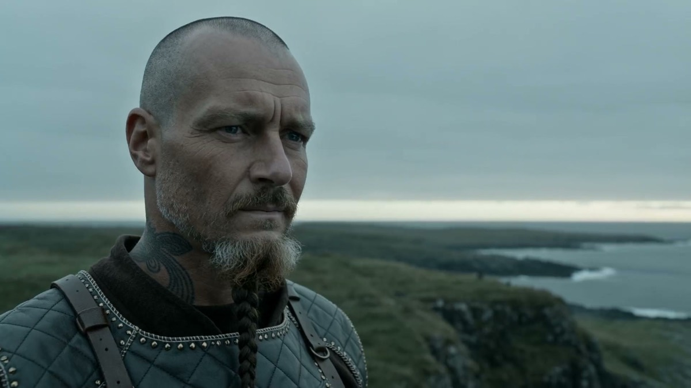</a><br><a href="#video-bc1f9f0af1">垂直升降揭示</a></td></tr>
<tr><td width="33%" valign="top" align="center"><a href="../assets/cases/video-37af5cd196.mp4">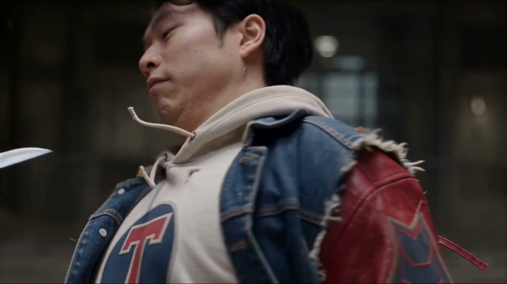</a><br><a href="#video-37af5cd196">粗野主义庭院武术动作</a></td><td width="33%" valign="top" align="center"><a href="../assets/cases/video-dcc3d74eac.mp4">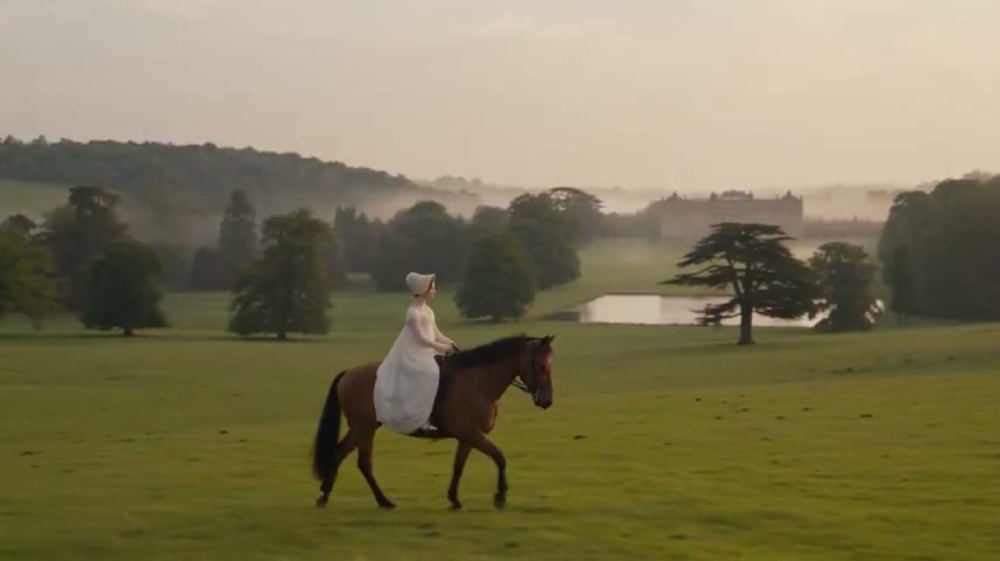</a><br><a href="#video-dcc3d74eac">摄政时期电影蒙太奇</a></td><td width="33%" valign="top" align="center"><a href="../assets/cases/video-df3924a259.mp4">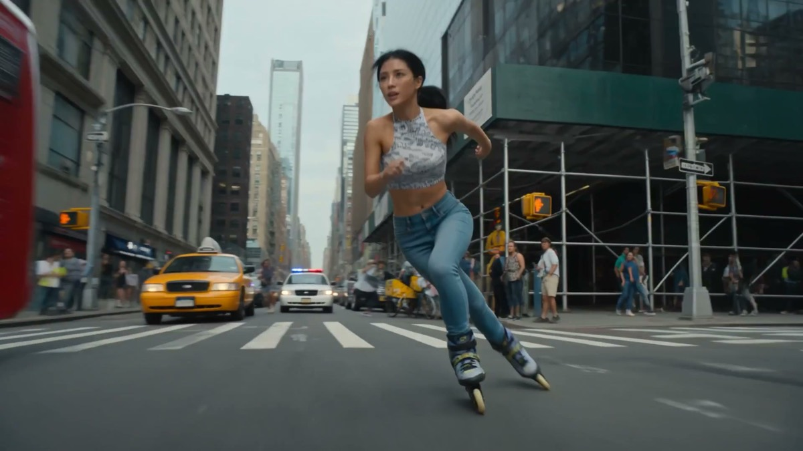</a><br><a href="#video-df3924a259">电影级动作轮滑序列</a></td></tr>
<tr><td width="33%" valign="top" align="center"><a href="../assets/cases/video-8f1bbd26f7.mp4">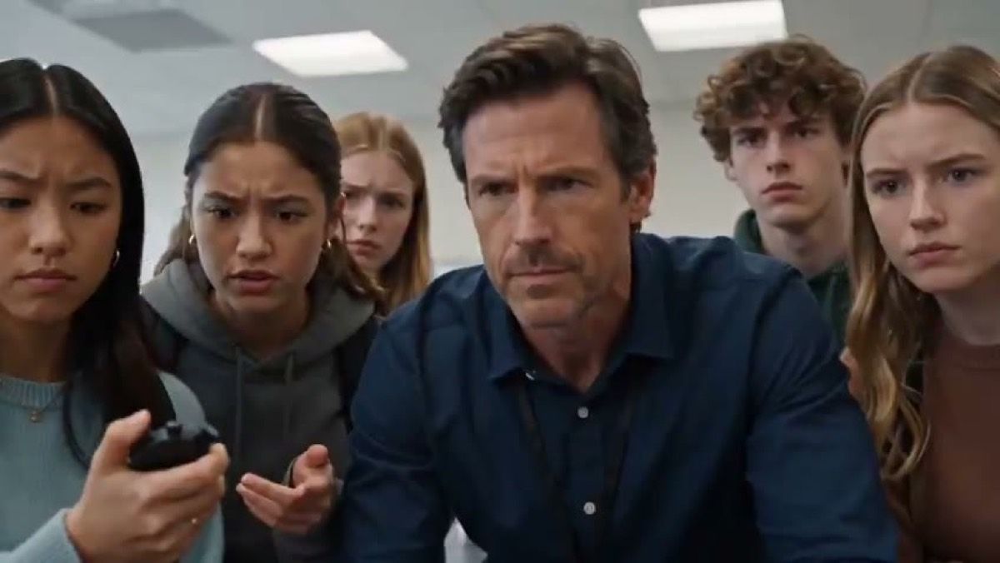</a><br><a href="#video-8f1bbd26f7">大学物理实验演示短片</a></td><td width="33%" valign="top" align="center"><a href="../assets/cases/video-849134cf4b.mp4">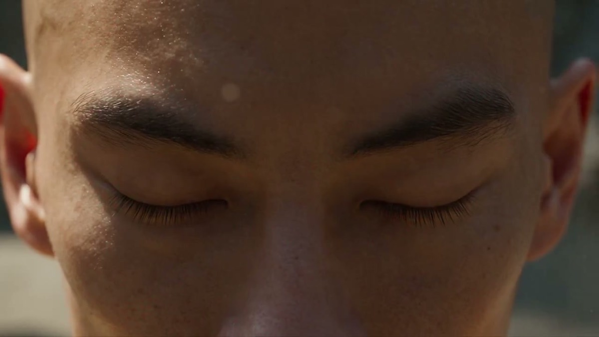</a><br><a href="#video-849134cf4b">电影级少林武僧动作大片</a></td><td width="33%" valign="top" align="center"><a href="../assets/cases/video-967e1a17e1.mp4">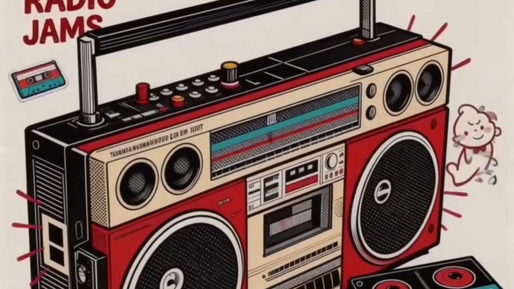</a><br><a href="#video-967e1a17e1">复古插画微动效</a></td></tr>
<tr><td width="33%" valign="top" align="center"><a href="../assets/cases/video-f97cb22797.mp4"></a><br><a href="#video-f97cb22797">第一人称视角：龙骑士电影级画面</a></td><td width="33%" valign="top" align="center"><a href="../assets/cases/video-53bf374a72.mp4"></a><br><a href="#video-53bf374a72">动态百科页拼贴解说</a></td><td width="33%" valign="top" align="center"><a href="../assets/cases/video-e0fd6d34ba.mp4">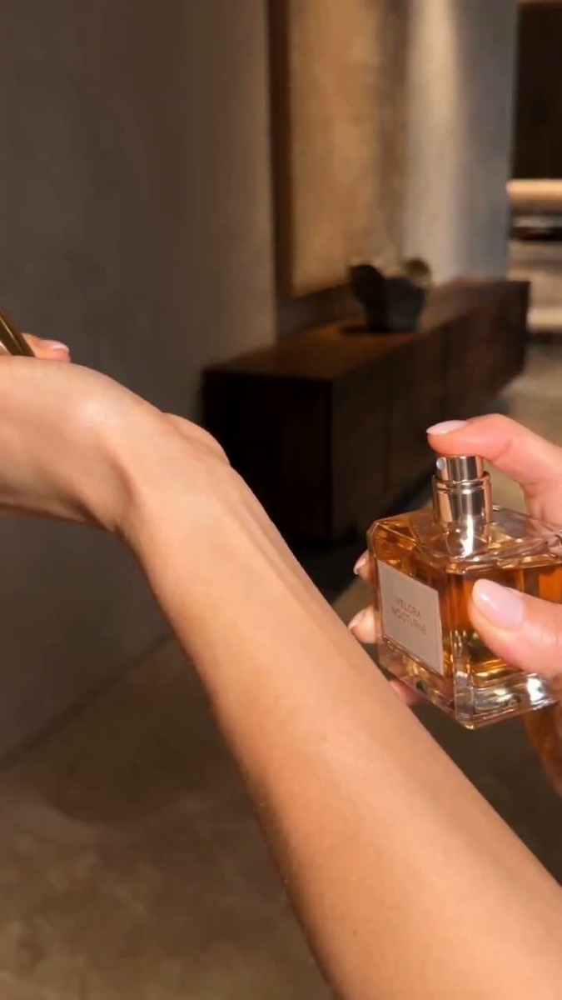</a><br><a href="#video-e0fd6d34ba">高端香水UGC口播</a></td></tr>
</table>

## 全部案例

- [产品短片：固定主体与缓慢推近](#product-reveal)
- [纸雕转场：从静态插画到微动效](#paper-cut-loop)
- [90年代像素文字游戏](#video-3d40126f5f)
- [巴黎街头时装变身](#video-50e620e4e4)
- [垂直升降揭示](#video-bc1f9f0af1)
- [粗野主义庭院武术动作](#video-37af5cd196)
- [大学物理实验演示短片](#video-8f1bbd26f7)
- [第一人称视角：龙骑士电影级画面](#video-f97cb22797)
- [电影级动作轮滑序列](#video-df3924a259)
- [电影级少林武僧动作大片](#video-849134cf4b)
- [动态百科页拼贴解说](#video-53bf374a72)
- [复古插画微动效](#video-967e1a17e1)
- [高端香水UGC口播](#video-e0fd6d34ba)
- [固定点向右横摇揭示](#video-8cf75d3afe)
- [哈恰普里俯拍烹饪](#video-3207e9e8c2)
- [海滩石像定格动画](#video-5d2a7780cd)
- [航拍后拉升高揭示](#video-cbe24f7388)
- [火山疏散城市建造延时](#video-19ceae29af)
- [科幻摩托车动作场面](#video-59eafdce5b)
- [立体书地图纸艺动画](#video-31ea8a7f7c)
- [毛线娃娃早餐定格动画](#video-d2f1128753)
- [黏土机器人创业故事](#video-69395c9b4c)
- [纽约街头的动漫滑板追逐](#video-2bf5e5594d)
- [纽约跑酷与蛛丝摆荡动作](#video-e7dcc94d27)
- [喷泉时间静止与彩虹](#video-1c634febce)
- [疲惫日常蒙太奇](#video-e6248de843)
- [企业猫职场动画短片](#video-0a64266abe)
- [前后景转移焦点](#video-ad4c3bf9c3)
- [日本网红出门准备 UGC](#video-0c79e1fe07)
- [山崖轮滑动作](#video-e24c102dab)
- [烧烤美食微距短片](#video-1d6c1fec91)
- [奢华护肤品水感广告](#video-512e7b9e27)
- [奢华珠宝开箱广告](#video-ced1de556c)
- [摄政时期电影蒙太奇](#video-dcc3d74eac)
- [生物发光灯塔守望者](#video-b5fa2e6d3f)
- [食谱信息图转连续烹饪短片](#video-60b5dcaaac)
- [手绘变实物定格料理](#video-a2196efe4e)
- [首尔周日 DV 家庭录像](#video-ac4f3a29c1)
- [水彩素描跑酷追逐](#video-dc65c9f52f)
- [水晶粒子厨房变身](#video-345a132c7a)
- [推拉变焦空间扭曲](#video-fa2e0ad821)
- [微型工人维修USB](#video-565c5a1550)
- [卧室接住落书互动](#video-fce76e69a8)
- [无人机环绕主体](#video-f953b9d317)
- [野花四季微距延时](#video-aecc45705d)
- [雨林神秘光源短片](#video-61094b8453)
- [真人贴纸海报动效](#video-24c5f43c41)
- [中国水墨无缝转场](#video-cdfbcca0a0)

<a id="product-reveal"></a>

## 产品短片：固定主体与缓慢推近

适合单件产品的五秒竖屏镜头设计。 · 产品广告

- 输入：产品参考图、清晰的产品外观描述
- 建议格式：9:16 · 5 秒

**完整提示词**

```text
以输入的产品参考图作为首帧。产品始终保持在画面中央，外观、颜色和标签在全片保持一致。摄影机从中景缓慢向前推进至近景；侧后方柔光逐渐勾勒瓶身轮廓，台面出现轻微真实反射。背景简洁，不增加人物、额外产品、变形文字或突兀转场。一个连续镜头，最后一秒稳定停在产品细节上。
```

**可复用模板**

[浏览生视频 Prompt 模板](../templates/video.md)

<a id="paper-cut-loop"></a>

## 纸雕转场：从静态插画到微动效

保持原插画构图，分层加入细微景深与环境运动。 · 插画动画

- 输入：分层插画或完整参考图
- 建议格式：16:9 · 5 秒

**完整提示词**

```text
以上传的纸雕风格插画为首帧，保持原始人物、物体、文字和配色不变。前景纸片以极小幅度缓慢摆动，中景云朵平移，背景出现轻微视差，光线从左至右柔和变化。镜头固定，不旋转、不推拉、不新增元素。运动幅度克制，末帧自然衔接首帧，适合作为无缝循环的短动效。
```

**可复用模板**

[浏览生视频 Prompt 模板](../templates/video.md)

## 来源案例

<a id="video-3d40126f5f"></a>

### 90年代像素文字游戏

<a href="../assets/cases/video-3d40126f5f.mp4"></a>

[播放样片](../assets/cases/video-3d40126f5f.mp4) · 来源：[@BMX / YouMind](https://x.com/bmx_ai13/status/2101593507232387096) · 来源提示词 / 翻译整理

用 CRT 像素界面、逐字翻牌和连续挑战节奏制作复古文字游戏概念短片。 · 动画

**完整提示词**

```text
30 秒像素风 90 年代复古文字游戏概念

0–3 秒 — 钩子
黑色 CRT 屏幕。静电闪烁。突然，霓虹粉/紫色像素图形启动。
大号粗体像素文字：

“你能猜出 90 年代吗？”

出现一个 5 字母谜题。

第一次猜测：MUSIC
方块快速翻转 — ⬛ 🟨 🟩 ⬛ 🟩

复古街机 beep-beep-boom 音效。
3–8 秒 — 快节奏玩法
玩家使用粗体像素键盘快速输入另一个单词。

每个字母方块翻转时伴有令人满足的街机音效。

正确的字母爆炸成亮绿色像素。
错误的字母抖动并产生故障效果。

顶部 UI：

连胜 ×7
等级 12
经验值 +50

背景感觉像是 1990 年代的街机卧室：CRT 光晕、磁带、软盘、棋盘格图案和霓虹几何形状。

8–13 秒 — 90 年代文字挑战
屏幕故障切换至：

“90 年代词汇堆”
单词快速闪现：
VHS
 DISCO
 RADIO
 PIXEL
 ARCADE

然后出现一个新的神秘单词：

_ _ _ _ _
倒计时：

10… 9… 8…

玩家开始快速打字。

13–18 秒 — 险些失败
猜测：
GAMES
只有两个字母变绿。
计时器：
3… 2…

屏幕开始闪烁红光。

玩家在最后一秒更改了一个字母。
GAME?

最后一个字母落下。

18–22 秒 — 重大回报
所有五个方块依次翻转为绿色。

P — I — X — E — L
巨大的像素爆炸。

CRT 屏幕震动。

复古彩纸填满屏幕。

文字：
完美！

连胜 ×8

+250 经验值

22–27 秒 — 进度钩子
快速游戏玩法蒙太奇：

解锁新的霓虹主题。

徽章弹出：
“90 年代小孩”

职业地图推进：

等级 12 → 等级 13

另一个主题解锁：

商场之夜

一切变为青色、品红色和紫色霓虹。

27–30 秒 — 重玩钩子
一个全新的谜题立即出现。

_ _ _ _ _
小字：

“再来一个词？”
光标开始闪烁。

然后：
按开始键
切回 CRT 静电画面。
视觉方向

制作真正的复古像素游戏画面，而不是逼真的 3D 或皮克斯风格。使用低分辨率像素图形、粗体 8/16 位风格字体、霓虹青/品红/紫/绿调色板、CRT 扫描线、VHS 风格故障、棋盘格图案、街机 UI、像素粒子、方块翻转动画和老式音效。

视频应感觉像是一款失落的 1990 年代街机文字游戏，专为现代移动游戏玩法重建——快速、令人满足且上瘾。

无照片级真实感，无 3D 冒险角色，无电影化环境，无动漫，无现代光泽 UI，无逼真的虚幻引擎视觉效果。

最佳开场钩子：
 “你能猜出 90 年代吗？”
```

**可复用模板**

[浏览生视频 Prompt 模板](../templates/video.md)

<a id="video-50e620e4e4"></a>

### 巴黎街头时装变身

<a href="../assets/cases/video-50e620e4e4.mp4"></a>

[播放样片](../assets/cases/video-50e620e4e4.mp4) · 来源：[@ayzalnoor / YouMind](https://x.com/ayzalnooor24521/status/2100456445900710158) · 来源提示词 / 翻译整理

以行走跟拍和环绕光轨完成街头服装无缝变身。 · 广告

**完整提示词**

```text
创作了一部具有电影质感的时尚变身视频，主角是一位美丽的年轻女子，漫步于优雅的巴黎街头。她起初身穿一件简洁的白色夏日连衣裙，自然地行走在时尚的城市人行道上，周围环绕着经典建筑、咖啡馆、商店和行人。镜头以逼真的电影运动感和浅景深平滑地跟随她。当她经过一家店面时，发光的红色光轨围绕她的身体旋转，营造出神奇的时尚过渡效果。她的服装无缝地从白色转变为精致的红色无袖连衣裙。接着是动态的街道视角镜头，展现她自信地穿过繁忙的巴黎十字路口。最后以一个美丽的特写镜头结束，她身穿红裙，轻轻拿着冰淇淋品尝，目光自然地望向镜头。具备照片级真实细节、优雅的时尚电影美学、自然日光、流畅过渡、逼真皮肤纹理、电影镜头、微妙的背景动感以及高端商业质感。
```

**可复用模板**

[浏览生视频 Prompt 模板](../templates/video.md)

<a id="video-bc1f9f0af1"></a>

### 垂直升降揭示

<a href="../assets/cases/video-bc1f9f0af1.mp4"></a>

[播放样片](../assets/cases/video-bc1f9f0af1.mp4) · 来源：[Higgsfield.AI Team。](https://higgsfield.ai/academy/how-to-use/turn-your-video-into-cinema-using-wan-camera-control) · 来源提示词 / 翻译整理

通过摇臂垂直升高并持续向下俯仰，在固定主体位置的同时逐步揭示环境规模。 · 镜头运动

**完整提示词**

```text
## 原始英文提示词

A smooth jib rise from [1.2] meters to [9] meters altitude over the shot, with a gentle continuous downward tilt that keeps the subject anchored in [the lower third] of frame as the world opens above and around them. No lateral orbit, no truck, no zoom, no speed ramps; one continuous vertical reveal easing into a high hold.

## 中文使用版

整个镜头中，摄像机通过摇臂从[1.2]米高度平滑升至[9]米，同时持续轻柔向下俯仰，使主体始终固定在画面[下三分之一]位置，周围及上方的空间逐步展开。不得进行横向环绕、轨道侧移、变焦或速度渐变；使用一次连续的垂直揭示运动，并在高位缓慢减速后稳定停留。

## 变量

- `[1.2]`、`[9]`：摄像机起始与结束高度。
- `[the lower third]` / `[下三分之一]`：主体在构图中的锚定区域，可按画面目的调整。
```

**可复用模板**

[查看对应模板](../templates/video.md#video-vertical-crane-reveal)

<a id="video-37af5cd196"></a>

### 粗野主义庭院武术动作

<a href="../assets/cases/video-37af5cd196.mp4"></a>

[播放样片](../assets/cases/video-37af5cd196.mp4) · 来源：[Avelyrah（X：`@AvelyrahnAI`）](https://x.com/AvelyrahnAI/status/2088495522801942951) · 来源提示词 / 翻译整理

生成发生在粗野主义混凝土庭院中的多人武术对抗，强调快节奏摄影和高张力布光。 · 动作

**完整提示词**

```text
位于粗野主义风格混凝土多层庭院中的电影级动作序列。一位身穿牛仔红拼色棒球夹克、带有“T”字标志连帽衫及工装裤的年轻亚裔男性主角，被一群身着精致深红黑色服装、佩戴白色狐狸面具并手持武士刀的敏捷女刺客包围。动态武术编排，快节奏镜头运动，混凝土路面扬起的尘土，高张力电影级布光，超写实，4k 分辨率，60fps 动作摄影。
```

**可复用模板**

[查看对应模板](../templates/video.md#video-brutalist-courtyard-martial-arts)

<a id="video-8f1bbd26f7"></a>

### 大学物理实验演示短片

<a href="../assets/cases/video-8f1bbd26f7.mp4"></a>

[播放样片](../assets/cases/video-8f1bbd26f7.mp4) · 来源：[@Ayat / YouMind](https://x.com/aiwithaayat/status/2102331859657253174) · 来源提示词 / 翻译整理

以教授和学生参与的斜轨小球实验组织课堂教育视频。 · 电影感

**完整提示词**

```text
创建一个电影感、逼真的教育视频，场景设定在现代大学物理实验室内。一位自信的男性物理教授手持咖啡杯和笔记本走进教室，学生们在大讲堂中专注地坐着。随后场景切换到一个动手操作的物理实验环节，教授与一组学生聚集在一个透明的倾斜轨道周围。一个小金属球被小心地放置在轨道上，清晰地展示了运动、重力、加速度和能量。展示透明轨道、金属球、近距离观察的学生以及教授用自然手势指导实验的详细特写镜头。使用平滑的摄像机移动、逼真的景深、自然的面部表情和真实的课堂互动，使实验感觉引人入胜且可信。包含具有柔和室内照明和透过大窗户进入的温暖阳光的电影级实验室灯光。最后以教授在黄金时刻的光线下在实验桌前工作结束，周围环绕着科学设备，营造出一种深思熟虑且鼓舞人心的学术氛围。
```

**可复用模板**

[浏览生视频 Prompt 模板](../templates/video.md)

<a id="video-f97cb22797"></a>

### 第一人称视角：龙骑士电影级画面

<a href="../assets/cases/video-f97cb22797.mp4"></a>

[播放样片](../assets/cases/video-f97cb22797.mp4) · 来源：[Nexora（X：`@frametheory058`）](https://x.com/frametheory058/status/2087007818721423855) · 来源提示词 / 翻译整理

以第一人称骑手视角生成巨龙从海岸悬崖起飞、贴海飞行、入水并再次冲出水面的奇幻镜头。 · 电影感

**完整提示词**

```text
创作一段 30 秒、9:16 竖屏、24fps、8K 画质的写实风格奇幻影像，采用第一人称骑手视角。主角是一条巨大的原创黑曜石深红巨龙，拥有细节丰富的鳞片、暗色斑纹、熔岩金色的双眼、火山黑色的后掠角、刀锋般的背鳍、酒红色的半透明翅膀，以及遍布全身的微弱余烬裂纹。骑手佩戴黑色皮手套，身着深绿色袖子和风化的皮革护腕，手握磨损的棕色铆钉马鞍上的重型链条缰绳。 开场时，巨龙在潮湿的翡翠色海岸悬崖上平静地呼吸；它缓慢转向镜头，骑手轻轻抚摸它的脖子。随后它突然压低身体，在草地上助跑并从悬崖上一跃而下。向灰绿色的海洋陡峭俯冲，展开巨大的翅膀，展现逼真的翼膜运动，随后贴近水面飞行，水雾溅在镜头上。在海蚀柱周围进行一次戏剧性的高速转弯，然后直接潜入水下。短暂的深青色水下静谧，伴随气泡和微弱的深红光芒，随后强力冲出海面。结尾处，巨龙在雾气缭绕的水面上平稳滑翔，缓慢转头看向骑手。 运用物理精确的解剖结构、重量感、重力、翅膀空气动力学、水体物理、鳞片形变、风力及环境交互。采用自然的骑手挂载摄像机运动，逼真的动态模糊、镜头水滴、呼吸效应、细微的手持抖动、电影级景深、柔和的阴天光照、HDR、克制的胶片颗粒感以及自然的电影级调色。 音频：氛围低音 → 亲密的独奏大提琴 → 渐强的管弦乐张力 → 宏大的起飞/飞行配乐 → 转弯时的强烈打击乐 → 沉闷的水下音效 → 冲出水面时史诗般的管弦乐回归 → 柔和的大提琴/钢琴结尾。叠加细节丰富的 ASMR/SFX：巨龙呼吸声、鳞片摩擦声、皮革声、缰绳声、利爪抓地声、风声、拍翼声、水雾声、气泡声、入水冲击声以及深沉自然的龙吼声。 制作效果需达到与昂贵的真人实拍电影无法区分的程度。拒绝 AI 感、卡通、动漫、游戏 CGI、塑料质感、虚假物理效果、霓虹光效、过度饱和、解剖结构扭曲、多余肢体、文字或水印。
```

**可复用模板**

[查看对应模板](../templates/video.md#video-first-person-dragon-rider)

<a id="video-df3924a259"></a>

### 电影级动作轮滑序列

<a href="../assets/cases/video-df3924a259.mp4"></a>

[播放样片](../assets/cases/video-df3924a259.mp4) · 来源：[Smiling Khan（X：`@AIwithkhan`）](https://x.com/AIwithkhan/status/2088506532434743745) · 来源提示词 / 翻译整理

生成一名轮滑女性穿梭城市车流并躲避警车追逐的电影级动作序列，强调角色一致性和真实运动物理。 · 动作

**完整提示词**

```text
创作一段超写实的电影级动作序列，主角是一名穿着修身蓝色牛仔裤、时尚短款上衣、运动鞋并佩戴防护装备的年轻女性，脚踩轮滑鞋。在整个视频中保持完美的人物一致性——相同的面部特征、发型、服装、身体比例和配饰。 视频以一个低角度追踪镜头开场，她正极速穿梭在拥挤的市中心街道上，在出租车、公交车、行人、自行车、街头小贩和送货车之间轻松穿行。她回头望去，发现身后有一辆闪烁着警灯的警车正在靠近。 她猛然加速。镜头与她并排疾驰，她完成了一个高难度的跳跃，越过一辆行驶中的汽车，平稳落地，随即又在不减速的情况下飞跃过一个街头小贩的摊位。她俯身穿过低矮的障碍物，转过街角，抓住栏杆，借力回旋，随后重新落回街道。 警车追逐愈演愈烈。当她穿过狭窄的侧街、拥挤的市场巷道、小路和行人密集的捷径时，两辆警车难以跟上。使用快速的 FPV 风格镜头移动、轮滑鞋旁的低位追踪镜头、极具张力的俯瞰视角、轮胎水平视角以及快速的甩镜头。保持动作的物理真实感，体现真实的动量、轮子摩擦力、身体重心和落地冲击力。 她最后完成了一次壮观的飞跃，越过一排停放的车辆，完美落地，并消失在一个急转弯处。警车在她身后停下。警官们走下车，精疲力竭，难以置信地望着空荡荡的街道。 一名警官缓缓摇头说道：“她太快了。”另一名警官喘着粗气，无奈地放弃了追捕，靠在车边。 结尾处采用电影级的慢动作英雄镜头，展示女孩滑向繁忙的城市深处，阳光反射在建筑物上，镜头随之升起并拉远。 风格：高级动作电影摄影，高能量城市追逐，写实特技编排，动态手持摄影，FPV 追踪，极具张力的低角度，平滑的稳定器镜头，真实的运动模糊，细节丰富的城市环境，自然光，物理精确的车辆和人物运动，电影级调色，照片级真实感，超高细节，4K HDR，24fps，1 负面提示词：无撞击行人，无受伤，无血腥，无畸形解剖结构，无多余肢体，无重复角色，无漂浮物体，无不真实的轮滑物理效果，无闪烁，无文字，无 Logo，无字幕，无水印。
```

**可复用模板**

[查看对应模板](../templates/video.md#video-cinematic-roller-skating-action)

<a id="video-849134cf4b"></a>

### 电影级少林武僧动作大片

<a href="../assets/cases/video-849134cf4b.mp4"></a>

[播放样片](../assets/cases/video-849134cf4b.mp4) · 来源：[Pierrick Chevallier | IA（X：`@CharaspowerAI`）](https://x.com/CharaspowerAI/status/2086830115527250284) · 来源提示词 / 翻译整理

生成少林武僧与石甲生物对决的武侠奇幻动作序列，包含分段动作编排、变速和电光效果。 · 动作

**完整提示词**

```text
超电影感日间武侠奇幻序列。一位身着风化藏红花色僧袍、剃着光头、体格健硕的少林武僧，站在一座广阔的废弃山间寺庙庭院内。四个高耸的原创石甲生物，长着细长的四肢和发光的眼睛，将他团团围住。 0–4 秒：武僧紧闭双眼的特写镜头。尘埃在阳光中漂浮。他的双眼猛然睁开，蓝白色的电流在他皮肤上游走。缓慢的推拉镜头展现出生物从四面八方冲来。 4–9 秒：时间戏剧性地变慢。生物的利爪从他脸颊旁几毫米处划过的微距特写，僧袍布料在空气中弯曲，细小的尘埃颗粒在他们周围静止。摄像机进行快速的 180 度环绕拍摄，同时武僧向后弯腰，做出一个不可思议但符合解剖学控制的闪避动作。 9–14 秒：瞬间恢复全速。激进的手持跟拍，武僧施展出迅猛的掌击、肘击和旋风踢。每次撞击都切换到史诗级的特写：紧握的拳头、在石头上扭转的脚掌、生物后仰的面部，以及向外迸发的电弧。 14–20 秒：超慢动作侧面轮廓。武僧在两个生物之间跳跃，摄像机围绕他悬空的身体进行 360 度旋转。他将一个生物引向另一个，水平旋转，随后单手着地，圆形的冲击波震散了灰尘和碎石。 20–26 秒：低角度近距离追拍。一个巨大的生物冲锋而来。武僧径直向它冲去，垂直跑上它的躯干，并在其头顶翻身。他双掌汇聚蓝白色能量的特写，随后是一次强有力的向下接触，空气随之扭曲，庭院地面出现同心圆状的裂纹。 26–30 秒：静谧的慢动作高潮。武僧面部的特写，闪电映照在他的眼中。他以深蹲姿势落地；摄像机迅速拉远至极广角的英雄镜头，四个生物环绕在他周围。 逼真的武侠大片，变形宽银幕摄影，高对比度阳光，戏剧性的变速特效，史诗级特写，清晰的动作编排，真实的动量，稳定的解剖结构，正常的比例且无拉伸，沉重的物理撞击声，石块碎裂声，布料撕裂声，雷鸣电闪。
```

**可复用模板**

[查看对应模板](../templates/video.md#video-cinematic-shaolin-action)

<a id="video-53bf374a72"></a>

### 动态百科页拼贴解说

<a href="../assets/cases/video-53bf374a72.mp4"></a>

[播放样片](../assets/cases/video-53bf374a72.mp4) · 来源：[X `@MrLarus`；原帖发布日期：2026-07-12。作者称这是一次用 ChatGPT、Image2、Seedance、AI 配音与字幕制作的秦统一中国解说实验。](https://x.com/MrLarus/status/2076328854315032641) · 案例整理的多镜头工作流

将一个知识主题拆成九个视觉节拍，以纸片拼贴关键帧、局部定格动画、旁白和字幕组成竖屏解释短片。 · 动画

**完整提示词**

```text
## 输入卡

```text
主题：[要解释的问题]
目标观众：[观众已有认知]
结论：[观众看完要理解的一句话]
时长与画幅：[约 45 秒，9:16；可根据配音改动]
可核查依据：[可靠来源及逐条事实]
视觉元素：[地图 / 档案 / 人物 / 器物 / 数据]
禁止误写的名称、数字与边界：[清单]
旁白语言：[中文 / 英文 / 其他]
```

## 1. 先拆叙事，不直接生视频

将输入卡交给脚本助手，要求它输出九条分镜记录：`镜号、唯一事实命题、依据、5 秒以内的口播草稿、一个主视觉、最多三类辅助视觉、一个具体动画事件、画面文字、转场关系`。按“主角或问题 → 原有格局 → 转折 → 四个机制或证据 → 系统归纳 → 影响”排列。若事实不足，先停下查证，不编造地图、数字、引语或因果关系。

## 2. 为每镜制作关键帧

对每条分镜单独填入以下图像提示。此处主动收紧了作者原文“密集资料页”的要求，以便手机阅读；需要更贴近来源的表达，参见原文文件。

```text
制作 9:16 的编辑式知识解说拼贴关键帧，主题：[本镜事实命题]。
画面像一页可以活动的百科资料：纸张、剪纸白边、轻微纸影、地图、档案、器物和标签属于同一套视觉语言。
主视觉：[一个清晰可辨的主体]；辅助元素：[最多 2-4 个相关物件]；空间关系：[前景/背景及阅读顺序]。
为箭头、路线、贴纸或印章预留可发生动作的位置；所有物件边界清楚，主体不能被标签压住。
沿用全片的色彩与纸张质感，但每镜只有一个主要结论。关键名称和数字留空位供后期精确覆字。
避免写实 3D、企业演示文稿、无意义装饰、文字乱码与未经证实的地图细节。
```

## 3. 每镜图生视频

输入该镜已核查的关键帧。下面是项目适配的运动约束，并非作者实际逐镜提交的完整提示词。

```text
以提供的参考图为唯一视觉基础，生成约 5 秒的 9:16 无声纸片拼贴动画。
保持主体、地图与重要轮廓稳定。只让选定物件发生分步、可理解的局部动作：
[主要事件，例如路线从 A 延伸到 B]；[辅助事件，例如两个节点依次亮起]。
可有轻微纸张抖动、贴纸弹入或印章落下，但不要让整张图漂浮，也不要把纸片变成写实视频。
保持为后期字幕和术语留出的区域清楚；不要生成新文字、虚构标签或改写地图边界。
```

## 4. 组合与检查

以旁白节奏为基准剪辑各段，后期加入校对过的术语、字幕和有使用权的音乐。逐镜检查“事实与画面一致、主要视觉一眼可读、动作有解释意义、文字无误、人物与地图不漂移、转场不打断逻辑”。来源样片中的“战国七雄 / SIX STATES”数量冲突尤其说明：画面生成后还必须逐项校对，不能只看整体氛围。
```

**Image2 关键帧 · 原始提示词**

来源：[原作者公开内容](https://x.com/MrLarus/status/2076329766261522741)

```text
Create a vertical 9:16 encyclopedia-style collage keyframe for a history explainer video.

Topic: [scene topic]

Style:

Vox-style explainer, scrapbook collage, paper cutout, layered stickers, torn paper, tape, labels, maps, arrows, object cards,人物 / buildings / artifacts, white cutout edges, thick outlines, paper shadows, halftone texture, old paper grain, Chinese historical collage.

Important:

Make it feel like a dense history reference page, not a clean poster.

Use many movable visual elements: people, maps, coins, scripts, roads, seals, cards, labels and small props.

Keep each object clearly separated with cut-paper edges so it can animate later.

Avoid:

3D render, photorealism, clean corporate poster, empty background, one single hero object, PPT layout.
```

**Seedance 视频 · 原始提示词**

来源：[原作者公开内容](https://x.com/MrLarus/status/2076330068331122881)

```text
Use the reference image as the only visual base.

Generate a 5-second vertical 9:16 silent paper-collage animation.

No music, no sound effects, no voice, no subtitles.

Keep the scrapbook / paper cutout / stop-motion collage style.

Animate the separated cutout elements, not the whole image.

Motion style:

paper jitter, sticker bounce, stepped stop-motion movement, moving arrows, route lines extending, map nodes lighting up, coins rotating, labels snapping into place, seals stamping, paper edges shaking, small objects shifting with clear paths.

Each scene should have a small event, not just soft floating.

Keep the main composition and important text stable.

Do not turn it into realistic video.

Do not make it look like PPT blocks sliding around.
```

**可复用模板**

[浏览生视频 Prompt 模板](../templates/video.md)

<a id="video-967e1a17e1"></a>

### 复古插画微动效

<a href="../assets/cases/video-967e1a17e1.mp4"></a>

[播放样片](../assets/cases/video-967e1a17e1.mp4) · 来源：[小洁AI实战](https://www.douyin.com/video/7624869691328485361) · 根据来源整理的适配提示词

上传完成的插画或海报，以固定镜头生成局部微动效，保持主体、文字与布局稳定。 · 动画

**完整提示词**

```text
将上传的完成版插画或海报作为首帧视觉参考，生成一段轻快、活泼有趣的 MG 动画，也就是平面图形微动效。

全程固定镜头，不推拉、不摇移、不缩放、不切镜。保持参考图的主体身份、轮廓、位置、配色、粗黑线条、半色调网点、纸张纹理和整体排版，不转换为写实摄影或三维渲染。

只让与画面内容相关的少量局部元素做幅度克制的周期性运动，例如音箱中的磁带卷轴缓慢转动、音乐符号轻轻跳动，或插画动物自然眨眼。根据上传画面的实际内容选择动作，不添加原图中不存在的角色、物品或装饰。

标题、字形、文案、文字位置和背景保持静止，文字不能重绘、漂移、扭曲或乱码，主体不能融化变形。动作柔和、节奏轻快，结尾尽量回到接近开头的状态，不添加转场、水印、教程字幕、对白或旁白。
```

**可复用模板**

[查看对应模板](../templates/video.md#video-retro-illustration-micro-motion)

<a id="video-e0fd6d34ba"></a>

### 高端香水UGC口播

<a href="../assets/cases/video-e0fd6d34ba.mp4"></a>

[播放样片](../assets/cases/video-e0fd6d34ba.mp4) · 来源：[@Meem / YouMind](https://x.com/mehvishs25/status/2094785997460660622) · 来源提示词 / 翻译整理

用手持口播、试喷和产品近景组合高端香水 UGC 广告。 · 广告

**完整提示词**

```text
创作一段超逼真的高端 UGC 香水广告，主角是一位美丽动人的年轻女性，身着优雅、大胆且前卫的时尚服装。她拥有自然迷人的外表、富有表现力的双眼、精致的妆容、透亮真实的皮肤质感以及精心打理的发型。她的造型显得成熟自信，而非过度华丽。场景：奢华的现代室内空间，配以温暖的环境光、柔和的阴影，营造出高端杂志大片的氛围。保持背景简洁并略微虚化，确保人物和香水始终是视觉焦点。服装：她穿着优雅大胆的晚装，剪裁精致，既前卫、考究又迷人，同时不失品位。服装应与香水的高端定位相得益彰。UGC 表演：她自然地拿着香水瓶，像是在向观众推荐自己真心喜爱的香水，并直接对着镜头说话。从一个随意的吸睛动作开始，然后将香水瓶靠近镜头展示，喷洒在手腕或颈部，闻一闻，并以自信的微笑做出反应。加入自然的手势、轻微的动作、真实的表情和放松的肢体语言。摄影：手持智能手机风格的 UGC 镜头，穿插少量精致的特写镜头。包含自然的微动作、真实的自动对焦、浅景深以及偶尔细微的推镜头。避免传统商业广告那种过度完美的观感。产品焦点：给予香水瓶几个高光时刻，确保焦点清晰、反射真实、玻璃和液体细节高级，同时保持品牌标签清晰可见且不失真。灯光与美学：温暖的奢华灯光，面部和头发上的柔和高光，真实的皮肤毛孔和细节，电影感但真实可信的曝光，高级的中性色调，高端美妆广告美学。视频风格：真实的高端 UGC × 奢华香水广告，自然且令人向往，自信的女性力量，照片级真实感，电影级写实，4K，逼真的动态，自然的表情，无 CGI 感，无美颜滤镜效果。结尾：她直视镜头，将香水举在脸庞旁，露出自信的微笑，并以自然的推荐式表情结束。避免夸张的表演、不自然的肢体动作、塑料感皮肤、过度修图、手部变形、香水瓶扭曲、虚假的反射或人工痕迹明显的面部表情。
```

**可复用模板**

[浏览生视频 Prompt 模板](../templates/video.md)

<a id="video-8cf75d3afe"></a>

### 固定点向右横摇揭示

<a href="../assets/cases/video-8cf75d3afe.mp4">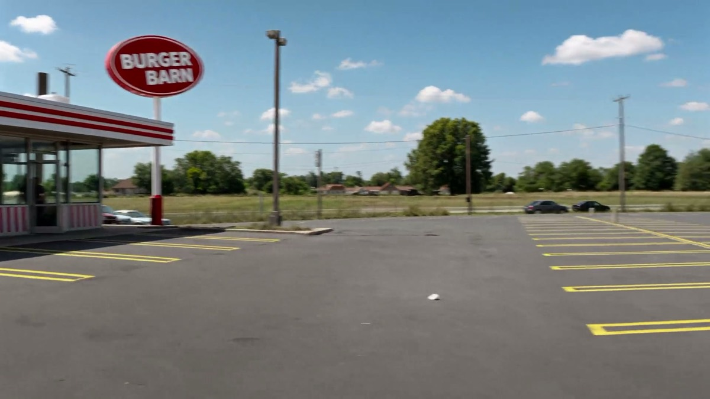</a>

[播放样片](../assets/cases/video-8cf75d3afe.mp4) · 来源：[Higgsfield.AI Team。](https://higgsfield.ai/academy/how-to-use/turn-your-video-into-cinema-using-wan-camera-control) · 来源提示词 / 翻译整理

让摄像机保持原地不位移，只向右水平旋转并在结尾主体上稳定停留。 · 镜头运动

**完整提示词**

```text
## 原始英文提示词

Rotate the camera horizontally from left to right from one fixed point, like a standing head-turn, starting on [composition A] and sweeping across [the environment]; no sideways travel, no dolly, no truck, no arc, no slide, no zoom, no tilt. Speed: smooth constant rotation, decelerating gently at the end. Framing: keep the horizon level while new space enters from the right side of the frame only through rotation; [the landing subject] stays beyond the right edge until the rotation brings them in. End: settle on a clear final composition on [the landing subject] and hold.

## 中文使用版

摄像机从一个固定点水平向右旋转，如同站在原地转头，从[起始构图 A]开始，横摇扫过[环境]；不得发生横向位移、推拉移动、轨道侧移、弧线运动、滑动、变焦或俯仰。速度保持平滑、匀速，并在结尾轻柔减速。构图上保持地平线水平，新空间只能通过旋转从画面右侧进入；在旋转将[落点主体]带入画面之前，该主体始终位于右侧画外。结尾稳定停在以[落点主体]为核心的清晰构图，并短暂停留。

## 变量

- `[composition A]` / `[起始构图 A]`：第一帧开始时的主体与环境构图。
- `[the environment]` / `[环境]`：横摇过程中逐步揭示的空间。
- `[the landing subject]` / `[落点主体]`：镜头最终停留的主体。
```

**可复用模板**

[查看对应模板](../templates/video.md#video-fixed-point-pan-right-reveal)

<a id="video-3207e9e8c2"></a>

### 哈恰普里俯拍烹饪

<a href="../assets/cases/video-3207e9e8c2.mp4">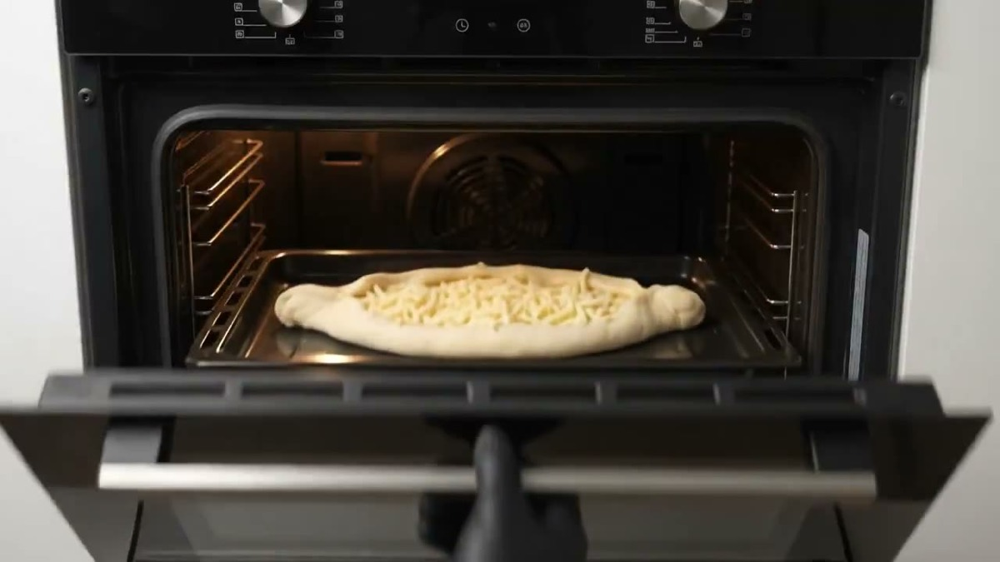</a>

[播放样片](../assets/cases/video-3207e9e8c2.mp4) · 来源：[@999 / YouMind](https://x.com/999shinobi/status/2102142574848798798) · 来源提示词 / 翻译整理

用固定俯拍和物体状态连续性展示哈恰普里的完整制作步骤。 · 烹饪

**完整提示词**

```text
创建一个 10 秒、16:9 比例的逼真哈恰普里（Khachapuri）烹饪视频，严格按顺序执行：静态 90° 俯视镜头，哑光黑色桌面，同一双戴黑手套的男性双手，仅使用硬切，无魔法或跳步：0.0-0.7 食材对称摆放，双手取面团 -> 0.7-1.5 将面团擀成椭圆形 -> 1.5-2.2 将长边向内卷起 -> 2.2-2.8 捏合两端形成船形 -> 2.8-3.6 均匀填入碎奶酪 -> 3.6-4.2 将生哈恰普里放在黑色烤盘上 -> 4.2-5.0 明显地将生哈恰普里滑入烤箱 -> 5.0-5.8 烤箱内快速逼真的延时摄影：面团膨胀并变成金黄色，奶酪融化起泡 -> 5.8-6.5 双手取出烤好的哈恰普里 -> 6.5-7.3 直接在中心打入一个鸡蛋 -> 7.3-8.0 放回烤箱，短时延摄影：蛋白略微凝固而蛋黄保持流动状态 -> 8.0-8.6 取出完成的哈恰普里并放在黑色桌面上 -> 8.6-9.2 在蛋黄旁添加黄油块，黄油开始融化 -> 9.2-10.0 双手退出画面，金色哈恰普里的特写镜头，配有融化的奶酪、光泽流动的蛋黄和正在融化的黄油。每个后续镜头必须从上一个镜头的确切食物状态继续；快速、精确、逼真的手部动作，无镜头移动，无悬浮、瞬移、瞬间烹饪、食材消失或重复现象。
```

**可复用模板**

[浏览生视频 Prompt 模板](../templates/video.md)

<a id="video-5d2a7780cd"></a>

### 海滩石像定格动画

<a href="../assets/cases/video-5d2a7780cd.mp4">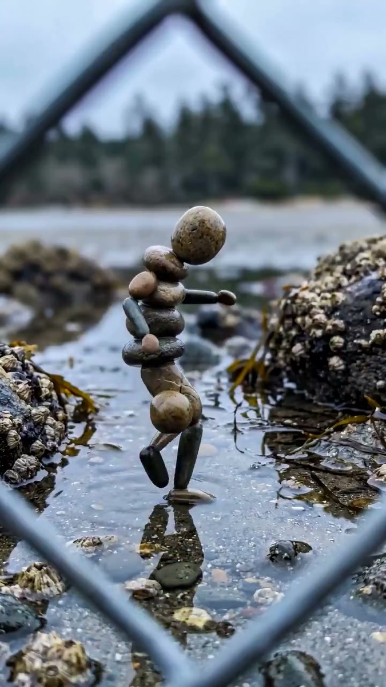</a>

[播放样片](../assets/cases/video-5d2a7780cd.mp4) · 来源：[Marcos（X：`@arsalannazir07`）。](https://x.com/arsalannazir07/status/2096791786807275583) · 来源提示词 / 翻译整理

生成由天然石块组成的小型人形在潮汐池中起舞、跌倒并重新散落成石块的定格动画。 · 动画

**完整提示词**

```text
创作一段 21 秒的 9:16 竖屏电影级定格动画。一个完全由自然形成的平滑海滩石块组成的小型人形生物，在岩石海岸的浅潮汐池中苏醒。身体的每个部位都由独立的石块构成：头部是一个大的椭圆形石头，躯干是堆叠的圆形石块，手臂和腿部则由较小的石块组成。

画面通过一个略微失焦的铁丝网围栏拍摄，形成自然的近景框架。角色背景是宁静的海岸线、浅海水、覆盖着藤壶的岩石、海藻，以及阴天下一片柔和模糊的森林。具有照片级的真实质感、自然的柔和色彩、浅景深以及逼真的水面反射。

## 动画效果

石像慢慢平衡身体，开始像顽皮的小人一样活动。它变换重心，抬起一条腿，弯曲膝盖，摆动石质手臂，并跳起一段古怪的小舞，同时在潮湿的表面上小心地保持平衡。每一步脚下都会形成细小的涟漪，水中的倒影也随之自然移动。动作应呈现出手工定格动画的质感，略显不完美但真实可信，并具备逼真的石块物理特性和重量感。

最后几秒，石像失去平衡，踉跄并自然倒下，石块散落并滚落在潮湿的浅滩上。角色完全分解成普通的石块。最后镜头定格在散落的石块及其倒影上。

## 摄像机

固定机位的手机风格竖屏构图，细微的自然镜头晃动，中全景，靠近水面的低角度拍摄，铁丝网带来的强烈前景虚化，电影级景深。

## 光照

柔和的漫射日光，阴天海岸氛围，逼真的反射和湿润石块的高光。

## 风格

超写实实景环境 + 充满奇趣的照片级石块定格动画角色，真实的石块质感，符合物理规律的动作，电影级微距摄影，无 CGI 感表面，无文字，无真人。

## 负面提示词

卡通，塑料质感的石头，夸张的面部特征，平滑的 CGI 角色，漂浮物体，不切实际的物理效果，多余的肢体，环境突变，镜头剪辑，文字，水印，色彩过饱和。
```

**可复用模板**

[查看对应模板](../templates/video.md#video-beach-stone-stop-motion)

<a id="video-cbe24f7388"></a>

### 航拍后拉升高揭示

<a href="../assets/cases/video-cbe24f7388.mp4"></a>

[播放样片](../assets/cases/video-cbe24f7388.mp4) · 来源：[Higgsfield.AI Team。](https://higgsfield.ai/academy/how-to-use/turn-your-video-into-cinema-using-wan-camera-control) · 来源提示词 / 翻译整理

让摄像机沿主体轴线同时后退和升高，从近景主体逐步揭示完整载具或大场景。 · 镜头运动

**完整提示词**

```text
## 原始英文提示词

The camera starts [2.5] meters ahead of the subject at [3] meters altitude and flies backward and upward along the axis in one continuous accelerating move, reaching about [40] meters distance and [25] meters altitude by the end. The subject stays centered, then the whole [craft / scene] centers itself in frame as it shrinks; the horizon line rises steadily through the frame. No orbit, no zoom, no speed reversals.

## 中文使用版

摄像机从主体前方[2.5]米、离地[3]米的位置开始，沿主体轴线以一次连续加速的运动向后并向上飞行，在结尾达到约[40]米距离和[25]米高度。主体首先保持在画面中央，随后随着画面缩小，完整的[载具/场景]成为居中对象；地平线在画面中持续稳定上升。不得环绕、变焦或反转运动速度。

## 变量

- `[2.5]`、`[3]`：起始水平距离和高度。
- `[40]`、`[25]`：结束距离和高度。
- `[craft / scene]` / `[载具/场景]`：后拉后需要完整揭示并居中的整体对象。
```

**可复用模板**

[查看对应模板](../templates/video.md#video-aerial-pullback-rise-reveal)

<a id="video-19ceae29af"></a>

### 火山疏散城市建造延时

<a href="../assets/cases/video-19ceae29af.mp4">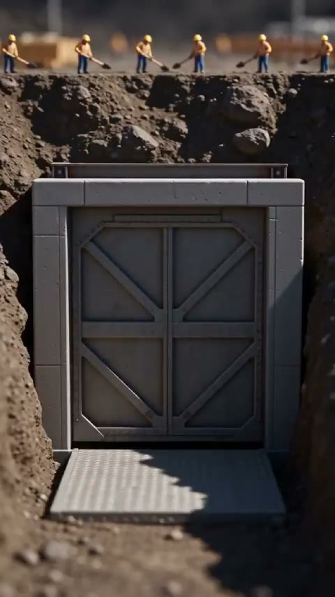</a>

[播放样片](../assets/cases/video-19ceae29af.mp4) · 来源：[@Maverick | AI / YouMind](https://x.com/RizwanAly07/status/2101897414760411153) · 来源提示词 / 翻译整理

用微型工人连续施工展示火山谷紧急疏散城市的建造。 · 电影感

**完整提示词**

```text
创建一个 30 秒、垂直 9:16 画幅的超写实微缩建筑延时视频，展示数百名微型工人正在火山谷中快速建造一座受保护的紧急疏散城市。

背景中始终可见一座巨大的冒烟火山。数百名工人持续进行逼真的物理作业：挖掘、搬运材料、浇筑混凝土、堆叠砖块、固定钢材、操作起重机、安装管道和搭建结构。所有物体必须通过物理方式构建——没有任何东西是凭空出现的。

0–4 秒：工人清理荒芜的火山谷，标记安全区域并修建主要疏散道路。

4–8 秒：团队挖掘地基，逐层建造多栋紧急住房。

8–12 秒：工人安装结构梁、屋顶、窗户、门以及厚重的防护围墙。

12–16 秒：建造加固型地下避难所和带有小型停机坪的紧急医疗中心。

16–20 秒：安装水箱、地下管道、食品仓库和补给箱。

20–24 秒：组装高大的通信塔、疏散隧道、次要道路和观察塔。

24–28 秒：应急卡车抵达，同时工人安装灯光、路障、警示标志、救援设备、树木和小片绿地。

28–30 秒：镜头特写一名工人拧紧最后一颗螺栓，然后迅速向上拉远，展现完整的微缩疏散城市，包括数十个避难所、道路、隧道、医疗中心、塔楼、车辆和数百名忙碌的工人。背景中巨大的火山冒着烟，远处隐约可见熔岩的光芒。

每 2 秒必须引入一个清晰可见的新建筑元素。在整个过程中保持工人密集且处于活跃工作状态。

严格限制：禁止魔法般的建造、瞬间出现、传送、材料消失、悬浮工人、重复工人、巨人、卡通风格、玩具/塑料质感、奇幻建筑、CGI 外观、文字或水印。保持一致的比例、逼真的物理效果、自然光照、微距景深、4K HDR 和电影级照片写实感。
```

**可复用模板**

[浏览生视频 Prompt 模板](../templates/video.md)

<a id="video-59eafdce5b"></a>

### 科幻摩托车动作场面

<a href="../assets/cases/video-59eafdce5b.mp4">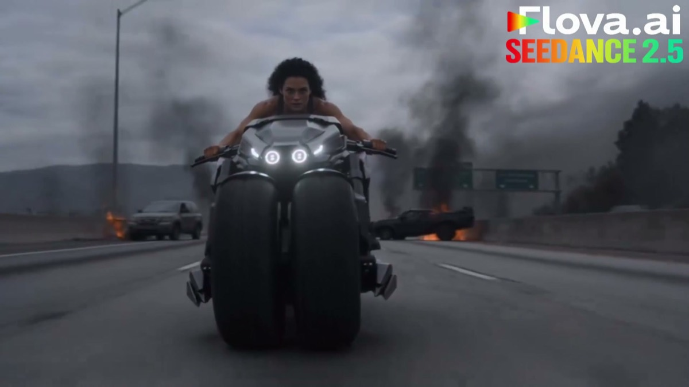</a>

[播放样片](../assets/cases/video-59eafdce5b.mp4) · 来源：[Zyrella（X：`@Zyrellix`）](https://x.com/Zyrellix/status/2087846827475239167) · 来源提示词 / 翻译整理

生成未来摩托车追逐、外星母舰爆炸和近身格斗组成的高能电影级科幻动作场面。 · 动作

**完整提示词**

```text
一场高能电影感科幻动作场面，背景设定在阴沉压抑的天空下，一条被摧毁且烟雾弥漫的高速公路上。一位留着深色卷发、身穿橄榄绿背心和深色战术裤的运动型女性，骑着一辆哑光黑色未来派摩托车在混乱的车流中穿梭，摩托车配有双前置重型轮胎和发光的白色 LED 前大灯，她灵活地避开燃烧的汽车残骸和剧烈的爆炸。摩托车底盘精准地部署出双联装重型等离子加特林机枪，向上方巨大的悬浮三角形外星母舰开火，直至其在道路上方炸成一团耀眼的火球。摩托车冲上混凝土护栏坡道，在光束背景下完成了一次极具戏剧性的空中慢动作跳跃，落地时发生爆炸，骑手优雅地以超级英雄式的“三点着陆”姿势落在火焰环绕的沥青路面上。她站起身以超人的速度冲向一名身穿黑色皮夹克的金发女性对手，她那带有蓝色 LED 发光线条的未来派机械腿甲清晰可见。两人展开快节奏的武术近身格斗，她踢出强有力的一记动能踢，将对手击飞撞向一辆翻倒的卡车，卡车随即引发剧烈火爆。超写实真人电影美学，8k 分辨率，电影级布光，体积光束，爆炸特效，低角度追踪镜头，快节奏动作，动态运动模糊，35mm 镜头拍摄。
```

**可复用模板**

[查看对应模板](../templates/video.md#video-sci-fi-motorcycle-action)

<a id="video-31ea8a7f7c"></a>

### 立体书地图纸艺动画

<a href="../assets/cases/video-31ea8a7f7c.mp4">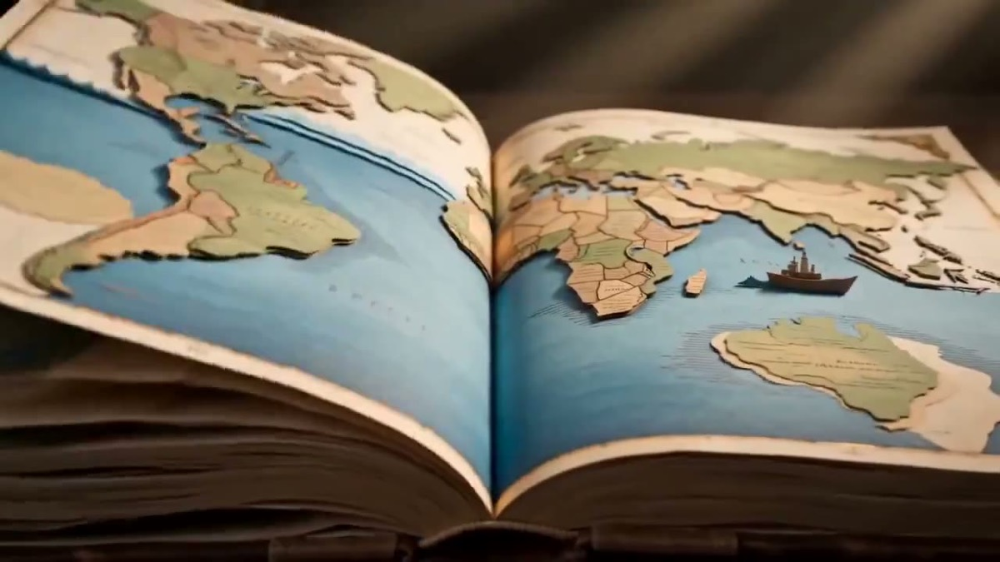</a>

[播放样片](../assets/cases/video-31ea8a7f7c.mp4) · 来源：[@Alexandra Aisling / YouMind](https://x.com/AllaAisling/status/2091584001282900033) · 来源提示词 / 翻译整理

让地图集中的纸艺地形随翻页重组并最终折叠成罗盘。 · 动画

**完整提示词**

```text
立体书纸艺动画，15 秒，16:9。大师级纸艺工程。多层地形纸艺设计，精致的剪纸景观，浮雕细节，金箔地图标记，移动的纸质机械结构，手工质感，电影级暖色调灯光，浅景深。所有物体均呈现为从古董地图集中浮现的实体纸张。无旁白。音频：翻页声、纸张摩擦声、微妙的管弦乐奇幻感。第一幕（0-4 秒）一本古老的地图集打开。一张宏伟的纸质地图在两页之间展开。山脉以分层纸浮雕的形式升起。森林、河流、桥梁、城市和船只从隐藏的折叠处浮现。微小的纸质云朵漂浮在景观上方。摄像机在地形上方低空掠过。第二幕（4-8 秒）翻页。地图开始自我重组。河流向上折叠变成道路。山脉变平并转化为海洋。城市在隐藏的纸质轨道上滑动。整个区域旋转并像巨大的机械拼图一样锁定在新的位置。第三幕（8-12 秒）再次翻页。地图变得愈发不可思议。新的大陆从现有大陆下方展开。桥梁横跨天空。浮岛从分层的机械结构中涌现。无尽的纸质地理景观向书本边缘之外延伸。第四幕（12-15 秒）最后一次翻页。整个世界通过数千个同步的纸张运动向内折叠，转化为一个由景观、城市、海洋和山脉组成的巨大华丽罗盘。罗盘扩展并展开成一张更大的、超出书本边缘的不可思议的地图。画面定格在变形完成的瞬间。
```

**可复用模板**

[浏览生视频 Prompt 模板](../templates/video.md)

<a id="video-d2f1128753"></a>

### 毛线娃娃早餐定格动画

<a href="../assets/cases/video-d2f1128753.mp4">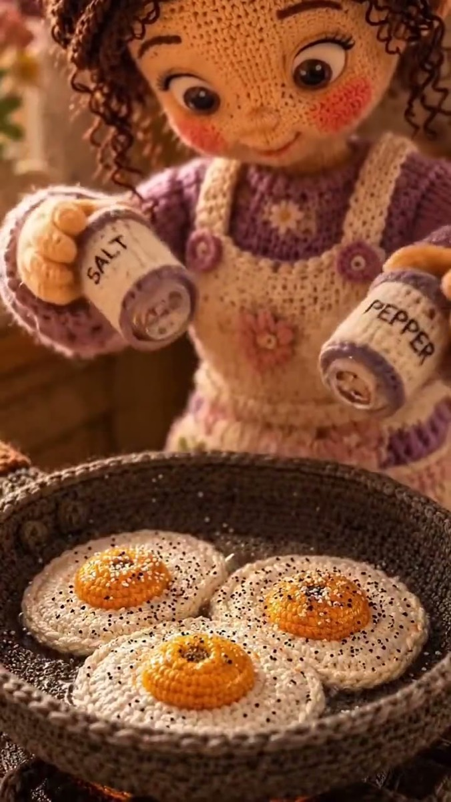</a>

[播放样片](../assets/cases/video-d2f1128753.mp4) · 来源：[@Maya / YouMind](https://x.com/MayaAiCreator/status/2098365565781917862) · 来源提示词 / 翻译整理

用四段针织材质镜头串联打蛋、调味、装盘和用餐的定格动画。 · 动画

**完整提示词**

```text
场景详情：
动作：娃娃正在将鸡蛋打入深灰色针织平底锅中，锅位于钩针编织的炉灶台面上。
物体：带有光泽黄色毛线蛋黄的针织鸡蛋，标有“SALT”和“PEPPER”的钩针编织盐罐和胡椒罐，贴有“Made with Love”标签的毛线罐子，以及在清晨柔和阳光透过窗户照射下的温馨木质背景。
风格：微距移轴摄影，触感真实的羊毛和棉线质感，高度精细的针织纹理，定格动画美学，温暖舒适的氛围，景深效果，8k 分辨率。--ar 9:16 --v 6.0

片段 1：打鸡蛋 (0:00 - 0:08)
提示词：一个可爱的毛线娃娃，梳着棕色发髻，穿着紫色针织套装，手持钩针编织的蛋壳，将生鸡蛋打入温馨炉灶上深灰色的针织平底锅中。光泽的黄色毛线蛋黄轻轻落入锅中，清晨柔和的阳光透过窗户洒下，3D 定格动画，真实的羊毛质感，微距摄像机角度。
片段 2：调味特写 (0:08 - 0:15)
提示词：极微距镜头，定格动画风格。一个毛线娃娃女孩拿着标有“SALT”和“PEPPER”的微型钩针编织调味罐，在针织锅中滋滋作响的三个煎毛线蛋上撒下细小的黑白珠子。真实的羊毛细节，温暖舒适的灯光，浅景深。
片段 3：装盘食物 (0:15 - 0:23)
提示词：中景镜头，定格动画。毛线娃娃女孩用一把微型木铲将煮熟的毛线蛋从深灰色钩针编织锅中滑入装饰性的针织盘子里。温馨的厨房背景，摆满了毛线罐子和钩针编织细节，明亮的晨光，逐帧拍摄的触感动态。
片段 4：享用早餐 (0:23 - 0:32)
提示词：特写定格动画。毛线娃娃坐在小桌旁，用微型金属叉刀切开钩针编织盘子里的煎毛线蛋。柔和温馨的灯光，毛衣和围裙上精细的针织纹理，手工艺术美感。
```

**可复用模板**

[浏览生视频 Prompt 模板](../templates/video.md)

<a id="video-69395c9b4c"></a>

### 黏土机器人创业故事

<a href="../assets/cases/video-69395c9b4c.mp4">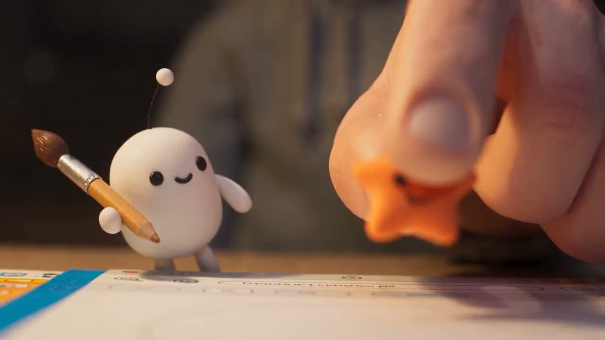</a>

[播放样片](../assets/cases/video-69395c9b4c.mp4) · 来源：[@Condz / YouMind](https://x.com/condzxyz/status/2093032563400987056) · 来源提示词 / 翻译整理

用黏土定格和拟音叙述微型机器人协助创作应用的故事。 · 动画

**完整提示词**

```text
一句话总结：橡皮泥定格动画短片。深夜的小阁楼里，一个年轻的黏土创业者有了一个做app的点子，书桌上那个小小的银色黏土方盒（一台迷你电脑主机）的盖子像玩具箱一样打开，一群小机器人帮手爬出来，自动完成设计、写代码、画图标、测试和上线，让他只专注于最有趣的创意部分。app上线的那一刻，窗外整座黏土城市亮起来。30秒，多机位剪辑，无对白无旁白，全程拟音音效驱动，结尾出现黏土字幕。

核心概念（像给10岁孩子解释）：这个小方盒里住着一群小帮手。你有了一个点子，按一下按钮，它们就爬出来把所有麻烦的活儿自动干完。你只负责想出最酷的东西。

风格：真实手工定格动画质感，每秒12帧的分步运动，非平滑插值，角色表情靠眉毛和肩膀的微小变化传达。黏土表面可见指纹与接缝。微缩布景：毛毡、瓦楞纸、火柴棍家具、棉花云。浅景深移轴感，每个镜头一个明确的机位行为，机位变化时用硬切。禁止：真实照片质感、光滑3D CG、任何品牌标志、水印、除结尾指定字幕以外的任何文字。

角色与道具：创业者是一个瘦高的黏土青年，蓬乱的棕色头发、圆圆的大眼镜、灰色连帽衫、浓密会动的眉毛。主机是一个巴掌大的银色哑光黏土方盒，圆角，正面有一个小圆按钮，底部有一圈细缝。方盒旁边立着一台小小的黏土显示器。机器人帮手是拇指大小的白色黏土小机器人，圆脑袋、一只天线、两条细腿，每个手里拿着不同的小工具（画笔、迷你键盘、放大镜、小印章、小喇叭）。app的吉祥物是一颗带笑脸的橙色小彗星。

镜头1（0s-4s）设定。大远景，正面对称构图，深夜的微缩阁楼：斜屋顶、一扇小窗、窗外是黑蓝色的纸板城市轮廓。创业者坐在小书桌前，桌上堆着歪歪扭扭的黏土便利贴塔，银色方盒安静地立在显示器旁边。他盯着一张空白的黏土纸，眉毛拧成一团。<远处城市的轻微嗡鸣> <纸张摩擦声> 忽然，他头顶一步一步鼓出一颗黄色黏土灯泡，眉毛猛地扬起。<清脆的"叮"> 末状态：他看向银色方盒。

镜头2（4s-8s）触发。切到桌面高度的低角度镜头，银色方盒在前景占据画面下方，创业者在后景虚化。他的手指伸进画面，按下方盒正面的小圆按钮。<机械的"咔哒"> 方盒底部的细缝亮起一圈薄荷绿光，焦点从他的脸拉到方盒。方盒的顶盖像玩具箱一样一步一步掀开，<盖子弹开的"啪"> 一架火柴棍小梯子从里面伸出来搭在桌上，小机器人一个接一个顺着梯子爬出来，落在桌面上排成一排，齐刷刷举起工具。<梯子伸出的木头咯吱声> <细碎的爬梯脚步声> <小工具碰撞的叮当声> 末状态：六个机器人面向镜头站好，顶盖敞开着，创业者在后景眼镜反光。

镜头3（8s-12s）自动搭建。切到正上方的垂直俯拍镜头，桌面像一张棋盘。机器人以极快的分步节奏把一块块彩色黏土薄片拼成一排排整齐的app界面：按钮、列表、一个大大的空白圆圈留给图标。另一个机器人坐在方盒顶上用迷你键盘敲字，一条卷曲的黏土代码彩带从方盒的细缝里不断长出来，绕着桌面盘旋。<密集的键盘哒哒声> <薄片拼合的啪嗒声> 末状态：界面整齐铺满桌面，代码彩带绕了一圈。

镜头4（12s-16s）他做最有趣的部分。切到微距特写，浅景深。创业者的手拿着一小根黏土，慢慢捏出一颗橙色小彗星，再用指尖点出两只眼睛和一个笑脸。<黏土揉捏的柔软声> <两下轻点声> 一个拿画笔的机器人踮脚趴在他手边看，天线激动地颤抖。焦点从彗星拉到机器人的脸，再拉回来。末状态：彗星完成，创业者把它放进界面上那个空白圆圈里。<恰好嵌入的"咔"声>

镜头5（16s-20s）自动测试。切到侧面横移镜头，镜头缓慢分步向右平移，一次扫过三个工位：第一个机器人用放大镜检查显示器上的界面，发现一个歪掉的按钮，用手指推正；第二个机器人在一部迷你黏土手机上滑动，彗星在屏幕上跳来跳去；第三个机器人举起小印章，重重盖在一张黏土纸上。<放大镜的玻璃摩擦声> <推正按钮的"咔"> <滑动的轻微沙沙声> <印章落下的"咚"> 末状态：三个机器人同时向创业者竖起大拇指。

镜头6（20s-25s）上线。切回正面构图，创业者深吸一口气，肩膀抬起，然后用手掌拍下桌上一个大大的红色黏土按钮。<按钮按下的沉闷"咚"> 方盒底部的绿光猛地变亮，显示器闪一下白光。<一声上扬的"叮"> 镜头开始缓慢后拉，穿过小窗飞到阁楼外面：黑蓝色的纸板城市里，一扇接一扇的小窗户亮起橙色光，每扇窗里都有一块微型黏土屏幕上跳着那颗笑脸彗星，光点像涟漪一样从阁楼向外扩散到整座城市。<窗户逐个亮起的连续"啵"声，越来越密> <温暖的合唱般的嗡鸣渐强> 末状态：大远景，整座城市点亮，阁楼的小窗在正中央。

镜头7（25s-30s）结尾。切回阁楼桌面，机器人们向创业者挥手，一个接一个爬回梯子钻进方盒，梯子缩回去，顶盖一步一步合上。<倒放的爬梯脚步声> <盖子合上的轻柔"咔哒"> 创业者在后景虚化，双手抱头靠在椅背上，眉毛放松。镜头缓慢分步推近至银色方盒的英雄特写，暖色背光勾勒轮廓，底部绿光轻柔呼吸。方盒顶部的黏土字母像积木一样一个个从盖子上凸起成形，先是【meet the new Mac mini】，停顿一下，再在前方凸起一行较小的【made for builders】。<字母逐个凸起的软"啵"声> <一声温暖的余韵音，然后归于安静> 末状态：方盒居中，两行字幕清晰可读，定格保持1秒。

灯光：主光是书桌上一盏黏土台灯的暖黄光，从左上方打下，硬边阴影，在银色方盒的圆角上留下柔和高光。窗外冷蓝色月光作为逆光 and 补光。方盒亮起后，底部的薄荷绿光成为第三个光源，映在创业者的眼镜上。镜头6城市亮起时，橙色窗光逐渐盖过蓝色月光。轻微的定格式亮度闪烁。三层色彩：基底为深蓝夜色与炭灰纸板，主体为灰色连帽衫的创业者和银色哑光方盒，点缀色为薄荷绿底光和橙色彗星与窗光。

全程保持：每个镜头只有一种机位行为，镜头之间硬切。所有运动分步、无平滑过渡。创业者、银色方盒、机器人和彗星的外形、颜色、大小全程一致。音频全程只有拟音音效和轻微的环境底噪。无对白、无旁白、无人声、无背景音乐。除结尾两行黏土字幕外，无任何文字、无品牌标志、无水印。
```

**可复用模板**

[浏览生视频 Prompt 模板](../templates/video.md)

<a id="video-2bf5e5594d"></a>

### 纽约街头的动漫滑板追逐

<a href="../assets/cases/video-2bf5e5594d.mp4">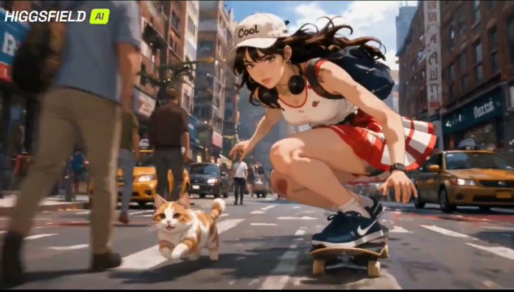</a>

[播放样片](../assets/cases/video-2bf5e5594d.mp4) · 来源：[Synthia（X：`@AIwithSynthia`）](https://x.com/AIwithSynthia/status/2088650163778961654) · 来源提示词 / 翻译整理

根据角色参考图生成女孩与小猫在纽约街头高速滑板追逐的半写实动漫短片。 · 动画

**完整提示词**

```text
请使用我上传的女孩参考图作为角色身份的唯一来源，创作一段电影级半写实动漫短片；需保留她的面部特征、发型、肤色和身体比例。 她身穿红白相间的运动短裙（内带短裤）、红白配色的修身短上衣、深蓝色 Nike 运动鞋，戴着米色“Cool”字样鸭舌帽、深蓝色双肩包、黑色电子手表，脖子上挂着耳机。 画面中需包含那只可爱的姜黄色配白色毛茸茸小猫，眼睛呈琥珀色，体型保持写实的家猫大小，高度约在女孩的小腿位置。 故事背景设定在充满活力的纽约繁华街道，包含砖砌建筑、店面、黄色出租车、地铁入口、交通信号灯、消防梯、街头小贩和人群。 女孩在曼哈顿街头极速滑行，小猫紧随其后，在行人、出租车和街头障碍物之间自然穿梭。 采用低机位的追逐镜头拍摄，运用快速跟拍、激进的甩镜头、强有力的剪辑、轮子高度的特写以及细微的手持抖动感。 她飞速掠过一个街头咖啡车，在不减速的情况下顺手拿走一杯外带咖啡，随后在保持高速滑行的同时迅速喝完。 她将空杯向后一扔，随即加速冲向一面布满涂鸦的墙壁，小猫始终与她并肩同行。 女孩表演了一个爆发力十足的滑板蹬墙跳，小猫在旁边与之完美同步跃起，两人同时落地。 场景无缝切换至纽约工业区，包含高架地铁轨道、钢结构桥梁、施工区域、仓库和屋顶建筑。 她用 ollie 动作跳上一条低矮的工业护栏，从桥下俯身穿过，与行驶中的地铁列车并肩竞速，随后跃上更高的钢结构平台。 结尾处，女孩与小猫从高架结构上同步跃下，跳入街面停车场，并以高速平稳落地。 保持顶级动漫游戏插画的画质，线条清晰，采用赛璐珞风格的绘画渲染，角色呈现细腻，灯光具有纽约电影质感，并加入动态动漫速度线。 拒绝写实风格，拒绝 3D CGI，严禁角色身份偏移、服装更换、猫咪体型过大、出现重复角色、人体结构扭曲、滑板变形，以及任何水印或文字。
```

**可复用模板**

[查看对应模板](../templates/video.md#video-anime-skateboard-chase-nyc)

<a id="video-e7dcc94d27"></a>

### 纽约跑酷与蛛丝摆荡动作

<a href="../assets/cases/video-e7dcc94d27.mp4">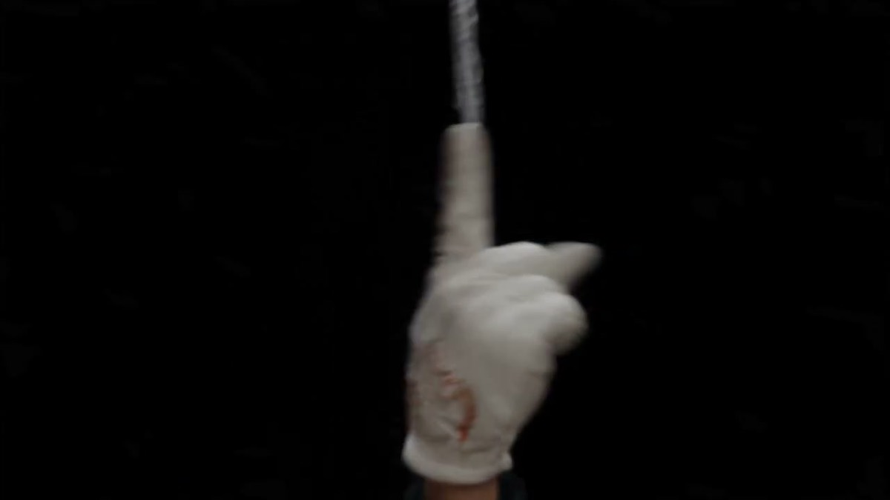</a>

[播放样片](../assets/cases/video-e7dcc94d27.mp4) · 来源：[Elsa Ai（X：`@ElsaSofia__AI`）](https://x.com/ElsaSofia__AI/status/2089306746804375878) · 来源提示词 / 翻译整理

生成一段15秒连续无人机跟拍，让角色在纽约街区完成跑酷、蹬墙和蛛丝摆荡。 · 动作

**完整提示词**

```text
角色参考 — 强制要求：面部 — 参考图像 3。服装 — 深色短波波头，黑色修身短款夹克，做旧深色工装牛仔短裤，腰间系灰色连帽衫，青色缎面芭蕾舞足尖鞋，粉色连裤袜，双耳佩戴黑色耳机，白色手套。 关键 — 角色身体结构。不可商量：165cm，47kg。健美、精瘦、受控。绝无布娃娃物理效果。绝无瘫软。绝无松垮。核心始终收紧。每一个动作都有肌肉发力意图。她的动作像是一位恰好拥有超能力的专业体操运动员/舞者 — 精准、自然、毫不费力。尽量减少旋转。身体运动逻辑符合物理定律。 关键 — 与环境的物理接触。不可商量：她不是在空中飞行。她与城市有物理交互 — 双脚蹬墙，双手抓取壁架，身体擦过建筑表面。每一个接触点：膝盖缓冲冲击，肌肉发力，身体对表面做出反应。这是跑酷 + 蛛丝摆荡，而不是漂浮。 关键 — 不同动作类型的身体姿态： 蛛丝摆荡：双臂向前伸展抓握蛛丝，双腿并拢拖在身后，核心收紧，背部挺直，下巴微抬 — 标准的绳索摆荡运动员姿势 蹬墙起跳：双脚平踩在墙面上，膝盖深蹲缓冲，随后双腿爆发式完全伸展以起跳，双臂向前挥动以获得动量 墙面奔跑：身体向墙面倾斜 45 度，双脚以跑步姿态蹬踏表面，双臂摆动，头发和连帽衫因惯性向侧面飘动 自由飞行顶点：双臂自然向两侧张开，身体微微后仰，放松 — 不是摆拍，而是物理上的释放 街道奔跑：全速冲刺，双臂摆动，头部前倾，青色足尖鞋敲击路面，身体向行进方向倾斜 关键 — 真实感。不可商量：真实的好莱坞电影质感。RED Monstro 8K，变形镜头。真实的运动模糊，真实的织物物理效果，真实的纽约大气雾霾。真实。 关键 — 摄影机。不可商量：一次连续的无人机跟拍。零剪辑。零瞬移。倾斜、侧倾、翻滚均符合物理规律。广角镜头，始终同时展现她与环境。 15 秒连续无人机跟拍镜头。直接衔接 — 从黑屏开始。 0–1 秒：黑屏。随后 — 特写 — 白色手套的手。手指张开。手腕弹动。蛛丝射出。摄影机立即后拉。 1–4 秒：广角 — 纽约住宅街道。褐砂石建筑、消防梯、杂货店。她低空摆荡 — 距离街道 3 米。身体：双臂伸展抓握蛛丝，双腿并拢拖在身后，核心收紧，背部挺直。在摆荡弧线的底部，她的双脚掠过一辆停放车辆的车顶 — 产生短暂的物理接触，双脚轻盈弹起，她借力转向。摄影机侧倾 40 度。 4–7 秒：她在顶点释放蛛丝 — 身体舒展，双臂张开，双腿伸展。随后，她没有立即发射下一根蛛丝，而是沿着褐砂石墙面奔跑。双脚以真实的跑步姿态敲击砖墙表面 — 身体向墙面倾斜 45 度，双臂摆动，在垂直表面快速跑动 4–5 步 — 随后双脚用力蹬墙，膝盖完全伸展，并在半空中向宽阔十字路口的另一栋建筑发射新蛛丝。摆荡将她猛地拉向侧面 — 摄影机侧倾 60 度。 7–10 秒：她低空穿过一条挤满黄色出租车的狭窄街道。距离地面 2 米，身体呈流线型 — 双臂前伸，双腿像箭一样拖在身后。蛛丝释放。双脚着地 — 全速冲刺，身体前倾，双臂发力 — 她在出租车之间跑了 3–4 步，利用惯性，双脚敲击湿润的路面。一辆出租车鸣笛。她笑了。随后一只脚踩在出租车侧面，单脚爆发式蹬踏车顶，向高处建筑发射蛛丝，并如火箭般冲向高空。 “WOOHOO！” 10–15 秒：远景镜头 — 屋顶高度，不算太高。她悬停在顶点 — 双臂微张，身体自然后仰，在令人屏息的瞬间完全静止。黄金时刻的天空 — 地平线上温暖的橙色和粉色光芒。巨大的戏剧性云层被下方的金光照亮。她是一个位于巨大发光天空正中央的小小身影。城市屋顶、水塔、下方的街道。画面定格。她开始向下坠落。 [结束] 关键 — 情感与声音。不可商量：她在每一帧中都充满活力。不呆滞。不中立。不挂机。 她的面部和身体在整个过程中表达出真实的实时情感： 第一次摆荡时 — 双眼睁大，嘴角微扬，纯粹的专注 双脚掠过车顶时 — 快速的惊讶笑声，本能反应 墙面奔跑时 — 咬紧牙关，坚定，高度集中 低空穿过出租车时 — 露出牙齿，肾上腺素带来的笑容，身体前倾 出租车鸣笛时 — 她大声笑出来，头微微后仰 “WOOHOO！” — 完全不受控制，张开嘴，纯粹的喜悦尖叫 顶点处的最终远景 — 双臂张开，头后仰，闭上双眼，展现出纯粹自由的面容 — 不呆滞，不摆拍，只是一个人处于人生中最美好的时刻 音频：仅音效。无音乐。风声呼啸。蛛丝弹射与绷紧声。双脚敲击车顶声。双脚敲击路面 — 真实的撞击声。出租车喇叭声。她真实的笑声。“WOOHOO！”在建筑间回荡。上升时切割风声。随后 — 顶点处归于寂静。 RED Monstro 8K，变形镜头，165cm 47kg 受控健美体态，尽可能与墙壁/车辆/表面产生物理接触，针对不同动作类型（摆荡/奔跑/蹬墙/冲刺）的详细身体力学，无布娃娃物理效果，无漂浮感，摆荡时采用剧烈的荷兰式倾斜角度，黄金时刻日落天空，温暖的橙粉色调，戏剧性的体积云，主体位于屋顶高度而非高空，主体在最终广角画面中心显得渺小，纽约褐砂石住宅建筑，连续单镜头无人机跟拍，无剪辑，照片级真实感
```

**可复用模板**

[查看对应模板](../templates/video.md#video-nyc-parkour-web-swing)

<a id="video-1c634febce"></a>

### 喷泉时间静止与彩虹

<a href="../assets/cases/video-1c634febce.mp4">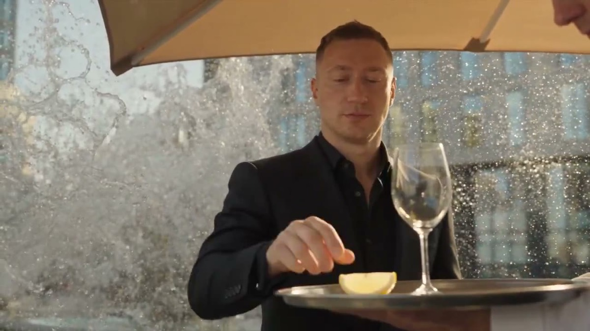</a>

[播放样片](../assets/cases/video-1c634febce.mp4) · 来源：[@lumiAI / YouMind](https://x.com/aiwithlumi/status/2102406322008559857) · 来源提示词 / 翻译整理

通过冻结喷泉水流、人物互动与恢复时间形成超现实彩虹揭示。 · 奇幻

**完整提示词**

```text
创建一个电影感、照片级逼真的场景，背景为欧洲广场，设有石制喷泉和露天咖啡馆。一名身穿深色西装的男子打了个响指，时间随之静止，巨大的喷泉水柱悬停在半空中纹丝不动。他从容地穿过水流，从一名静止的服务员手中取过一只酒杯，接住几滴水珠，加入柠檬片，并调整了一把遮阳伞。他将伞倾斜，再次打响指，时间恢复流动——水花在阳光下闪烁，在咖啡馆上方形成一道壮观的完整彩虹，周围人群惊叹不已。他轻啜一口饮品，直视镜头，用俄语说道：**“这样好多了”**（意为“Much better”）。
```

**可复用模板**

[浏览生视频 Prompt 模板](../templates/video.md)

<a id="video-e6248de843"></a>

### 疲惫日常蒙太奇

<a href="../assets/cases/video-e6248de843.mp4">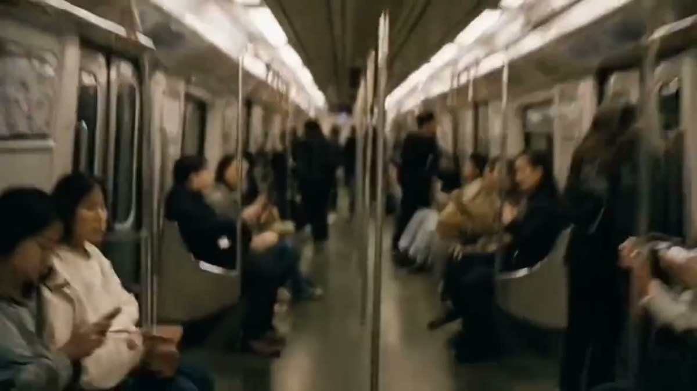</a>

[播放样片](../assets/cases/video-e6248de843.mp4) · 来源：[@Noor / YouMind](https://x.com/noorlewisx/status/2101902128986075593) · 来源提示词 / 翻译整理

用连续生活碎片呈现从清晨通勤到深夜工作的疲惫日常。 · 电影感

**完整提示词**

```text
一部具有电影感和写实风格的短片，主角是一位留着波浪状及肩深色头发的年轻东亚女性，展现她匆忙且疲惫的日常作息。采用柔和的大地色调，略带颗粒感的 35mm 胶片质感，自然光线，手持摄影，营造出安静而忧郁的氛围。

镜头序列：
- 特写：放在磨损大理石床头柜上的智能手机，显示时间为 06:50 AM。
- 她穿着碎花睡衣惊醒，双眼圆睁，头发凌乱。
- 在昏暗的瓷砖浴室里洗脸，湿发垂下。
- 黑暗空旷的走廊。
- 伸手从拥挤的冰箱中取出一个容器。
- 一边吃三明治，一边套上绿红相间的连帽衫。
- 穿上灰色 New Balance 运动鞋。
- 背着米色背包走在昏暗的走廊里。
- 带有运动模糊效果的拥挤地铁车厢。
- 站在列车上看手机。
- 走上长长的瓷砖地铁楼梯。
- 换上白色纽扣衬衫。
- 在开放式办公室用笔记本电脑工作到深夜。
- 特写：杂乱的电子表格。
- 远景：夜晚黑暗空荡的办公室；她是最后离开的人。
- 走出空荡荡的办公室。
- 精疲力竭地倒在床上。
- 穿着睡衣侧身入睡。
- 最终黑屏：“18:50 AM”。

风格：扎实的纪录片质感，自然的皮肤纹理，充满生活气息的空间，16:9 画幅，24fps，电影级调色。
```

**可复用模板**

[浏览生视频 Prompt 模板](../templates/video.md)

<a id="video-0a64266abe"></a>

### 企业猫职场动画短片

<a href="../assets/cases/video-0a64266abe.mp4">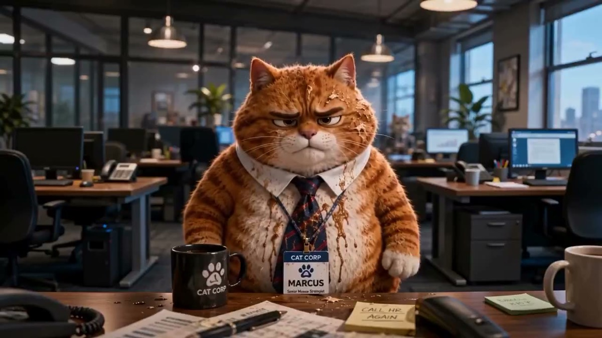</a>

[播放样片](../assets/cases/video-0a64266abe.mp4) · 来源：[@Aynelle / YouMind](https://x.com/aynellex/status/2102604800341000457) · 来源提示词 / 翻译整理

以拟人化角色的一日职场故事制作 3D 动画短片。 · 动画

**完整提示词**

```text
创作一部电影感、超精细的动画短片，讲述一只名为 Marcus 的拟人化橙色虎斑猫意外踏入职场世界的旅程。开场于一个温馨舒适的家，Marcus 在客厅耐心等待，主人正走出前门。展示 Marcus 为一天做准备：身穿正式白衬衫、深色条纹领带、商务西裤，手提一个小公文包。

转场至 Marcus 抵达一座名为 Cat Corp 的大型现代企业办公楼。呈现一个令人印象深刻的玻璃钢结构工作场所，布满办公桌、电脑屏幕、员工、冷蓝色灯光以及巨大的发光 Cat Corp 标志。跟随 Marcus 自信地穿过办公室，手持公文包和咖啡杯，神情略显严肃且坚定。

继续展示 Marcus 坐在办公桌前，周围堆满文件、文档、电脑和办公用品。引入一位优雅的白色母猫同事加入他进行重要的商务讨论。展现自然的互动、严肃的表情、交换的文件以及合作时细微的手势动作。

场景转入一间充满戏剧张力的行政办公室，Marcus 站在一张豪华办公桌后的大灰猫老板对面。透过窗户可见夜晚的城市灯光，营造出紧张的职场氛围。展示 Marcus 仔细聆听后，带着更加坚定的表情离开办公室。

逐步推向神秘的结局：夜晚 Marcus 回到家，伸手去开门锁时突然停顿。切至其富有表现力眼睛的极端特写，眼中反射着发光的 Cat Corp 办公室，暗示着更大的事件即将发生。

全程保持严格的人物一致性：相同的橙色虎斑皮毛图案、面部特征、眼睛、身体比例、红色项圈、白衬衫、条纹领带及商务装束。在所有场景中保留每个角色相同的视觉身份。

采用电影级 3D 动画风格，具备逼真的毛发、细腻的面部表情、可信的猫咪解剖结构与动作、真实的办公环境、戏剧性的蓝暖光对比、大气景深、柔和反射、精致的电影质感以及顶级动画电影品质。

运用流畅的跟拍镜头、广角建立镜头、中景人物镜头、过肩构图、缓慢推镜、戏剧性特写，以及用于最终揭示的极端眼部特写。包含自然的行走、尾巴摆动、眨眼、耳朵转动、微妙面部表情、处理纸张、咖啡移动、开门、真实的光线变化及可信的环境动态。

营造神秘、情感丰富且略带幽默的企业氛围，带有动画惊悚片或职场冒险的感觉。从始至终保持故事叙述的连贯性与电影感。无对白，无旁白，无字幕
```

**可复用模板**

[浏览生视频 Prompt 模板](../templates/video.md)

<a id="video-ad4c3bf9c3"></a>

### 前后景转移焦点

<a href="../assets/cases/video-ad4c3bf9c3.mp4">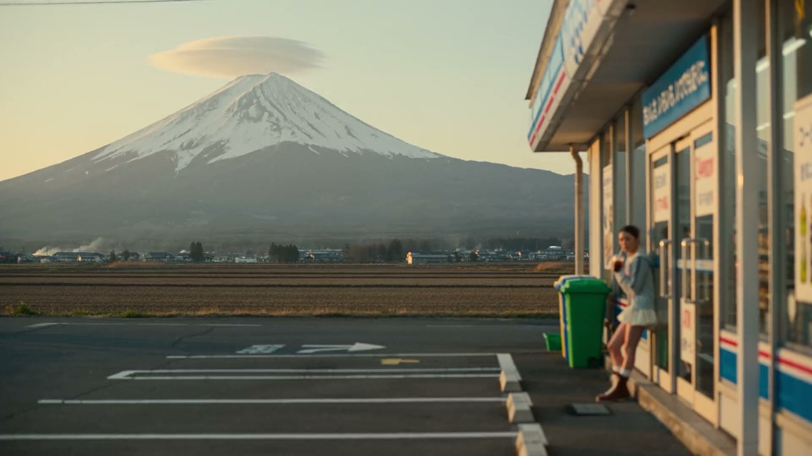</a>

[播放样片](../assets/cases/video-ad4c3bf9c3.mp4) · 来源：[Higgsfield.AI Team。](https://higgsfield.ai/academy/how-to-use/turn-your-video-into-cinema-using-wan-camera-control) · 来源提示词 / 翻译整理

保持机位和构图完全固定，只在远景锚点与近景主体之间进行一次平滑转焦。 · 镜头运动

**完整提示词**

```text
## 原始英文提示词

The camera hard-locked on a tripod with no pan, no tilt, no push, no drift; the only optical change is FOCUS. Hold sharp on [plane A — the far anchor]; then rack once to [plane B — the near subject]; then follow focus on the subject if they move toward the lens. Speed: the rack is slow, smooth and continuous with no hunting and no overshoot; the follow focus tracks without breathing. Framing: the composition never changes; exactly one plane is sharp at any moment, the other melts into clean bokeh; the subject grows in frame only by physically approaching the lens. End: settle sharp on [the final subject framing], the far plane dissolved to soft bokeh behind.

## 中文使用版

摄像机严格锁定在三脚架上，不得横摇、俯仰、向前推进或产生漂移；唯一的光学变化是焦点。首先保持[焦平面 A：远处锚点]清晰，然后只进行一次焦点转移，将清晰焦点缓慢移至[焦平面 B：近处主体]；如果主体继续向镜头移动，则跟随主体持续对焦。转焦速度缓慢、平滑且连续，不得来回搜焦或越过焦点；跟焦过程中不得出现明显呼吸效应。构图始终不变，任何时刻只能有一个焦平面清晰，另一个应融入干净的散景。主体在画面中变大只能来自其真实靠近镜头。结尾稳定对焦于[最终主体构图]，远处焦平面在其后方化为柔和散景。

## 变量

- `[plane A — the far anchor]` / `[焦平面 A：远处锚点]`：镜头开始时清晰的远景对象。
- `[plane B — the near subject]` / `[焦平面 B：近处主体]`：转焦后的近景主体。
- `[the final subject framing]` / `[最终主体构图]`：结尾需要保持清晰的主体画面。
```

**可复用模板**

[查看对应模板](../templates/video.md#video-rack-focus-foreground-background)

<a id="video-0c79e1fe07"></a>

### 日本网红出门准备 UGC

<a href="../assets/cases/video-0c79e1fe07.mp4"></a>

[播放样片](../assets/cases/video-0c79e1fe07.mp4) · 来源：[タナベ | AI動画 × マーケティング（X：`@tanabe_fragm`）。](https://x.com/tanabe_fragm/status/2096136682055864564) · 来源提示词 / 翻译整理

使用角色图和房间首帧生成一段日本美妆网红出门前整理刘海的自然手机口播视频。 · UGC

**完整提示词**

```text
## 作品

美丽网红的假日。“我以为我准备好了，但还是担心刘海。”

一段 30 秒自然的手机 UGC 视频，主角为一名虚构的 27 岁日本女性，场景在家中。展现她平日美丽迷人的一面。营造一种如同与亲密粉丝对话般的亲切距离感。

## 输出要求

竖屏 9:16，30 秒，全屏视频。无黑边。单人、单房间、单手机拍摄，一镜到底。无剪辑、场景切换或分屏。对话和肢体动作优先于严格的时间控制。

## 图像角色

`@Image1` = 角色参考（脸部、发型、服装）。

`@Image2` = 起始帧及房间/灯光参考。

两张图中的角色保持一致。Image2 用于固定构图和室内环境。

## 角色设定

27 岁日本美妆/时尚网红。五官精致，巧克力棕色中长卷发，卷度柔和。身穿白色圆领 T 恤，搭配蓝色高腰牛仔裤，佩戴小巧的金色圆环耳环。自然妆容，蜜桃色腮红，玫瑰米色唇妆。全程形象保持一致。

## 室内与拍摄

紧凑的日本出租屋，白墙，自然光。手机固定在桌面上拍摄。无电影级虚化或过度 HDR。房间看起来不应像摄影棚。

## 语音与行为

自然的标准日语口语。声音温暖清晰，非推销口吻。口型与日语同步。自然的眨眼、呼吸，以及看向镜头或镜子的眼神交流。

## 表演与对话：30 秒序列

- 0.0-3.5 秒：手从镜头前移开，看向镜头。对话：“好了，我准备出发了。”
- 3.5-8.5 秒：看向左侧的镜子。注意到刘海。对话：“……哦，刘海这样会不会更好一点？”
- 8.5-14.0 秒：沉默。用指尖整理刘海。照镜子确认。
- 14.0-21.0 秒：微笑着看向镜头。对话：“我总是临出门前就开始担心。”
- 21.0-25.5 秒：拿起包。对话：“今天要去咖啡馆。”
- 25.5-30.0 秒：向镜头挥手。对话：“那么，回头见。”伸手去关掉录制。

## 声音

本人声音、呼吸声、室内环境音、衣物摩擦声、包的声音。与动作同步。无背景音乐或旁白。

## 严格合规

不要添加额外对话。仅限一人。全程保持角色形象一致。
```

**可复用模板**

[查看对应模板](../templates/video.md#video-japanese-influencer-get-ready-ugc)

<a id="video-e24c102dab"></a>

### 山崖轮滑动作

<a href="../assets/cases/video-e24c102dab.mp4">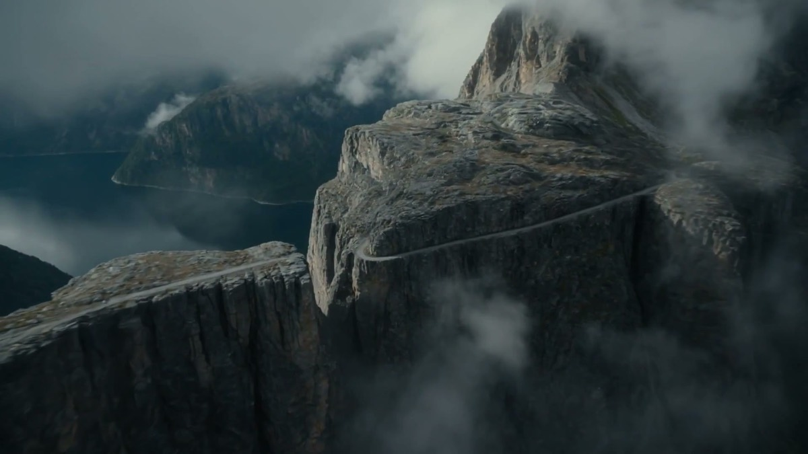</a>

[播放样片](../assets/cases/video-e24c102dab.mp4) · 来源：[Sarah（X：`@SyntheSarah`）](https://x.com/SyntheSarah/status/2088122680142930199) · 来源提示词 / 翻译整理

生成一名女性在危险山崖道路轮滑的超写实动作序列，重点控制环境尺度、身体平衡和轮滑物理。 · 动作

**完整提示词**

```text
创作一段 15 秒的超写实电影级动作序列。一名年轻女性独自在极其危险的山地环境中轮滑。她身穿写实的黑色专业户外服装，佩戴防护手套、头盔，脚穿专业轮滑鞋。在整个视频中，她的面部、身体比例、服装和轮滑动作保持高度一致。 0–3 秒：广角航拍镜头，展示巨大的锯齿状山脉环绕着一条狭窄的山崖小路。路面仅容一人通过，一侧是深不见底、云雾缭绕的峡谷，垂直落差令人胆战心惊。乌云在山峰间快速移动，强风吹拂着山崖。 3–6 秒：低角度跟拍镜头，女子在靠近边缘的地方危险地滑行。她身旁的小石块滚落，坠入深渊。轮子对裂缝和不平整的路面做出真实的物理反应。她在强风中保持平衡，头发和衣物自然飘动。 6–9 秒：道路突然变得极窄，一侧是巨大的岩壁，另一侧是深渊。她从一块巨大的悬垂岩石下穿过，身后碎石滚落。镜头随她移动，展现出环境的宏大与压迫感。 9–12 秒：戏剧性的近距离跟拍，她接近山路的一处断裂带。路面横跨着一道大裂缝。她轮滑跳跃过裂缝，并真实地落在另一侧。撞击产生自然的尘土和碎石飞溅效果。 12–15 秒：镜头快速后拉至宏大的电影级广角镜头，展现女子独自在极其危险的山脊上滑行，周围环绕着巨大的悬崖、远处的瀑布、厚重的云层、薄雾以及下方深不见底的峡谷。 风格：纪录片级别的写实感，物理精准的人体动作，真实的轮滑物理效果，自然的表情，真实的皮肤纹理，清晰的发丝，细腻的织物，真实的岩石构造，大气透视，穿透云层的自然阳光，体积感山雾，真实的强风与尘土，细腻的手持摄影感，电影镜头，真实的景深，自然的动态模糊，高动态范围，4K 超写实，顶级真人电影摄影。 负面提示词：CGI 感，卡通感，人工纹理，不真实的物理效果，悬浮物体，解剖结构扭曲，多余的手指，多余的肢体，面部变化，身份变化，闪烁，轮子变形，物体复制，色彩过饱和，过度慢动作，不自然的镜头运动。
```

**可复用模板**

[查看对应模板](../templates/video.md#video-cliffside-roller-skating)

<a id="video-1d6c1fec91"></a>

### 烧烤美食微距短片

<a href="../assets/cases/video-1d6c1fec91.mp4"></a>

[播放样片](../assets/cases/video-1d6c1fec91.mp4) · 来源：[@Zoya / YouMind](https://x.com/Zoyavelle/status/2102641743669961207) · 来源提示词 / 翻译整理

组合烤架火焰、肉串和人物动作的微距美食镜头。 · 烹饪

**完整提示词**

```text
A cinematic close-up of a young Asian woman wearing a black hoodie and a dark head covering, standing beside a traditional outdoor barbecue grill. She slowly adjusts the cloth on her head with both hands while smoke rises around her. Cut to detailed macro shots of juicy pieces of grilled meat on metal skewers over glowing charcoal, sizzling and releasing thick aromatic smoke. Close-up of the meat being grilled over intense open flames, golden-orange firelight reflecting on the food, realistic smoke and heat distortion. Ultra-realistic food cinematography, cinematic lighting, shallow depth of field, dramatic warm tones, highly detailed textures, natural movement, realistic fire and smoke physics, 4K, 8K, professional DSLR camera, macro lens, smooth camera movement, photorealistic, immersive atmosphere.
```

**可复用模板**

[浏览生视频 Prompt 模板](../templates/video.md)

<a id="video-512e7b9e27"></a>

### 奢华护肤品水感广告

<a href="../assets/cases/video-512e7b9e27.mp4"></a>

[播放样片](../assets/cases/video-512e7b9e27.mp4) · 来源：[@Maha / YouMind](https://x.com/Aiwithmaha/status/2101887507059351894) · 来源提示词 / 翻译整理

围绕护肤玻璃罐设计水珠、乳霜、花叶和产品定格镜头。 · 广告

**完整提示词**

```text
创作一段 15 秒的超写实奢华护肤品商业广告，主角是一个标有“AQUA LUXE – DEEP HYDRATION”字样的优雅玻璃罐，置于清凉蓝色、令人焕然一新的环境中。以柔和的蓝色氛围背景开场，轻柔的光束和细微的水粒子营造出洁净高端的格调。缓慢揭示立于光泽水面上的护肤罐，呈现逼真的倒影和电影般的景深效果。镜头逐渐拉近，柔和的高光在金属银色盖子和玻璃包装上缓缓滑动。让如丝绸般顺滑的白色乳霜状波浪优雅地环绕着罐体流动，营造奢华的护肤质感。添加漂浮的水珠和微小气泡，使其以符合真实物理规律的方式自然穿梭于场景中。过渡到清澈水晶般的水花戏剧性地包裹住产品，同时保持罐体完美清晰且居中。在水花周围引入精致的白花和新鲜绿叶，营造清新补水灵感氛围。最后以 AQUA LUXE DEEP HYDRATION 罐体的精美英雄镜头收尾，罐体居中置于蓝色背景前，周围环绕着水珠、花朵和柔和发光的光线，配合高端电影级布光和完美的产品焦点。
```

**可复用模板**

[浏览生视频 Prompt 模板](../templates/video.md)

<a id="video-ced1de556c"></a>

### 奢华珠宝开箱广告

<a href="../assets/cases/video-ced1de556c.mp4"></a>

[播放样片](../assets/cases/video-ced1de556c.mp4) · 来源：[ayzalnoor（X：`@ayzalnooor24521`）。](https://x.com/ayzalnooor24521/status/2097194787564658942) · 来源提示词 / 翻译整理

生成包含礼盒开箱、宝石微距、人物佩戴和产品陈列的竖屏珠宝商业广告。 · 广告

**完整提示词**

```text
创作一段 30 秒的电影级奢华珠宝广告视频，风格温暖而优雅。

视频以装饰精美的卧室开场，柔和的晨光洒入，一个高级珠宝礼盒放置在木桌上。一位女性轻轻拿起优雅的礼盒，展现出细腻且富有情感的开箱瞬间。

镜头切换至她面部和手部的电影级特写，展示珠宝揭晓的时刻。一颗闪耀的蓝色宝石吊坠在柔和的金色灯光下呈现出精致的微距细节。她优雅地戴上项链，突显其精致的设计与奢华的光泽。

场景延续至窗边宁静的清晨时刻，她手持杯子，沐浴在温暖的阳光中。特写镜头捕捉到吊坠在肌肤上自然闪烁的光芒，伴随着逼真的阴影与倒影。

视频结尾展示了陈列着整套珠宝的高级礼盒。

柔和的电影级灯光、温暖的金色调、奢华商业美学、平滑的运镜、浅景深、照片级真实细节、9:16 竖屏格式。
```

**可复用模板**

[查看对应模板](../templates/video.md#video-luxury-jewelry-unboxing)

<a id="video-dcc3d74eac"></a>

### 摄政时期电影蒙太奇

<a href="../assets/cases/video-dcc3d74eac.mp4"></a>

[播放样片](../assets/cases/video-dcc3d74eac.mp4) · 来源：[@anj / YouMind](https://x.com/anjmaxx/status/2102052600426504362) · 来源提示词 / 翻译整理

通过服饰、场景与光线连续性制作摄政时期人物蒙太奇。 · 电影感

**完整提示词**

```text
创作一段 25 秒的超写实电影感时代蒙太奇，背景设定在约 1811–1812 年的英国，即乔治王朝晚期/摄政时期早期。使其呈现出高端英国时代剧电影的质感：自然的 35mm 胶片纹理、微妙的颗粒感和光晕、逼真的皮肤、织物、水面、植被和马匹物理效果、柔和的大气景深、克制的镜头运动、优雅的构图、柔和温暖的调色以及真实的历史还原度。

角色锁定 — 全程同一女性：一位极其美丽的英国女性，二十五六岁，精致的椭圆脸型，挺直的鼻梁，微妙的高颧骨，轮廓柔和的下颌线，自然红润的双唇，白皙温暖且带有真实质感的发光肌肤，富有表现力的杏仁形深榛褐色眼睛，柔和拱形的深色眉毛，丰富的深栗色柔软波浪发梳成低垂的摄政时期发髻，留有松散的发丝。神情平静、聪慧，略带忧郁。她在每个镜头中都穿着完全相同的象牙白飘逸摄政时期帝国高腰长裙：轻薄的细棉布/棉丝绸，适度的领口，长款修身袖子，精致的植物刺绣，细腻的蕾丝边缘，微妙的象牙色丝带和自然的布料褶皱；户外佩戴相同的蕾丝饰边软帽。切勿改变她的面部特征、发型、礼服、配饰或身体比例。

镜头序列

0–2s — 钩子（HOOK）：

一棵巨大的垂柳框住了金色黎明下雾气笼罩的装饰性湖泊。身穿白色长裙的女子站在水边；远处的石桥消失在薄雾中，鸭子在湖面上滑行。缓慢的推轨镜头穿过垂下的柳枝，揭示出她微微转向光辉风景的身影。

2–4s：

她走过古老的石桥，裙摆在微风中自然摆动。平滑的后退跟踪镜头揭示了水面、柳树和远处的庄园花园。

4–6s：

她走向一扇爬满淡粉色攀援玫瑰的风化石拱门，轻轻推开陈旧的绿色木门，进入一座正式的乔治亚风格花园。过渡期间，玫瑰叶片自然地遮挡了镜头。

6–8s：

在睡莲池旁，她跪下并用两根手指触碰水面。逼真的同心涟漪扭曲了她的倒影。低水位相机视角，亲密的浅景深。

8–10s：

一匹栗色马在一棵古老的橡树下等待。她温柔地抚摸它的脖子，自然地骑上马背并侧坐调整姿势。围绕马匹和骑手进行缓慢优雅的弧形镜头运动。

10–12s：

宽幅横向跟踪镜头，展示她缓缓穿越广阔的英国公园式景观：起伏的绿色山丘、古树、装饰性湖泊以及远处宏伟的蜜糖色乔治亚乡村别墅。她的白色长裙和软帽丝带随风自然飘动。

12–14s：

她穿过一片茂密的野花草地，手指拂过高高的草丛。她摘下一朵花，微微一笑。温和的圆形镜头运动。

14–16s：

圆形运动揭示了草坪对面宏伟对称的乔治亚庄园，由成熟的树木框景。她停下脚步，望向那里。

16–18s：

安静的视觉停顿：乔治亚庄园倒映在湖中，鸭子滑过前景，轻轻打破倒影。边缘处的柳枝摇曳。几乎难以察觉的推进镜头。

18–21s：

将湖面倒影匹配到庄园内一架历史合理的抛光木质乔治亚大三角钢琴上。女子仍穿着相同的礼服，坐在俯瞰同一片湖泊和柳树的高大推拉窗前轻柔弹奏。从她肩后向侧面轮廓进行缓慢的对角线推轨镜头。

21–23s：

特写她自然弹奏象牙琴键的双手；袖子的动作、抛光木材的反光和微妙的烛火晃动。焦点转移从琴键 → 手指 → 柔和模糊的面部。

23–25s：

缓慢向后推轨穿过客厅朝向高大的窗户，揭示出钢琴前的女子以及窗外同样的湖泊、柳树和石桥。随着最后一个钢琴音符淡去，画面轻柔地切至黑屏。

环境

构建一个地理连贯、美丽的英国乔治亚庄园：大型反光装饰性湖泊、巨大的垂柳、睡莲、芦苇、古老石桥、玫瑰覆盖的石制花园入口、修剪整齐的树篱、碎石小径、淡粉色玫瑰、毛地黄、薰衣草、蕨类植物、野花草地、古老橡树、起伏的公园式景观，以及一座拥有推拉窗和古典细节的宏伟对称蜜糖色乔治亚乡村别墅。室内：奶油色灰泥墙、深色胡桃木、高大推拉窗、大理石壁炉、植物画作、瓷器、蜡烛和抛光的乔治亚大三角钢琴。

光线 / 色彩 / 物理效果

仅使用自然英国阳光：柔和的金色黎明、温和的午后日光、温暖的傍晚高光，以及室内带有微妙烛光效果的逼真窗光。奶油白、柔和鼠尾草绿、苔藓绿、陈旧石材、尘粉色、暖金色和柔和蓝灰色阴影。略微降低饱和度的绿色，无青橙色调。物理准确的反射、阴影、水波、马匹运动、布料运动、植被、雾气和烛火。

摄影机 / 剪辑

仅使用有动机的电影化运动：缓慢推轨、横向跟踪、温和弧线、克制推进、水位视角和前景遮挡转场。在运动中切换，并利用反射和前景遮挡转场。

在运动中切换，并利用反射和前景遮挡转场。
```

**可复用模板**

[浏览生视频 Prompt 模板](../templates/video.md)

<a id="video-b5fa2e6d3f"></a>

### 生物发光灯塔守望者

<a href="../assets/cases/video-b5fa2e6d3f.mp4">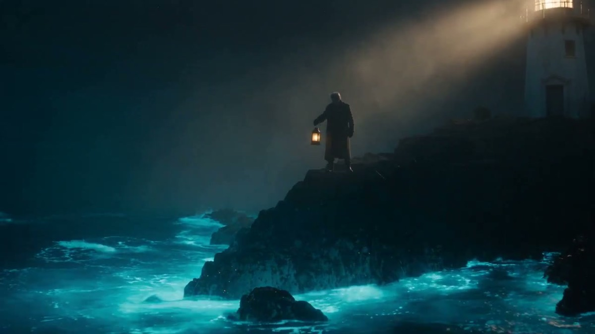</a>

[播放样片](../assets/cases/video-b5fa2e6d3f.mp4) · 来源：[Sarah（X：`@SyntheSarah`）。](https://x.com/SyntheSarah/status/2097182529564365135) · 来源提示词 / 翻译整理

生成老灯塔守望者在雾夜悬崖目睹发光球体从海中升起的连续电影镜头。 · 电影感

**完整提示词**

```text
一位饱经风霜的老灯塔守望者站在夜晚雾气弥漫的悬崖上，身穿厚重的羊毛大衣，手提一盏古老的黄铜灯。

在他脚下，海浪拍打着岩石，泛起柔和的蓝色生物发光。当他举起灯时，几十个发光的漂浮球体（如同萤火虫般）从水中升起，飘过他身边进入雾气中，在他周围轻轻盘旋。体积光月光穿透了浓雾。

镜头从悬崖的全景开始，随后缓慢地进行电影级推进，聚焦到守望者的面部，当球体环绕他时，最终定格在球体倒映在他眼中的特写镜头上。

青色与暖琥珀色的调色，超写实纹理，浅景深，胶片颗粒感，大气雾气，15 秒，平滑连续的镜头运动，无剪辑。
```

**可复用模板**

[查看对应模板](../templates/video.md#video-bioluminescent-lighthouse-keeper)

<a id="video-60b5dcaaac"></a>

### 食谱信息图转连续烹饪短片

<a href="../assets/cases/video-60b5dcaaac.mp4"></a>

[播放样片](../assets/cases/video-60b5dcaaac.mp4) · 来源：[Oleksa AI（X：`@OleksaFrame`）。](https://x.com/OleksaFrame/status/2097669808800113040) · 来源提示词 / 翻译整理

以一张多步骤食谱信息图为视觉分镜，先生成前半段，再续写后半段，得到保持食材状态、厨房环境、声效和烹饪顺序连续的竖屏美食短片。 · 烹饪

**完整提示词**

```text
阶段一：首段 10 秒

MODEL: Gemini Omni 1.1 Flash

SHOT STRUCTURE: 5 shots, 10 seconds, vertical 9:16, exactly as listed.

REFS:

@Image1 = visual storyboard reference. It controls the cooking order, black cast-iron skillet, ingredients, finished-dish styling, dark surfaces, and soft window-lit food photography. Convert its picture panels into fresh full-frame live-action cooking shots.

VISUAL CONTENT LOCK:

Every frame contains only food, cookware, ingredients, natural hands, and kitchen surfaces. Live-action cooking imagery fills the entire 9:16 frame. All surfaces remain clean and unlettered. The source poster’s typography, grid, headings, step numbers, captions, logos, and graphic elements remain reference metadata outside the generated video.

AUDIO CONTENT LOCK:

The soundtrack consists exclusively of synchronized cooking sounds and quiet kitchen room tone. Close dry chopping, oil pouring, pan sizzling, wooden-spoon movement, vegetables landing, tomato pouring, bubbling sauce, and soft steam. Spoken voices, narration, vocals, and music remain outside the soundtrack.

GLOBAL LOOK:

70mm large-format film aesthetic, fine organic grain, broad dynamic range, deep food detail, soft highlight roll-off, restrained anamorphic character. Vertical 9:16 composition with the food, cookware, and hands inside the central safe area. Soft diffused daylight enters from camera-left through a white curtain; pale stone counters return gentle fill. Saturated tomato red contrasts with black cast iron and warm neutral kitchen surfaces. Preserve realistic steam, oil flow, translucent onion, red-pepper texture, spice granules, sauce bubbles, and natural hand movement.

SHOT 1 (0–1.5s) — Finished-dish hook

camera: three-quarter close hero view, quick smooth push toward the skillet.

action_visual: finished shakshuka bubbles gently beside crusty bread; steam crosses the soft window light.

sound: close bubbling sauce and faint skillet sizzle.

exit: the circular skillet rim fills the frame.

(MATCH CUT TO)

SHOT 2 (1.5–3.5s) — Prepare ingredients

camera: locked overhead medium shot.

action_visual: hands finish dicing onion and slicing red pepper, then arrange minced garlic, spices, tomatoes, eggs, feta, and herbs in small bowls.

sound: clean knife rhythm, cutting-board taps, bowls touching the stone counter.

exit: one hand lifts an olive-oil bottle.

(CUTTING ON ACTION TO)

SHOT 3 (3.5–5.5s) — Heat oil and sauté onion

camera: macro three-quarter insert shifting into an overhead close shot.

action_visual: golden olive oil pours into the black skillet; diced onion follows immediately and a wooden spoon stirs through the rising sizzle.

sound: smooth oil pour followed by a sharp fresh sizzle and dry wooden scraping.

exit: the spoon sweeps screen-right.

(MATCH ON MOVEMENT TO)

SHOT 4 (5.5–7.5s) — Add pepper, garlic, and spices

camera: overhead close shot with a subtle push-in.

action_visual: red pepper strips fall into the softened onion, followed by minced garlic, cumin, smoked paprika, and chili flakes. The spoon folds everything together in one continuous action.

sound: vegetables landing, brighter pan sizzle, granular spices brushing the skillet.

exit: paprika-red oil spreads beneath the spoon.

(CUT TO)

SHOT 5 (7.5–10s) — Add tomatoes and simmer

camera: low three-quarter close view, short dolly back.

action_visual: crushed tomatoes pour into the skillet. A clean cooking-time jump reveals the sauce bubbling, reducing, and becoming visibly thicker.

sound: dense tomato pour transitioning into wet clustered bubbling.

exit: the thick bubbling red surface fills the final frame; bubbling continues across the extension.

阶段二：续写 10 秒

MODEL: Gemini Omni 1.1 Flash

REFS:

@Video1 = the first 10-second video being extended. It sets the exact starting frame, skillet position, reduced sauce level, kitchen surfaces, lighting direction, color grade, camera character, and cooking-sound palette.

SHOT STRUCTURE: 5 new shots, 10 seconds, vertical 9:16, exactly as listed.

CONTINUITY:

Begin directly from the final bubbling-sauce frame of @Video1. Continue in the same skillet, kitchen, soft window light, color grade, screen direction, and large-format film aesthetic. Preserve the reduced sauce level and every visible ingredient state.

VISUAL CONTENT LOCK:

Every frame contains only the cooking process, food, cookware, natural hands, and kitchen surfaces. Live-action imagery fills the entire 9:16 frame. All surfaces remain clean and unlettered. Captions, titles, step numbers, logos, watermarks, graphic overlays, interface elements, and the source poster grid remain outside the generated video.

AUDIO CONTENT LOCK:

The soundtrack consists exclusively of synchronized kitchen foley and quiet room tone. Sauce bubbling, spoon pressure, eggshell cracking, lid contact, escaping steam, feta crumbling, herbs falling, bread touching the counter, and gentle skillet sizzling. Spoken voices, narration, vocals, and music remain outside the soundtrack.

SHOT 1 (0–2s) — Make the wells

camera: pull back from the bubbling surface into a locked overhead close shot.

action_visual: the thick sauce settles slightly and a wooden spoon presses four evenly spaced wells into it.

sound: wet spoon movement through dense sauce with soft bubbling underneath.

exit: the final well forms at frame center.

(MATCH CUT TO)

SHOT 2 (2–4s) — Crack in the eggs

camera: macro three-quarter insert with a gentle push-in.

action_visual: one egg cracks into the center well; three rapid cut-on-action beats place eggs into the remaining wells. Every yolk remains whole.

sound: four distinct eggshell cracks, soft egg contact with the sauce, steady skillet sizzle.

exit: the final shell lifts as a glass lid descends.

(CUTTING ON ACTION TO)

SHOT 3 (4–6s) — Cover and check

camera: medium three-quarter view shifting overhead as the lid lifts.

action_visual: the glass lid seats on the skillet and condensation spreads across it. A concise cooking-time jump reveals set whites and glossy soft yolks as the lid rises.

sound: soft glass-and-iron clink, muted simmer beneath the lid, then a brief rush of escaping steam.

exit: released steam fills the bright upper frame.

(WHIP THROUGH LIGHT TO)

SHOT 4 (6–8s) — Finish and serve

camera: overhead macro moving into a low lateral slide.

action_visual: fingertips scatter creamy feta between the yolks, fresh herbs fall across the sauce, and a hand places warm crusty bread beside the skillet in one flowing finishing action.

sound: dry feta crumble, delicate herb rustle, bread making soft contact with the stone counter.

exit: the lateral camera slide reveals the complete skillet.

(CONTINUOUS — NO CUT)

SHOT 5 (8–10s) — Final dish

camera: settle into a three-quarter hero composition and hold with a nearly imperceptible push-in.

action_visual: finished shakshuka bubbles softly; steam curls through the window light, golden yolks remain intact, feta and herbs stay naturally scattered, and crusty bread frames the skillet.

sound: gentle sauce bubbling, faint skillet sizzle, quiet kitchen room tone fading naturally at the final frame.
```

**可复用模板**

[查看对应模板](../templates/video.md#video-recipe-infographic-cooking-sequence)

<a id="video-a2196efe4e"></a>

### 手绘变实物定格料理

<a href="../assets/cases/video-a2196efe4e.mp4">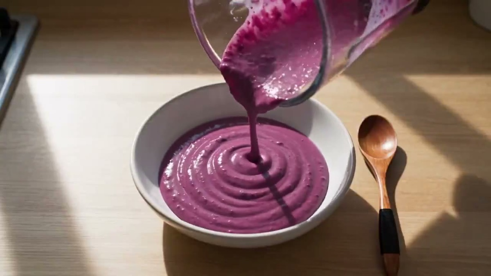</a>

[播放样片](../assets/cases/video-a2196efe4e.mp4) · 来源：[@NoorAI / YouMind](https://x.com/noorwithwifi/status/2087821976270450985) · 来源提示词 / 翻译整理

以铅笔草图变为真实食材的机制制作混合现实料理短片。 · 动画

**完整提示词**

```text
创作一段视觉上令人满足的混合现实定格动画短片，展示 [DRAWN OBJECT/SKETCH] 无缝转换为 [REAL INGREDIENT/OBJECT] 的过程。视频中，一个人使用智能手机和彩色铅笔在 [SURFACE] 上进行创作，在每个物品通过流畅、无缝的变换魔法般地变为现实之前，先将其勾勒出来。展示 [INGREDIENTS] 被加入 [CONTAINER]，随后进行 [COOKING/BLENDING/PREPARATION ACTION]，最后盛入 [DISH]。结尾处，艺术家勾勒出 [TOPPINGS/FINAL DETAILS]，这些细节瞬间化为真实的食物，呈现出一道充满活力且摆盘精美的 [FINAL DISH]。使用逼真的纹理、自然的动作、令人舒适的定格动画节奏、简洁的构图、柔和的灯光，以及铅笔画与真实物体之间的无缝过渡。
```

**可复用模板**

[浏览生视频 Prompt 模板](../templates/video.md)

<a id="video-ac4f3a29c1"></a>

### 首尔周日 DV 家庭录像

<a href="../assets/cases/video-ac4f3a29c1.mp4">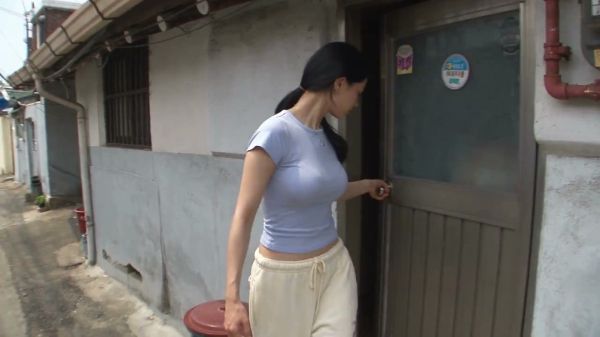</a>

[播放样片](../assets/cases/video-ac4f3a29c1.mp4) · 来源：[@Smiling Khan（X：`@AIwithkhan`）](https://x.com/AIwithkhan/status/2096424933366931946) · 来源提示词 / 翻译整理

生成一段具有 21 世纪初手持 DV 质感、自然日常互动和连续物体状态的首尔生活记录，适合怀旧 Vlog、城市日常和人物短片。 · DV

**完整提示词**

```text
制作一段 30 秒、1080p 超写实的 21 世纪初 DV 家庭录像，记录一名韩国年轻女性在首尔老城区度过宁静周日下午的场景。

韩国年轻女性，20 岁出头，自然美，皮肤真实，淡妆，黑色波浪卷发扎成凌乱的侧马尾，身穿修身淡蓝色短上衣、宽松米色睡衣风长裤，脚蹬黑色运动鞋，佩戴简约银色项链。保持其外貌、服装、发型和比例的高度一致。

她提着一个小购物袋走在安静的居民巷子里。她经过一个社区游乐场，看到一个小女孩的气球挂在低矮的树枝上。她注意到小女孩正在努力够气球，便走过去轻轻地将气球从树枝上解救下来。气球清晰地落入她手中，随后她递给小女孩，小女孩接过气球。

小女孩笑着说：“谢谢！”她回答：“不客气。”

她继续往家走，微风拂过她的头发和街道两旁的树叶，她脸上带着微笑。她走到家门口，转向镜头说道：“真是个不错的周日。”她走进屋内，画面切黑。

摄像机：原始手持 21 世纪初 DV 摄像机，画面抖动，自动对焦搜索，色彩褪色，曝光偏移，运动模糊，柔和的数字细节，不经意的变焦。拒绝精致的电影感。

音频：自然的社区环境音，鸟鸣、儿童声、自行车声、脚步声、风声和远处的交通声。无背景音乐。

连贯性：无物体消失或重复。气球在交给小女孩后保持在女孩手中。购物袋始终在女性手中。动作和转场流畅自然。

负面提示词：CGI 感、塑料感皮肤、外貌偏移、服装改变、物体瞬移、手部扭曲、多余手指、字幕、水印。
```

**可复用模板**

[查看对应模板](../templates/video.md#video-seoul-sunday-dv-home-video)

<a id="video-dc65c9f52f"></a>

### 水彩素描跑酷追逐

<a href="../assets/cases/video-dc65c9f52f.mp4">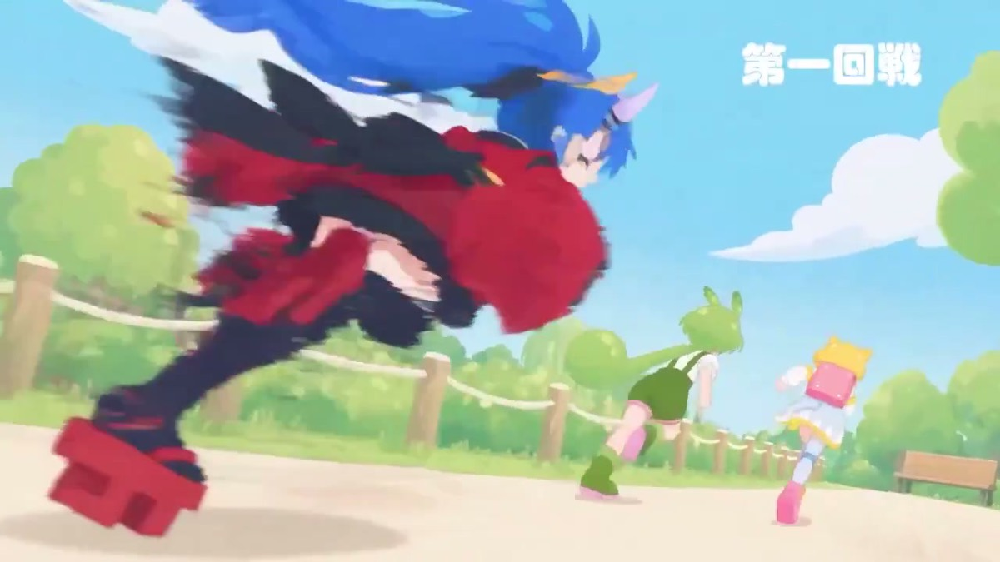</a>

[播放样片](../assets/cases/video-dc65c9f52f.mp4) · 来源：[おのもの | AIコンテンツを作るサラリーマン（X：`@user_monom`）](https://x.com/user_monom/status/2086447224750530664) · 来源提示词 / 翻译整理

使用多张角色与场景参考图生成三人跑酷追逐，并把每一帧呈现为不稳定线条和水彩重新绘制的动画。 · 动画

**完整提示词**

```text
> 完整性说明：以下内容是 YouMind 当前公开的中文翻译。页面将“剪辑 1-20”压缩成摘要，并在“表情指导”的“角色”处截断，因此本文件不是完整可复现提示词。缺失内容未做推测补写。

任务：Dreamina Seedance 2.5 - Omni Reference

时长：30 秒

宽高比：16:9

编辑目标：24fps，F000-F719

## 生成目标

一场高强度的跑酷追逐游戏，仅包含来自 `@Image1`、`@Image2` 和 `@Image3` 的三名角色。蓝色角色 C 为“抓人者”且是逃跑目标。角色 A 和角色 B 追逐角色 C。严禁使用 C 追逐 A 和 B 的构图。在整个视频中，C 必须始终处于领先位置，而 A 和 B 从后方追赶。

使用武术定位、假动作和闪避等敏捷动作，但不得出现拳击、踢踹、抓取或身体冲撞等物理攻击。角色之间绝无身体接触。禁止慢动作、定格画面、长时间停顿或静态姿势。全程保持正常或高速运动。

在关键时刻设置快速加速和变向（约 0.2 秒 / 5 帧）。将这些动作直接连接到奔跑、落地和下一步动作，中间不得停顿。当 C 跺脚时，腿部、臀部和肩部的压缩到伸展动作需连贯，且 C 会立即化作一组流动的笔触进行瞬移。仅在跺脚点生成 6-8 帧或更短的轻微镜头抖动。

不要让肌肉、关节、脚部、地面或受力点发光。不要生成内部光源、发光肌肉、光环、电流、魔法阵或发光的脚印。不要破坏地面或设施。

## 角色素材

`@Image1` = 角色 A（追逐者）。保持黄色波波头、猫耳、绿眼、浅蓝/白色服装配黄色饰边、三角形领结装饰、粉色背包、粉色靴子、带黄色三角形尖端的浅蓝色尾巴。敏捷且大胆。在追逐时注视 C 的背影和落脚点。表情：得意的微笑、惊讶，以及追上时兴奋的表情。

`@Image2` = 角色 B（追逐者）。保持亮绿色圆波波头、两只叶状耳朵、金眼、白色泡泡袖、粉色领结、带背带的深绿色短裤、绿色靴子，以及从后脑勺延伸出的长亮绿色发束，末端为圆形。预测 C 的逃跑路线并从外侧包抄。表情：观察、发现、专注、惊讶和竞技乐趣。

`@Image3` = 角色 C（蓝色“抓人者”/逃跑者）。保持鲜艳的蓝色长发马尾、两只白角、尖耳朵、金眼、星形耳环、深红色日式服装、黑色短裙、黑色腰带/后背丝带、黑色过膝袜和红色木屐。始终跑在 A 和 B 前面。回头观察追逐者并利用障碍物逃脱。表情：放松的微笑、快被抓到时的惊讶，以及逃脱时得意的微笑。

不要将三视图当作克隆体处理。总共只有三个人。不要互换面部、头发、服装、耳朵、角、尾巴、背包、鞋子或配色方案。不要生成武器。

`@Image4` = 公园背景。仅使用其结构、设施、色调、深度和空间关系。不要参考其中的人物。

## 环境布局

保持 `@Image4` 公园为一个连续的空间。特征：左前方有木长椅；左侧有大树、指示牌和路灯；中央有绿色屋顶的凉亭和分叉小径；中右侧有木拱桥、池塘、岩石、睡莲和绳索围栏；右侧有秋千、Slides 游乐设施、指示牌和垂柳。

路径顺序：长椅 -> 树/指示牌 -> 路灯 -> 凉亭 -> 拱桥 -> 池塘/石头 -> 秋千 -> Slides 游乐设施 -> 垂柳 -> U 型转弯 -> 池塘远端 -> 凉亭前方 -> 左前方人行道。

不要改变此顺序。不要在剪辑之间移动设施。不要让角色瞬移。将每个剪辑的结束位置作为下一个剪辑的起始位置。

## 追逐方向锁定

- F000-F440：三人均从屏幕左侧向右侧移动。角色 C 在最右侧领先。
- F441-F460：C 以垂柳为支点进行急转弯。仅在此剪辑内反转方向。
- F461-F719：三人均从屏幕右侧向左侧移动。角色 C 在最左侧领先。

无故不得反转左右方向。不要越过假想线。

## 连续动作规则

不要让角色在剪辑开始时等待。从上一个剪辑动作的中间开始。落地的脚要连接到下一步动作。放在环境上的手要连接到推开身体的动作。变向应在视线移动后立即发生。即使在特写镜头中也要保持这些动作。不要在动作进行中切换障碍物。在剪辑之间继承奔跑速度、水平/垂直位置和身体朝向。

## 不稳定线条规则

将整个视频渲染为“连续生成的线条和水彩”。将每一帧重绘为新的粗略草图。不要创建稳定的轮廓。在身体边缘保留 30-60% 的白纸间隙。线条应细长/断续，并突然加粗、抖动、分叉或消失。水彩应在轮廓外晕染，留下白点、干笔触痕迹或错位。

身体运动领先，铅笔线条滞后约 1-2 帧，水彩表面进一步滞后。在缓慢移动时，绘制约 60% 的身体。中速时绘制约 30-40%。高速时绘制约 10-20%。最高速度（约 0.2 秒）时，仅用 3-5 笔笔触和 2-3 个粗略的水彩面来表现角色。

速度形态：A = 黄/浅蓝/白/粉；B = 亮绿/深绿/白/粉；C = 蓝/深红/黑/金。不要只是在完成的身体上添加速度线；将流动的笔触组本身视为移动的角色。

## 剪辑 1-20

（详细描述了通过公园的具体编排，从剪辑 1 的长椅开始，到剪辑 20 结束，在左前方人行道进行动态、未决的高速追逐，遵循既定的环境顺序和流畅的运动规则）。

> 来源页面在此处仅提供以上摘要，没有公开 20 个剪辑的逐条内容。

## 镜头处理

通过低水平跟踪和前景物体（柱子、围栏、树枝、秋千链、桥栏）掠过镜头来营造速度感。不要长时间跟随角色的正面。侧重于侧视图、斜后方视图和低位跟踪。使用广角或全景镜头清晰展示 C 在前、A/B 在后的构图。

将眼睛/脚/手的特写限制在 0.2-0.5 秒的切入镜头，并直接连接回广角镜头中的相同动作。仅在 C 跺脚加速时使用镜头抖动。

## 表情指导

角色 A：专注的眼神锁定 C 的背影，靠近时露出得意的微笑，C 拉开距离时表现出惊讶，高度兴奋。角色

> 来源页面公开文本到此结束，后续内容缺失。
```

**可复用模板**

[查看对应模板](../templates/video.md#video-watercolor-sketch-parkour-chase)

<a id="video-345a132c7a"></a>

### 水晶粒子厨房变身

<a href="../assets/cases/video-345a132c7a.mp4">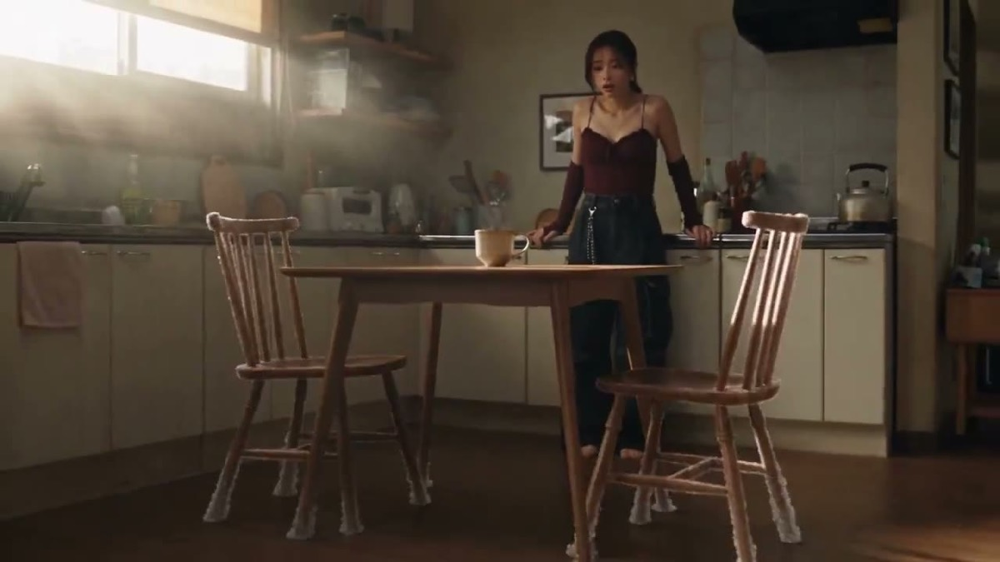</a>

[播放样片](../assets/cases/video-345a132c7a.mp4) · 来源：[@Lavinia / YouMind](https://x.com/laviniavelle/status/2100431886543978896) · 来源提示词 / 翻译整理

以人物触碰触发器物碎裂和室内空间重构的视觉特效短片。 · 科幻

**完整提示词**

```text
一位年轻的东亚女性身穿深栗色吊带背心，搭配同色系分离式袖套和黑色工装裤，站在明亮的现代厨房中。当她触碰陶瓷马克杯、金属水壶、木质餐桌、置物架以及窗外的景色时，每个物品都会碎裂并转化为动态的水晶粒子。她周围的房间逐渐溶解并转变为一个时尚简约的工业风阁楼空间，拥有裸露的混凝土墙壁、可俯瞰明亮海滨城市港口的大窗户，以及围绕在她周围的专业视频制作设备。电影感的温暖阳光透过窗户洒入，照亮空气中漂浮的尘埃和闪烁的玻璃碎片，画面采用流畅的运镜和柔和的景深效果拍摄。
```

**可复用模板**

[浏览生视频 Prompt 模板](../templates/video.md)

<a id="video-fa2e0ad821"></a>

### 推拉变焦空间扭曲

<a href="../assets/cases/video-fa2e0ad821.mp4"></a>

[播放样片](../assets/cases/video-fa2e0ad821.mp4) · 来源：[Higgsfield.AI Team。](https://higgsfield.ai/academy/how-to-use/turn-your-video-into-cinema-using-wan-camera-control) · 来源提示词 / 翻译整理

同步执行摄像机前移和镜头变广，在保持主体尺寸不变的同时拉伸背景空间。 · 镜头运动

**完整提示词**

```text
## 原始英文提示词

The camera physically dollies forward from [6] meters to [2.5] meters while the lens simultaneously zooms out from [18] to [84] degrees field of view, in one continuous, perfectly synchronized ramp. The subject's head size stays EXACTLY constant in frame the entire time; the background behind them visibly stretches, elongates and recedes into depth, [the repeating background elements] pulling away. Constant lens height, no pan, no tilt, no handheld drift; the two motions start and end together.

## 中文使用版

摄像机沿直线轨道从距离主体[6]米处实际向前移动至[2.5]米，同时镜头视场角从[18]度连续扩大至[84]度，两种运动必须在同一段完全同步的匀滑变化中完成。整个过程中，主体头部在画面中的尺寸必须严格保持不变；其身后的背景应明显拉伸、延长并向纵深退去，[重复出现的背景元素]逐渐远离。镜头高度保持固定，不得横摇、俯仰或出现手持漂移；轨道前移与镜头变焦必须同时开始、同时结束。

## 变量

- `[6]`、`[2.5]`：摄像机起始与结束距离，可按场景尺度调整。
- `[18]`、`[84]`：起始与结束视场角。
- `[the repeating background elements]` / `[重复出现的背景元素]`：用于强化空间拉伸感的走廊、灯带、柱列等元素。
```

**可复用模板**

[查看对应模板](../templates/video.md#video-dolly-zoom-space-warp)

<a id="video-565c5a1550"></a>

### 微型工人维修USB

<a href="../assets/cases/video-565c5a1550.mp4">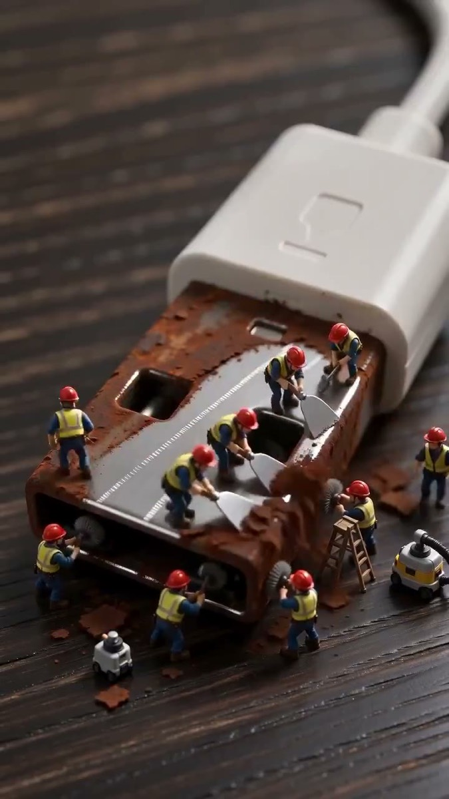</a>

[播放样片](../assets/cases/video-565c5a1550.mp4) · 来源：[@Martian / YouMind](https://x.com/drzubi01/status/2090307471797780641) · 来源提示词 / 翻译整理

用微距小人协作逐步修复并改造损坏的 USB 闪存盘。 · 动画

**完整提示词**

```text
{
  "title": "微型工人维修损坏的 USB 闪存盘",
  "duration": "15 秒",
  "style": "电影级微型定格动画，照片级真实感",
  "prompt": "一个电影级的微距场景，展示一个损坏的 USB 闪存盘放在深色的木质桌面上。起初，USB 闪存盘表面有明显的裂痕、污垢，并覆盖着细小的碎片。几十个戴着彩色安全帽、穿着工作服的微型建筑工人聚集在周围，检查损坏情况并搬运微型工具和设备。他们积极地维修和重建 USB 闪存盘：一些工人清理碎片，另一些人焊接和组装微小组件，还有一些人在表面搬运零件。随着维修工作的进行，损坏的棕色外壳逐渐转变为干净、光滑的金属银色 USB 闪存盘。工人们继续打磨并检查成品设备。保持真实的微型比例、细腻的纹理、逼真的阴影、电影级的景深、细微的镜头运动、温暖的桌面照明以及高度精细的微距摄影效果。",
  "camera": {
    "shot": "微距特写",
    "movement": "缓慢的电影级推镜头，伴随细微的横向移动",
    "focus": "浅景深，聚焦于 USB 闪存盘和微型工人"
  },
  "lighting": {
    "style": "柔和的电影级实用照明",
    "details": "温暖的高光、金属上的逼真反射、自然的阴影"
  },
  "animation": {
    "workers": "持续且协调的施工和维修活动",
    "transformation": "从损坏的棕色 USB 外壳到抛光银色外壳的渐进式视觉过渡",
    "motion": "微型工具移动、工人搬运零件、焊接火花、碎片被清理"
  },
  "negative_prompt": "大型人类、超大号工人、卡通风格、不真实的比例、漂浮物体、扭曲的 USB 闪存盘、过度的镜头抖动、模糊的细节、文字、徽标、水印"
}
```

**可复用模板**

[浏览生视频 Prompt 模板](../templates/video.md)

<a id="video-fce76e69a8"></a>

### 卧室接住落书互动

<a href="../assets/cases/video-fce76e69a8.mp4">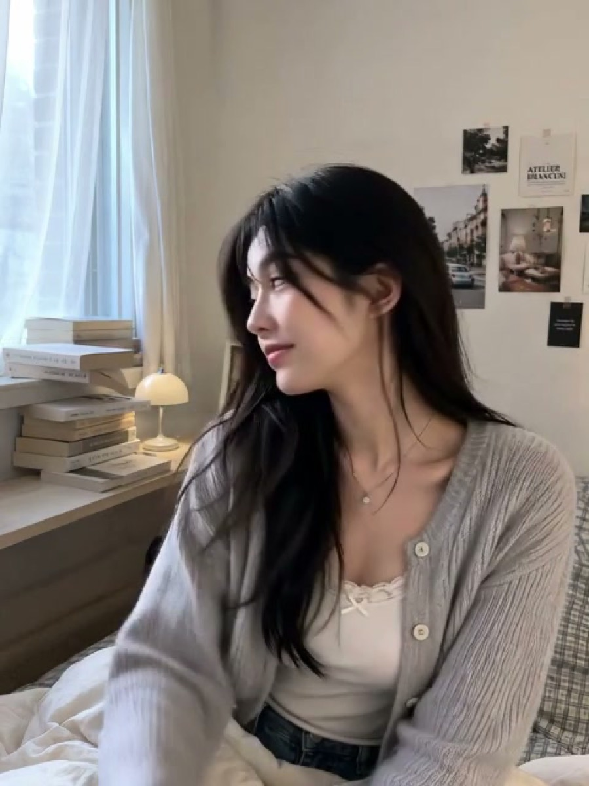</a>

[播放样片](../assets/cases/video-fce76e69a8.mp4) · 来源：[Ahmad Faraz（X：`@iamahmedfaraz66`）。](https://x.com/iamahmedfaraz66/status/2095139680786493912) · 来源提示词 / 翻译整理

基于卧室人物首帧生成书籍滑落、人物及时接住并作出自然反应的连续物体交互。 · 角色互动

**完整提示词**

```text
基于此图片创作一段 15 秒的写实风格温馨电影感视频。保持女性的面部特征、发型、开衫、首饰、身体比例、卧室、床、书籍、台灯、墙面装饰、灯光及整体构图完全一致。

- 0-4 秒：她舒适地坐在床上，看向镜头，表情柔和放松。她自然地眨眼和呼吸，随后看向身旁的一叠书。
- 4-7 秒：她伸手去拿那一叠书，轻轻抽出其中一本。就在这时，另一本书突然从书堆中滑落，向地面掉去。
- 7-10 秒：她反应迅速，身体前倾并伸手去接那本掉落的书。她在书落地前成功将其接住。
- 10-12 秒：她坐回原位，拿着书，带着一丝惊讶的表情看着它，随后发出轻微的笑声。
- 12-15 秒：她直视镜头，调皮地笑了笑，轻声说道：“好险。”随后将书稳妥地放在身旁。

要求：自然的人类动作、逼真的反应时机、可信的手指动作、与书籍准确的交互、细微的发丝摆动、真实的开衫质感、自然的表情、温馨的午后卧室氛围、柔和的电影级灯光、浅景深效果、轻微的手持摄像机感。掉落的书籍必须符合重力规律，接书动作要真实。

禁止夸张表演、禁止突兀的镜头移动、禁止出现其他人物、禁止面部变化、禁止服装变化、禁止手部畸变、禁止物体变形。
```

**可复用模板**

[查看对应模板](../templates/video.md#video-bedroom-falling-book-catch)

<a id="video-f953b9d317"></a>

### 无人机环绕主体

<a href="../assets/cases/video-f953b9d317.mp4">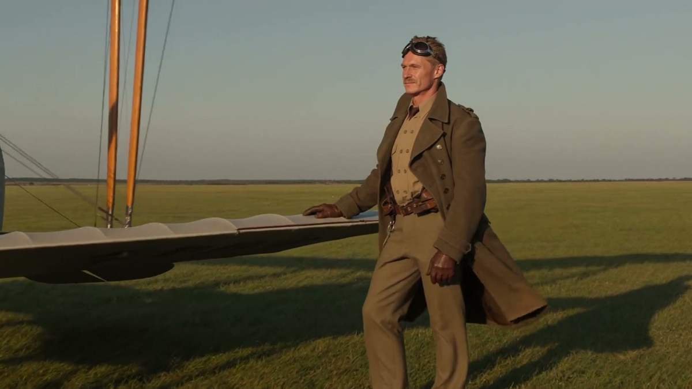</a>

[播放样片](../assets/cases/video-f953b9d317.mp4) · 来源：[Higgsfield.AI Team。](https://higgsfield.ai/academy/how-to-use/turn-your-video-into-cinema-using-wan-camera-control) · 来源提示词 / 翻译整理

让无人机以固定半径和高度匀速环绕主体，利用地平线旋转和视差建立空间感。 · 镜头运动

**完整提示词**

```text
## 原始英文提示词

A smooth constant-speed circular drone flight around the subject — [8]-meter radius, [4]-meter altitude, traveling screen-[right] (clockwise seen from above), covering roughly a [200]-degree arc across the shot. The horizon rotates continuously behind the subject; no altitude change, no radius drift, no zoom, no speed ramps.

## 中文使用版

无人机围绕主体进行平滑、匀速的圆周飞行：环绕半径为[8]米，高度为[4]米，向画面[右侧]移动，从上方俯视为顺时针方向，整个镜头覆盖约[200]度的弧线。地平线在主体身后持续旋转；不得改变高度、漂移环绕半径、变焦或使用速度渐变。

## 变量

- `[8]`：环绕半径。
- `[4]`：飞行高度。
- `[right]` / `[右侧]`：画面运动方向，改变时应同步调整顺逆时针说明。
- `[200]`：镜头覆盖的环绕角度。
```

**可复用模板**

[查看对应模板](../templates/video.md#video-drone-orbit-subject)

<a id="video-aecc45705d"></a>

### 野花四季微距延时

<a href="../assets/cases/video-aecc45705d.mp4">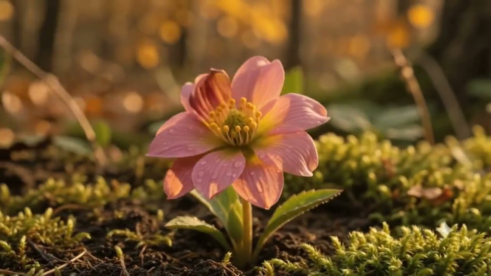</a>

[播放样片](../assets/cases/video-aecc45705d.mp4) · 来源：[@Mr Das / YouMind](https://x.com/MrDasOnX/status/2096453993371422748) · 来源提示词 / 翻译整理

固定一株野花，以微距延时展示盛放、枯萎、结霜和凋零。 · 电影感

**完整提示词**

```text
{
  "duration": "10 秒",
  "aspect_ratio": "16:9",
  "fps": 24,
  "style": "电影级写实风格，微距延时摄影，国家地理级视觉保真度，浅景深",
  "prompt": "一段持续 10 秒的微距延时摄影，焦点集中在从深色苔藓土壤中生长出的一朵孤傲、灿烂的野花上，捕捉四季流转以唤起无常之感。0:00–0:03，金色的春日晨光照亮了在繁茂花丛中绽放的花瓣，上面挂着晶莹的露珠。0:03–0:06，阳光增强为盛夏的暖阳，随后迅速转变为秋日的琥珀色；花瓣变得干燥、卷曲，呈现出浓郁的酒红色和赭石色。0:06–0:08，在寒冷的暮色下，精致的结晶霜和轻雪覆盖了枯萎的花朵。0:08–0:10，一阵冬风将干枯的花瓣和雪尘吹散到空中，露出空旷、宁静的土壤。在最终场景（0:08–0:10）中，优雅、极简的衬线字体平滑地淡入画面中心，显示“Everything is temporary…”，字体呈温暖、半透明的灰白色，带有轻微的模糊和柔和的光晕，随后淡出至黑色。",
  "lighting": "动态光影，从金色的晨曦轮廓光平滑过渡到清脆的盛夏日光、忧郁的秋日阴天以及寒冷的冬日暮光。",
  "camera": "85mm 微距镜头，f/2.8，缓慢的环形轨道移动并伴随轻微的推镜头，从花朵盛开到最终文字淡出，始终保持焦点居中。",
  "text_overlay": {
    "text": "Everything is temporary…",
    "timestamp": "0:08 - 0:10",
    "font_style": "极简、优雅的衬线字体，柔和发光的灰白色，带有细微的胶片颗粒质感，平滑的淡入淡出效果",
    "placement": "屏幕中心"
  },
  "audio_cues": "柔和的鸟鸣声过渡到干叶的沙沙声，轻柔的冬风呼啸声，以及在最终文字出现时背景中深沉、渐弱的环境钢琴和弦。"
}
```

**可复用模板**

[浏览生视频 Prompt 模板](../templates/video.md)

<a id="video-61094b8453"></a>

### 雨林神秘光源短片

<a href="../assets/cases/video-61094b8453.mp4">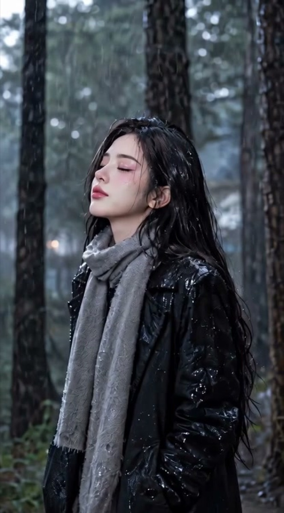</a>

[播放样片](../assets/cases/video-61094b8453.mp4) · 来源：[Ahmad Faraz（X：`@iamahmedfaraz66`）。](https://x.com/iamahmedfaraz66/status/2095362901326598521) · 来源提示词 / 翻译整理

基于雨林人物首帧生成女性察觉远处暖光、靠近后光芒消失的氛围悬念短片。 · 电影感

**完整提示词**

```text
请根据此图像制作一段 15 秒的写实电影级视频。请保留女性的面部特征、发型、湿发、黑色雨衣、灰色围巾、身体比例、森林环境、降雨效果、光影及构图。

- 0-4 秒：她静静地站在大雨中，闭着双眼，脸微微向上仰，平静地享受着雨水。水珠自然地流过她的湿发，顺着光亮的雨衣滑落。她的围巾在冷风中轻轻飘动。
- 4-7 秒：她身后的树林深处突然出现了一束微弱的暖光。起初它几乎难以察觉，就像透过雨雾闪烁的远方灯火。她缓缓睁开双眼。
- 7-10 秒：她注意到了这束不同寻常的光。她的表情从平静转为好奇。她慢慢转过头看向光亮处，在周围持续的雨幕中凝视着树林间。
- 10-13 秒：暖光变得稍微明亮了一些，在雾气中轻轻闪烁。她小心翼翼地向光亮处迈出一步，双眼紧盯着那神秘的光芒。镜头随她轻微移动。
- 13-15 秒：就在她迈出下一步时，光芒突然消失了。她停下脚步，凝视着树林间的黑暗，神情困惑。除了雨声外，一切陷入寂静。画面转黑。

写实电影质感，氛围感雨林，逼真的雨水和雾气，湿润的头发和衣物，自然的风吹效果，细腻的面部表演，真实的行走动作，深邃的森林透视，冷色调蓝灰色环境与远处暖色调琥珀光形成对比，浅景深，细腻的手持摄影感。

光线必须保持在远处并被树木部分遮挡；切勿揭示光源。无超自然生物，无其他人，无恐怖怪物，无惊吓镜头，无夸张反应，无场景切换，无面部改变，无服装改变，无手部变形，无画面扭曲。
```

**可复用模板**

[查看对应模板](../templates/video.md#video-rainforest-mysterious-light)

<a id="video-24c5f43c41"></a>

### 真人贴纸海报动效

<a href="../assets/cases/video-24c5f43c41.mp4">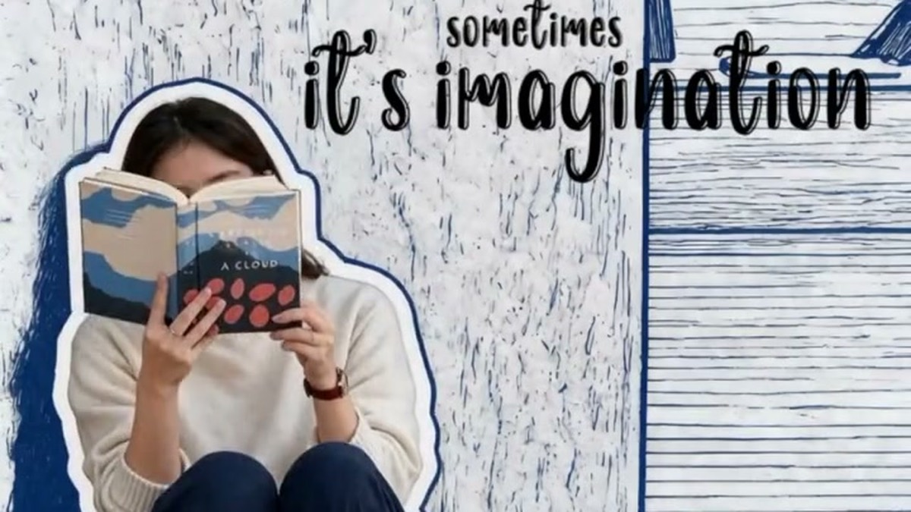</a>

[播放样片](../assets/cases/video-24c5f43c41.mp4) · 来源：[小洁AI实战](https://www.douyin.com/video/7683887650173032805) · 根据来源整理的适配提示词

上传真人贴纸海报，固定镜头与背景，只让真实人物自然活动。 · 动画

**完整提示词**

```text
以上传的完成版真人贴纸海报为首帧参考，生成一段 4 秒动态视频。

严格保留原图构图、布局、人物身份、服装、真实摄影质感，以及背景的原有底色与贴纸风格。除真实人物主体及其原本持有物品的必要交互外，全部背景、文字、极简单线轮廓切模贴纸完全冻结静止。绝对禁止重绘背景，禁止改变任何贴纸轮廓、物体位置、结构或透视关系，不新增场景元素，不将原有黑白或蓝调背景重新染色。

仅让真实人物做幅度克制、自然连贯的肢体动作，根据上传画面的实际姿态与空间选择：例如轻轻放低手中的书、自然抬头、转头或舒展肩膀。仅当原图确实已有桌子、窗台和足够的活动空间时，才可将原有物品轻放到原有桌面、缓缓起身并在原场景中伸一个小幅度懒腰；否则使用原地微动作，不凭空创造桌子、窗户或新的物品。

镜头完全固定不动，不推拉、不摇移、不缩放、不切镜。保持人物真实质感，不将人物贴纸化，不出现肢体崩坏、变形、融化或多余手指。不重构场景，不产生背景动画、文字漂移、画面闪烁或模糊。输出绝对静止的贴纸背景与自然而然的人物动作，不添加转场、水印、教程字幕、配音或音乐。
```

**可复用模板**

[查看对应模板](../templates/video.md#video-real-person-sticker-poster-motion)

<a id="video-cdfbcca0a0"></a>

### 中国水墨无缝转场

<a href="../assets/cases/video-cdfbcca0a0.mp4">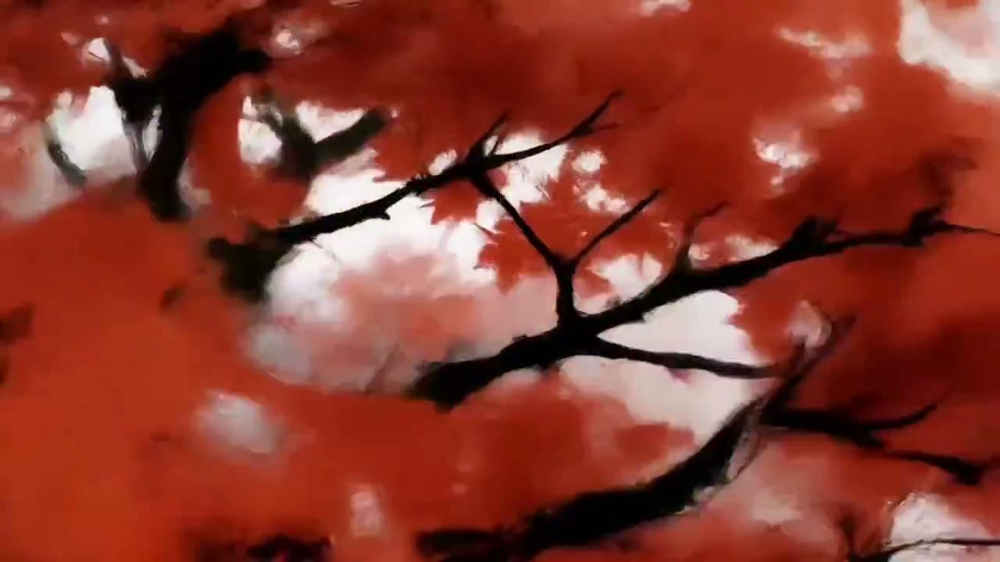</a>

[播放样片](../assets/cases/video-cdfbcca0a0.mp4) · 来源：[@NoorAI / YouMind](https://x.com/noorwithwifi/status/2101683541629354348) · 来源提示词 / 翻译整理

用水墨形态变换连续连接海浪、山峦、花枝和月夜场景。 · 动画

**完整提示词**

```text
一段无缝衔接的传统中国水墨水彩动画，始于深蓝色的海浪逐渐幻化为云雾缭绕的山峦，山间矗立着宝塔与石阶。绯红色的墨云横扫画面，场景随之过渡至平静的江面，一叶扁舟停泊在红叶树旁。红叶变幻为娇嫩的粉色樱花，花瓣围绕着一座小岛上孤零零的盆景式树木轻轻飘落。最终，一轮皎洁的满月从远山后升起，金色的月光倒映在宁静的水面上，画面渐渐融入静谧的夜晚。整体氛围诗意盎然，转场流畅自然，尽显优雅的中国画美学与柔和的水彩质感。
```

**可复用模板**

[浏览生视频 Prompt 模板](../templates/video.md)
